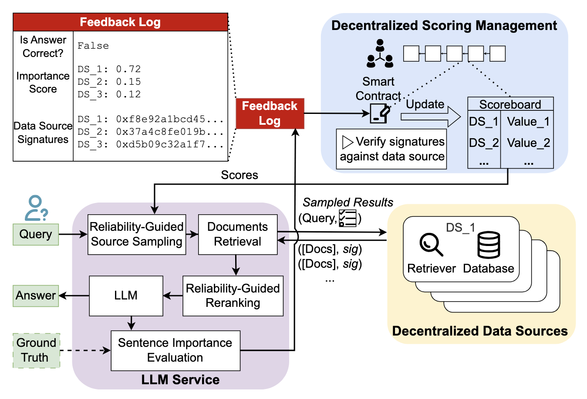

# A Decentralized Retrieval Augmented Generation System with Source Reliabilities Secured on Blockchain

<p align="center">
  
  
  
</p>

<p align="center">
  <b>TL;DR: We built dRAG, a decentralized RAG system that addresses data reliability challenges in real-world settings </b><br>
  <a href="https://arxiv.org/abs/2511.07577"><b>Paper on arXiv</b></a>
</p>

---

## ⚙️ System Overview
Our dRAG system can be abstracted into three components: *Decentralized Data Sources*, *LLM Service*, and *Decentralized Blockchain Network*. Details can be found in Section 5 of the paper.

<p align="center">
  
</p>

## 🚀 How to Deploy dRAG?
We provide detailed instructions for starting the [retrieval service](drag_data_source/README.md), [LLM service](drag_llm_service/README.md), and interacting with the [smart contract](drag_python_client/README.md). For your convenience, we also provide a one-line command to launch the entire dRAG system.

### Quick Start (One-Line Command)
To start all services using Docker Compose:

```bash
docker compose up -d
```

By default, the LLM image skips vLLM (GPU-only). To enable it:
```bash
INSTALL_VLLM=true docker compose up --build -d
```

If you use a gated HuggingFace model (e.g., Llama), set your token first:
```bash
HF_TOKEN=hf_your_token_here docker compose up --build -d
```

This will:
1. Start the contract service (a smart contract deployed on local Hardhat node for testing)
2. Start all three data sources simultaneously (data-source-0, data-source-20, data-source-100, each is assigned with a testing private key provided by Hardhat)
3. Start the LLM service after all data sources are healthy. The LLM service will also have a private key.

To view logs:
```bash
docker compose logs -f
```

To stop all services:
```bash
docker compose down
```

### Testing the System
Once all Docker containers are up and running, you can use the `test.ipynb` Jupyter notebook to interact with the system. The notebook contains:
- Health check tests for all services
- Example queries to test the RAG system
- Integration tests to verify the end-to-end functionality
or check Reliable-dRAG-anonymous/drag_llm_service/README.md for endpoint description.

To use the notebook:
```bash
jupyter notebook test.ipynb
```

Make sure all services are healthy before running the tests. You can check the service status with:
```bash
docker compose ps
```

If you wish to test the system with publicly smart contract, there is an example deployment on Sepolia (a public Ethereum testnet) at [0x5F67901BC1A22010BA438EDa426A70d0B5eA17Be](https://sepolia.etherscan.io/address/0x5F67901BC1A22010BA438EDa426A70d0B5eA17Be). A private key of Sepolia wallet and Infura api key are needed to connect to the testnet.

### Example Visualization
The dRAG system provides real-time monitoring of source scores (usefulness and reliability) over queries.

<p align="center">
  
</p>

The visualization demonstrates how the system learns and adapts to source quality over time, with sources showing different performance characteristics based on their pollution levels and content quality.

## 📖 Folder Structure
```
data/                 // Synthetic polluted datasets for experiments
drag_contract/        // Hardhat project + Solidity DragScores contract
drag_data_source/     // Dockerized retrieval service
drag_llm_service/     // Dockerized LLM orchestrator service
drag_python_client/   // Minimal Python client for DragScores
result/               // Result example for live visualization
attack/                // Security evaluation framework — six CIA-triad attack modules (see below)
defense/               // Countermeasures for a subset of the attack modules
config/                // YAML configs for the config-driven (sim/sweep) attack + defense modules
attack_logs/           // JSON/CSV output written by each attack/defense run
reports/               // Per-attack security analysis write-ups (methodology + measured results)
```

---

## 🛡️ Security Evaluation Framework (Attacks)

This fork adds a security evaluation layer on top of Reliable-dRAG: attack modules that probe the deployed system through its existing, legitimate interfaces (HTTP retrieval/LLM endpoints, the on-chain `DragScores` contract) exactly as an external adversary would, rather than modifying the core system itself. Attacks are organized around the CIA triad, with two structurally distinct attacks per property. This is a port of an equivalent framework validated on DRAG (Xu et al., 2025), a peer-to-peer gossip-based distributed RAG, built to demonstrate the same attack taxonomy generalizes across distributed RAG architectures.

| Property | Attack | Mechanism | Module |
|---|---|---|---|
| Integrity | **Data Poisoning** | Data-plane — injects malicious/misleading documents into a source's own retriever | [`attack/datapoisoning`](attack/datapoisoning) |
| Integrity | **Source Selection Manipulation (SSM)** | Control-plane — manipulates the on-chain reliability score (`R_i`/`U_i`) that decides which source gets trusted. Two variants: key-forgery (`ssm_score_attack.py`) and the flagship, no-privileged-access **grounding-farming** attack (`run_grounding_farming.py`), which games the orchestrator's substring-grounding check via ordinary queries alone | [`attack/ssm_score`](attack/ssm_score) |
| Confidentiality | **KB Extraction** | Reconstructs a source's private document collection via systematic keyword/topic-level query probes against the public retrieval + LLM endpoints | [`attack/kb_extraction`](attack/kb_extraction) |
| Confidentiality | **Membership Inference (MIA)** | Infers whether a specific record is present in a source via similarity/certainty/decision-match signals on the LLM's response, reported as AUC-ROC | [`attack/Mia_attack`](attack/Mia_attack) |
| Availability | **Denial of Service (DoS)** | Overt resource exhaustion — a congestion simulation (`ddos_attack.py`) and a real concurrent HTTP flood (`live_flood.py`) against the data-source containers | [`attack/ddos_sim`](attack/ddos_sim) |
| Availability | **Selective Forwarding** | Covert insider withholding — a compromised, trusted peer silently drops a fraction of queries instead of forwarding them. `selective_forward` is the original real-Docker implementation; `selective_forward_sim` is the newer config-driven network-simulation version used for the current results | [`attack/selective_forward`](attack/selective_forward), [`attack/selective_forward_sim`](attack/selective_forward_sim) |

Countermeasures for a subset of these attacks live under [`defense/`](defense) (`ddos_sim_defense`, `kb_extraction_defense`, `mia_defense`, `sfa_defense`, `sfa_sim_defense`, `ssm_defense`); per-attack methodology and measured results are written up in [`reports/`](reports).

### Running an attack

Each module is runnable standalone via its `run_attack.py`; most write a JSON log (and, for the config-driven sim modules, a CSV sweep table) to `attack_logs/<module>/`. Start the system first (`docker compose up -d`), then, for example:

```bash
# Data Poisoning — inject + evaluate at a given intensity
python attack/datapoisoning/run_attack.py --evaluate --intensity heavy --seed 42

# SSM — grounding-farming (flagship, no privileged access required)
python attack/ssm_score/run_grounding_farming.py

# KB Extraction — probe the retrieval + LLM endpoints
python attack/kb_extraction/run_attack.py

# Membership Inference — members vs. non-members, report AUC-ROC
python attack/Mia_attack/run_attack.py --seed 42

# DoS — congestion simulation (mock) or a real flood (live)
python attack/ddos_sim/run_attack.py --mode mock

# Selective Forwarding — config-driven mock/live network simulation
python attack/selective_forward_sim/run_attack.py --mode mock
```

See each module's `--help` (and, where present, its own `README.md`) for the full set of CLI flags — targeting strategy, attack ratio/intensity, mock vs. live mode, and multi-seed sweeps.

<!-- ## 📚 Citation
If you use our code or system, please cite the following paper:
```

``` -->
