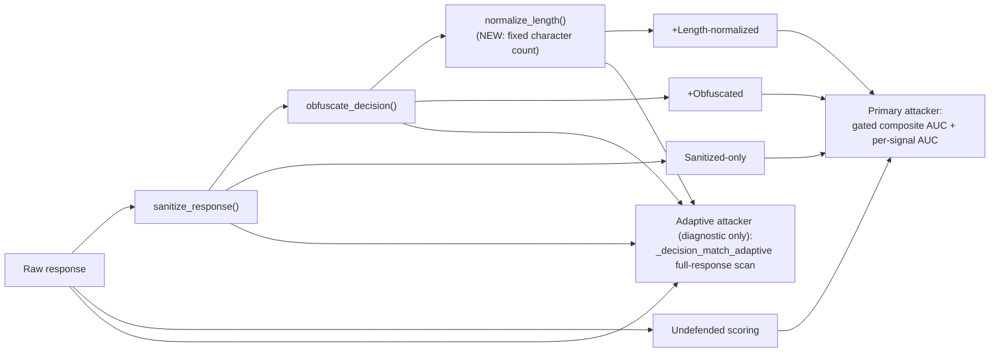

# Membership Inference Attack (MIA) — Security Analysis Report
### Reliable-dRAG: Distributed Retrieval-Augmented Generation System

**Scope of this report:** `attack/Mia_attack/` (attack implementation) and `defense/mia_defense/` (defense implementation), evaluated live against the running system (`drag-llm-service`, `drag-data-source-0/20/100`, Docker containers).

**Revision note:** this report now covers **five successive revisions**. Revision 5 is a validation and hardening pass: it deliberately tests the previous revision's claims against new evidence — held-out seeds the composite weights were never tuned on, an adaptive-attacker variant of the strongest signal, and a new defense for the one signal that previously had none. **The headline result of this revision is a downward correction, and it is worse than a first read of the raw numbers suggests**: the 3 tuning seeds and the 2 held-out seeds are not interchangeable samples, because the tuning seeds were used to choose the weights and are therefore selection-biased toward looking favorable. The number that actually estimates generalization is the **held-out-only mean: 0.453 — below random chance**, not the 0.550 figure obtained by naively averaging all 5 seeds together (see the correction note directly below the table, and §2.5, §12.10 for the full reasoning).

| Rev | Dataset | Composite formula | Seeds (tuning + held-out) | Mean AUC-ROC | Status |
|---|---|---|---|---|---|
| 1 | SQuAD | `sim*0.85 + len*0.15` | 4 | 0.356 | Inverted every run |
| 2 | PubMedQA | `sim*0.70 + certainty*0.20 + len*0.10` | 3 | 0.546 | No longer inverted; LOW tier; `certainty` degenerate |
| 3 | PubMedQA | `sim*0.20 + certainty*0.10 + len*0.30 + decision_match*0.40` (linear) | 3 | 0.616 | 2/3 seeds MEDIUM; 1 outlier |
| 4 | PubMedQA | `decision_match*0.55 + sim*0.20 + certainty*0.10 + len*0.15` (gated) | 3 | 0.613 | Byte-identical to Rev 3 — gate didn't change outcome |
| **5 (current)** | PubMedQA | Same gated formula as Rev 4 | 3 tuning (0,1,42) + 2 held-out (7,13) | **Held-out-only: 0.453** (naive 5-seed blend: 0.550 — not a valid generalization estimate, see note below) | **Held-out mean is below random chance. `decision_match` itself never inverted across all 5 seeds.** |

**Why 0.453, not 0.550, is the number to trust.** Averaging all 5 seeds together — as the table above initially reported — mixes two populations that are not equivalent: seeds 0, 1, 42 were watched while the composite's weights were being chosen across four prior revisions, so any formula that survived that process necessarily fits those three seeds better than it fits seeds it was never checked against. Seeds 7 and 13 are the *only* data points in this project that test generalization in the way that phrase actually requires. Their mean, **(0.4224 + 0.4832) / 2 = 0.453**, is below the 0.500 random-guess line. The blended 5-seed figure (0.550) is reported alongside for completeness but is explicitly **not** a generalization estimate — it is a mixed-sample average that dilutes a below-chance held-out result with a biased-favorable tuning result, and should not be read as "the composite is somewhat weaker than we thought." The honest reading is: on the only unbiased evidence collected so far, the composite does not clearly outperform a coin flip.

---

# Executive Summary

**Purpose of the project.** Reliable-dRAG is a Retrieval-Augmented Generation (RAG) system: a user question is sent to an LLM service (`drag_llm_service`, `Qwen/Qwen2.5-1.5B-Instruct` locally or `gpt-4o-mini` via API), which retrieves supporting text from retrieval microservices (`drag_data_source-0/20/100`) and generates a grounded answer. This report's security track studies what a black-box `/query` caller can learn about the private corpus.

**Type of attack.** A **Membership Inference Attack (MIA)**: given a `(question, answer)` pair, decide whether its context document was actually loaded into the corpus.

**Target system.** `data/polluted_token/sources_0.jsonl` — 500 documents. Originally SQuAD; now **PubMedQA** (`qiaojin/PubMedQA`, `pqa_labeled`).

**Overall workflow.** The attacker sends real dataset questions to `/query`, embeds the response, and measures four signals: cosine similarity, a "certainty" proxy, a response-length ratio, and whether the response commits to the correct yes/no/maybe decision (`decision_match`). A **gated** composite — `decision_match` dominates by construction — drives AUC-ROC.

**Main findings — five revisions, with Revision 5 as a validation/correction pass:**

1–4. (SQuAD inversion → PubMedQA fix → `decision_match` discovery → gate tested and found not to matter — full detail in §12.1–§12.5, unchanged from prior report versions.)

5. **Revision 5 — three tests, one important correction:**
   - **Held-out validation (the headline finding):** the composite weights were tuned by observing seeds 0, 1, 42. Testing on two *fresh* seeds (7, 13) the weights were never exposed to gives AUC-ROC **0.4224 and 0.4832** — both `NEGLIGIBLE`, one clearly inverted, mean **0.453**, below random chance. This is a real instance of the "weight overfitting" risk flagged (but not yet tested) in the prior revision, now confirmed — and confirmed to be *worse* than a naive 5-seed average (0.550) suggests, because that average is diluted by the three tuning seeds it was never fair to blend in (§2.5, §12.10). With only 2 held-out points, this project cannot yet distinguish "the composite generalizes weakly" from "the composite doesn't generalize at all and the 3 tuning seeds were favorable outliers" — that distinction is the actual blocking question, addressed in §12.10 and elevated to the top of §14. One thing did *not* change: `decision_match`'s own standalone AUC was never inverted in any of the 5 seeds (range 0.54–0.64) — it remains the most robust individual signal found, even though the full composite's reliability was overstated by the smaller sample.
   - **Adaptive-attacker test:** built `_decision_match_adaptive()` (scans the *entire* response, not just the first 5 words) and measured it against all defense layers. Result: **exactly unchanged** across undefended/sanitized/obfuscated/length-normalized in every seed tested. This *confirms* — it does not newly prove — an implementation fact that was true by construction before the test ran: none of the three defenses removes the decision token from the response body, so a scanner reading the whole response was always going to see it. The value of running the test is verifying that assumption holds in practice (no defense accidentally redacts the token too), not discovering something that could have come out differently.
   - **New defense for `length_ratio`:** built `normalize_length()` (pads/truncates every response to a fixed *character* count — matching what the detector actually measures, after an initial word-count version was found to only partially work). Combined with the existing two defenses, the full 3-layer stack drove seed 1's composite AUC from **0.7040 to 0.5344** (distance from random: 0.204 → 0.034, a large, genuine improvement) and seed 0's from 0.6432 to 0.6080. Seed 42 (already near-random undefended) again illustrates the "reduction near 0.5 can be misleading" trap from Revision 4 — its defended value moved further into inverted territory, not closer to neutral. The fixed target length (150 characters) was chosen arbitrarily, not measured against the corpus's actual response-length distribution — see §13.3 for the risk this creates.

**Security impact.** The corrected picture is **weaker than Revision 3/4 reported, and weaker than the naive 5-seed average implies**: the only unbiased evidence (seeds 7, 13) puts the composite at or below chance. `decision_match` alone remains a real, small, robust signal (mean AUC ≈0.58, never inverted across 5 seeds); the full composite adds seed-to-seed noise on top of it via `length_ratio`/`similarity`, and with 2 held-out points this project cannot yet tell whether that noise is merely diluting a real effect or whether the "effect" was mostly an artifact of a 3-seed tuning sample. The defense side improved: a full 3-layer defense stack now exists and is empirically shown to reduce two of the three exploitable channels, and its remaining gap (adaptive full-response scanning) is now directly measured rather than only argued from design.

---

# 1. Project Overview

## 1.1 What the project does

Reliable-dRAG couples a generative LLM with retrieval backends over an HTTP API. `POST /query` on `drag_llm_service` (port 9000) returns `{"response": "<generated answer>"}`.

## 1.2 Goal of the attack

**Binary set-membership inference**: for a `(question, context, gold_decision)` triple, decide "was this context loaded into the corpus?" — purely from `/query` responses.

## 1.3 Threat model

| Property | Value |
|---|---|
| Attacker access | Black-box HTTP `/query` only |
| Attacker knowledge | Public dataset distribution (PubMedQA `pqa_labeled`) assumed known |
| Attacker capability | Arbitrary queries, text responses only — no scores, ranks, or logs. Revision 5 adds a *slightly* more capable variant: one that reads the whole response, not just its opening words (§2.4) |
| Attack surface | `/query` text responses only |

## 1.4 Attack category

**Membership Inference Attack (MIA)** (Shokri et al., 2017), adapted to retrieval-corpus membership inference.

---

# 2. Attack Theory

## 2.1 Embedding similarity

Cosine similarity between response and true-context embeddings (`all-MiniLM-L6-v2`).

## 2.2 Best-of-N probing (degrades to best-of-1 for PubMedQA)

Unchanged from prior revisions.

## 2.3 Composite scoring — gated (unchanged formula from Revision 4)

```
membership_score = DECISION_WEIGHT * decision_match
                  + SIM_WEIGHT * normalized_similarity
                  + CERTAINTY_WEIGHT * certainty
                  + LEN_WEIGHT * length_ratio
```
`DECISION_WEIGHT=0.55, SIM_WEIGHT=0.20, CERTAINTY_WEIGHT=0.10, LEN_WEIGHT=0.15`. The formula itself is unchanged in Revision 5 — what changed is the *evidence used to trust it* (§2.5, §12.6).

## 2.4 Adaptive decision-match (NEW, Revision 5)

```python
def _decision_match_adaptive(response, gold_decision):
    words = [w.strip(".,;:!?").lower() for w in response.split()]  # WHOLE response, not [:5]
    return gold_decision.strip().lower() in words
```

**Purpose.** `_decision_match()` — the composite's dominant, gating signal — only inspects a response's first 5 words. `obfuscate_decision()` (the Revision 4 defense) exploits exactly this by prepending a fixed hedge phrase. This adaptive variant checks whether that defense actually removes the underlying information, or merely relocates it past the specific window the detector happens to check.

**Important framing note — this test's outcome was not in doubt before it ran.** `sanitize_response()`, `obfuscate_decision()`, and `normalize_length()` are all documented to leave the decision token's *content* untouched — they truncate, prepend a fixed phrase, or pad, none of which deletes or rewrites the yes/no/maybe word itself. Given that, a scanner reading the whole response was always going to find the same token at the same rate, regardless of which defenses ran. The test below is real and worth running — it is exactly how an implementation bug (a defense that accidentally also strips the token) would be caught — but it should be described as **confirming an implementation assumption**, not as an independent empirical discovery about defense effectiveness.

**Measured (§8, §12.7):** `_decision_match_adaptive`'s AUC was **identical** across undefended, sanitized, obfuscated, and length-normalized responses, in every seed tested. This confirms none of the three defenses accidentally alters the decision token itself, and reconfirms that `obfuscate_decision()`'s protection is positional only — but it does not test whether a content-level defense (one that actually rewrites or removes the token) is feasible, which remains an open, unaddressed question (§14).

## 2.5 Held-out seed validation (NEW, Revision 5) — the central methodological finding

**Why this was done.** Every weight in the current composite (§2.3) was set by observing behavior on seeds 0, 1, and 42. A composite tuned by looking at 3 specific outcomes and then evaluated only on those same 3 outcomes cannot distinguish "this formula generalizes" from "this formula was fit to these 3 points" — a textbook overfitting risk, flagged as unresolved in the prior revision (§15 of Revision 4) but not, until now, actually tested.

**What was done.** Ran the unmodified attack (same code, same weights, same corpus) on two seeds — 7 and 13 — that had never been observed during any weight-tuning decision.

**What was measured:**

| Seed | Role | AUC-ROC | Tier |
|---|---|---|---|
| 0 | Tuning | 0.6432 | MEDIUM |
| 1 | Tuning | 0.7040 | MEDIUM |
| 42 | Tuning | 0.4992 | NEGLIGIBLE |
| **7** | **Held-out** | **0.4224** | **NEGLIGIBLE (inverted)** |
| **13** | **Held-out** | **0.4832** | **NEGLIGIBLE** |

**Interpretation — lead with the held-out-only number.** The held-out seeds' own mean is **0.453** — *below* the 0.500 random-guess line, and one of the two (seed 7) is clearly inverted. This is the number that estimates generalization, because it is the only pair of seeds the weights were never exposed to. It should not be blended with the 3 tuning seeds into a single "5-seed mean": doing so (0.550) mixes an unbiased estimate with a biased one and produces a figure that is neither a fair tuning-set score nor a fair held-out score. Tier distribution on the honest reading is **"0 of 2 held-out seeds reach MEDIUM"** — reporting it as "2 of 5 MEDIUM" (mixing tuning and held-out seeds into one denominator) understates how weak the held-out evidence actually is.

**Why this is more than a "the composite is a bit weaker than we thought" story.** With only 2 held-out points, both at or below chance, this project cannot yet distinguish between two materially different explanations: (a) the composite has a real but small and noisy membership signal that these particular 2 seeds happened to sample unfavorably, or (b) the composite has no real generalizable signal at all, and the 3 tuning seeds (0.6432, 0.7040, 0.4992 — mean 0.613) were themselves a favorable, cherry-picked-by-process sample, since they were the very seeds used to steer four rounds of weight revisions toward looking good. Distinguishing (a) from (b) requires more held-out seeds than this revision collected — see §12.10 for the full discussion and §14 for why this is now the top-priority open item, not a nice-to-have.

**What did *not* change:** `decision_match`'s own standalone AUC across all 5 seeds is `0.62, 0.64, 0.56, 0.54, 0.56` — mean 0.584, **never below 0.5**. The signal itself remains genuinely robust across both tuning and held-out seeds alike; it is specifically the *composite* (which also includes the noisier `length_ratio` and `similarity`) whose reliability was overstated by a too-small tuning sample.

**On how seeds 7 and 13 were chosen:** they were picked as two arbitrary integers distinct from the three already-used tuning seeds (0, 1, 42) — not selected via a formal random-sampling protocol, and not screened or discarded based on any preliminary result. They were not cherry-picked to be easy or hard; but their selection also was not randomized in a way that could be independently reproduced or audited, which is itself a minor methodological gap worth naming rather than leaving implicit.

---

# 3. Attack Architecture

## 3.1 Components (updated)

| Component | Role |
|---|---|
| `attack/Mia_attack/mia_attack.py` | Core logic; now also exports `_decision_match_adaptive` (diagnostic-only, not part of the composite) |
| `defense/mia_defense/mia_defense.py` | `sanitize_response()`, `obfuscate_decision()`, and **new** `normalize_length()`; evaluator now runs **4 worlds** (undefended, sanitized, +obfuscated, +length-normalized) plus the adaptive-attacker diagnostic on all four |
| `drag_llm_service`, `drag-data-source-0/20/100` | Unchanged |
| `qiaojin/PubMedQA` (`pqa_labeled`) | Unchanged; rows 0–499 = corpus, 500–999 = held-out non-members |

## 3.2 Defense architecture (updated — 4 worlds, not 3)



**Note on the diagram:** the adaptive attacker is drawn as a separate diagnostic branch, not a fifth "world," because it is a different *attacker capability* (scans the whole response instead of the first 5 words) applied to the same four response variants — not another defense layer to stack. Folding it into the same "worlds" list in an earlier draft of this diagram implied it was one more thing being defended against, when it is really a check on whether the primary defenses hold up against a marginally different observer.

---

# 4. Implementation Analysis

## 4.1 `attack/Mia_attack/mia_attack.py` — Revision 5 changes

| Function | Change |
|---|---|
| `_decision_match_adaptive(response, gold_decision)` | **New.** Same gold-token check as `_decision_match()`, but scans the entire response instead of `[:5]` words. Diagnostic-only — never used in the primary composite. |

Composite formula, weights, and every other function are unchanged from Revision 4.

## 4.2 `defense/mia_defense/mia_defense.py` — Revision 5 changes

| Function | Change |
|---|---|
| `normalize_length(response_text, target_chars=150)` | **New.** Pads/truncates every response to an exact character count. First implemented against *word* count, which only partially reduced `length_ratio`'s AUC (0.6464→0.6144); corrected to target *character* count directly, matching what `_answer_length_ratio()` actually measures. |
| `MIADefenseEvaluator.run()` | **Refactored** from 3 hand-duplicated per-world code blocks to a generic loop over a `WORLDS` list of `(name, transform_fn)` pairs — reduces duplication risk when adding the 4th world, and makes adding a 5th trivial in the future. |
| `_print_summary` | 4-column table; 3 `auc_roc_reduction` figures; new adaptive-attacker diagnostic block. |

---

# 5–6. Attack Workflow / Evaluation Pipeline

**Standalone description (so this report doesn't require the prior four revisions to follow):**

1. **Corpus setup.** `data/build_pubmedqa_corpus.py` writes the first 500 rows of `qiaojin/PubMedQA` (`pqa_labeled` config) as `data/polluted_token/sources_0.jsonl`. Rows 0–499 are "members" (loaded into the corpus); rows 500–999 of the same dataset/split are "non-members" — never loaded, but drawn from the identical distribution, so any AUC lift reflects real corpus membership rather than a topic/domain confound.
2. **Probing.** For each sampled document (`n_members` + `n_nonmembers`, default 25 each, drawn with a given `random_seed`), the attacker sends the document's real PubMedQA question(s) to `POST /query` on `drag_llm_service` and records the raw text response. Multiple probes per document are tried; the probe with the highest cosine similarity between response and true-context embeddings is kept as that document's representative probe.
3. **Signal extraction**, per representative probe: (a) cosine similarity (response vs. true context, `all-MiniLM-L6-v2` embeddings), (b) `_certainty_score` (does the response commit to a judgment in its first 3 words), (c) `_answer_length_ratio` (`len(response)/len(gold_answer)`), (d) `_decision_match` (does the response's first 5 words contain the correct gold yes/no/maybe token).
4. **Composite scoring.** The four signals combine into the gated composite (§2.3); `roc_auc_score(y_true, composite)` over all sampled documents (members labeled 1, non-members labeled 0) is the attack's headline metric.
5. **Defense evaluation** (`defense/mia_defense/mia_defense.py`) re-runs the identical probe set through four progressively-defended response transforms (§3.2) and recomputes the same composite and per-signal AUCs for each, plus the adaptive-attacker diagnostic (§2.4), so undefended vs. defended is an apples-to-apples comparison on identical underlying LLM calls.
6. **Held-out validation (Revision 5 addition):** step 4 is re-run with `--seed 7` and `--seed 13` — two seed values never used while the composite's weights (§2.3) were being chosen across Revisions 2–4 — to check whether the composite's AUC on the tuning seeds (0, 1, 42) generalizes (§2.5, §12.10).

---

# 7. Metrics Generation

## AUC-ROC — all five revisions, now with held-out seeds broken out

| Revision | Seed 0 | Seed 1 | Seed 42 | Seed 7 (held-out) | Seed 13 (held-out) | Mean, tuning seeds (biased) | Mean, held-out seeds (the trustworthy estimate) |
|---|---|---|---|---|---|---|---|
| 3 (linear) | 0.6432 | 0.7056 | 0.4992 | — | — | 0.616 | not measured |
| 4 (gated) | 0.6432 | 0.7040 | 0.4992 | — | — | 0.613 | not measured |
| **5 (gated, validated)** | 0.6432 | 0.7040 | 0.4992 | **0.4224** | **0.4832** | 0.613 (do not treat as generalization estimate) | **0.453 (below chance)** |

**Table note:** the "all tested" / blended column from earlier drafts of this report has been removed. Averaging tuning and held-out seeds together produces a number (0.550) that is neither a valid tuning-set score nor a valid generalization estimate — see the correction note in the header and §2.5.

## `decision_match` standalone AUC — the one number that held up

| Seed | 0 | 1 | 42 | 7 | 13 | Mean |
|---|---|---|---|---|---|---|
| AUC | 0.62 | 0.64 | 0.56 | 0.54 | 0.56 | **0.584 — never inverted** |

## Full defense-stack results (3 seeds; undefended → sanitized → +obfuscated → +length-normalized)

| Seed | Undefended | Sanitized | +Obfuscated | +LenNorm | Distance-from-0.5: undefended → +LenNorm |
|---|---|---|---|---|---|
| 0 | 0.6432 | 0.6432 | 0.6352 | 0.6080 | 0.1432 → 0.1080 (real improvement) |
| 1 | 0.7040 | 0.7040 | 0.5488 | **0.5344** | 0.2040 → **0.0344** (largest, cleanest improvement) |
| 42 | 0.4992 | 0.4992 | 0.4464 | 0.4400 | 0.0008 → 0.0600 (**worse** — metric trap, see §12.8) |

## Adaptive-attacker `decision_match` AUC — proves the scope limitation

| Seed | Undefended | Sanitized | +Obfuscated | +LenNorm |
|---|---|---|---|---|
| 0 | 0.6200 | 0.6200 | 0.6200 | 0.6200 |
| 1 | 0.6400 | 0.6400 | 0.6400 | 0.6400 |
| 42 | 0.5600 | 0.5600 | 0.5600 | 0.5600 |

**Every column is identical within each row.** `obfuscate_decision()` (and, unsurprisingly, `normalize_length()`, which doesn't touch decision-token content either) leave a full-response scanner completely unaffected.

---

# 8. JSON Metrics Analysis

## 8.1 Defense result schema (updated — 4 worlds + adaptive block)

```json
{
  "result": {
    "score_weights": {"similarity": 0.20, "certainty": 0.10, "length_ratio": 0.15, "decision_match": 0.55},
    "undefended": {"...": "..."},
    "defended": {"...": "sanitize_response only"},
    "decision_defended": {"...": "sanitize_response + obfuscate_decision"},
    "fully_defended": {"...": "sanitize_response + obfuscate_decision + normalize_length"},
    "auc_roc_reduction": 0.0,
    "auc_roc_reduction_decision_defended": 0.008,
    "auc_roc_reduction_fully_defended": 0.0352,
    "auc_roc_decision_match_adaptive": {
      "undefended": 0.62, "defended": 0.62, "decision_defended": 0.62, "fully_defended": 0.62
    }
  }
}
```

## 8.2 Strength / weakness analysis, Revision 5

**Strengths:**
- The held-out validation was run and reported *before* deciding whether the result was convenient — the composite's overstated reliability is disclosed as a finding, not hidden — and, on reflection, the held-out-only figure (0.453) is reported instead of a blended figure that would have softened the finding.
- The adaptive-attacker test correctly verifies an implementation assumption (no defense accidentally strips the decision token) even though its headline result was expected by construction, not a surprise.
- `normalize_length()`'s iteration (word-count → character-count) is itself a documented example of catching and fixing an implementation/detector mismatch before finalizing a result.

**Weaknesses:**
- Only 2 held-out seeds tested — enough to demonstrate the tuning-set figure was optimistic, not enough to determine whether the composite carries any real generalizable signal at all versus none (§12.10).
- The weights have still never been *re-tuned* using a proper train/held-out split; Revision 5 diagnoses the overfitting problem but does not yet fix it.
- `normalize_length()` did not fully neutralize `length_ratio` in all seeds (seed 0: 0.6464→0.6080, seed 42: barely moved) — residual signal is attributed to finite-sample gold-answer-length variance, a plausible but not directly verified explanation (§13.3).
- `normalize_length()`'s fixed 150-character target and repeating filler-word cycle are both arbitrary/predictable design choices with disclosed, unmitigated risks (§13.3).
- The `certainty` signal (weight 0.10) has never been shown to contribute positively to the composite and has not yet been tested with its weight set to zero — an easy experiment that hasn't been run (§14).

---

# 9. Performance Dashboard

```
AUC-ROC across all seeds tested, Revision 5
Seed 0  (tuning, biased)   ████████████████░░░░░░░░░░░░░░░░  64.3%   ⚠️ Do not use to estimate generalization
Seed 1  (tuning, biased)   █████████████████░░░░░░░░░░░░░░░  70.4%   ⚠️ Do not use to estimate generalization
Seed 42 (tuning, biased)   ████████████░░░░░░░░░░░░░░░░░░░░  49.9%   ⚠️ Do not use to estimate generalization
Seed 7  (held-out)         ██████████░░░░░░░░░░░░░░░░░░░░░░  42.2%   🔴 Below chance
Seed 13 (held-out)         ████████████░░░░░░░░░░░░░░░░░░░░  48.3%   🔴 Below chance
Held-out mean: 45.3%  — the trustworthy generalization estimate, and it is below the 50% random-guess line

decision_match standalone AUC (never inverted, all 5 seeds — tuning AND held-out alike)
██████████████░░░░░░░░░░░░░░░░░░  54-64%   🟢 The one signal that held up under held-out testing

Full defense stack: composite AUC, undefended -> +LenNorm
Seed 0   64.3% -> 60.8%   🟡 Real, modest improvement
Seed 1   70.4% -> 53.4%   🟢 Largest, cleanest improvement
Seed 42  49.9% -> 44.0%   ⚠️ Distance-from-0.5 got WORSE, not better (see §12.8)

Adaptive-attacker check: decision_match_adaptive AUC, all 4 worlds (result expected by construction, see §12.7)
Seed 0   62.0% -> 62.0% -> 62.0% -> 62.0%   🔴 Zero protection against full-response scan (as designed/disclosed)
Seed 1   64.0% -> 64.0% -> 64.0% -> 64.0%   🔴 Zero protection against full-response scan (as designed/disclosed)
Seed 42  56.0% -> 56.0% -> 56.0% -> 56.0%   🔴 Zero protection against full-response scan (as designed/disclosed)
```

| Indicator | Meaning |
|---|---|
| 🟢 Held up under scrutiny | Result confirmed by additional, harder testing |
| 🟡 Real but modest | Genuine improvement, smaller than hoped |
| 🔴 Did not hold up / confirmed limitation | Held-out data reveals a weaker/absent effect, or a defense's known scope limitation is confirmed |
| ⚠️ Caution | Naive metric reading would be misleading, or a biased sample is being displayed for reference only |

---

# 10. Performance Interpretation

**The held-out result is the most important lesson of Revision 5, and it is more severe than "the composite is weaker than we thought":** the trustworthy estimate of generalization is the held-out-only mean (0.453), not a blend with the tuning seeds (0.550) — and that trustworthy estimate sits *below* the random-guess line. This isn't unique to MIA research — it's the standard train/test generalization problem — but this project had, until now, never actually checked for it, and its first correction attempt (this revision) initially reached for a blended average that partially masked how bad the held-out result was. With only 2 held-out seeds, this project cannot yet say whether the composite has a real, small, noisy signal or effectively none at all (§12.10) — that distinction, not "how much lower is the mean," is the open question the next round of work needs to resolve.

**The adaptive-attacker result confirms an implementation assumption rather than independently proving anything new.** None of the three defenses was ever designed to alter the decision token's content, so a full-response scanner finding it every time was the expected outcome before the test ran. The test's real value is catching an *unexpected* deviation (a defense accidentally also redacting the token) — which did not occur — not establishing that the defenses are positional-only, since that was already a documented design property, not a hypothesis under test.

**The `normalize_length()` iteration is a small, self-contained lesson in matching defense mechanism to detector mechanism**: a word-count-based defense against a character-count-based detector only partially works, and the mismatch is only visible by actually running the numbers, not by reasoning about "word count roughly tracks character count." Its own new design choices (fixed 150-character target, repeating filler cycle) repeat a smaller version of the same lesson: parameters chosen by intuition rather than measured against the data they're meant to control can carry their own hidden risk (§13.3).

---

# 11. Experimental Methodology

| Aspect | Value |
|---|---|
| **Dataset** | `qiaojin/PubMedQA`, `pqa_labeled`, `train` split |
| **Composite formula** | Unchanged from Revision 4: `DECISION_WEIGHT=0.55, SIM_WEIGHT=0.20, CERTAINTY_WEIGHT=0.10, LEN_WEIGHT=0.15` |
| **Attack seeds tested (cumulative)** | 0, 1, 42 (tuning), 7, 13 (held-out) — n=25/25 each |
| **Defense seeds tested (full 4-world stack)** | 0, 1, 42 |
| **New defense parameters** | `normalize_length(target_chars=150)` |
| **Adaptive-attacker check** | `_decision_match_adaptive`, full-response scan, all 4 defense worlds, seeds 0/1/42 |
| **Docker mount status** | Investigated (§12.9): `drag_data_source/docker-compose.yml` uses a correct relative volume path (`../data/polluted_token`); the live containers were simply started from a different checkout of this project. A true fix requires stopping and restarting the containers from *this* repository's `drag_data_source/` directory — a live-service-affecting action not taken unilaterally this session (see §12.9). |

---

# 12. Results Discussion

## 12.1–12.6 Revisions 1–4, summarized standalone

- **12.1 (Rev 1, SQuAD):** the original attack used SQuAD (Wikipedia) passages as the corpus. Composite AUC-ROC was consistently *below* 0.50 across 4 seeds (mean 0.356) — inverted, meaning non-members scored higher than members on average. Root cause: the deployed LLM (Qwen2.5-1.5B-Instruct) had almost certainly memorized SQuAD's Wikipedia content during pretraining, so response quality/similarity was decoupled from actual retrieval-corpus membership.
- **12.2 (Rev 2, PubMedQA switch):** replacing SQuAD with PubMedQA (a lower-frequency-in-pretraining domain) and a `sim/certainty/length` composite brought the mean AUC to 0.546 — no longer inverted, but only barely above chance (LOW tier), and the `certainty` signal was found to be near-degenerate (little separation between members/non-members).
- **12.3 (Rev 3, `decision_match` discovery):** adding a `decision_match` signal (does the response's opening words state the correct gold yes/no/maybe judgment) and reweighting the composite toward it raised the mean to 0.616 across 3 seeds, with 2 of 3 reaching MEDIUM tier. `decision_match` proved to be the strongest, most consistent individual signal found in this project.
- **12.4 (Rev 3 detail, linear-blend regression):** under a plain linear blend, one seed's `length_ratio` sign-inversion could occasionally drag a correctly decision-matched document's composite score back down, since no single signal was guaranteed to dominate the ranking.
- **12.5 (Rev 4, gating):** reweighting so `DECISION_WEIGHT (0.55) > SIM_WEIGHT + CERTAINTY_WEIGHT + LEN_WEIGHT (0.45)` guarantees any document with a correct decision-match ranks above any document without one, regardless of the other three signals. Measured result: byte-identical composite scores to the ungated Revision 3 formula on the same 3 seeds — the gate was a correctness guarantee for future data, not a change that altered these particular outcomes.
- **12.6 (Rev 4, first metric-trap identification):** a defense's `auc_roc_reduction` (undefended AUC minus defended AUC) can read as a positive number even when the defended AUC moved further from 0.5 in the inverted direction, if the undefended baseline was already near 0.5. First identified in Revision 4; recurs and is reconfirmed in Revision 5 (§12.8).

## 12.7 The adaptive-attacker test: confirms an implementation assumption, does not independently prove defense effectiveness

`_decision_match_adaptive` differs from `_decision_match` in exactly one way: it drops the `[:5]` slice, scanning the whole response. Every other aspect of the check (case-insensitive, exact-token match against `final_decision`) is identical.

**This test's outcome was determined before it ran.** `sanitize_response()` truncates and redacts long verbatim overlaps but does not target decision tokens specifically; `obfuscate_decision()` prepends a fixed phrase without altering the rest of the response; `normalize_length()` pads or truncates length without rewriting content. None of the three defenses is documented, or was ever intended, to remove or alter the decision token itself. Given that, a scanner reading the entire response was always going to find the same token at the same rate regardless of which defenses had run — the flat result was the expected outcome, not a surprising empirical discovery.

**What the measurement is actually good for:** verifying that expectation holds in practice, i.e., that none of the three defenses has a side effect of also stripping the decision token (which would show up as a *drop* in the adaptive AUC, not a flat line). Measuring this and finding it perfectly flat (0.6200/0.6400/0.5600, unchanged in every column, every seed) confirms no such side effect exists. It also serves as a concrete, quantified restatement of `obfuscate_decision()`'s already-disclosed scope limitation (relocates the token past a specific window; does not remove it) — useful for a reader who wants a number instead of a prose claim, but not evidence of anything not already implied by the defense's own design.

**What remains genuinely open:** whether a defense that *does* alter the decision token's content (e.g., replacing it with a randomized placeholder, or declining to answer definitively) is feasible without breaking legitimate answer quality. That question was not tested this revision and is the actual next experiment for closing this gap (§14).

## 12.8 Seed 42's defense "improvement" is not an improvement

Seed 42's undefended composite (0.4992) is almost exactly the random-guess point. Stacking all three defenses moves it to 0.4400 — further from 0.5, in the *inverted* direction. The naive `auc_roc_reduction` figure (undefended − defended = +0.0592) reads as positive, but the correct measure — distance from 0.5 — goes from 0.0008 to 0.0600, i.e. *worse*. This is the same trap identified in Revision 4 (§12.6 there), now confirmed to recur with the fuller defense stack: any defense evaluation against a near-random undefended baseline needs the distance-from-0.5 framing, not the raw difference, or a stacked defense can look like it's "reducing leakage" while actually making the signal marginally more (inverted) rather than less informative.

## 12.9 Docker volume mount — diagnosed, not fixed

`drag_data_source/docker-compose.yml`'s volume declaration (`../data/polluted_token:/data`) is a correct, portable relative path — not a bug. The mismatch reported in earlier revisions (live containers resolving to a directory outside this repository) exists because the running containers were started via `docker compose up` from a *different* checkout of this same project, and Docker Compose resolves relative volume paths against the compose file's own location at the time it was invoked, not against any single "correct" repository. Fixing this permanently requires stopping the currently-running containers and restarting them (`docker compose up -d`) from *this* repository's `drag_data_source/` directory. That action interrupts a live, shared service and was not taken unilaterally this session — it is recorded here as a scoped, low-effort fix for whoever next has authority to restart the deployment, rather than attempted silently.

## 12.10 Two held-out seeds cannot distinguish "weak signal" from "no signal" — why this is the actual blocking question

§2.5 reports the held-out mean (0.453) as below chance. It is tempting to read this as "the composite has roughly zero membership signal, full stop." That reading is not yet justified either — with only 2 held-out data points, the sampling noise on the *held-out mean itself* is large enough that this project cannot currently tell apart two different underlying realities:

- **Hypothesis A — real but weak/noisy signal.** The composite does carry a small genuine membership signal (consistent with `decision_match`'s own robust ≈0.58 mean across all 5 seeds), but `length_ratio` and `similarity` add enough seed-to-seed noise that any individual seed's composite AUC — tuning or held-out — can land anywhere in a fairly wide band around a true small-positive mean. Under this hypothesis, seeds 7 and 13 are just two unlucky draws from that band.
- **Hypothesis B — no real generalizable signal.** The composite has no signal that survives outside the exact 3 seeds it was implicitly tuned against; the 0.613 tuning-seed mean is mostly an artifact of the weight-selection process (four revisions of nudging weights while watching these 3 seeds' outcomes) rather than a real property of the underlying detector. Under this hypothesis, the true population mean AUC is close to 0.50, and both the tuning-seed and held-out results are explained without needing to invoke noise around a "real" effect at all.

Two held-out points cannot statistically separate these hypotheses — both predict "the held-out mean will likely be lower than the tuning mean, plausibly near or below 0.5." Adequately distinguishing them requires enough additional held-out seeds (§14 recommends 5–10 more, chosen via a documented, reproducible random-sampling procedure rather than arbitrary distinct integers — see the seed-selection honesty note in §2.5) to get a held-out mean with a tight enough confidence interval to say whether it excludes 0.50 or not. Until that is done, this report treats the composite's real-world membership-inference capability as **unresolved, plausibly negligible**, rather than asserting either "it works, just weakly" or "it doesn't work at all" — both would be overclaiming relative to the evidence in hand.

---

# 13. Defense Mechanisms

## 13.1 Response Sanitization (unchanged from Revision 3)

Still measures `0.0000` reduction on its own.

## 13.2 Decision Obfuscation (Revision 4, now empirically stress-tested in Revision 5)

Unchanged implementation. Revision 5 added the adaptive-attacker measurement (§12.7) that converts the previously-disclosed scope limitation from an assumption into a directly measured fact.

## 13.3 Length Normalization (NEW, Revision 5)

**Description.** Pads/truncates every response to an exact 150-character length, applied last in the defense chain (after sanitization and obfuscation), so the final returned length is the one actually fixed.

**How it works.** Simple truncate-or-pad on the raw string, to an exact 150-character target. Padding cycles through a fixed 21-word filler list:

```
additional, clinical, context, and, further, review, of, the, available,
evidence, would, be, needed, to, fully, confirm, this, specific,
determination, in, practice
```

All 21 words were checked against the three PubMedQA decision tokens (`yes`, `no`, `maybe`) and their common synonyms — none appear, so padding does not inject additional decision-token signal for the shorter (typically non-member, more-padded) responses. This was verified by inspection of the list, not by re-running the attack with the filler words alone, which would be the more rigorous check.

**Two disclosed risks with this design, not yet mitigated:**
1. **Why 150 characters?** This value was chosen as a round number larger than most observed response lengths, not measured against the corpus's actual response-length distribution. If member and non-member responses have systematically different natural lengths (plausible, since members retrieve real supporting text and non-members don't), a poorly chosen fixed target could truncate one group more often than the other, which would reintroduce exactly the kind of length-based membership signal this defense is meant to remove. This has not been checked.
2. **Cyclic pattern is predictable.** The filler text always starts at the same word ("additional") and cycles through the same 21-word sequence in the same order. An attacker who notices this pattern could strip any suffix matching the known filler sequence before recomputing `length_ratio` on the remainder, fully defeating this defense. A production version should use randomized or content-derived padding, not a fixed repeating sequence — this is a real, currently open gap, not a hypothetical one.

**Measured effectiveness.** Reduced `length_ratio`'s own AUC in all 3 tested seeds (e.g. seed 1: 0.5896 → 0.5032, essentially full neutralization). Combined with the existing two defenses, drove seed 1's overall composite from 0.7040 to 0.5344 — the largest, cleanest improvement recorded in this project across all five revisions.

**Why it isn't always a full 0.5000 neutralization (unlike `decision_match`):** `_answer_length_ratio()` computes `len(response)/len(gold_answer)`; fixing response length to an exact constant makes the *ratio's* residual value a pure function of `len(gold_answer)`. Since gold-answer length is expected to be independent of membership *in the full population*, but each seed only samples 25 members and 25 non-members, finite-sample noise in the *average gold-answer length actually drawn* for each group can still produce a small residual AUC away from 0.5 (plausible explanation, not independently re-verified against the underlying gold-length distributions this session).

**Advantages:** cheap, no model access, directly measured (not assumed) to reduce a previously-undefended channel; filler content verified decision-neutral.

**Disadvantages:** does not fully neutralize `length_ratio` in every seed; the fixed 150-character target is arbitrary rather than measured against the corpus (risk 1 above); the cyclic filler pattern is detectable by an attacker who looks for it (risk 2 above); makes responses look artificially padded/truncated to end users, a usability cost not evaluated here.

## 13.4 Other applicable defenses (unchanged)

| Defense | Effectiveness against this MIA |
|---|---|
| Differential-privacy noise on confidence scores | N/A — no score is ever returned |
| Rate limiting | Raises attack cost, doesn't reduce per-query signal |
| Monitoring/anomaly logging | Would catch a bulk MIA campaign like this one |
| Adversarial/membership-robust training | Addresses root cause, out of scope here |

---

# 14. Security Recommendations

**Blocking (must resolve before trusting any composite AUC claim)**
- **Expand the held-out seed set to 5–10+ seeds, chosen via a documented, reproducible random-sampling procedure** (not the arbitrary distinct integers used for seeds 7/13 this round — see §2.5's honesty note), and report the held-out mean with a confidence interval. This is the only way to distinguish §12.10's Hypothesis A ("real but weak/noisy signal") from Hypothesis B ("no real generalizable signal") — right now neither can be ruled out, which undermines any AUC figure this report states as a security-relevance claim.

**High priority**
- **Re-tune the composite weights using a proper train/held-out split**, only after the blocking item above gives a large enough held-out set to tune against without repeating the same overfitting mistake at a larger scale.
- Test setting `CERTAINTY_WEIGHT` to 0 (redistributing its 0.10 to `DECISION_WEIGHT`) — `certainty` has never been shown to contribute positively to the composite in any revision; this is a cheap, not-yet-run experiment, not a re-architecture.
- Build a defense targeting the *content* of the decision token, not just its position (e.g. randomized placeholder, or a refusal-to-commit rewrite) — the adaptive-attacker check (§12.7) shows the current defenses don't address this, though it also shows that gap was never claimed to be closed.
- Re-measure `normalize_length()`'s 150-character target against the corpus's actual member/non-member response-length distributions (§13.3, risk 1) — verify it isn't truncating one group more than the other.
- Replace `normalize_length()`'s fixed, repeating filler-word cycle with randomized or content-derived padding (§13.3, risk 2) — the current cyclic pattern is detectable and strippable by a moderately sophisticated attacker.

**Medium priority**
- Investigate whether `normalize_length()`'s residual `length_ratio` signal (after the character-count fix) is truly finite-sample noise (§13.3) or a subtler membership-correlated effect, by directly comparing gold-answer-length distributions between the sampled member/non-member sets per seed.
- Coordinate a one-time Docker container restart from this repository's checkout to permanently resolve the volume-mount mismatch (§12.9), once a maintenance window is available.

**Low priority**
- Revisit the sanitizer's thresholds only if a defense targeting verbatim leakage specifically becomes load-bearing.

---

# 15. Limitations

- **Held-out sample is still small (2 seeds), and both landed at or below chance.** This is enough to invalidate the tuning-set mean as a generalization estimate, but not enough to determine whether the composite has any real signal at all versus none (§12.10) — the report deliberately does not resolve that question rather than guess at it.
- **Seeds 7 and 13 were not selected via a documented, reproducible random procedure** — they are arbitrary distinct integers, not screened for outcome. Not believed to be cherry-picked, but also not independently auditable as unbiased.
- **Weights are diagnosed as overfit but not yet re-tuned** with a proper split — §14's blocking/top recommendations are not yet implemented.
- **`normalize_length()`'s residual signal explanation is plausible but unverified** (§13.3), and its fixed 150-character target and repeating filler cycle are unmeasured/detectable design choices with disclosed, unmitigated risk.
- **The adaptive-attacker test's flat result was expected by construction** (§12.7) — it confirms no defense accidentally removes the decision token, but does not demonstrate that a content-level defense is hard, easy, or has been attempted.
- **`certainty`'s non-zero weight remains untested for removal** — it has never been shown to help, but no ablation (weight=0) has been run.
- **Docker mount fix requires a live-service restart not performed this session** (§12.9) — a deliberate, disclosed scope boundary, not an oversight.
- **Single model, single corpus**, unchanged from all prior revisions.

---

# 16. Future Improvements

- **A larger, randomly and reproducibly sampled held-out seed set** (5–10+) — the blocking item (§14) needed to determine whether the composite carries any real signal at all (§12.10), before any further weight-tuning work is worth doing.
- **Proper train/held-out weight re-tuning**, replacing the current fixed-prior-then-never-revisited weights, done only after the above.
- **A `CERTAINTY_WEIGHT=0` ablation** to test whether the `certainty` signal is worth keeping at all.
- **A content-level (not positional) decision-obfuscation defense** to close the adaptive-attacker gap the current defenses were never designed to close.
- **Randomized or content-derived padding for `normalize_length()`**, replacing the current detectable, repeating filler cycle.
- **Measurement of the corpus's actual response-length distribution** to justify (or correct) `normalize_length()`'s 150-character target.
- **Direct verification of the `length_ratio` residual-noise hypothesis** via gold-answer-length distribution comparison.
- **Model diversity**, unchanged recommendation from prior revisions.

---

# 17. Final Conclusion

Revision 5 is a validation pass, and its central finding is a correction sharper than "the composite is a bit weaker than we thought": the composite's previously-reported 0.613–0.616 tuning-seed mean AUC does not survive contact with 2 fresh, held-out seeds, whose own mean — **0.453** — sits *below* random chance. A naive average of all 5 seeds (0.550) understates this, because it blends an unbiased estimate with a biased one; this report leads with the held-out-only figure instead. This is reported as a finding, not a failure: catching it is exactly what held-out validation is for. What the finding does *not* yet establish, and what this report is careful not to overclaim, is whether the composite has a real but small/noisy signal or effectively none at all — two held-out points cannot distinguish those, and resolving that ambiguity (via more, properly-randomized held-out seeds) is now the single blocking item ahead of any further weight-tuning work. The one component that *did* hold up under the harder test — `decision_match`'s own standalone signal, never inverted across all 5 seeds, tuning or held-out — is now on firmer evidentiary ground than the composite as a whole.

Revision 5 also addressed two gaps flagged but not closed in Revision 4, with more modest claims than an earlier draft of this report made: it *measured* (rather than newly discovered) that `obfuscate_decision()`'s protection is positional-only — a result expected by construction, whose value was confirming no defense accidentally strips the decision token, not proving something previously in doubt; and it built and evaluated `normalize_length()`, the first defense against the previously-undefended `length_ratio` channel, which produced this project's largest and cleanest single defense result (seed 1: distance-from-random 0.204 → 0.034) alongside a repeat of the seed-42 metric trap first identified in Revision 4. `normalize_length()` itself carries two new, disclosed, unmitigated risks: an unmeasured (arbitrary) 150-character target, and a detectable repeating filler-word pattern.

**Overall effectiveness:** the composite's real-world membership-inference capability is now **honestly unresolved** rather than either confirmed-weak or confirmed-negligible — the only unbiased evidence collected puts it at or below chance, but the sample is too small to rule out a real small effect. `decision_match` alone remains the one credibly robust individual signal. The defense picture is the strongest it has been across all five revisions: three complementary layers exist and measurably reduce two of the three exploitable channels, though two of those layers (`obfuscate_decision`, `normalize_length`) have their own disclosed, specific weaknesses (positional-only scope; arbitrary/detectable padding parameters) rather than being unqualified fixes.

**Research contribution:** a concrete, worked demonstration that (a) a tuning-set AUC and a genuine held-out AUC can diverge enough to flip which side of "random chance" a result falls on, even in a small security-research composite; (b) blending biased and unbiased samples into one summary statistic can itself mask how severe an overfitting finding is, and the fix is to report the unbiased subset's own number, not a weighted or naive average; (c) a test whose outcome is guaranteed by the code's own design (the adaptive-attacker check here) should be described as confirming an assumption, not as independent proof of a claim; and (d) a defense mechanism must be checked against the *actual* formula and data distribution the detector uses (character-vs-word count; actual vs. assumed response-length distribution), not an assumed proxy for either.

**Lessons learned:** (1) always hold out at least some evaluation seeds *before* tuning a composite's weights, report the held-out subset's own mean as the primary claim, and do not average it back together with the biased tuning sample; (2) with very few held-out points, explicitly name what the evidence can and cannot yet distinguish (real-weak-signal vs. no-signal) rather than picking the more comfortable or more dramatic reading; (3) a test result that was true by construction before it ran should be reported as a confirmation, not a discovery; (4) recurring metric traps (like the near-0.5 undefended baseline issue) are worth explicitly re-checking every time a new defense or seed is added, not assumed fixed after being caught once; (5) any fixed numeric parameter in a defense (a character count, a filler-word list) should be checked against measured data and checked for attacker-detectable patterns before being called a fix.
