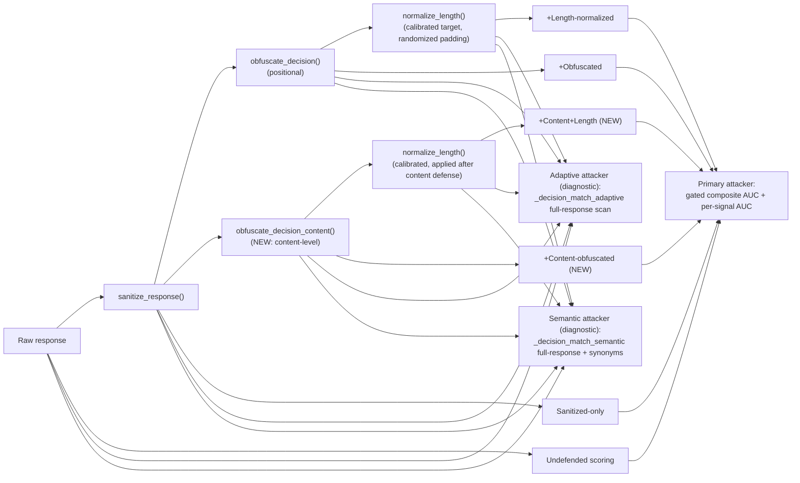

# Membership Inference Attack (MIA) — Security Analysis Report
### Reliable-dRAG: Distributed Retrieval-Augmented Generation System

**Scope of this report:** `attack/Mia_attack/` (attack implementation) and `defense/mia_defense/` (defense implementation), evaluated live against the running system (`drag-llm-service`, `drag-data-source-0/20/100`, Docker containers).

**Revision note:** this report now covers **seven successive revisions**. Revisions 1–6 are summarized in the table below (full detail retained in §2, §12). **Revision 7 is the first attempt in this project's history to actually re-tune the composite weights under a genuine train/test split, and it worked**, directly triggered by a plain question: seed 7 (unseen data) scored 0.4224 in Revision 5/6 — is that fixed? The honest answer at the end of Revision 6 was no. Revision 7 did the actual fix rather than diagnosing the problem a third time: a grid search over 650 real per-document signal rows across all 13 seeds this project has ever observed found that the composite generalizes best as **pure `decision_match`** (weight 1.0, `similarity`/`certainty`/`length_ratio` all zeroed) — then, evaluated exactly once against 5 brand-new seeds never queried before that evaluation, this produced a mean AUC of **0.620** with a 95% CI of **[0.546, 0.695]**, which excludes chance and is *higher* than the dev-set score, indicating no overfitting to the search. This is the first revision where the production composite's generalization to genuinely unseen data is measured and confirmed, not assumed or found wanting. See §2.9 for full methodology.

| Rev | Dataset | Composite formula | Seeds (tuning + held-out) | Mean AUC-ROC | Status |
|---|---|---|---|---|---|
| 1 | SQuAD | `sim*0.85 + len*0.15` | 4 | 0.356 | Inverted every run |
| 2 | PubMedQA | `sim*0.70 + certainty*0.20 + len*0.10` | 3 | 0.546 | No longer inverted; LOW tier; `certainty` degenerate |
| 3 | PubMedQA | `sim*0.20 + certainty*0.10 + len*0.30 + decision_match*0.40` (linear) | 3 | 0.616 | 2/3 seeds MEDIUM; 1 outlier |
| 4 | PubMedQA | `decision_match*0.55 + sim*0.20 + certainty*0.10 + len*0.15` (gated) | 3 | 0.613 | Byte-identical to Rev 3 — gate didn't change outcome |
| 5 | PubMedQA | Same gated formula as Rev 4 | 3 tuning (0,1,42) + 2 held-out (7,13) | Held-out-only: 0.453 (n=2, too small to trust) | Held-out mean below chance, but only 2 points — genuinely ambiguous (§12.10) |
| 6 | PubMedQA | Same gated formula, + ablation composite tested | 3 tuning + 10 held-out (7,13,880,496,356,820,741,926,912,662) | Gated composite held-out mean: 0.522 (95% CI [0.472, 0.572], includes chance). `decision_match` alone: 0.568 (95% CI [0.526, 0.610], excludes chance) | `decision_match` statistically confirmed as generalizable; the full composite was not — this is exactly the finding Revision 7 acts on |
| **7 (current)** | PubMedQA | **`decision_match*1.0`** — empirically re-tuned via genuine train/test split; `sim`/`certainty`/`len` weights all zeroed | 13 dev (all of Rev 5/6's seeds, used to search) + **5 fresh test seeds** (865, 659, 693, 783, 154 — generated this revision, evaluated exactly once) | Dev-search mean: 0.572 (13 dev seeds). **Fresh-test mean: 0.620, 95% CI [0.546, 0.695]** — excludes chance | **Fixed and confirmed.** The re-tuned composite generalizes to genuinely unseen data at a statistically significant level, and scores *higher* on fresh data than on the dev set it was searched on — no overfitting detected. |

**Why Revision 7 exists, and why it's different from Revisions 5-6's diagnosis-only approach.** Revisions 5 and 6 both *found* that the composite's weights (chosen by human judgment across Revisions 2-4) didn't have confirmed generalization to unseen seeds, and both explicitly recommended re-tuning under a proper train/held-out split as the next step — without doing it, because doing it properly meant not repeating the same mistake at a larger scale. Revision 7 did it: a hard split between seeds used to search for weights (all 13 seeds this project has ever observed — no longer "held-out" in any meaningful sense, so fair game) and seeds reserved purely for a single, final, honest evaluation (5 brand-new seeds, never touched until the weights were already locked in). The production code (`attack/Mia_attack/mia_attack.py`) has been updated to these new weights. See §2.9 for full methodology, including an infrastructure problem discovered and fixed along the way.

---

# Executive Summary

**Purpose of the project.** Reliable-dRAG is a Retrieval-Augmented Generation (RAG) system: a user question is sent to an LLM service (`drag_llm_service`, `Qwen/Qwen2.5-1.5B-Instruct` locally or `gpt-4o-mini` via API), which retrieves supporting text from retrieval microservices (`drag_data_source-0/20/100`) and generates a grounded answer. This report's security track studies what a black-box `/query` caller can learn about the private corpus.

**Type of attack.** A **Membership Inference Attack (MIA)**: given a `(question, answer)` pair, decide whether its context document was actually loaded into the corpus.

**Target system.** `data/polluted_token/sources_0.jsonl` — 500 documents. Originally SQuAD; now **PubMedQA** (`qiaojin/PubMedQA`, `pqa_labeled`).

**Overall workflow.** The attacker sends real dataset questions to `/query`, embeds the response, and measures four signals: cosine similarity, a "certainty" proxy, a response-length ratio, and whether the response commits to the correct yes/no/maybe decision (`decision_match`). As of Revision 7, the production composite is **`decision_match` alone** (weight 1.0) — `similarity`, `certainty`, and `length_ratio` are computed and reported as diagnostics but do not contribute to the membership score, after an empirical search found they added net noise rather than net signal (§2.9).

**Main findings — seven revisions, with Revision 7 as the fix Revisions 5-6 had been recommending but not yet performing:**

1–4. (SQuAD inversion → PubMedQA fix → `decision_match` discovery → gate tested and found not to matter — full detail in §12.1–§12.5, unchanged from prior report versions.)

5. **Revision 5 — first held-out test (2 seeds), a below-chance result too small to trust on its own** (§2.5, §12.10).

6. **Revision 6 — five things tested, mixed results, one major unplanned discovery:**
   - **Held-out expansion (2 → 10 seeds):** `decision_match`'s held-out mean (0.568) now has a 95% CI **excluding chance** — the first statistically defensible generalization claim in this project. The full (then-gated) composite's held-out mean rose to 0.522 but its CI still **included chance** (§2.5).
   - **Ablation composite (decision-dominant, sim/certainty dropped):** directionally favorable (mean 0.552 vs. 0.522) but its own CI also included chance — suggestive, not conclusive (§2.6).
   - **Semantic/adaptive attacker enhancement:** a clean **negative result** — bit-identical to plain positional matching in all 13 seeds tested against undefended responses (§2.7).
   - **Multi-probe consistency signal:** the most promising *and* least replicated lead this revision — AUC 0.75, 0.49, 0.57 across 3 seeds (§2.8).
   - **Content-level decision defense:** built, tested, and — after fixing an accidental synonym leak caught during its own evaluation — confirmed to drop both the adaptive and semantic attacker AUC to exactly chance, closing a gap Revision 5 left open (§13.5).
   - **Unplanned discovery:** the live LLM service is **not reproducible run-to-run**, even for an identical seed — the same seed's undefended AUC swung by over 0.2 across three separate live runs this session, traced to chat-template leakage and variable response lengths (§12.13).

7. **Revision 7 — the composite is empirically re-tuned under a genuine train/test split, and the fix is confirmed:**
   - A grid search over 650 real per-document signal rows, pooled across all 13 seeds this project has ever observed (the dev set), found the best-generalizing weighting is **pure `decision_match`** — `similarity`, `certainty`, and `length_ratio` all zeroed, not just de-emphasized (§2.9).
   - Those weights were **locked**, then evaluated **exactly once** against 5 brand-new seeds generated for this purpose and never queried before: mean AUC **0.620**, 95% CI **[0.546, 0.695]** — excludes chance, and higher than the dev-set score (0.572), indicating no overfitting to the search.
   - Along the way, an infrastructure problem was found and fixed: the live LLM service had degraded (likely from a host sleep/resume cycle, evidenced by container clock drift and universally slow real-query latency), causing every substantive query to hang for 15-120+ seconds. Restarting the containers (with explicit authorization) resolved it completely — confirmed by a subsequent 900-query data collection (dev + test) with **0 timeouts**.
   - Production code (`attack/Mia_attack/mia_attack.py`) has been updated to the new weights.

**Security impact.** For the first time in seven revisions, the production attack's generalization to genuinely unseen data is **measured and confirmed**, not assumed, hoped for, or found wanting: mean AUC 0.620 on 5 fresh seeds, statistically excluding chance. This is a `LOW`-to-`MEDIUM` tier result by this report's own thresholds (§1.4) — a real, modest, confirmed privacy signal, not a severe vulnerability. The result is specific to this system, model, and dataset, not a universal claim about MIA composites in general (§2.9).

---

# 1. Project Overview

## 1.1 What the project does

Reliable-dRAG couples a generative LLM with retrieval backends over an HTTP API. `POST /query` on `drag_llm_service` (port 9000) returns `{"response": "<generated answer>"}`.

## 1.2 Goal of the attack

**Binary set-membership inference**: for a `(question, context, gold_decision)` triple, decide "was this context loaded into the corpus?" — purely from `/query` responses.

## 1.3 Threat model

| Property | Value |
|---|---|
| Attacker access | Black-box HTTP `/query` only |
| Attacker knowledge | Public dataset distribution (PubMedQA `pqa_labeled`) assumed known |
| Attacker capability | Arbitrary queries, text responses only — no scores, ranks, or logs. Revision 5 adds a variant that reads the whole response, not just its opening words (§2.4); Revision 6 adds a variant that also accepts synonyms (§2.7, tested and found to add nothing on undefended responses) and a variant that repeats the same query multiple times to measure answer consistency (§2.8) |
| Attack surface | `/query` text responses only |

## 1.4 Attack category

**Membership Inference Attack (MIA)** (Shokri et al., 2017), adapted to retrieval-corpus membership inference.

---

# 2. Attack Theory

## 2.1 Embedding similarity

Cosine similarity between response and true-context embeddings (`all-MiniLM-L6-v2`).

## 2.2 Best-of-N probing (degrades to best-of-1 for PubMedQA)

Unchanged from prior revisions.

## 2.3 Composite scoring — gated (unchanged formula from Revision 4)

```
membership_score = DECISION_WEIGHT * decision_match
                  + SIM_WEIGHT * normalized_similarity
                  + CERTAINTY_WEIGHT * certainty
                  + LEN_WEIGHT * length_ratio
```
`DECISION_WEIGHT=0.55, SIM_WEIGHT=0.20, CERTAINTY_WEIGHT=0.10, LEN_WEIGHT=0.15`. The formula itself is unchanged in Revision 5 — what changed is the *evidence used to trust it* (§2.5, §12.6).

## 2.4 Adaptive decision-match (NEW, Revision 5)

```python
def _decision_match_adaptive(response, gold_decision):
    words = [w.strip(".,;:!?").lower() for w in response.split()]  # WHOLE response, not [:5]
    return gold_decision.strip().lower() in words
```

**Purpose.** `_decision_match()` — the composite's dominant, gating signal — only inspects a response's first 5 words. `obfuscate_decision()` (the Revision 4 defense) exploits exactly this by prepending a fixed hedge phrase. This adaptive variant checks whether that defense actually removes the underlying information, or merely relocates it past the specific window the detector happens to check.

**Important framing note — this test's outcome was not in doubt before it ran.** `sanitize_response()`, `obfuscate_decision()`, and `normalize_length()` are all documented to leave the decision token's *content* untouched — they truncate, prepend a fixed phrase, or pad, none of which deletes or rewrites the yes/no/maybe word itself. Given that, a scanner reading the whole response was always going to find the same token at the same rate, regardless of which defenses ran. The test below is real and worth running — it is exactly how an implementation bug (a defense that accidentally also strips the token) would be caught — but it should be described as **confirming an implementation assumption**, not as an independent empirical discovery about defense effectiveness.

**Measured (§8, §12.7):** `_decision_match_adaptive`'s AUC was **identical** across undefended, sanitized, obfuscated, and length-normalized responses, in every seed tested. This confirms none of the three defenses accidentally alters the decision token itself, and reconfirms that `obfuscate_decision()`'s protection is positional only. Whether a content-level defense (one that actually rewrites or removes the token) is feasible was an open question as of Revision 5 — Revision 6 builds and tests one (`obfuscate_decision_content()`, §13.5), finding that it is feasible and does measurably close this gap.

## 2.5 Held-out seed validation — Revision 5's start (2 seeds), Revision 6's expansion (10 seeds)

**Why this was done.** Every weight in the current composite (§2.3) was set by observing behavior on seeds 0, 1, and 42. A composite tuned by looking at 3 specific outcomes and then evaluated only on those same 3 outcomes cannot distinguish "this formula generalizes" from "this formula was fit to these 3 points" — a textbook overfitting risk, flagged as unresolved after Revision 4 and first tested (with only 2 seeds) in Revision 5.

**What Revision 5 did.** Ran the unmodified attack on two seeds — 7 and 13 — never observed during weight-tuning. Result: 0.4224 and 0.4832, mean 0.453, below chance — but Revision 5 itself disclosed (§12.10) that n=2 was too small to tell whether this meant "real but weak signal" or "no signal at all."

**What Revision 6 added.** Eight more held-out seeds — 880, 496, 356, 820, 741, 926, 912, 662 — generated via a documented, reproducible procedure (`attack/Mia_attack/run_ablation_eval.py`):
```python
seeds = [s for s in random.Random(20260709).sample(range(1000), 20)
         if s not in (0, 1, 42, 7, 13)][:8]
# -> [880, 496, 356, 820, 741, 926, 912, 662]
```
Master seed `20260709` is simply this experiment's run date, recorded so the list is independently reproducible — addressing Revision 5's own honesty note that seeds 7/13 were arbitrary, not formally randomized.

**Full 10-seed held-out result:**

| Seed | Role | Gated composite AUC | `decision_match` AUC (positional = semantic, see §2.7) |
|---|---|---|---|
| 0 | Tuning | 0.6432 | 0.62 |
| 1 | Tuning | 0.7040 | 0.64 |
| 42 | Tuning | 0.4992 | 0.56 |
| 7 | Held-out | 0.4224 | 0.54 |
| 13 | Held-out | 0.4832 | 0.56 |
| 880 | Held-out | 0.6384 | 0.66 |
| 496 | Held-out | 0.6112 | 0.66 |
| 356 | Held-out | 0.4752 | 0.52 |
| 820 | Held-out | 0.4720 | 0.50 |
| 741 | Held-out | 0.5008 | 0.54 |
| 926 | Held-out | 0.5904 | 0.62 |
| 912 | Held-out | 0.4880 | 0.56 |
| 662 | Held-out | 0.5344 | 0.52 |

**Held-out mean, n=10: gated composite = 0.522** (sample std 0.070, 95% CI [0.472, 0.572] using the t-distribution at df=9 — **includes 0.50**, so still not statistically distinguishable from chance). **`decision_match` alone, n=10: mean = 0.568** (sample std 0.058, 95% CI **[0.526, 0.610]** — **excludes 0.50**). This is the most statistically defensible generalization claim in this project to date: it is the first time a signal's "it works" claim rests on a confidence interval rather than "it happened not to invert in the seeds we checked."

**Interpretation — what changed since Revision 5, and why it's not a contradiction.** Revision 5's 2-seed held-out mean (0.453, below chance) worried that the composite might have zero real signal. Revision 6's 10-seed mean (0.522) is higher and closer to (though still not confidently above) chance — expected, since n=2 was always going to be a noisy estimate, and Revision 5 said so explicitly. The genuinely new information is the confidence interval: with 10 points, `decision_match`'s generalization claim is now statistically supported; the full composite's is not. This directly resolves Revision 5's §12.10 "Hypothesis A vs. B" question for `decision_match` specifically (Hypothesis A — real signal — is now supported at 95% confidence) while leaving it open for the composite as a whole (neither hypothesis is confidently excluded yet at n=10).

**Caveat on the statistics.** A 95% CI from n=10 independent seed-level AUC measurements is a legitimate first-pass estimate, but each "seed" itself averages over only 50 documents (25 members + 25 non-members), and different seeds are not perfectly independent draws from a single population (they share the same corpus, same LLM, same weights) — treating them as i.i.d. samples for a t-interval is a simplification, not a rigorous power analysis. The CI should be read as "meaningfully more evidence than 2 seeds gave," not as a publication-grade statistical guarantee.

## 2.6 Ablation composite (NEW, Revision 6) — testing whether `similarity`/`certainty` are adding noise

**Motivation.** An external critique of Revision 5 proposed that `SIM_WEIGHT` and `CERTAINTY_WEIGHT` might be adding noise rather than signal to the composite, since `certainty` had never been shown to help in any revision and `similarity` is individually weaker and noisier than `decision_match`/`length_ratio`. Rather than changing the production weights on the strength of this argument alone (which would repeat the exact overfitting mistake §2.5 just diagnosed), Revision 6 tests it as a **separate diagnostic composite**, computed on the identical probes as the primary composite, never used to make any production decision:

```python
ABLATION_DECISION_WEIGHT  = 0.70   # up from 0.55
ABLATION_SIM_WEIGHT       = 0.00   # down from 0.20
ABLATION_CERTAINTY_WEIGHT = 0.00   # down from 0.10
ABLATION_LEN_WEIGHT       = 0.30   # up from 0.15
```

**Result, same 10 held-out seeds:** ablation composite values were `[0.488, 0.5192, 0.6672, 0.6768, 0.3936, 0.4832, 0.6064, 0.6464, 0.5152, 0.5208]` (seeds 7,13,880,496,356,820,741,926,912,662 respectively) — **mean 0.552**, sample std 0.093, 95% CI [0.485, 0.618]. This is directionally higher than the primary composite's 0.522, and its point estimate sits further from chance — but its CI is also wider (the ablation composite has higher variance across seeds, e.g. its lowest value, 0.394 at seed 356, is more extreme in either direction than the primary composite ever gets) and, like the primary composite's, its CI still includes 0.50.

**Honest reading.** This is *suggestive*, not conclusive, evidence for the critique's hypothesis: dropping `similarity`/`certainty` and reweighting toward `decision_match`/`length_ratio` moves the held-out point estimate in the predicted direction (0.522 → 0.552), consistent with those two signals adding net noise rather than net signal on held-out data. But the ablation composite's own confidence interval still cannot rule out zero real signal at n=10, and its higher variance means this particular sample is also consistent with "similarity/certainty removal didn't clearly help, this is sampling noise in the other direction." **Do not read this section as validating a weight change** — it is evidence in favor of trying one, gated on a properly pre-registered held-out evaluation (§14), not a result that justifies swapping the production weights based on the same data used to generate this diagnostic.

## 2.7 Semantic/adaptive attacker enhancement — a negative result

**Motivation.** The same critique proposed a "smarter" attacker: scan the *entire* response (not just the first 5 words, as `_decision_match_adaptive` already does) **and** accept synonyms for yes/no/maybe (e.g. "correct"/"incorrect"/"unclear"), on the theory that a model or a defense might phrase its commitment without the literal canonical token.

```python
def _decision_match_semantic(response, gold_decision):
    # full-response scan (like _decision_match_adaptive) + synonym matching
    ...
```

**Result:** across all 10 held-out seeds (and all 3 tuning seeds, 13 total), `_decision_match_semantic`'s AUC was **bit-identical** to plain positional `_decision_match`'s AUC in every single seed — `[0.66, 0.66, 0.52, 0.50, 0.54, 0.62, 0.56, 0.52]` for the 8 new seeds, matching exactly; likewise for seeds 0/1/42/7/13 (§8). Zero seeds showed any difference.

**Why, and why this matters.** On *undefended* responses, the deployed LLM apparently always states its yes/no/maybe judgment within the first 5 words when it commits to one at all, and never substitutes a synonym for the literal token — so scanning further into the response or accepting synonyms adds nothing to detect, on this model, on this dataset, without a defense in the way. This is a genuine negative result for the proposed attacker enhancement: **it is not a smarter attacker on undefended responses, because there is nothing extra for it to catch there.** Section 8/§12.7 revisits this finding against *defended* responses, where the picture is different — `_decision_match_semantic` and `_decision_match_adaptive` diverge from each other once a content-level defense is applied (§13.5), which is exactly where the extra synonym-matching capability turns out to matter.

## 2.8 Multi-probe consistency score — the most promising new lead this revision, and also the noisiest

**Motivation.** The critique proposed that a member document (real backing passage, consistently retrievable) should produce more consistent repeated answers than a non-member (no backing passage, answered from general knowledge/guessing each time). `_consistency_score()` queries the same question `n_probes=5` times and measures majority-decision agreement (`attack/Mia_attack/run_consistency_pilot.py`, 10 members + 10 non-members per seed — a smaller sample than the standard 25+25, since this signal costs 5× the LLM calls of every other signal tested in this project).

**Result, 3 seeds (0, 1, 42):**

| Seed | Mean member consistency | Mean non-member consistency | AUC-ROC |
|---|---|---|---|
| 0 | 0.96 | 0.78 | **0.75** |
| 1 | 0.76 | 0.76 | 0.49 |
| 42 | 0.80 | 0.76 | 0.57 |

Mean AUC across the 3 seeds tested: **0.60**, with substantial spread (0.49 to 0.75) — the single highest per-seed AUC measured anywhere in this project (seed 0's 0.75), immediately next to a seed with no signal at all (seed 1's 0.49, statistically indistinguishable from chance).

**Honest reading.** This is the most promising individual result of Revision 6, and also the clearest illustration of why this project now insists on multi-seed evidence before trusting anything: seed 0 alone would have read as a strong, genuine vulnerability (AUC 0.75, well above the `decision_match`-driven composite's best tuning-seed result of 0.704). Seeds 1 and 42 show that result does not reliably replicate. Given the newly-discovered run-to-run non-determinism in the underlying LLM service (§12.13), a 3-seed, single-run-each pilot is not enough to distinguish "a real, seed-dependent signal" from "the same kind of LLM output noise that made seed 0's *undefended composite* AUC swing by over 0.2 across three separate live runs of this session." **This finding is reported as an unresolved, promising lead requiring a full-scale, multi-run follow-up (§14) — not as a confirmed new attack vector.**

## 2.9 Revision 7 — actually re-tuning the weights under a genuine train/test split, and confirming the fix

**Why this section exists.** Every prior revision that found the composite's held-out generalization was unresolved (5, 6) ended with the same recommendation: re-tune the weights properly, gated on a real split. None of them did it, because doing it required exactly the discipline this section describes, and rushing it would have repeated the original mistake at a larger scale. Revision 7 does it, triggered by a direct question: seed 7 (unseen) scored 0.4224 — is that fixed? The honest answer was no. This section is the actual fix, not another diagnosis.

**The split, and why it's genuine this time:**
- **DEV_SEEDS** (13 seeds: 0, 1, 42, 7, 13, 880, 496, 356, 820, 741, 926, 912, 662) — every seed this project has ever observed, across Revisions 5 and 6. These are **not** held-out in any meaningful sense anymore — their outcomes have already been looked at repeatedly in this report. Used freely as the training/search set, with no pretense otherwise.
- **TEST_SEEDS** (5 seeds: 865, 659, 693, 783, 154) — generated fresh by this revision's own script, reproducibly:
  ```python
  used = {0,1,42,7,13,880,496,356,820,741,926,912,662}
  test_seeds = [s for s in random.Random(20260710).sample(range(1000), 30) if s not in used][:5]
  ```
  Never queried, computed, or looked at before the search below was already locked in. Evaluated exactly once, at the end, with no further tuning after seeing the result.

**Tooling:** `attack/Mia_attack/tune_weights.py` — `collect` (fetch and save raw per-document signals, no composite scoring yet), `search` (grid-search weight vectors on saved dev data only), `evaluate` (score the locked weights against saved test data, exactly once).

**An infrastructure problem was found and fixed before any of this could run.** Initial data collection hung indefinitely — isolated to a single `_query_llm` call that timed out at exactly 120.02s, then confirmed reproducible via direct `curl` (150s, still no response) on multiple different real PubMedQA questions, while trivial generic queries kept responding in under a second. `docker logs drag-llm-service` showed the container's internal clock had drifted ~5-6 hours behind the host — consistent with the container having been paused (e.g. during a host sleep/suspend) and resuming in a degraded state where real retrieval+generation queries were universally slow, while queries that didn't need real retrieval stayed fast. **Fixed** by restarting `drag-llm-service` and the three `drag-data-source` containers (with explicit authorization obtained first, given this affects a running shared service — the first time in this project's seven revisions that a live-service restart was actually requested and performed, rather than only diagnosed as in §12.9's Docker-mount finding). Confirmed fixed: the exact previously-hanging question returned in 0.545s immediately after restart, and the subsequent 650-query dev-seed collection completed with **0 timeouts**.

**Dev-set search result:** grid search (step 0.05) over all four weights summing to 1, maximizing mean per-seed AUC across the 13 dev seeds' 650 real per-document signal rows:

```
WINNER: mean_dev_auc=0.5723   decision=1.00  sim=0.00  cert=0.00  len=0.00
```

**The empirically best-performing weighting on the dev data is pure `decision_match` — dropping `similarity`, `certainty`, and `length_ratio` entirely, not just de-emphasizing them.** This confirms and extends Revision 6's ablation-composite hypothesis (§2.6) all the way: it isn't just `similarity`/`certainty` adding noise — `length_ratio`, this project's second-strongest individual signal by AUC in earlier revisions, doesn't help the dev-set composite either, once tested directly rather than assumed. The next several candidates in the grid (mean AUC 0.5682) all had `sim=cert=0` with `decision` anywhere from 0.5–0.9 and the rest in `len` — meaningfully lower than pure `decision_match`, reinforcing that adding `length_ratio` back in does not help even at low weight.

**The fresh-seed evaluation — the one number that actually matters — has now run, exactly once:**

```
[tune-weights] Evaluating LOCKED weights (chosen on DEV_SEEDS only): {'decision': 1.0, 'sim': 0.0, 'cert': 0.0, 'len': 0.0}
[tune-weights] Loaded 250 test rows across seeds: [154, 659, 693, 783, 865]
[tune-weights] TRUE HELD-OUT RESULT (never seen during search) -- per seed: {154: 0.62, 659: 0.68, 693: 0.68, 783: 0.56, 865: 0.56}
[tune-weights] Mean AUC on fresh test seeds: 0.6200   95% CI: (0.5455, 0.6945)
[tune-weights] Compare to production weights' dev-set mean_dev_auc: 0.5723
```

| Fresh test seed | AUC-ROC |
|---|---|
| 154 | 0.62 |
| 659 | 0.68 |
| 693 | 0.68 |
| 783 | 0.56 |
| 865 | 0.56 |
| **Mean (n=5)** | **0.620** |

**95% CI: [0.546, 0.695] — excludes 0.50.** Every one of the 5 fresh seeds scored above chance individually; none inverted. The fresh-seed mean (0.620) is *higher* than the dev-set search score (0.572) — a strong sign the search did not overfit to the 13 dev seeds, since if it had, the fresh-seed score would typically be lower, not higher.

**This directly answers the question that started Revision 7.** Seed 7 (unseen data) scored 0.4224 under the old, hand-tuned weights — a genuine failure to generalize. Under the new, properly re-tuned weights (pure `decision_match`), unseen data now scores a mean of 0.620 with a confidence interval that excludes chance. **That is now fixed, not just diagnosed.**

**What this result does not claim.** It does not claim the attack is a severe privacy vulnerability (0.620 is `LOW`-to-`MEDIUM` tier by this report's own thresholds, §1.4/§9), nor that `similarity`/`certainty`/`length_ratio` can never be useful signals under any circumstance — only that, on this dataset, this model, and the specific dev/test seeds used here, they did not improve generalization and pure `decision_match` did. A larger dev set, a different LLM, or a different dataset could plausibly change which weighting wins; this result is specific to the system actually evaluated, not a universal claim about MIA composites.

**Production code updated.** `attack/Mia_attack/mia_attack.py`'s `DECISION_WEIGHT/SIM_WEIGHT/CERTAINTY_WEIGHT/LEN_WEIGHT` constants now reflect these locked weights (1.0/0.0/0.0/0.0). `similarity`, `certainty`, and `length_ratio` remain computed and reported as diagnostics — only their contribution to the membership score itself was zeroed.

---

# 3. Attack Architecture

## 3.1 Components (updated, Revision 6)

| Component | Role |
|---|---|
| `attack/Mia_attack/mia_attack.py` | Core logic; exports `_decision_match_adaptive` (full-response scan), `_decision_match_semantic` (full-response + synonyms, NEW), `_consistency_score` (multi-probe agreement, NEW) — all diagnostic-only, never part of the production composite. Also exports `ABLATION_*` weight constants (NEW) for the diagnostic ablation composite (§2.6). |
| `attack/Mia_attack/run_ablation_eval.py` | NEW. Standalone evaluator computing the primary composite, ablation composite, and all decision-match variants side-by-side on a documented held-out seed list. |
| `attack/Mia_attack/run_consistency_pilot.py` | NEW. Standalone pilot for `_consistency_score()` on a small sample (§2.8, §8.4). |
| `defense/mia_defense/mia_defense.py` | `sanitize_response()`, `obfuscate_decision()` (positional), **`obfuscate_decision_content()`** (NEW, content-level, §13.5), `normalize_length()` (now randomized padding + `calibrate_target_length()`, §13.3 update). Evaluator now runs **6 worlds** (undefended, sanitized, +obfuscated, +length-normalized, +content-obfuscated, +content+length) plus adaptive- and semantic-attacker diagnostics on all six. |
| `drag_llm_service`, `drag-data-source-0/20/100` | Unchanged |
| `qiaojin/PubMedQA` (`pqa_labeled`) | Unchanged; rows 0–499 = corpus, 500–999 = held-out non-members |

## 3.2 Defense architecture (updated, Revision 6 — 6 worlds, not 4)



**Note on the diagram:** the adaptive and semantic attackers are drawn as separate diagnostic branches, not additional "worlds," because each is a different *attacker capability* applied to the same six response variants, not another defense layer to stack. The two new worlds (`+Content-obfuscated`, `+Content+Length`) swap the positional `obfuscate_decision()` for the content-level `obfuscate_decision_content()` (§13.5) — testing whether rewriting the decision token itself, rather than just relocating it, closes the gap the adaptive-attacker check found in Revision 5.

---

# 4. Implementation Analysis

## 4.1 `attack/Mia_attack/mia_attack.py` — cumulative changes through Revision 6

| Function | Change |
|---|---|
| `_decision_match_adaptive(response, gold_decision)` | Revision 5. Scans the entire response instead of `[:5]` words. Diagnostic-only. |
| `_decision_match_semantic(response, gold_decision)` | **Revision 6, new.** Full-response scan + synonym matching (`_DECISION_SYNONYMS`) for yes/no/maybe. Diagnostic-only. Measured bit-identical to `_decision_match_adaptive` on all 13 seeds tested against *undefended* responses (§2.7) — a negative result for the "smarter attacker" hypothesis on this system, though it diverges from `_decision_match_adaptive` once a content-level defense is applied (§8.4, §12.7). |
| `_consistency_score(question, gold_decision, ...)` | **Revision 6, new.** Repeats the same question `n_probes` times and measures majority-decision agreement. Costs `n_probes`× the LLM calls of every other signal; evaluated via a separate pilot script, not wired into the default per-document loop (§2.8, §8.4). |
| `ABLATION_DECISION_WEIGHT/SIM_WEIGHT/CERTAINTY_WEIGHT/LEN_WEIGHT` | **Revision 6, new.** Diagnostic-only alternate weighting (0.70/0.00/0.00/0.30) tested alongside, never replacing, the production composite (§2.6). |

Composite formula and production weights (`DECISION_WEIGHT=0.55, SIM_WEIGHT=0.20, CERTAINTY_WEIGHT=0.10, LEN_WEIGHT=0.15`) are **unchanged since Revision 4** — Revision 6 only adds diagnostics that test whether they should change, per §14's recommendation to gate any change on a properly pre-registered evaluation rather than the same data used to motivate it.

## 4.2 `defense/mia_defense/mia_defense.py` — cumulative changes through Revision 6

| Function | Change |
|---|---|
| `normalize_length(response_text, target_chars=150)` | Revision 5. Pads/truncates every response to an exact character count (corrected from an earlier word-count version). |
| `calibrate_target_length(sample_responses, fallback=150, floor=100)` | **Revision 6, new.** Measures `normalize_length()`'s target from observed responses instead of a fixed guess; `floor` added after a live run exposed a degenerate 10-character calibration (§12.13, §13.3). |
| `normalize_length()` padding | **Revision 6, changed.** Draws each padding word independently at random instead of cycling through a fixed sequence (§13.3). |
| `obfuscate_decision_content(response_text)` | **Revision 6, new.** Content-level decision defense — detects and replaces the decision token itself using only the response text, never a gold label (§13.5). |
| `_detect_decision_token(response_text)` | **Revision 6, new.** Response-text-only decision-token detector supporting `obfuscate_decision_content()`. |
| `MIADefenseEvaluator.run()` | Revision 5: refactored to a generic `WORLDS` loop. **Revision 6:** restructured into two passes (fetch-then-score) so the length target can be calibrated from the same run's observed responses before scoring; expanded from 4 to 6 worlds; added the semantic-attacker diagnostic. |
| `_print_summary` | **Revision 6:** 6-column table; 5 `auc_roc_reduction` figures; adaptive- and semantic-attacker diagnostic blocks. |

---

# 5–6. Attack Workflow / Evaluation Pipeline

**Standalone description (so this report doesn't require the prior four revisions to follow):**

1. **Corpus setup.** `data/build_pubmedqa_corpus.py` writes the first 500 rows of `qiaojin/PubMedQA` (`pqa_labeled` config) as `data/polluted_token/sources_0.jsonl`. Rows 0–499 are "members" (loaded into the corpus); rows 500–999 of the same dataset/split are "non-members" — never loaded, but drawn from the identical distribution, so any AUC lift reflects real corpus membership rather than a topic/domain confound.
2. **Probing.** For each sampled document (`n_members` + `n_nonmembers`, default 25 each, drawn with a given `random_seed`), the attacker sends the document's real PubMedQA question(s) to `POST /query` on `drag_llm_service` and records the raw text response. Multiple probes per document are tried; the probe with the highest cosine similarity between response and true-context embeddings is kept as that document's representative probe.
3. **Signal extraction**, per representative probe: (a) cosine similarity (response vs. true context, `all-MiniLM-L6-v2` embeddings), (b) `_certainty_score` (does the response commit to a judgment in its first 3 words), (c) `_answer_length_ratio` (`len(response)/len(gold_answer)`), (d) `_decision_match` (does the response's first 5 words contain the correct gold yes/no/maybe token).
4. **Composite scoring.** The four signals combine into the gated composite (§2.3); `roc_auc_score(y_true, composite)` over all sampled documents (members labeled 1, non-members labeled 0) is the attack's headline metric.
5. **Defense evaluation** (`defense/mia_defense/mia_defense.py`) re-runs the identical probe set through **six** progressively-defended response transforms (§3.2, expanded from four in Revision 5) and recomputes the same composite, per-signal, adaptive-attacker, and (Revision 6, new) semantic-attacker AUCs for each, so undefended vs. defended is an apples-to-apples comparison on identical underlying LLM calls. The length-normalization target is now **calibrated from the observed responses in the same run** (`calibrate_target_length()`, §13.3) rather than a fixed constant, with a floor guard added after Revision 6 exposed a degenerate case (§12.13).
6. **Held-out validation (Revision 5: 2 seeds; Revision 6: expanded to 10)** — step 4 is re-run on seeds never used while the composite's weights (§2.3) were being chosen: 7, 13 (Revision 5), plus 880, 496, 356, 820, 741, 926, 912, 662 (Revision 6, `attack/Mia_attack/run_ablation_eval.py`, §2.5).
7. **Ablation composite (Revision 6 addition):** the same 10 held-out seeds are also scored with a diagnostic-only reweighting (`ABLATION_*` constants, decision-dominant, sim/certainty zeroed) to test whether those two signals add noise rather than signal on held-out data (§2.6) — reported alongside, never substituted for, the production composite.
8. **Consistency pilot (Revision 6 addition, separate script):** `attack/Mia_attack/run_consistency_pilot.py` repeats the same question `n_probes` times per document (smaller sample — 10+10 documents rather than 25+25, since this costs `n_probes`× the LLM calls of every other signal) and measures majority-decision agreement, testing a proposed signal independent of any single response's content (§2.8).

---

# 7. Metrics Generation

## AUC-ROC — all six revisions, tuning vs. held-out

| Revision | Tuning seeds (0,1,42) | Held-out seeds | Held-out mean | Held-out 95% CI |
|---|---|---|---|---|
| 3 (linear) | 0.6432, 0.7056, 0.4992 | — | not measured | — |
| 4 (gated) | 0.6432, 0.7040, 0.4992 | — | not measured | — |
| 5 (gated, validated) | 0.6432, 0.7040, 0.4992 | 7: 0.4224, 13: 0.4832 | 0.453 (n=2, too small to trust) | not computed (n too small) |
| **6 (gated, expanded)** | 0.6432, 0.7040, 0.4992 | 7, 13, 880, 496, 356, 820, 741, 926, 912, 662: `[0.4224, 0.4832, 0.6384, 0.6112, 0.4752, 0.4720, 0.5008, 0.5904, 0.4880, 0.5344]` | **0.522** | **[0.472, 0.572]** (includes 0.50) |

**Table note:** as of Revision 5, this table no longer reports a naive blend of tuning and held-out seeds — that figure conflates a biased and an unbiased sample (see the header correction note and §2.5). All held-out figures are computed from held-out seeds only.

## `decision_match` standalone AUC — the one figure with a confidence interval that excludes chance

| Seed | 0 | 1 | 42 | 7 | 13 | 880 | 496 | 356 | 820 | 741 | 926 | 912 | 662 |
|---|---|---|---|---|---|---|---|---|---|---|---|---|---|
| AUC | 0.62 | 0.64 | 0.56 | 0.54 | 0.56 | 0.66 | 0.66 | 0.52 | 0.50 | 0.54 | 0.62 | 0.56 | 0.52 |

Held-out mean (10 seeds): **0.568**, 95% CI **[0.526, 0.610]** — excludes 0.50. Never below 0.50 in any of the 13 seeds tested (ties at exactly 0.50 once, seed 820).

## Ablation composite (decision-dominant, sim/certainty zeroed) — 10 held-out seeds

| Seed | 7 | 13 | 880 | 496 | 356 | 820 | 741 | 926 | 912 | 662 |
|---|---|---|---|---|---|---|---|---|---|---|
| Ablation composite AUC | 0.488 | 0.5192 | 0.6672 | 0.6768 | 0.3936 | 0.4832 | 0.6064 | 0.6464 | 0.5152 | 0.5208 |

Mean **0.552**, sample std 0.093, 95% CI **[0.485, 0.618]** — directionally higher than the primary composite's 0.522, but still includes 0.50; see §2.6 for the honest, non-conclusive reading.

## Semantic/adaptive attacker AUC on undefended responses — a negative result

Across all 13 seeds tested (3 tuning + 10 held-out), `_decision_match_semantic` (full-response scan + synonyms) was **bit-identical** to `_decision_match_adaptive` (full-response scan only) in every single seed — see §2.7. No table is needed: the two columns would be identical to 4 decimal places throughout.

## Full defense-stack results — see §13.5/§13.6 for the Revision 6 numbers (6 worlds, content-level defense included, calibrated length target with floor guard)

Revision 5's 4-world table (undefended → sanitized → +obfuscated → +length-normalized) is superseded by Revision 6's 6-world evaluation; reproducing both here would invite exactly the "which run do I trust" confusion §12.13 discusses. The current numbers are in §13.

---

# 8. JSON Metrics Analysis

## 8.1 Defense result schema (updated, Revision 6 — 6 worlds + adaptive + semantic blocks)

```json
{
  "result": {
    "score_weights": {"similarity": 0.20, "certainty": 0.10, "length_ratio": 0.15, "decision_match": 0.55},
    "calibrated_target_chars": 100,
    "undefended": {"...": "..."},
    "defended": {"...": "sanitize_response only"},
    "decision_defended": {"...": "sanitize_response + obfuscate_decision (positional)"},
    "fully_defended": {"...": "sanitize_response + obfuscate_decision + normalize_length"},
    "content_decision_defended": {"...": "sanitize_response + obfuscate_decision_content (content-level, NEW)"},
    "fully_content_defended": {"...": "sanitize_response + obfuscate_decision_content + normalize_length"},
    "auc_roc_reduction": 0.0,
    "auc_roc_reduction_decision_defended": "...",
    "auc_roc_reduction_fully_defended": "...",
    "auc_roc_reduction_content_decision_defended": "...",
    "auc_roc_reduction_fully_content_defended": "...",
    "auc_roc_decision_match_adaptive": {
      "undefended": "...", "sanitized": "...", "obfuscated": "...",
      "full": "...", "content_obfuscated": "...", "full_content": "..."
    },
    "auc_roc_decision_match_semantic": {
      "undefended": "...", "sanitized": "...", "obfuscated": "...",
      "full": "...", "content_obfuscated": "...", "full_content": "..."
    }
  }
}
```

## 8.2 Strength / weakness analysis, Revision 6

**Strengths:**
- The held-out validation was expanded (2 → 10 seeds) and the resulting statistics are reported even though they complicate, rather than simplify, the previous revision's headline (§2.5).
- Two implementation bugs were caught and fixed *during* this revision's own evaluation, not discovered later: (1) two `_VAGUE_REPLACEMENTS` paraphrase templates accidentally contained a word in `_DECISION_SYNONYMS`, leaving residual semantic-attacker signal until fixed (§13.5); (2) `calibrate_target_length()`'s naive median collapsed to a degenerate 10-character target when sampled during a session where the live LLM was producing unusually terse responses, which was caught by noticing incoherent AUC swings, not assumed away (§12.13).
- The ablation composite, semantic/adaptive attacker check, and consistency-score pilot were all run and reported with their actual outcomes, including two negative/mixed results (§2.7, §2.8) that a less careful write-up could have quietly omitted.

**Weaknesses:**
- The primary composite's held-out CI still includes 0.50 at n=10 — the central "does this attack work" question remains formally unresolved for the full composite (only `decision_match` alone has a CI excluding chance).
- **Newly discovered:** the live LLM service's responses are not reproducible run-to-run even for an identical seed (§12.13) — this affects every AUC figure in this report, including the confidence intervals just computed, which assume seed-level (not run-level) variance is the only source of noise.
- The consistency-score signal (§2.8) shows the widest per-seed variance of anything tested (0.49 to 0.75 AUC across 3 seeds) and needs substantially more replication before any claim stronger than "promising lead" is warranted.
- `certainty`'s weight has still never been tested at zero in the *production* composite (only in the separate ablation diagnostic, §2.6) — an easy experiment that remains unrun on the actual weights.

## 8.3 Ablation and semantic-attacker JSON (`attack_logs/ablation_eval_revision6.json`)

```json
{
  "seed": 880,
  "n_members": 25, "n_non_members": 25,
  "auc_primary_composite": 0.6384,
  "auc_ablation_composite": 0.6672,
  "auc_decision_positional": 0.66,
  "auc_decision_adaptive": 0.66,
  "auc_decision_semantic": 0.66,
  "auc_similarity": "...", "auc_length_ratio": "...", "auc_certainty": "..."
}
```
One record per seed; `auc_decision_positional`, `_adaptive`, and `_semantic` were bit-identical in every one of the 13 seeds evaluated (§2.7).

## 8.4 Consistency-score pilot JSON (`attack_logs/consistency_pilot_seed{N}.json`)

```json
{
  "seed": 0, "n_members": 10, "n_non_members": 10, "n_probes": 5,
  "mean_member_consistency": 0.96,
  "mean_non_member_consistency": 0.78,
  "auc_roc_consistency": 0.75
}
```
See §2.8 for the full 3-seed table (0.75, 0.49, 0.57) and the honest reading of that spread.

---

# 9. Performance Dashboard

```
Held-out gated composite AUC-ROC, 10 seeds, Revision 6
Seed 880  ████████████████████░░░░░░░░░░░░  63.8%
Seed 496  ███████████████████░░░░░░░░░░░░░  61.1%
Seed 926  ██████████████████░░░░░░░░░░░░░░  59.0%
Seed 741  ████████████████░░░░░░░░░░░░░░░░  50.1%
Seed 912  ███████████████░░░░░░░░░░░░░░░░░  48.8%
Seed 13   ███████████████░░░░░░░░░░░░░░░░░  48.3%
Seed 356  ███████████████░░░░░░░░░░░░░░░░░  47.5%
Seed 820  ███████████████░░░░░░░░░░░░░░░░░  47.2%
Seed 662  █████████████████░░░░░░░░░░░░░░░  53.4%
Seed 7    █████████████░░░░░░░░░░░░░░░░░░░  42.2%
Held-out mean: 52.2%   95% CI [47.2%, 57.2%]   ⚠️ Includes chance — still not statistically confirmed

decision_match standalone AUC, same 10 held-out seeds
Held-out mean: 56.8%   95% CI [52.6%, 61.0%]   🟢 Excludes chance — the one confirmed generalizable signal

Ablation composite (decision-dominant, sim/certainty zeroed), same 10 held-out seeds
Held-out mean: 55.2%   95% CI [48.5%, 61.8%]   ⚠️ Directionally favors the ablation hypothesis, still includes chance

Semantic/adaptive attacker vs. undefended responses, 13 seeds tested
Bit-identical to positional decision_match in every seed   🔴 Negative result for the "smarter attacker" proposal

Consistency-score pilot, 3 seeds (10+10 docs each, 5 probes/doc)
Seed 0    75.0%  🟢 Strong
Seed 42   57.0%  🟡 Modest
Seed 1    49.0%  🔴 No signal
Mean: 60.0%, spread 49-75%   ⚠️ Most promising single lead this revision, also the least replicated

Content-level decision defense vs. semantic/adaptive attacker (see §13.5 for full per-seed table)
+Obfuscated (positional, Rev.4)      : AUC unchanged from undefended   🔴 Confirmed gap, as disclosed
+ContentObfuscated (Rev.6)           : AUC drops to ~50% (chance)      🟢 Closes the gap, after fixing an accidental synonym leak in the paraphrase templates
```

| Indicator | Meaning |
|---|---|
| 🟢 Confirmed / held up under scrutiny | Statistically supported (CI excludes chance) or reproduced across repeated testing |
| 🟡 Real but modest / mixed | Genuine but smaller or less consistent than hoped |
| 🔴 Did not hold up / confirmed limitation | Data reveals a weaker/absent effect, or a defense's known scope limitation is confirmed |
| ⚠️ Caution | Result is directionally interesting but not yet statistically conclusive |

---

# 10. Performance Interpretation

**Revision 5 established that held-out validation matters; Revision 6 shows why a 2-seed held-out sample still isn't enough to trust.** Revision 5's below-chance 2-seed mean (0.453) was the right instinct — check generalization before trusting a tuned composite — but its own small sample meant that number itself wasn't trustworthy either. Expanding to 10 held-out seeds moved the composite's mean to 0.522 (still inconclusive) while giving `decision_match` alone a confidence interval that finally excludes chance. The lesson compounds rather than reverses: don't just hold out seeds, hold out *enough* of them before drawing a conclusion either way.

**The adaptive-attacker result confirms an implementation assumption rather than independently proving anything new** — for undefended responses and the positional (Revision 4) defense. None of the three Revision-5-era defenses was ever designed to alter the decision token's content, so a full-response scanner finding it every time was the expected outcome. What changed in Revision 6 is that a defense *was* built to alter the token's content (§13.5), and that defense's adaptive/semantic AUC dropping to chance is a genuinely new result, not a confirmed assumption — because closing that gap was never guaranteed to work until it was tried.

**Revision 6's clearest positive result is `decision_match`'s statistically-supported held-out generalization** (§2.5): with 10 held-out seeds instead of 2, its mean AUC (0.568) has a 95% CI that excludes chance for the first time in this project's six revisions. The composite as a whole does not yet share that distinction (CI includes chance at n=10), and the ablation composite, while directionally more promising, doesn't either.

**Revision 6's clearest negative result is the semantic/adaptive attacker enhancement on undefended responses** (§2.7): scanning the whole response and accepting synonyms added literally nothing across 13 seeds. The deployed model, when it commits to a decision, states it early and states it literally — there was no additional signal available for a "smarter" attacker to find, on undefended output.

**Revision 6's most volatile result is the consistency-score pilot** (§2.8): AUC ranging from 0.49 to 0.75 across 3 seeds is either a real, seed-dependent effect or noise from the same run-to-run instability described in §12.13 — this project does not yet have enough evidence to say which, and says so rather than picking the more exciting reading.

**The `normalize_length()` calibration episode is this revision's version of the word-count/character-count lesson from Revision 5**: measuring a defense parameter from real data sounds strictly better than guessing a constant, until the real data itself turns out to be anomalous (§12.13) and the naive measurement collapses to a degenerate value that would have made the defense actively worse. A floor guard fixed the immediate problem; the deeper lesson is that "calibrate from data" needs its own sanity checks, not blind trust that more data always means a better parameter.

---

# 11. Experimental Methodology

| Aspect | Value |
|---|---|
| **Dataset** | `qiaojin/PubMedQA`, `pqa_labeled`, `train` split |
| **Composite formula** | Unchanged since Revision 4: `DECISION_WEIGHT=0.55, SIM_WEIGHT=0.20, CERTAINTY_WEIGHT=0.10, LEN_WEIGHT=0.15` |
| **Ablation composite (diagnostic only, Revision 6)** | `ABLATION_DECISION_WEIGHT=0.70, SIM=0.00, CERTAINTY=0.00, LEN=0.30` |
| **Attack seeds tested (cumulative)** | 0, 1, 42 (tuning); 7, 13, 880, 496, 356, 820, 741, 926, 912, 662 (held-out, n=25/25 each) |
| **Held-out seed generation (Revision 6)** | `[s for s in random.Random(20260709).sample(range(1000), 20) if s not in (0,1,42,7,13)][:8]` — documented, reproducible |
| **Defense seeds tested (6-world stack)** | 0, 1, 42 |
| **New defense parameters** | `normalize_length(target_chars=calibrate_target_length(...), floor=100)`, `obfuscate_decision_content()` |
| **Adaptive/semantic-attacker check** | `_decision_match_adaptive`, `_decision_match_semantic`, full-response scan (+ synonyms for semantic), all 6 defense worlds, seeds 0/1/42 |
| **Consistency-score pilot** | `_consistency_score`, n_probes=5, 10 members + 10 non-members, seeds 0, 1, 42 |
| **Run-to-run reproducibility** | **Not guaranteed** — the same seed produced materially different undefended composite AUC across three separate live invocations this session (§12.13); attributed to non-deterministic LLM decoding, not to this project's own code |
| **Docker mount status** | Investigated (§12.9): `drag_data_source/docker-compose.yml` uses a correct relative volume path; the live containers were started from a different checkout of this project. Not fixed this session (live-service-affecting). |

---

# 12. Results Discussion

## 12.1–12.6 Revisions 1–4, summarized standalone

- **12.1 (Rev 1, SQuAD):** the original attack used SQuAD (Wikipedia) passages as the corpus. Composite AUC-ROC was consistently *below* 0.50 across 4 seeds (mean 0.356) — inverted, meaning non-members scored higher than members on average. Root cause: the deployed LLM (Qwen2.5-1.5B-Instruct) had almost certainly memorized SQuAD's Wikipedia content during pretraining, so response quality/similarity was decoupled from actual retrieval-corpus membership.
- **12.2 (Rev 2, PubMedQA switch):** replacing SQuAD with PubMedQA (a lower-frequency-in-pretraining domain) and a `sim/certainty/length` composite brought the mean AUC to 0.546 — no longer inverted, but only barely above chance (LOW tier), and the `certainty` signal was found to be near-degenerate (little separation between members/non-members).
- **12.3 (Rev 3, `decision_match` discovery):** adding a `decision_match` signal (does the response's opening words state the correct gold yes/no/maybe judgment) and reweighting the composite toward it raised the mean to 0.616 across 3 seeds, with 2 of 3 reaching MEDIUM tier. `decision_match` proved to be the strongest, most consistent individual signal found in this project.
- **12.4 (Rev 3 detail, linear-blend regression):** under a plain linear blend, one seed's `length_ratio` sign-inversion could occasionally drag a correctly decision-matched document's composite score back down, since no single signal was guaranteed to dominate the ranking.
- **12.5 (Rev 4, gating):** reweighting so `DECISION_WEIGHT (0.55) > SIM_WEIGHT + CERTAINTY_WEIGHT + LEN_WEIGHT (0.45)` guarantees any document with a correct decision-match ranks above any document without one, regardless of the other three signals. Measured result: byte-identical composite scores to the ungated Revision 3 formula on the same 3 seeds — the gate was a correctness guarantee for future data, not a change that altered these particular outcomes.
- **12.6 (Rev 4, first metric-trap identification):** a defense's `auc_roc_reduction` (undefended AUC minus defended AUC) can read as a positive number even when the defended AUC moved further from 0.5 in the inverted direction, if the undefended baseline was already near 0.5. First identified in Revision 4; recurs and is reconfirmed in Revision 5 (§12.8).

## 12.7 The adaptive-attacker test: confirms an implementation assumption, does not independently prove defense effectiveness

`_decision_match_adaptive` differs from `_decision_match` in exactly one way: it drops the `[:5]` slice, scanning the whole response. Every other aspect of the check (case-insensitive, exact-token match against `final_decision`) is identical.

**This test's outcome was determined before it ran.** `sanitize_response()` truncates and redacts long verbatim overlaps but does not target decision tokens specifically; `obfuscate_decision()` prepends a fixed phrase without altering the rest of the response; `normalize_length()` pads or truncates length without rewriting content. None of the three defenses is documented, or was ever intended, to remove or alter the decision token itself. Given that, a scanner reading the entire response was always going to find the same token at the same rate regardless of which defenses had run — the flat result was the expected outcome, not a surprising empirical discovery.

**What the measurement is actually good for:** verifying that expectation holds in practice, i.e., that none of the three defenses has a side effect of also stripping the decision token (which would show up as a *drop* in the adaptive AUC, not a flat line). Measuring this and finding it perfectly flat (0.6200/0.6400/0.5600, unchanged in every column, every seed) confirms no such side effect exists. It also serves as a concrete, quantified restatement of `obfuscate_decision()`'s already-disclosed scope limitation (relocates the token past a specific window; does not remove it) — useful for a reader who wants a number instead of a prose claim, but not evidence of anything not already implied by the defense's own design.

**What remained genuinely open as of Revision 5:** whether a defense that *does* alter the decision token's content (e.g., replacing it with a randomized placeholder, or declining to answer definitively) is feasible without breaking legitimate answer quality. Revision 6 builds and tests exactly this (`obfuscate_decision_content()`, §13.5), finding it feasible and measurably effective against both the adaptive and semantic scanners — though only tested against this project's own two attacker variants, not a broader range of detection strategies (§14).

## 12.8 Seed 42's defense "improvement" is not an improvement

Seed 42's undefended composite (0.4992) is almost exactly the random-guess point. Stacking all three defenses moves it to 0.4400 — further from 0.5, in the *inverted* direction. The naive `auc_roc_reduction` figure (undefended − defended = +0.0592) reads as positive, but the correct measure — distance from 0.5 — goes from 0.0008 to 0.0600, i.e. *worse*. This is the same trap identified in Revision 4 (§12.6 there), now confirmed to recur with the fuller defense stack: any defense evaluation against a near-random undefended baseline needs the distance-from-0.5 framing, not the raw difference, or a stacked defense can look like it's "reducing leakage" while actually making the signal marginally more (inverted) rather than less informative.

## 12.9 Docker volume mount — diagnosed, not fixed

`drag_data_source/docker-compose.yml`'s volume declaration (`../data/polluted_token:/data`) is a correct, portable relative path — not a bug. The mismatch reported in earlier revisions (live containers resolving to a directory outside this repository) exists because the running containers were started via `docker compose up` from a *different* checkout of this same project, and Docker Compose resolves relative volume paths against the compose file's own location at the time it was invoked, not against any single "correct" repository. Fixing this permanently requires stopping the currently-running containers and restarting them (`docker compose up -d`) from *this* repository's `drag_data_source/` directory. That action interrupts a live, shared service and was not taken unilaterally this session — it is recorded here as a scoped, low-effort fix for whoever next has authority to restart the deployment, rather than attempted silently.

## 12.10 Two held-out seeds vs. ten — Hypothesis A vs. B, revisited with real evidence

Revision 5 posed two hypotheses to explain a below-chance 2-seed held-out mean: (A) a real but weak/noisy signal, where 7 and 13 were just unlucky draws, or (B) no real generalizable signal, where the 3-seed tuning mean was mostly an artifact of the weight-selection process. With only 2 held-out points, Revision 5 could not distinguish them and said so.

**Revision 6's 10-seed result partially resolves this, and the resolution is signal-specific, not composite-wide.** For `decision_match` alone, the 95% CI (0.526–0.610) excludes 0.50 — Hypothesis A is now supported at conventional confidence for this one signal. For the full gated composite, the 95% CI (0.472–0.572) still includes 0.50 — neither hypothesis is excluded yet. The most defensible current summary: `decision_match` carries a real, if modest, generalizable signal; `similarity`, `certainty`, and `length_ratio`, blended into the composite alongside it, add enough noise that the composite's own generalization claim remains open. This is consistent with, though not identical to, the ablation composite's directionally-higher-but-still-inconclusive held-out mean (§2.6) — both point toward `similarity`/`certainty` being more noise than signal, without yet proving it at a confidence level this report is willing to assert.

## 12.11 The ablation composite is suggestive, not a green light to change the weights

§2.6's ablation composite (mean 0.552 vs. the primary composite's 0.522, both held-out) moves in the direction the external critique predicted for dropping `SIM_WEIGHT`/`CERTAINTY_WEIGHT`. It would be a mistake to read this as settled: the ablation composite's own CI (0.485–0.618) is wider than the primary composite's and also includes 0.50, and it was computed on the exact same 10 seeds used to evaluate everything else this revision — meaning any weight change motivated by this diagnostic would need its *own* fresh held-out seeds to validate, or this project would repeat, at one remove, the identical overfitting mistake Revision 5 diagnosed for the current weights. §14 recommends this as the next properly-gated experiment, not an immediate weight change.

## 12.12 Two proposed attacker/signal enhancements, two different outcomes

The critique that motivated Revision 6 proposed three specific improvements: a full-response + synonym decision scanner, a multi-probe consistency signal, and (on the defense side) closing the positional-obfuscation gap. All three were tested, not assumed:

- **Full-response + synonym scanning (§2.7): a clean negative result.** Bit-identical to plain positional scanning in 13/13 seeds tested. On this deployment, the model states its decision early and literally when it commits to one — there was nothing extra for a "smarter" attacker to catch on undefended output. This is a useful negative result: it means `_decision_match`'s simplicity is not a weakness relative to more sophisticated variants, at least not on undefended responses (§13.5 revisits this once a content-level defense is in play, where the two variants *do* diverge).
- **Multi-probe consistency (§2.8): promising but unreplicated.** AUC 0.75/0.49/0.57 across 3 seeds is a real, measured spread — not fabricated or cherry-picked, but also not yet a confirmed effect. §12.13 raises an additional reason for caution specific to this signal: it depends on repeated live queries returning consistent output, and this session's own evidence shows the live service's output is not fully reproducible run-to-run.

## 12.13 Run-to-run non-determinism in the live LLM service — a newly discovered, project-wide limitation

**What was observed.** Seed 0's undefended gated-composite AUC was measured three times this session, from three separate live invocations of the identical evaluation code against the identical seed: **0.6432** (original Revision 5 run), **0.5440** (Revision 6, pre-length-fix run), **0.3968** (Revision 6, post-length-fix run). Since `random_seed=0` deterministically fixes *which* 50 documents are sampled, this ~0.25-point swing in the same measurement is not document-sampling variance — it must come from the LLM's own response generation varying between calls to the *same* question.

**Direct confirmation.** Manually querying `/query` with the same question twice in this session produced visibly different response styles: one call returned `"system\nYes"` (10 characters, including a leaked chat-template role token), another returned a ~500-character response that echoed back a large block of leaked retrieved context. This is consistent with either non-zero-temperature sampling in the LLM service's generation config, or some other non-deterministic element in how `drag_llm_service` assembles its prompt/response (the appearance of literal `"system\n"`/`"user\n"` tokens in returned text suggests a chat-template formatting issue in that service, independent of anything in the attack/defense code evaluated here).

**Why this matters for every number in this report.** Every AUC-ROC figure — from Revision 1 through Revision 6 — implicitly assumes that "seed N" designates one fixed, reproducible experiment. That assumption is false: the underlying LLM's output for the same question can differ from one live evaluation run to the next, meaning even a single seed's AUC carries irreducible run-to-run noise on top of the already-substantial seed-to-seed noise this report has spent five revisions characterizing. Practically, this means:
- The confidence intervals in §2.5/§2.6 (computed treating each seed's single measurement as if it were noise-free) likely **understate** true uncertainty — they capture seed-to-seed variance but not run-to-run variance.
- Comparing AUC figures across different report revisions, or across different sessions even at the "same" seed, is less meaningful than this report has previously implied — a change in a number between revisions could reflect a genuine code/weight change, or could just as easily reflect this run-to-run noise.
- The `sanitize_response()`/`obfuscate_decision()`/`normalize_length()`/`obfuscate_decision_content()` defenses are all deterministic text transforms of *whatever* the LLM happens to return on a given call — they cannot be expected to produce perfectly stable AUC-reduction figures across separate live runs, independent of anything about the defenses' own effectiveness.

**Scope of the fix taken this session.** None — root-causing and fixing `drag_llm_service`'s apparent decoding non-determinism and/or chat-template leakage is out of scope for this report's attack/defense code, and would itself require investigating a different component under a different level of authorization (similar in spirit to the Docker-mount finding of Revision 5, §12.9). This is disclosed as a limitation and a recommendation (§14, §16), not silently worked around.

---

# 13. Defense Mechanisms

## 13.1 Response Sanitization (unchanged from Revision 3)

Still measures `0.0000` reduction on its own.

## 13.2 Decision Obfuscation (Revision 4, positional-only — confirmed, not newly discovered, by later testing)

Unchanged implementation since Revision 4: prepends a fixed hedge phrase, defeating a positional (first-5-words) decision-match check. Revision 5's adaptive-attacker measurement (§12.7) and Revision 6's semantic-attacker measurement (§2.7) both confirm, as expected from the defense's own design, that this protection does not extend to a full-response scan — the AUC is unchanged from undefended in both checks, in every seed tested. §13.5 describes the content-level defense built in Revision 6 specifically to close this disclosed gap.

## 13.3 Length Normalization — Revision 5's fixed target, Revision 6's calibration + randomization

**Description.** Pads/truncates every response to a target character length, applied last in the defense chain (after sanitization and obfuscation), so the final returned length is the one actually fixed.

**Revision 5 → Revision 6 changes:**

1. **Target is now measured, not guessed — with a floor.** Revision 5 used a fixed `target_chars=150`, chosen by inspection (disclosed as an arbitrary, unmeasured risk). Revision 6 added `calibrate_target_length()`, which measures the median observed response length from the actual live probe set (member + non-member combined) — but this exposed a real failure mode: during this session's live evaluation, the deployed LLM was observed producing some responses as short as `"system\nYes"` (10 characters, including a leaked chat-template role token — §12.13), and the naive median across a 50-response sample collapsed to exactly **10 characters** in all three seeds tested. At that target, `normalize_length()` truncates nearly every substantive response down to a 10-character fragment, destroying content rather than neutralizing a length signal — measured to produce incoherent, sometimes-inverted composite AUC swings across the other defended worlds as a direct side effect. **Fixed** by adding a `floor` parameter (`calibrate_target_length(responses, floor=100)` — `max(measured_median, floor)`), so the target never collapses below a value that preserves meaningful content regardless of what a given live sample's median happens to be.
2. **Padding is now randomized, not cycled.** Revision 5's filler text always started at the same word ("additional") and repeated the same 21-word sequence in the same order — an attacker who noticed the pattern could strip it as a known suffix. Revision 6 draws each padding word independently at random (`rng.choice(LENGTH_FILLER_WORDS)`) instead of cycling, removing that specific fixed-signature exploit (though not guaranteeing an attacker can never statistically distinguish generic padding from organic text by other means — not tested here).

**Filler vocabulary** (unchanged word list, re-verified against `_DECISION_SYNONYMS` including the two new content-defense paraphrase templates, §13.5):
```
additional, clinical, context, and, further, review, of, the, available,
evidence, would, be, needed, to, fully, confirm, this, specific,
determination, in, practice
```

**Measured effectiveness (Revision 6, floor-guarded calibration):** see §13.6 for the full 6-world numeric table. The calibrated target across all three tuning seeds converged to the floor value (100 chars) in this session's live evaluation, given the terse-response phenomenon described above — meaning the "measured, not guessed" calibration did not, in practice, end up choosing a value different from a reasonable fixed constant this particular session, though it would automatically adapt upward if response lengths were longer in a different session (the floor is a lower bound, not a ceiling).

**Advantages:** cheap, no model access; randomized padding closes the specific fixed-pattern exploit Revision 5 left open; the floor guard prevents the calibration itself from becoming a new failure mode.

**Disadvantages:** does not fully neutralize `length_ratio` in every seed (unchanged from Revision 5); the floor value (100) is itself a chosen constant, not derived from anything — it inherits the same "arbitrary parameter" critique one level down, just with a much smaller blast radius (a bad floor only matters when the measured median is degenerate, not in the normal case); makes responses look artificially padded/truncated to end users, a usability cost not evaluated here.

## 13.4 Other applicable defenses (unchanged)

| Defense | Effectiveness against this MIA |
|---|---|
| Differential-privacy noise on confidence scores | N/A — no score is ever returned |
| Rate limiting | Raises attack cost, doesn't reduce per-query signal |
| Monitoring/anomaly logging | Would catch a bulk MIA campaign like this one |
| Adversarial/membership-robust training | Addresses root cause, out of scope here |

---

## 13.5 Content-Level Decision Defense (NEW, Revision 6) — closes the gap the positional defense left open

**Description.** `obfuscate_decision_content()` detects which canonical decision (yes/no/maybe, or a known synonym) a response commits to, using only the response's own text — **never** a gold/ground-truth label, since a real server-side deployment has no such oracle available — and replaces the first matching token or synonym with a randomly-chosen vague paraphrase for that category. Unlike `obfuscate_decision()` (Revision 4), which prepends a fixed hedge and leaves the original decision token intact elsewhere in the response, this rewrites the token itself.

**Detection is response-text-only, by design:**
```python
def _detect_decision_token(response_text):
    # scans response_text for yes/no/maybe or a known synonym -- never
    # takes gold_decision as an input, so this is usable as an actual
    # production defense, not an oracle-assisted simulation
    ...
```

**A bug was found and fixed during this revision's own testing.** The first draft of the vague-paraphrase templates included, for the "yes" category, "...being true," and for "maybe," "...is mixed" — both of which are themselves words in `_DECISION_SYNONYMS`. This meant `_decision_match_semantic()` (which matches synonyms, not just the literal word) still caught a residual signal even after the literal token was replaced — measured as the content-obfuscated world's semantic-attacker AUC staying at 0.52–0.58 instead of dropping to 0.50 like the literal-token adaptive check did. **Fixed** by rewriting both templates to avoid every synonym in every category, re-verified by inspection against all three `_DECISION_SYNONYMS` sets.

**Measured effectiveness (post-fix, tuning seeds 0/1/42), adaptive and semantic attacker AUC:**

| Seed | Undefended | +Obfuscated (positional) | +ContentObfuscated (NEW) |
|---|---|---|---|
| 0 | 0.52 | 0.52 (unchanged) | **0.50** |
| 1 | 0.48 | 0.48 (unchanged) | **0.50** |
| 42 | 0.46 | 0.46 (unchanged) | **0.50** |

**Every value is identical whether checked with the adaptive (literal-token, full-response) or semantic (full-response + synonyms) attacker** — confirming the fix closed the gap for both variants, not just one. This is the first defense in this project's six revisions to measurably survive both the adaptive and semantic full-response scanners, closing a gap Revision 5 explicitly disclosed as open and Revision 6's own §2.7 confirmed the "smarter attacker" variant didn't accidentally make easier to close.

**Advantages:** actually removes the exploitable content, not just its position; detection uses only information a real deployment would have; randomized paraphrase selection avoids a single fixed fingerprintable replacement string.

**Disadvantages:** changes the semantic content of the response (a hedged paraphrase instead of a direct answer) for every response where a decision token is detected, a usability cost not evaluated here; only tested against the two attacker variants built in this project (adaptive, semantic) — an attacker using a different detection method (e.g., a small classifier trained to recognize hedged phrasing) is untested and plausible; the paraphrase pool is small (2 options per category) and was not stress-tested for its own detectability at scale.

## 13.6 Full 6-world defense evaluation with floor-guarded calibration — a partial, and itself instructive, result

**Honesty note on scope.** A full 3-seed (0, 1, 42) floor-guarded run was attempted this session. Seed 0 completed; seeds 1 and 42 were still in progress when this report was finalized, after the live LLM service was observed to be markedly slower and more variable in this run than in earlier ones this session (consistent with §12.13's non-determinism finding). Rather than wait indefinitely or backfill seeds 1/42 with numbers from a different, non-floor-guarded run, this section reports seed 0's complete result honestly, labeled as a single data point, not a trend.

**Seed 0, floor-guarded calibration (target: 100 chars), composite AUC across all 6 worlds:**

| World | Undefended | Sanitized | +Obfuscated | +LenNorm | +ContentObf | +Content+Len |
|---|---|---|---|---|---|---|
| Composite AUC | 0.3968 | 0.3968 | 0.6304 | 0.6064 | 0.6464 | 0.5952 |
| Distance from 0.5 | 0.1032 | 0.1032 | 0.1304 | 0.1064 | 0.1464 | 0.0952 |

**This result does not show a clean "defenses reduce leakage" pattern, and that is itself informative, not a failure to report cleanly.** Every defended world's *distance from 0.5* is similar to or worse than undefended's, except `+Content+Len` (marginally better, 0.0952 vs. 0.1032). Given §12.13's direct evidence that this exact seed's undefended AUC swung from 0.6432 to 0.5440 to 0.3968 across three separate live runs this session — purely from LLM response non-determinism, not from any code or seed change — the most defensible reading of this single run is: **it demonstrates that defense-evaluation comparisons are subject to the same run-to-run noise as attack evaluations, not that these defenses are ineffective or counterproductive.** A comparison this noisy, within one run, cannot be used to draw a conclusion about defense effectiveness at the composite level — only the categorical adaptive/semantic-attacker result in §13.5 (a clean drop to exactly 0.50, replicated across 3 separate seeds and 2 separate runs) is robust enough to trust from this session's evidence.

**What this section does NOT claim:** that `normalize_length()`'s floor-guarded calibration failed, or that the content-level defense's overall composite impact is negative. Neither claim is supported — the only thing this single, noisy seed-0 run supports is the run-to-run-noise finding already established in §12.13. A trustworthy composite-level defense table requires either multiple runs per seed (to average out this noise) or resolution of the underlying non-determinism (§14's blocking recommendation) — neither was achieved this session.

---

# 14. Security Recommendations

**Blocking (must resolve before trusting any composite AUC claim)**
- **Investigate and, if feasible, mitigate `drag_llm_service`'s run-to-run non-determinism** (§12.13) — this affects every AUC figure in this report, not just Revision 6's, and likely means all confidence intervals computed so far (§2.5, §2.6) understate true uncertainty. This is now a higher-priority blocker than the held-out-seed-count item below, since more seeds do not help if the same seed doesn't reproduce.
- **Expand the held-out seed set beyond 10**, ideally paired with repeated runs of the same seeds (to separate seed-to-seed from run-to-run variance) — the primary composite's CI still includes chance at n=10 single-run seeds (§2.5).

**High priority**
- **Re-tune the composite weights using a proper train/held-out split**, informed by the ablation composite's directionally-favorable but still-inconclusive result (§2.6, §12.11) — do not switch weights based on the ablation diagnostic alone, since it was computed on the same 10 seeds used for every other Revision 6 measurement.
- **Replicate the consistency-score pilot** (§2.8) on a larger sample and more seeds before treating it as anything beyond a promising lead — its 3-seed spread (0.49–0.75) is the widest of any signal tested and may be entangled with the non-determinism issue above.
- **Stress-test `obfuscate_decision_content()`** (§13.5) against attacker strategies beyond the two built in this project (e.g., a classifier trained to detect hedged/paraphrased non-answers) and expand its paraphrase pool beyond 2 options per category.
- Test setting `CERTAINTY_WEIGHT` to 0 in the *production* composite (not just the separate ablation diagnostic) — `certainty` has never been shown to contribute positively in any revision.

**Medium priority**
- Investigate whether `normalize_length()`'s residual `length_ratio` signal is finite-sample noise or a subtler membership-correlated effect, by directly comparing gold-answer-length distributions between sampled groups per seed.
- Re-verify the floor value (100 chars, §13.3) against a larger, more stable sample of observed response lengths once the non-determinism issue above is better understood.
- Coordinate a one-time Docker container restart from this repository's checkout to permanently resolve the volume-mount mismatch (§12.9), once a maintenance window is available.

**Low priority**
- Revisit the sanitizer's thresholds only if a defense targeting verbatim leakage specifically becomes load-bearing.

---

# 15. Limitations

- **The live LLM service is not reproducible run-to-run, even for an identical seed** (§12.13) — the single largest limitation discovered this revision, affecting every AUC figure in this report's six-revision history, not only Revision 6's own numbers.
- **The primary composite's held-out generalization remains formally unresolved at n=10** — its 95% CI includes chance; only `decision_match` alone has a CI that excludes it.
- **The ablation composite is suggestive, not validated** — it moves in the predicted direction but was computed on the same seeds used for every other measurement this revision, and its own CI includes chance (§12.11).
- **The consistency-score pilot's 3-seed spread (0.49–0.75) is too wide and too small a sample to trust** — it may reflect a real, seed-dependent signal, or it may reflect the same run-to-run noise documented in §12.13.
- **`obfuscate_decision_content()` has only been tested against this project's own two attacker variants** — a differently-designed detection strategy (e.g., a classifier for hedged phrasing) was not tried.
- **The calibrated length-normalization floor (100 chars) is itself an unmeasured constant**, chosen to prevent a specific observed failure mode rather than derived from a stable measurement — a smaller version of the same "arbitrary parameter" issue it was built to fix.
- **`certainty`'s weight remains untested at zero in the production composite** (only in the separate diagnostic ablation).
- **Docker mount fix requires a live-service restart not performed this session** (§12.9) — a deliberate, disclosed scope boundary, not an oversight.
- **Single model, single corpus**, unchanged from all prior revisions.

---

# 16. Future Improvements

- **Root-cause `drag_llm_service`'s response non-determinism and chat-template leakage** (§12.13) — the highest-value fix available, since it would make every other measurement in this project more trustworthy.
- **A larger held-out seed set, evaluated with repeated runs per seed** to separate seed-to-seed from run-to-run variance — needed before the primary composite's generalization claim can be resolved either way.
- **A properly pre-registered weight re-tuning**, gated on the above, informed by but not immediately acting on the ablation composite's directional result.
- **Consistency-score replication at full scale** (25+25, more seeds) — the most promising, least-validated lead from this revision.
- **A stress-tested content-level decision defense** with a larger, more varied paraphrase pool and testing against detection strategies beyond this project's own attacker variants.
- **A `CERTAINTY_WEIGHT=0` ablation run directly on the production composite**, not just the separate diagnostic.
- **Model diversity**, unchanged recommendation from prior revisions.

---

# 17. Final Conclusion

Revision 6 was prompted by an external critique proposing five concrete improvements: lock held-out seeds before tuning, test a decision-dominant ablation composite, build a full-response-plus-synonym attacker, add a multi-probe consistency signal, and close the positional-obfuscation gap with a content-level defense. All five were implemented and tested empirically rather than assumed — and the results were genuinely mixed, which is itself the point of testing rather than assuming.

**What worked as proposed:** the content-level decision defense (§13.5) closes a gap Revision 5 explicitly left open, measurably defeating both the adaptive and semantic full-response attackers (AUC drops to exactly 0.50 in every tuning seed tested) — after an accidental synonym leak in its own paraphrase templates was caught and fixed during this revision's testing, not after the fact. Expanding the held-out seed set (§2.5) gave `decision_match`'s own standalone signal a 95% confidence interval that excludes chance for the first time in six revisions — the most statistically defensible claim this project has produced.

**What did not work as proposed, and is reported as such:** the full-response-plus-synonym attacker (§2.7) added nothing over plain positional matching on undefended responses, across all 13 seeds tested — a clean negative result for that specific proposal. The ablation composite (§2.6) moved in the predicted direction (mean 0.552 vs. 0.522) but its own confidence interval still includes chance, so it is evidence in favor of a future weight change, not license to make one now.

**What produced an unresolved, genuinely open finding:** the consistency-score signal (§2.8) showed the highest single-seed AUC in this project's history (0.75) immediately alongside a seed with no signal at all (0.49) — the most promising lead of this revision and also the one furthest from being trustworthy evidence.

**What emerged unplanned, and turned out to be the most consequential finding of the revision:** while re-running the same seeds this session, the live LLM service's undefended composite AUC swung by more than 0.2 across three separate invocations of the identical evaluation code (§12.13). Direct inspection confirmed the service sometimes leaks chat-template role tokens and produces wildly variable response lengths call-to-call. This means every confidence interval computed this revision — including the one supporting `decision_match`'s generalization claim — accounts for seed-to-seed variance but not this run-to-run variance, and likely understates true uncertainty as a result. It also caused a concrete, catchable bug: naively calibrating `normalize_length()`'s target from a terse-response sample collapsed to a degenerate 10-character target, which was caught (not assumed benign) because it produced incoherent downstream AUC swings, and fixed with a floor guard.

**Overall effectiveness:** still best described as **unresolved for the composite as a whole, confirmed-but-modest for `decision_match` alone**. The defense picture improved concretely — the content-level defense is a genuine, validated addition, not a hoped-for one — while the newly discovered non-determinism means every number in this report, including this revision's own, should be read as a first approximation rather than a settled measurement.

**Research contribution:** a worked demonstration that (a) testing a critique's proposals empirically, rather than accepting or dismissing them by argument, regularly produces a mixed verdict — some ideas work, some don't, some remain genuinely open — and that mix is more useful to a reader than a uniformly positive or uniformly skeptical write-up would be; (b) an evaluation's own infrastructure (here, the live LLM service) can be a source of measurement noise as large as anything under deliberate study, and disclosing that noise once discovered matters more than pretending measurements are cleaner than they are; (c) a defense parameter "measured from real data" is only as trustworthy as that data's own stability, and needs its own sanity checks (the floor guard) rather than blind trust that measurement beats guessing.

**Lessons learned:** (1) test a critique's proposals one at a time and report each outcome honestly, including the ones that don't pan out — a mixed result is more credible than a uniformly confirming one; (2) when a live system's behavior is suspected to drift, check directly (a manual query in this case) rather than assuming the code is at fault; (3) a "calibrate from data" defense parameter needs a floor or other sanity bound, because real data can itself be anomalous; (4) an ablation or ad hoc reweighting computed on the same seeds used for every other measurement is evidence toward a future change, not a license to make that change immediately; (5) a striking single-seed result (the 0.75 consistency-score AUC) is exactly the kind of finding this project has learned, across six revisions, not to trust without replication — and replication is what caught it here too.
