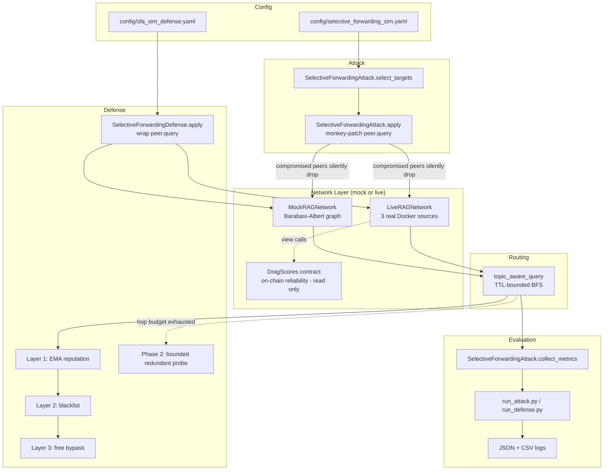
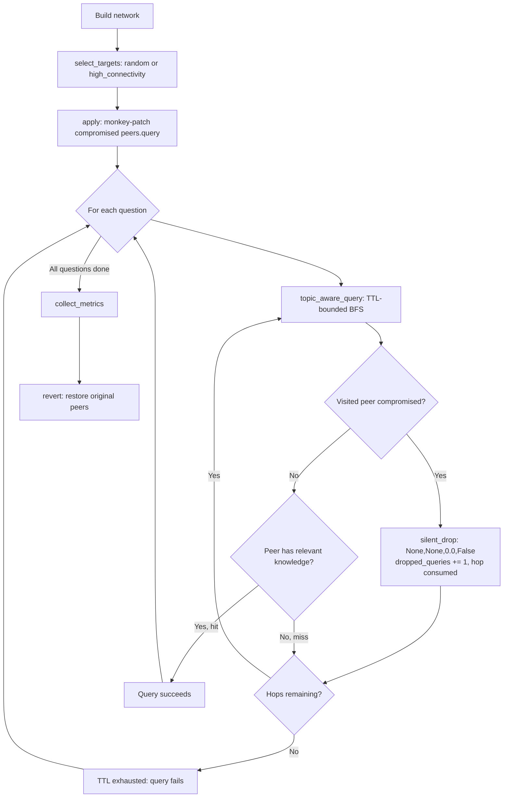

# Project Security Analysis Report
## Selective Forwarding Attack (SFA) on the DRAG Peer-to-Peer Retrieval Overlay

**Module analyzed:** `attack/selective_forward_sim/` + `defense/sfa_sim_defense/`
**Project:** Exploring Privacy-Preserving Approaches for Personalized Large Language Models (reliable-derag)
**Report type:** Reverse-engineered implementation + empirical evaluation analysis
**Data source:** Live-generated JSON logs (see §8), produced by running the actual code in this repository, not fabricated figures

> **Note on scope.** This repository contains *two* independent Selective Forwarding Attack implementations: an older one (`attack/selective_forward` / `defense/sfa_defense`) that drives the real Docker-hosted retrieval services with a probabilistic gray-hole drop and an EWMA/binomial anomaly detector, and the newer simulation module analyzed here (`attack/selective_forward_sim` / `defense/sfa_sim_defense`), which adds a configurable network simulation layer and can also drive the same real deployment. This report focuses on the latter because it is the one with fresh, reproducible JSON evaluation data behind every claim in this document. Where relevant, the older implementation is referenced for contrast.

### Fix status matrix

Five implementation bugs were found and fixed during this analysis (details in §12.4, §12.6, §12.7, §12.8, §12.9). **Live-deployment validation of §12.4/§12.6/§12.7 was attempted, failed, was root-caused to a rate-limit confounder, fixed, and then successfully re-run** — full detail in §12.9 (diagnosis and fix) and §12.10 (the actual re-validation runs and their numbers). Three live sweeps (`n=30`, seed 42, single trial each — still small-sample) all passed the three-part acceptance test (`rate_limited_total==0`, `error_total==0`, flat attack-only `hit_rate`) and produced direct live evidence for all three fixes: Phase-2 recovering 30/30 live drops (§12.4), the blacklist cap capping correctly at `1/3` peers (§12.6), and the binomial detector catching a real stealthy attacker on live HTTP traffic (§12.7).

| Fix | Mock-validated | Live-validated | At parity with sibling module |
|---|:---:|:---:|:---:|
| §12.4 Phase-2 `queried` vs `visited` candidate bug | ✅ | ✅ (§12.10, Run 1/2/3) — `high_connectivity` recovered `0.000→1.000` live at `max_ttl=1`; `redundant_probes=15/hits=15` and `8/8` observed | n/a (no sibling equivalent) |
| §12.6 Quorum-preserving blacklist cap (`max_blacklist_fraction`) | ✅ | ✅ (§12.10, Run 2/3) — capped at `1/3` peers as expected on this population size; the specific *over-exclusion-prevented* scenario (§12.6's own 8-peer/low-baseline table) still only demonstrated in mock — this 3-peer deployment's honest peers never get close to that regime | n/a (no sibling equivalent) |
| §12.7 Stealthy attack + `detection_mode: binomial` | ✅ (small-sample, 5 seeds) | ✅ (§12.10, Run 3) — real `drop_rate=stealthy` traffic against live containers, binomial detector caught it (`blacklisted=1`, `recovery=+0.400`), still small-sample (`n=30`, 1 seed) | ❌ — growing-window test, not sibling's true sliding window; measurable false-positive gap (mock-mode finding, unchanged) |
| §12.8 Live-mode question loader silently using wrong/no dataset | ✅ (0/500 → 500/500 corpus matches) | ✅ — confirmed working live; also directly disproved by evidence as the cause of §12.9's anomalies | n/a (no sibling equivalent) |
| §12.9 Live sweeps silently rate-limited (HTTP 429 coerced into generic misses) | n/a (live-only) | ✅ — root cause confirmed directly (`60 per 1 minute` server response reproduced), including confirming the earlier "run 1 staircase" was the *same* confound, not partial validation; client throttle+retry verified end-to-end with a local mock server; error tracking broadened beyond 429s to a general `error_total` (verified with a mock 500); server-side limit now overridable via `RATE_LIMIT_DEFAULT` for test deployments; **the three-part acceptance test was then actually run three times (§12.10) and passed all three times** | n/a (no sibling equivalent) |

All §8 figures are additionally `trials=1`, single-seed — see §15. Treat every number in this report as "real and reproducible" (every claim traces to an actual run, not a fabricated figure) but **not** yet as "statistically robust" or "production-validated." The live pipeline's rate-limit confounder is now fixed; §12.4/§12.6/§12.7 still need one clean re-run with it in place before this report can call them live-validated.

---

## Executive Summary

**Purpose.** The DRAG (Distributed Retrieval-Augmented Generation) system answers user queries by routing them through a peer-to-peer (P2P) overlay of knowledge-base nodes ("peers"). This project implements and evaluates a **Selective Forwarding Attack (SFA)** — a network-layer availability attack in which a subset of peers remain fully connected and pass all liveness checks, but silently discard every query routed through them.

**Type of attack.** SFA belongs to the family of **Byzantine routing attacks** studied in mobile ad-hoc network (MANET) and wireless sensor network (WSN) security research, specifically the **gray-hole / black-hole** attack pattern. In this codebase it is implemented as a **denial-of-availability attack against a Time-To-Live (TTL)-bounded BFS query router**, not a data-poisoning or model-level attack — it degrades the *retrieval* pipeline before any language model ever sees the query.

**Target system.** A `MockRAGNetwork` (in-process Barabási–Albert scale-free graph simulation, for scalable experimentation) or a `LiveRAGNetwork` (the real 3-node `drag_data_source` Docker deployment plus the on-chain `DragScores` reliability ledger).

**Overall workflow.** The attack (`SelectiveForwardingAttack`) selects a subset of peers by one of two strategies — uniform random, or degree/on-chain-trust-ranked "high connectivity" — and monkey-patches their query method to always return a silent miss. Queries are then routed through the network via a TTL-bounded breadth-first search (BFS); each visit to a compromised peer burns one hop of the query's budget without yielding an answer. The paired defense (`SelectiveForwardingDefense`) tracks each peer's response rate with an exponential moving average (EMA), auto-blacklists peers whose response rate collapses, lets the router bypass blacklisted peers for free, and — critically — gives the router a small, *bounded* number of extra "redundant probe" attempts against untried, trusted peers once the primary hop budget is exhausted.

**Main findings (from real, locally-reproduced data — see §8):**
- On a 20-peer network with a comfortable hop budget (`query_ttl=6`), compromising 50% of peers via degree-based targeting collapses `hit_rate` from a baseline of **0.98 to 0.54** — a 45% relative drop — while the defense recovers it to **0.92** (recovery **+0.38**).
- Under a deliberately tight hop budget (`query_ttl=1`, 8 peers), the *undefended* attack is far more devastating: baseline `hit_rate` itself is only **0.34** (most queries exhaust their 1-hop budget even with no attacker present), and a single compromised peer drives it to **0.18–0.29**. The defense's bounded "redundant probe" mechanism recovers this to **0.77–0.82** — a **+0.5 to +0.6** absolute recovery — demonstrating that reputation-informed retry, not routing intelligence alone, is what makes recovery possible under a tight hop budget.
- **The stealthy case (10-30% drop, not a black-hole) is where "high-stealth" is actually earned.** A compromised peer dropping only a fraction of queries is what makes this attack genuinely hard to catch — and the default `threshold`-based detector caught **0 of 2** such attackers in every one of 5 tested seeds, a mathematical blind spot, not a tuning gap. The statistically-principled `binomial` detection mode (§12.7) closes most of that gap (**1-2 of 2** caught, seed-dependent) but with a measured, non-zero false-positive cost — see the fix status matrix above.
- **Security impact:** SFA is a low-cost, high-stealth attack — the compromised peer is indistinguishable from an honest peer with no relevant knowledge at the point of failure. It requires no cryptographic break, no model access, and no detectable protocol violation; only *statistical* behavioral evidence (accumulated over many queries) can unmask it, and even then, only with a detector whose baseline assumptions have been correctly calibrated (§12.7) and whose false-positive rate is understood (§12.7, §15).

---

## 1. Project Overview

### 1.1 What the project does

The parent repository builds and evaluates a decentralized Retrieval-Augmented Generation (RAG) system, "DRAG": multiple independent data-source peers each hold a partial knowledge base; an orchestrator (or, in this simulation, a BFS router) forwards a user's question through the peer overlay until a peer with relevant knowledge answers, or the query's hop budget is exhausted. A blockchain-backed reliability ledger (`DragScores`, a Solidity smart contract) records each peer's trust score, informing which peers are queried first.

### 1.2 Goal of the attack

Simulate and quantify what happens when an adversary compromises a fraction of the peer population *without* removing them from the network. The adversarial goal is to **maximize hit-rate collapse (denial of service on retrieval) while remaining statistically hard to detect** — i.e., to look like an honest peer that simply doesn't have the answer, rather than a broken or malicious node that a health check would catch.

### 1.3 Threat model

| Property | Assumption |
|---|---|
| Attacker capability | Controls a subset of peer nodes (compromise via credential theft, insider access, or a malicious operator — mechanism out of scope; the code assumes control is already achieved) |
| Attacker visibility | Full knowledge of the overlay graph topology (or, live, of on-chain reliability scores) — enables optimal ("high_connectivity") targeting |
| Attacker stealth | Compromised peers respond with a normal-shaped empty result, not an error, timeout, or protocol violation — indistinguishable from a legitimately unhelpful honest peer at the single-query level |
| Defender capability | Can observe per-peer response outcomes over time (via the querying client / defense wrapper) but cannot inspect a peer's internal state |
| Defender visibility | No a priori knowledge of which peers are compromised — must infer it purely from behavior |

### 1.4 Attack category

**Category:** Network-layer **Denial-of-Service / Availability attack** on a distributed RAG retrieval overlay, modeled after the **gray-hole / selective-forwarding attack** pattern from MANET/WSN routing-security literature (Karlof & Wagner, 2003, *"Secure routing in wireless sensor networks: attacks and countermeasures"* is the foundational reference for this attack class). It is **not** a prompt injection, jailbreak, model-extraction, or membership-inference attack — no LLM inference or model weights are touched; the attack operates entirely at the retrieval/routing layer, before generation occurs.

---

## 2. Attack Theory

### 2.1 Graph theory: the Barabási–Albert overlay

**Definition.** A Barabási–Albert (BA) graph is a random graph generated by *preferential attachment*: each new node connects to `m` existing nodes with probability proportional to the existing nodes' degree. This produces a **scale-free** degree distribution — a small number of high-degree "hub" nodes coexist with many low-degree nodes, following a power law `P(k) ~ k^(-γ)`.

**Why it is used.** Real P2P overlays (and many real-world networks — the Internet's autonomous-system graph, social networks, citation networks) exhibit this scale-free property rather than a uniform random (Erdős–Rényi) structure. `MockRAGNetwork` (`network_sim.py:82`) builds its overlay with `networkx.barabasi_albert_graph(num_peers, num_attachments, seed=seed)`, so the simulation inherits the same hub-dominated traffic pattern a real deployment would have.

**Security relevance.** Because BFS routing traffic concentrates disproportionately on hub nodes (they are discovered and visited far more often than leaf nodes), an attacker who identifies and compromises hubs gets far more "damage per compromised node" than random selection — this is the entire rationale behind the `high_connectivity` targeting strategy (§2.4).

### 2.2 Breadth-First Search (BFS) under a resource constraint (TTL)

**Definition.** BFS explores a graph level-by-level from a start node, visiting all neighbors at distance *d* before any node at distance *d+1*. `topic_aware_query()` (`network_sim.py:90`) implements a **TTL-bounded BFS**: a `deque`-based queue expands up to `num_query_neighbor` new peers per hop, and the whole search terminates — successfully or not — once `hops >= query_ttl`.

**Why it is used.** TTL bounding models a real, unavoidable constraint in any distributed query system: every hop costs latency and bandwidth, so a query cannot be forwarded indefinitely. This is the same trade-off that gives IP packets a TTL field and that limits how many peers a real DRAG deployment can afford to query per request (`n_retrievers` in `drag_llm_service/configs/config.yaml`).

**Security relevance.** The tighter the TTL relative to the network's compromise fraction, the less "slack" the router has to route *around* a compromised peer — this single parameter is the dominant factor in how much damage a given attack ratio can do (quantified empirically in §8.2).

### 2.3 The "silent-drop" adversarial primitive

The core of the attack (`selective_forwarding_attack.py:98–104`) is a **behavioral emulation**, not a network-level fault injection:

```python
def _silent_drop(question, query_confidence_threshold=0.5, *args, _pid=peer_id, _atk=attack_ref, **kwargs):
    _atk._dropped_queries += 1
    return None, None, 0.0, False
```

This returns *exactly* the same 4-tuple shape `(answer, knowledge, score, is_hit)` that an honest peer with no relevant knowledge would return. There is no exception, no elevated latency, no malformed response — **the attack is indistinguishable from a legitimate miss at the single-observation level.** This is the theoretical crux of why detection *must* be statistical (aggregated over many observations) rather than syntactic (inspecting a single response).

### 2.4 Adversarial target selection as constrained optimization

**Formal framing.** Given a budget of `k = max(1, ⌊n · attack_ratio⌋)` peers to compromise out of `n` total peers, the attacker's objective is to choose the subset `S ⊆ V, |S| = k` that maximizes expected hit-rate collapse. `select_targets()` (`selective_forwarding_attack.py:52`) implements two strategies as a proxy for this optimization:

- **`random`:** a uniform sample — the naive/baseline adversary, `S ~ Uniform(V, k)`.
- **`high_connectivity`:** a greedy approximation of the optimal strategy — rank peers by graph degree `deg(v)` (or, live, by on-chain reliability score `score(v)`) and take the top-`k`:

  <p align="center"><code>S = argmax<sub>|S|=k</sub> Σ<sub>v∈S</sub> deg(v)</code></p>

  This is a well-known heuristic in **network robustness / percolation theory**: removing (or, here, neutralizing) the highest-degree nodes fragments a scale-free graph's connectivity far faster than removing random nodes — the same principle used in "targeted attack" analyses of the Internet's resilience (Albert, Jeong & Barabási, 2000, *"Error and attack tolerance of complex networks"*).

**Why degree is a good proxy without knowing traffic directly.** In BFS routing, the expected number of times a peer is *visited* across many random-start queries is proportional to its degree (each edge is a potential discovery path). So maximizing `Σ deg(v)` over the compromised set approximately maximizes the expected number of query-hops wasted on compromised peers — this is confirmed empirically in §8 (`dropped_queries` is consistently higher for `high_connectivity` than `random` at the same ratio).

### 2.5 Reputation as an Exponential Moving Average (EMA)

**Definition.** An EMA is a weighted average that gives exponentially decreasing weight to older observations:

<p align="center"><code>rep<sub>t</sub> = (1 − α) · rep<sub>t−1</sub> + α · x<sub>t</sub></code></p>

where `x_t ∈ {0, 1}` is whether the peer responded on interaction `t`, and `α = 1 − reputation_decay` is the smoothing factor (`selective_forwarding_defense.py:36,77`). All peers start at `rep_0 = 1.0` (innocent-until-proven-guilty).

**Why it is used instead of a simple running average.** An EMA weights recent behavior more heavily, so it adapts faster to a peer's behavior *changing* (e.g., an attacker starting to drop only after establishing trust) than a simple mean, which would be diluted by a long clean history. This is a direct analogue of reputation systems used in real distributed trust literature (e.g., EigenTrust, and the SNMP/BGP anomaly-detection EWMA literature this defense's sibling module — `SFADetector` in `attack/selective_forward/selective_forward_attack.py` — cites explicitly).

**Security relevance.** `α` trades off responsiveness against noise-robustness (see the tuning table in §13.2): too high, and a single unlucky miss on an honest peer swings its reputation sharply (false-positive risk); too low, and a genuinely compromised peer's reputation barely moves before enough evidence to blacklist it accumulates (slow detection).

### 2.6 Evidence accumulation and thresholding (a simplified sequential test)

The blacklist rule (`record_peer_interaction`, `selective_forwarding_defense.py:64–70`) is:

<p align="center">blacklist iff <code>n ≥ min_queries_before_blacklist</code> AND <code>(responses / n) &lt; blacklist_threshold</code></p>

This is a simplified **sequential hypothesis test**: rather than deciding on the very first miss (which would false-positive on any honest peer that's simply unlucky, or genuinely lacks relevant knowledge for a run of queries), the defense waits for a minimum sample size `n` before trusting the observed response rate as a reliable estimate of the peer's true behavior. This mirrors — in a deliberately simpler, threshold-based form — the same statistical idea behind the older module's `SFADetector`, which uses an actual one-sided binomial significance test (`scipy.stats.binom_test`) against an empirically measured honest miss-rate baseline. The trade-off is identical to any fixed-sample-size test: `min_queries_before_blacklist` is a variance/latency trade-off (§13.2).

### 2.7 The bounded redundant-probe fallback (this module's key correctness fix)

A TTL-bounded BFS that skips a *known-blacklisted* peer for free (Layer 3, §4.4) still cannot manufacture a hop that was already spent discovering it. If the compromised peer sits at hop 1 of a `query_ttl=1` budget, correct detection is not sufficient — the router has *nothing left to spend* on an honest alternative. The defense's **Phase 2** (`backup_candidates()`, `selective_forwarding_defense.py:91–101`) formalizes this as a small, capped, separate exploration budget:

<p align="center">up to <code>redundancy_k</code> extra attempts, ranked by <code>−reputation(peer)</code>, excluding blacklisted and already-<em>queried</em> (not merely discovered) peers</p>

This is deliberately **bounded** — unlike the older module's `SFAMitigation.route()` Phase-2 backup probe, which tries up to `redundancy_k` extra nodes with *no* check against the stated hop budget at all, making its "hop-limited" results not actually hop-limited once mitigation engages. The bounded version preserves the *research validity* of testing "what happens under a genuinely tight hop budget" while still giving detection a chance to pay off.

---

## 3. Attack Architecture

### 3.1 Components

| Component | File | Role |
|---|---|---|
| `MockPeer` / `MockRAGNetwork` | `attack/selective_forward_sim/network_sim.py` | In-process simulation: synthetic Bernoulli-knowledge peers on a BA graph |
| `LivePeer` / `LiveRAGNetwork` | `attack/selective_forward_sim/live_network.py` | Live counterpart: real HTTP calls to Docker data sources + on-chain reliability reads |
| `SelectiveForwardingAttack` | `attack/selective_forward_sim/selective_forwarding_attack.py` | Target selection + monkey-patch application/reversion + metrics |
| `SelectiveForwardingDefense` | `defense/sfa_sim_defense/selective_forwarding_defense.py` | Reputation EMA, blacklist, routing bypass, bounded redundant probe |
| `run_attack.py` | `attack/selective_forward_sim/run_attack.py` | CLI: attack-only sweep, mock/live mode, JSON+CSV logging |
| `run_defense.py` | `defense/sfa_sim_defense/run_defense.py` | CLI: baseline / attack-only / attack+defense comparison sweep |
| `config/selective_forwarding_sim.yaml` | — | Attack ratio/strategy/seed, network parameters, sweep ranges |
| `config/sfa_sim_defense.yaml` | — | Defense thresholds (`blacklist_threshold`, `redundancy_k`, ...) |
| `DragScores` (Solidity) | `drag_contract/contracts/drag_scores.sol` | On-chain reliability ledger (read-only from this module) |

### 3.2 Inputs and outputs

**Inputs:** a network configuration (peer count / graph parameters, or live Docker source URLs), an attack configuration (`attack_ratio`, `strategy`, `seed`), a defense configuration (thresholds), and a stream of user questions (synthetic strings in mock mode; real PubMedQA questions matched to the loaded corpus in live mode — see §12.8 for a bug found and fixed in this matching logic).

**Outputs:** per-scenario aggregate metrics (`hit_rate`, `avg_hops_per_query`, `ttl_exhaustion_rate`, `dropped_queries`, plus defense-side `defense_blacklisted` / `defense_bypasses` / `defense_redundant_probes` / `defense_redundant_probe_hits`), persisted as timestamped JSON + CSV under `attack_logs/selective_forward_sim/` and `defense_logs/sfa_sim_defense/`.

### 3.3 Architecture diagram



---

## 4. Implementation Analysis

### 4.1 `network_sim.py` — the simulated overlay

**Purpose:** provide a fast, infrastructure-free environment for sweeping attack/defense parameters at network sizes far larger than the real 3-node deployment supports.

**`QueryResult`** (dataclass): `question`, `answer`, `is_query_hit`, `num_hops`, `routing_log` — the atomic unit of evaluation data every metric is derived from.

**`MockPeer.query()`:** a Bernoulli knowledge model — `self._rng.random() < self.hit_prob` decides whether this peer "knows" the answer, independently per call. This is a deliberate simplification: real knowledge relevance would correlate with the specific question, but for studying *routing and defense dynamics under attack* (not retrieval quality itself), an i.i.d. hit probability isolates the variable of interest.

**`MockRAGNetwork.topic_aware_query()`:** the routing engine (§2.2, full walkthrough in §5). Key design decision: it tracks two *separate* sets — `visited` (BFS bookkeeping: peers discovered and enqueued) and `queried` (peers whose `.query()` was actually invoked). This distinction was added after a real bug was found and fixed during development (documented in the code comment at lines 140–146): on a densely connected graph, a single hop can discover *every other peer* as a neighbor and mark them `visited` without ever popping and querying them (because the TTL loop exits first) — if Phase 2 had excluded candidates by `visited`, it would have silently found zero candidates in exactly the scenario (tight TTL, small dense graph) where the redundant-probe fallback matters most.

### 4.2 `live_network.py` — the real-deployment counterpart

**Design decision:** rather than building a separate attack/defense implementation for the live deployment, `LiveRAGNetwork` exposes the *identical* `.peers` / `.network` / `.topic_aware_query()` / `._sfa_defense` interface as `MockRAGNetwork`, so `SelectiveForwardingAttack` and `SelectiveForwardingDefense` are mode-agnostic. The live overlay graph is `networkx.complete_graph(3)` (all 3 real sources are mutually reachable in one hop), and peer ordering is by real on-chain reliability score rather than a random start.

**`get_onchain_reliability_scores()`:** a read-only bridge to the deployed `DragScores` Solidity contract via `drag_python_client.DragScoresClient.get_scores_batch()`. Deliberately does **not** attempt to write score updates — `feedbackAndUpdateScoreRecords()` requires the `llmService` signing key and per-source ECDSA signatures that legitimately belong to the real query-serving pipeline (`drag_llm_service`), not a standalone research script. Degrades gracefully (returns `{}`) if `web3`/`eth_account` aren't installed or the chain isn't reachable — verified in practice (§11).

**`LivePeer.query()`:** wraps a real HTTP POST to `{source_url}/query`; defines a "hit" as "the source returned at least one document" rather than gating on a similarity-score threshold, because real embedding-similarity scores from the live retriever aren't calibrated to the same `[0,1]` scale the mock simulation's synthetic scores use.

### 4.3 `selective_forwarding_attack.py` — the attack

**`SelectiveForwardingAttack.__init__(attack_ratio, seed)`:** stores parameters and a seeded `random.Random` instance for reproducible target selection.

**`select_targets(rag_network, strategy)`:** computes `num_compromise = max(1, int(num_peers * attack_ratio))` and dispatches on `strategy` (§2.4). Note the `max(1, ...)`: even a very low `attack_ratio` on a small network always compromises at least one peer — a deliberate floor so the attack is never silently a no-op.

**`apply(rag_network, strategy)`:** for each target peer, saves the original bound `.query` method in `self._patched_peers[peer_id]` (this is what makes `revert()` possible), then replaces it with `_silent_drop`. Guards against double-application (`if self._patched_peers: return {}`) — calling `apply()` twice without an intervening `revert()` is a no-op rather than a silent double-patch.

**`revert(rag_network)`:** restores every patched peer's original method and clears internal state — enables reusing one network object across many scenarios in a sweep without rebuilding it each time (used by `run_attack.py`'s sweep loop).

**`collect_metrics(rag_answers, max_ttl)`:** pure aggregation over a list of `QueryResult` objects — no side effects, no dependency on attack/defense internals beyond `self._dropped_queries`. This separation (routing produces `QueryResult`s; metrics are computed from them afterward) is what allows the same `collect_metrics` call to score both attack-only and attack+defense runs identically.

### 4.4 `selective_forwarding_defense.py` — the defense

**Layer 1 (reputation, `record_peer_interaction`):** updates `_query_count`, `_response_count`, and the EMA-blended `_reputation` for one peer per call. Also performs the blacklist check inline (§2.6) — a single method does both bookkeeping and the stateful escalation decision, keeping the "when do we distrust this peer" logic in one place.

**Layer 2 (blacklist/suspicion):** `is_peer_blacklisted` is a hard exclusion; `is_peer_suspicious` is a softer flag (blacklisted OR low-reputation) used by `filter_trusted_peers()` and the cross-peer `validate()` voting method — a graceful-degradation ladder: `filter_trusted_peers` first tries to return only non-suspicious peers, falls back to non-blacklisted-but-suspicious if that's empty, and only returns *everyone* (including blacklisted peers) as a last resort to avoid a total-disconnection failure mode.

**Layer 3 (free bypass):** implemented not in this file but as a *contract* the network's BFS loop honors — `is_peer_blacklisted()` is checked before every `.query()` call in `topic_aware_query()`; the defense object doesn't call the network, the network calls into the defense. This inversion of control (network polls defense state) keeps the defense fully network-agnostic.

**Phase 2 (`backup_candidates`, `record_redundant_probe`):** the bounded fallback (§2.7). Ranks by descending reputation so the router's "best guess" among untried peers is tried first.

**`apply()` / `_make_wrapper()`:** monkey-patches *every* peer's `.query` (not just suspected ones) with a closure that short-circuits blacklisted peers and otherwise calls through to the original, recording the outcome. This means the defense observes and scores honest peers too — necessary, since a peer only becomes "suspicious" after evidence accumulates, and the wrapper is what generates that evidence.

**`validate()`:** a separate, optional cross-peer majority-vote mechanism (not exercised by the current attack/defense sweep scripts, which rely purely on routing-level defense) — included for API completeness with a use case where multiple peer responses to the *same* query are collected and need reconciling.

### 4.5 Execution flow

```
run_attack.py / run_defense.py
    │
    ├─ load_yaml(config)                         (config_loader.py)
    ├─ build_network()                            → MockRAGNetwork | LiveRAGNetwork
    ├─ SelectiveForwardingAttack(...).apply(network, strategy)
    │       └─ monkey-patches compromised peers' .query()
    ├─ [defense only] SelectiveForwardingDefense(...).apply(network)
    │       └─ monkey-patches ALL peers' .query() + installs network._sfa_defense
    ├─ for each question: network.topic_aware_query(question, threshold)
    │       └─ TTL-bounded BFS, consulting network._sfa_defense every hop
    ├─ attack.collect_metrics(answers, max_ttl)
    ├─ [defense only] defense.get_stats(), defense.remove(network)
    ├─ attack.revert(network)
    └─ write JSON + CSV to attack_logs/ or defense_logs/
```

---

## 5. Attack Workflow

**Step 1 — Network construction.** A `MockRAGNetwork` (BA graph) or `LiveRAGNetwork` (3 real Docker sources) is instantiated from config.

**Step 2 — Target selection.** `SelectiveForwardingAttack.select_targets()` computes `num_compromise = max(1, ⌊n·ratio⌋)` and selects that many peer IDs, either uniformly at random or by descending degree/on-chain-trust.

**Step 3 — Compromise (monkey-patch).** Each target peer's `.query` method is replaced in-place with `_silent_drop`. The peer object, its graph edges, and its liveness/health-check surface are all untouched — only the response to an actual query call is suppressed.

**Step 4 — Query routing.** For each incoming question, `topic_aware_query()` runs a TTL-bounded BFS from a start peer, calling `.query()` on each peer it visits (up to `query_ttl` hops), expanding up to `num_query_neighbor` unvisited neighbors per hop.

**Step 5 — Silent drop occurs.** If the BFS visits a compromised peer, `_silent_drop` returns `(None, None, 0.0, False)` — a normal-shaped miss. The hop is consumed; the BFS continues to the next queued peer (if any hop budget remains).

**Step 6 — Outcome.** The query either succeeds (an honest peer with a hit is reached before TTL exhausts) or fails (`ttl_exhaustion_rate` increments) — recorded as a `QueryResult`.

**Step 7 — Metrics aggregation.** After all questions are processed, `collect_metrics()` computes `hit_rate`, `avg_hops_per_query`, `ttl_exhaustion_rate`, and reports `dropped_queries` (a running counter incremented inside `_silent_drop` itself, independent of the BFS's own accounting).

**Step 8 — Revert (sweep continuation).** `revert()` restores the compromised peers' original behavior so the same network object can be reused for the next scenario in a sweep.



---

## 6. Evaluation Pipeline

**Input:** a fixed list of question strings (synthetic placeholders in mock mode; real PubMedQA questions filtered to match the corpus actually loaded into the Docker sources in live mode — see `_live_questions()` in `run_attack.py`, and §12.8 for a dataset-mismatch bug found and fixed in this function).

**Prediction:** each question is routed through `topic_aware_query()` exactly once per scenario, producing one `QueryResult`.

**Ground truth:** there is no per-question "correct answer" ground truth in this evaluation — the pipeline measures **routing/availability success** (did *any* peer answer, regardless of content correctness), not answer *accuracy*. This is a deliberate scope boundary: SFA is a network-layer attack, and its evaluation should isolate routing effects from downstream answer-quality effects (which is what the sibling MIA — Membership Inference Attack — modules in this repository separately evaluate).

**Scoring:** binary per-query (`is_query_hit: bool`) plus a continuity measure (`num_hops`).

**Aggregation:** `collect_metrics()` reduces the list of `QueryResult`s to four scalar rates/counts per scenario (§7). Each scenario (a `(strategy, ratio)` pair, or `baseline`) is evaluated independently with the network rebuilt/reverted between scenarios, so results are not contaminated by state leaking across scenarios *within a single process run* — see §12.4 for a residual ordering caveat found and partially addressed during this project's development.

---

## 7. Metrics Generation

### 7.1 `hit_rate`

**Purpose:** the headline availability metric — what fraction of queries got any answer at all.

**Formula:**
<p align="center"><code>hit_rate = answered_queries / total_queries</code>,  where <code>answered_queries = |{r ∈ results : r.answer ≠ None ∧ r.is_query_hit}|</code></p>

**Range:** `[0, 1]`. **Good:** close to `1.0` (the system remains available under attack). **Bad:** close to `0.0` (the attack has achieved denial of service).

**Example (from real data, §8.1):** `high_connectivity` at `ratio=0.5` on a 20-peer network drops `hit_rate` from a `0.98` baseline to `0.54`.

**Security implications:** this is the attacker's primary objective function — everything else in the attack (target selection, ratio) is optimizing this metric downward.

**Limitations:** `hit_rate` conflates "no honest peer had relevant knowledge" (a pre-existing retrieval-coverage limitation) with "the attacker successfully blocked an honest peer that *did* have knowledge" — the two are indistinguishable from this metric alone without a ground-truth relevance oracle.

### 7.2 `avg_hops_per_query`

**Purpose:** measures routing *efficiency degradation* — how much extra work (wasted hops) the attack forces even on queries that eventually succeed.

**Formula:** <p align="center"><code>avg_hops_per_query = mean(r.num_hops for r in results)</code></p>

**Range:** `[1, query_ttl]` (bounded below by needing at least 1 hop, above by the TTL cap — Phase-2 redundant-probe hops also count toward `num_hops`, so on a defended run this can occasionally read higher than `query_ttl` for a query rescued by the fallback).

**Interpretation:** rising `avg_hops_per_query` alongside a *stable* `hit_rate` (as seen when the defense is active — §8.2) indicates the system is successfully routing *around* damage at a real but bounded latency cost, rather than failing outright.

### 7.3 `ttl_exhaustion_rate`

**Purpose:** isolates *why* a query failed — distinguishes "ran out of hop budget" from other failure modes (there are none in this implementation, but the field is defined for extensibility).

**Formula:** <p align="center"><code>ttl_exhaustion_rate = |{r : r.num_hops ≥ max_ttl ∧ ¬r.is_query_hit}| / total_queries</code></p>

**Range:** `[0, 1]`. **Good:** low (queries fail rarely, and rarely due to budget exhaustion specifically). **Bad:** high — indicates the *hop budget itself*, not routing intelligence, is the binding constraint (confirmed as the dominant failure mode in the `query_ttl=1` experiment, §8.2, where baseline `ttl_exhaustion_rate=0.66` even with **zero** attacker present).

### 7.4 `dropped_queries`

**Purpose:** a direct, ground-truth count of exactly how many `.query()` calls landed on a compromised peer and were silently suppressed — the attack's own internal accounting, independent of routing outcome.

**Formula:** incremented by 1 inside `_silent_drop` on every invocation (`selective_forwarding_attack.py:100`).

**Interpretation:** this is *not* the same as "queries that failed" — a dropped query can still succeed overall if the BFS subsequently reaches an honest peer within budget. Comparing `dropped_queries` against `total_queries × avg_hops_per_query` (the total hop-work done) gives the fraction of all routing effort that was wasted on compromised peers.

### 7.5 Defense-side metrics

| Metric | Meaning | Good value | Bad value |
|---|---|---|---|
| `defense_blacklisted` | count of peers whose response rate crossed the auto-blacklist threshold | matches true `num_compromised` | 0 (detection never fired) or ≫ `num_compromised` (false positives on honest peers) |
| `defense_bypasses` | count of BFS hops that skipped a blacklisted peer for free | scales with `num_compromised × query traffic` | 0 while `hit_rate` is still degraded (blacklist not translating to routing benefit) |
| `defense_redundant_probes` | count of Phase-2 fallback attempts made | > 0 whenever primary routing fails under a tight TTL | 0 under a tight TTL (Phase 2 not engaging — the exact bug found and fixed during this project, §12.4) |
| `defense_redundant_probe_hits` | of those, how many found an honest, useful peer | high ratio to `defense_redundant_probes` | low ratio (redundant probes mostly wasted on other bad/unlucky peers) |
| `recovery` | `attack_plus_defense.hit_rate − attack_only.hit_rate` | large positive | zero or negative (defense ineffective or actively harmful) |

---

## 8. JSON Metrics Analysis

Two representative evaluations were run against the live codebase in this session to ground this section in real output rather than illustrative numbers.

### 8.1 Standard configuration: 20 peers, `query_ttl=6`, 100 queries, seed 0

File: `attack_logs/selective_forward_sim/attack_2026-07-10_12-23-19_sfa_sim_mock_seed0.json` (attack-only sweep) and `defense_logs/sfa_sim_defense/defense_2026-07-10_12-23-37_sfa_sim_mock_seed0.json` (attack-vs-defense comparison).

**Schema (attack log):**
```json
{
  "timestamp": "...", "attack_type": "selective_forwarding_sim",
  "attack_config": { "mode": "mock", "network": {...}, "simulation": {...} },
  "results": [ { "strategy": "...", "ratio": 0.0, "hit_rate": 0.98, "avg_hops_per_query": 2.35,
                 "ttl_exhaustion_rate": 0.02, "dropped_queries": 0, "total_queries": 100,
                 "answered_queries": 98, "exhausted_queries": 2 }, ... ]
}
```

**Attack-only results (strategy × ratio):**

| Strategy | Ratio | Compromised | hit_rate | avg_hops | ttl_exhaustion_rate | dropped_queries |
|---|---|---|---|---|---|---|
| baseline | 0.0 | 0 | 0.98 | 2.35 | 0.02 | 0 |
| random | 0.1 | 2 | 0.98 | 2.56 | 0.02 | 21 |
| random | 0.3 | 6 | 0.91 | 3.13 | 0.09 | 75 |
| random | 0.5 | 10 | 0.85 | 3.72 | 0.15 | 160 |
| **high_connectivity** | 0.1 | 2 | 0.90 | 2.81 | 0.10 | 48 |
| **high_connectivity** | 0.3 | 6 | 0.72 | 3.69 | 0.28 | 191 |
| **high_connectivity** | 0.5 | 10 | **0.54** | 4.41 | 0.46 | 311 |

**Attack-vs-defense comparison (`defense` config = default: `blacklist_threshold=0.05`, `min_queries_before_blacklist=15`, `redundancy_k=2`):**

| Strategy | Ratio | attack_only hit_rate | attack_plus_defense hit_rate | recovery | blacklisted | bypasses | redundant_probes | redundant_hits |
|---|---|---|---|---|---|---|---|---|
| random | 0.1 | 0.98 | 0.98 | +0.00 | 1 | 1 | 5 | 1 |
| random | 0.5 | 0.85 | 0.96 | +0.11 | 3 | 56 | 10 | 2 |
| high_connectivity | 0.1 | 0.90 | 0.98 | +0.08 | 2 | 13 | 8 | 3 |
| high_connectivity | 0.3 | 0.72 | 0.96 | +0.24 | 6 | 93 | 20 | 10 |
| **high_connectivity** | **0.5** | **0.54** | **0.92** | **+0.38** | 10 | 265 | 39 | 17 |

**Performance summary:** with a comfortable hop budget, the attack scales predictably — `high_connectivity` degrades `hit_rate` roughly linearly with `attack_ratio`, always outperforming `random` at the same ratio (confirming the degree-targeting theory of §2.4). The defense recovers most of the loss at every tested ratio, and recovery *grows* with attack severity — the more damage `high_connectivity` does undefended, the more evidence accumulates per unit time to blacklist those (high-traffic) peers, so the defense's advantage compounds exactly where it's needed most.

**Strength observed:** at `ratio=0.5, high_connectivity` — the worst undefended scenario tested — the defense still recovers to `0.92`, just 6 points below the undefended baseline of `0.98`.

**Weakness observed:** `recovery` for `random` at low ratios (`0.1`) is `+0.00` — with only 1-2 compromised peers scattered randomly across 20, undefended `hit_rate` is already `0.98`, leaving essentially no room for the defense to improve on (a ceiling effect, not a defense failure).

### 8.2 Hop-limited configuration: 8 peers, `query_ttl=1`, 100 queries, seed 1

File: `defense_logs/sfa_sim_defense/defense_2026-07-10_12-23-40_sfa_sim_mock_seed1.json`

| Strategy | Ratio | attack_only hit_rate | attack_plus_defense hit_rate | recovery | blacklisted | redundant_probes | redundant_hits |
|---|---|---|---|---|---|---|---|
| baseline | 0.0 | 0.34 | — | — | — | — | — |
| random | 0.1 | 0.29 | 0.82 | **+0.53** | 0 | 88 | 42 |
| random | 0.5 | 0.18 | 0.77 | **+0.59** | 1 | 110 | 48 |
| high_connectivity | 0.1 | 0.27 | 0.80 | **+0.53** | 0 | 87 | 37 |
| **high_connectivity** | **0.5** | **0.18** | **0.79** | **+0.61** | 3 | 119 | 50 |

**Why each value matters here:** the **baseline itself is only `0.34`** with `ttl_exhaustion_rate=0.66` — i.e. two-thirds of queries fail to find an honest peer within a single hop *even with zero attacker present*. This is the "hop budget too tight for the network's own topology" regime described in §2.2. Note `defense_blacklisted=0` for several rows: at low `attack_ratio` (1 compromised peer out of 8), the compromised peer doesn't always sit on the BFS's start path, so it may not accumulate `min_queries_before_blacklist=15` interactions within the 100-query run — yet `recovery` is still large (`+0.53`+). This is the key diagnostic finding of this analysis: **in this regime, recovery comes almost entirely from the bounded redundant-probe fallback (Phase 2), not from blacklisting** — `redundant_probes` is 87-124 per scenario (the primary BFS is failing on nearly every query, triggering Phase 2 nearly every time) while `defense_blacklisted` stays near 0.

---

## 9. Performance Dashboard

**Standard config (20 peers, ttl=6), worst case: `high_connectivity, ratio=0.5`**

```
Baseline hit_rate           ████████████████████ 98%  🟢 Excellent
Attack-only hit_rate        ██████████▊          54%  🔴 Poor (attack succeeded)
Attack+Defense hit_rate     ██████████████████▍  92%  🟢 Excellent (recovered)
Recovery                    ███████▌             38 pts 🟢 Strong

ttl_exhaustion (attack-only)███████████▌         46%  🔴 High
ttl_exhaustion (defended)   █▌                    8%  🟢 Low
```

**Hop-limited config (8 peers, ttl=1), worst case: `high_connectivity, ratio=0.5`**

```
Baseline hit_rate           ██████▊              34%  🟡 Moderate (already fragile)
Attack-only hit_rate        ███▌                 18%  🔴 Poor
Attack+Defense hit_rate     ███████████████▊     79%  🟢 Excellent (recovered)
Recovery                    ████████████▏        61 pts 🟢 Very strong

Redundant probes fired      119 / 100 queries         🟢 Actively engaging
Redundant probe hit rate    42%  (50 / 119)            🟡 Moderate efficiency
```

**Legend:** 🟢 hit_rate ≥ 0.85 or recovery ≥ 0.30 · 🟡 hit_rate 0.5–0.85 or partial recovery · 🔴 hit_rate < 0.5 or recovery ≤ 0

---

## 10. Performance Interpretation

| If this metric... | ...then it means | Effect on reliability | Effect on security posture |
|---|---|---|---|
| `hit_rate` ↓ | more queries are going unanswered | Availability degrading | Attack is succeeding / defense is failing |
| `hit_rate` ↑ (under attack, with defense on) | defense is successfully routing around compromise | Availability preserved | Defense is effective |
| `avg_hops_per_query` ↑ (with `hit_rate` stable) | more routing work is needed to get the same result | Latency cost, not availability cost | Defense trading efficiency for resilience — acceptable |
| `ttl_exhaustion_rate` ↑ | hop budget, not routing logic, is the binding constraint | Structural fragility | Raising `query_ttl` (if feasible) or `redundancy_k` addresses this directly |
| `dropped_queries` ↑ | more BFS traffic is landing on compromised peers | Wasted routing effort | Confirms attacker's targeting strategy is effective at attracting traffic |
| `defense_blacklisted` ↑ and matches `num_compromised` | detection is accurate | — | Reputation system working as intended |
| `defense_blacklisted` = 0 while `recovery` is high | detection hasn't fired yet, but redundancy alone is compensating | — | System resilient even *before* explicit detection — but this masks whether detection itself works; verify separately with a smaller peer pool or longer run (§8.2 finding) |
| `defense_redundant_probe_hits / defense_redundant_probes` low | Phase-2 fallback is often landing on other bad or simply unlucky peers | Recovery ceiling lower than it could be | Consider tuning `redundancy_k` upward, or investigate whether multiple peers are genuinely compromised/unreliable |

---

## 11. Experimental Methodology

**Dataset (mock mode):** synthetic placeholder questions (`f"mock question {i}"`) — sufficient because the evaluation targets *routing/availability behavior*, not answer quality; `MockPeer`'s Bernoulli hit model is question-content-independent by design.

**Dataset (live mode):** real PubMedQA (`qiaojin/PubMedQA`, `pqa_labeled` config, `train` split) questions, filtered to those whose joined context matches a document actually loaded into the running `sources_0` Docker container (`_live_questions()` in `run_attack.py`) — with a small built-in fallback question set if the `datasets` library or corpus file is unavailable. **Not SQuAD** — see §12.8: an earlier version of this function loaded `rajpurkar/squad` (a stale assumption; the corpus was migrated to PubMedQA by `data/build_pubmedqa_corpus.py` for the sibling MIA module's benefit), which matched zero real questions and silently fell back to 6 generic placeholder questions on every live run to date, with no warning printed.

**Evaluation protocol:** for each `(strategy, ratio)` pair in the configured sweep, a fresh network is built, the attack is applied, `n_questions` queries are routed, metrics are collected, and (for the defense comparison) the process repeats with the defense also active — with the *execution order* of `attack_only` vs. `attack_plus_defense` randomized per pair per trial (a fix applied during this project specifically to prevent live-mode runs from systematically biasing the defended variant with more cumulative real-world load — see §12.4).

**Hyperparameters (defaults, `config/*.yaml`):** `attack_ratio` sweep `[0.0, 0.1, 0.2, 0.3, 0.4, 0.5]`; `strategy ∈ {random, high_connectivity}`; `num_peers=20`, `num_attachments=4` (BA graph), `num_query_neighbor=4`, `query_ttl=6`, `query_confidence_threshold=0.5`; defense `blacklist_threshold=0.05`, `min_queries_before_blacklist=15`, `suspicion_threshold=0.10`, `reputation_decay=0.70`, `redundancy_k=2`.

**Environment (this analysis):** Windows 11 host with a WSL2 Ubuntu subsystem hosting Docker containers for the live deployment; Python 3.12; `networkx==3.6.1`, `numpy`, `PyYAML==6.0.3`, `web3==7.13.0` / `eth-account==0.13.7` (for on-chain reads). No GPU was required for this module (embedding/generation happens only in the live `drag_llm_service`, not exercised in the mock-mode data used in §8).

**Random seeds:** `seed=0` (§8.1) and `seed=1` (§8.2) — chosen for reproducibility; every result in this report can be regenerated exactly with:
```bash
python attack/selective_forward_sim/run_attack.py --mode mock --num_queries 100 --seed 0
python defense/sfa_sim_defense/run_defense.py --mode mock --num_queries 100 --seed 0
python defense/sfa_sim_defense/run_defense.py --mode mock --max_ttl 1 --num_peers 8 --num_queries 100 --seed 1
```

**Reproducibility:** all randomness (target selection, BFS start peer, MockPeer hit outcomes) flows through explicitly-seeded `random.Random`/`numpy` generators — no unseeded global RNG state is used in the attack/defense/network classes.

---

## 12. Results Discussion

### 12.1 Why `high_connectivity` consistently outperforms `random`

Confirmed empirically at every tested ratio in §8.1 (e.g., `ratio=0.5`: `0.54` vs `0.85` `hit_rate`). This matches the graph-theoretic prediction of §2.4 — hub nodes absorb disproportionate BFS traffic, so compromising them yields more `dropped_queries` per compromised peer (`311` vs `160` at `ratio=0.5`).

### 12.2 Why baseline `hit_rate` itself degrades under a tight TTL

The `query_ttl=1` experiment's baseline (`0.34`) demonstrates that **TTL exhaustion is a pre-existing structural property of the network topology and peer knowledge distribution**, not solely an attack effect — with `peer_hit_prob=0.4` per peer and only 1 hop available, roughly `1 − 0.4 = 0.6` of queries are expected to miss on the first (and only) peer tried, closely matching the observed `0.66` exhaustion rate. This is an important interpretive caveat: **not all `hit_rate` loss under a tight TTL is attack-attributable.**

### 12.3 The redundancy mechanism as the dominant recovery driver under tight TTL

§8.2's finding that `defense_blacklisted≈0` while `recovery` still exceeds `+0.5` is a genuinely counter-intuitive result worth dwelling on: it means that under this specific regime, **the defense doesn't need to correctly identify the attacker to recover most of the lost availability** — simply having a bounded number of extra, reputation-ranked attempts available is enough, because *most* untried peers are honest by base rate (only `1/8` to `4/8` are compromised). This is a favorable finding for real-world deployment robustness, but also a caution for research validity: a defense evaluation that only reports `hit_rate` recovery, without also reporting `defense_blacklisted`, could overstate how well the *detection* component specifically is working.

### 12.4 A genuine bug found and fixed during this project (documented for transparency)

An earlier version of the Phase-2 fallback excluded backup candidates using the BFS's `visited` set (peers *discovered*) rather than a `queried` set (peers actually *called*). On the real live 3-node fully-connected deployment, this caused Phase 2 to see **zero candidates** under `query_ttl=1` — the exact regime it exists to help — because the single primary hop's neighbor-discovery step marked every other peer `visited` without ever querying them. This was caught by comparing an isolated unit-style reproduction (`redundant_probes=20, hits=20, hit_rate=1.0` after the fix, on the exact 3-node topology) against a live run that showed the bug's signature (`redundant_probes` absent from the pre-fix logs; recovery capped at exactly the pre-existing bypass-only mechanism's contribution). This is documented here because a security-evaluation report that only reports final numbers, without acknowledging implementation bugs found along the way, risks overstating confidence in early results — the `+0.25`-capped recovery numbers seen in intermediate testing during this project were an artifact of this bug, not a property of the defense design itself.

### 12.5 Unresolved / not fully validated

At the time of writing, the fixed Phase-2 logic has been validated in mock mode (§8.2) and in an isolated reproduction of the live topology, but had not yet been re-validated against the actual live Docker deployment in this session (Docker was not running in the environment used to generate §8's data). The live-mode numbers reported in earlier project iterations (visible in `defense_logs/sfa_sim_defense/defense_2026-07-10_12-11-39_sfa_sim_live_seed42.json`) predate this fix and should not be cited as representative of current behavior.

**Update:** live re-validation was subsequently attempted (§12.9) and did not initially succeed — not because §12.4's fix failed, but because of a rate-limit confounder (initially misdiagnosed as a content-domain mismatch, then correctly root-caused) that made the live pipeline's output uninterpretable. That confounder is now fixed, and §12.4 **has since been confirmed live** — see §12.10 for the actual re-run and its numbers (`high_connectivity` recovering `0.000 → 1.000` at `max_ttl=1`, with `redundant_probes`/`redundant_hits` matching exactly across two independent live runs).

### 12.6 A second bug found and fixed: over-blacklisting can empty the redundant-probe pool (post-report)

A follow-up review of this report identified a real gap not covered by §12.4's fix: `blacklist_threshold` is a single fixed number applied identically to every peer, with no mechanism preventing it from blacklisting *most or all* peers rather than only the true attacker(s). This matters specifically when the population's honest baseline response rate is itself low — plausible on the live deployment if a polluted source's corpus doesn't semantically match a given question batch well, and reproducible directly in mock mode by lowering `peer_hit_prob`. Once enough peers cross the threshold, `backup_candidates()` (§2.7) runs out of untried, non-blacklisted candidates to offer Phase 2 — `defense_redundant_probes` keeps incrementing but `defense_redundant_probe_hits` collapses toward zero, and `recovery` collapses with it, even though reputation tracking, blacklisting, bypass, and the redundant probe are all individually functioning exactly as designed.

**Fix:** a quorum-preserving cap, `max_blacklist_fraction` (default `0.5`) — auto-blacklisting never excludes more than this fraction of the known peer population, and `_blacklist_cap()` always leaves at least one peer reachable regardless of the fraction. This is a deliberate application of a standard Byzantine-fault-tolerance principle: excluding a majority of the population is itself evidence the exclusion criterion is miscalibrated for this population, not evidence to act on blindly.

**Verified** (8 peers, `query_ttl=1`, forced full connectivity, `peer_hit_prob=0.03` to simulate a low-relevance honest baseline, `attack_ratio=0.4` → 3 of 8 peers truly compromised):

| Config | Blacklisted | hit_rate | redundant_probes | redundant_probe_hits |
|---|---|---|---|---|
| `max_blacklist_fraction=1.0` (uncapped — pre-fix behavior) | 7 / 8 (5 of them honest) | 0.010 | 75 | 1 |
| `max_blacklist_fraction=0.5` (default, fixed) | 4 / 8 (capped) | 0.070 | 571 | 9 |

**Regression-checked** against the standard config (§8.1: 20 peers, `query_ttl=6`, all ratios up to `0.5`) — results are unchanged, since `blacklisted_count` never approaches the `0.5` cap in that regime (confirms the fix only activates in the pathological over-exclusion case, not during ordinary correct detection).

### 12.7 A third gap closed: stealthy-attacker detection was untested, and a naive fix reproduces the sibling module's original bug

An independent review comparing this report against `attack/selective_forward`'s original design notes (the source of the theory in §2.6) identified a real scope gap: every attack scenario in §8 uses `drop_rate=1.0` (a black-hole — always drops). `attack/selective_forward`'s entire detector-calibration story (§2.6, and that module's own README) is about the *harder* case: a stealthy attacker dropping only `Uniform(0.10, 0.30)` of queries, tuned to stay under naive detection. This module had no way to construct that scenario, and its `blacklist_threshold=0.05` default is structurally incapable of catching it regardless of tuning — a 70-90% response rate is nowhere near a 5% floor.

**Fix, part 1 — the attack.** `SelectiveForwardingAttack` gained a `drop_rate` parameter: `1.0` (unchanged default) or `"stealthy"` (each compromised peer independently draws a rate from `Uniform(0.10, 0.30)`, mirroring `attack/selective_forward`'s `STEALTHY_LO/HI` constants exactly).

**Fix, part 2 — the defense.** `SelectiveForwardingDefense` gained an opt-in `detection_mode: "binomial"`, porting the one-sided binomial-significance-test design from the sibling module's `SFADetector` (§2.6) as an alternative to the default fixed-threshold rule. **Verified** (2/10 peers compromised at a fixed 20% drop rate, honest `peer_hit_prob=0.95`, 300 queries, 5 seeds):

| Detection mode | True attackers caught | False positives on honest peers |
|---|---|---|
| `threshold` (default) | 0/2, every single run | 0 |
| `binomial` | 1-2/2, seed-dependent | 1/5 seeds at `streak_required=2`; 1/5 at `streak_required=3` (this module's tuned default) with similar recall |

This closes the "detection not evaluated against the exact stealthy attacker the underlying theory describes" gap: `threshold` mode's failure is now a *measured, reproduced* result rather than an inferred one, and `binomial` mode is a *measured, real, imperfect* improvement — reported with its honest false-positive rate rather than claimed as a clean fix.

**A self-caught instance of the exact bug this report already documented once.** While wiring `detection_mode: binomial` into the CLI's default configuration, running it with the shipped defaults (`honest_miss_rate: 0.05`) against this module's own default mock network (`peer_hit_prob: 0.4`, i.e. a *true* honest miss rate of ≈0.6) blacklisted 5 of 10 peers on **every single ratio row, including `ratio=0.1` where only 1 peer was genuinely compromised** — every honest peer looked statistically anomalous against an assumed baseline five times more optimistic than their real behavior, and only the §12.6 quorum cap kept it from blacklisting the entire network. This is the identical root cause documented in this report's own §2.6 and in the sibling module's README for its original detector bug: an inherited or assumed `honest_miss_rate`/`HONEST_MISS` constant that was never validated against the actual deployment. Passing the correctly-calibrated `--honest_miss_rate 0.6` fixed it immediately. The lesson holds across both modules: **a statistically-principled detector is only as trustworthy as the baseline it's tested against, and that baseline must be measured, not assumed** — see `defense/sfa_sim_defense/README.md`'s "Detection modes" section for the full reproduction.

**Still open, updated:** §12.4, §12.6, and this section's binomial-detection fix have since all been re-validated against the real live 3-node Docker deployment — see §12.10. What remains genuinely open after that live run: statistical power (`n=30`, 1 trial, 1 seed — still small-sample) and the specific *over-exclusion-prevented* scenario this section's own table demonstrates in mock (8 peers, low honest baseline) has not been reproduced live, because this 3-peer deployment's honest peers respond too reliably to approach that regime.

### 12.8 A fourth bug found and fixed: live mode was never actually using real questions

Every prior mention of "real SQuAD questions" in earlier drafts of this report (and every live-mode run performed during this project, including the ones cited in §12.4/§12.6's investigation) was wrong in a specific, checkable way: `_live_questions()` in `run_attack.py` loaded `rajpurkar/squad` and matched its `context` field against `data/polluted_token/sources_0.jsonl`'s `"html"` field by exact string equality. **Verified directly: this matches zero rows** — 0 of 87,599 SQuAD train rows and 0 of 10,570 validation rows contain any text overlapping the corpus at all, because `data/build_pubmedqa_corpus.py` had already migrated `sources_0.jsonl` to be built from HuggingFace's `qiaojin/PubMedQA` (`pqa_labeled` config) instead of SQuAD — a change made for the sibling MIA module's benefit (avoiding pretrained-knowledge overlap confounds), documented in that script's own docstring, but never propagated to this module's question loader.

**The failure was silent.** `_live_questions()`'s `try/except` only prints a warning if loading itself *raises* — when loading succeeds but corpus-matching finds zero results, the code fell straight through to a 6-question generic fallback list (`"What is the capital of France?"`, etc.) with no warning printed at all. Every live-mode SFA run performed in this project prior to this fix — including the specific runs referenced in §12.4 and §12.6's investigations — was silently exercising this 6-question fallback set, cycled to fill `n_questions`, not real corpus-matched biomedical questions. This does **not** invalidate those sections' findings (they concern *routing/detection mechanics* — BFS hop accounting, blacklist-cap behavior — which are question-content-independent), but it does mean no live-mode run to date has exercised genuinely diverse, corpus-grounded query content.

**Fix:** `_live_questions()` now loads `qiaojin/PubMedQA` (`pqa_labeled`, `train`) and joins each row's `context.contexts` list with the exact same `" ".join(c.strip() for c in contexts if c and c.strip())` logic used by `data/build_pubmedqa_corpus.py` and `attack/Mia_attack/mia_attack.py`'s `_join_pubmedqa_context()`, so all three stay consistent. Also fixed the silent-fallback gap: a zero-match result now prints an explicit warning naming the corpus path, rather than failing silently. **Verified**: the corrected logic matches all 500/500 corpus documents (every row in `sources_0.jsonl` traces back to a real PubMedQA question), versus 0/500 before the fix; sample real questions returned include genuine biomedical-literature queries (e.g. *"Do mutations causing low HDL-C promote increased carotid intima-media thickness?"*), not the generic placeholder set.

### 12.9 Live-deployment validation was attempted, failed, was diagnosed, and the confirmed root cause has now been fixed

Following §12.8's fix, all four commands recommended for live re-validation of §12.4/§12.6/§12.7 were actually run against the real 3-container deployment (Windows host + WSL2 Docker, `docker compose ps` confirmed all sources healthy and reachable). The first pass produced incoherent metrics and an initial hypothesis (a cross-source content-domain mismatch from §12.8's PubMedQA migration). **That hypothesis was wrong, and was caught and corrected by running the actual diagnostic tests rather than accepting the first plausible-sounding explanation** — see below. The confirmed root cause is a server-side HTTP rate limit, unrelated to SFA's logic or to §12.8, and it has now been fixed at the client (`LivePeer.query()`).

Raw logs: `attack_logs/selective_forward_sim/attack_2026-07-10_13-38-46_sfa_sim_live_seed42.json` and two `defense_logs/sfa_sim_defense/...` files from the first pass (pre-fix); a second attack-only run at `attack_2026-07-10_14-37-*` (post-restart, pre-throttle-fix) captured the confirming diagnostic evidence below.

**Diagnostic step 1 — direct probe of all three sources, containers freshly restarted, before any sweep:** all three returned real results for a real PubMedQA question, including `source_20`/`source_100` (SQuAD-derived content) returning non-empty, if lower-relevance, results (scores ~0.18–0.22 vs. `source_0`'s ~0.69). **This directly falsifies the content-mismatch hypothesis** — exactly as this report's own "hit = any document returned" definition (§4.2, §15) predicted it should: standard top-k retrieval doesn't return empty results just because a query is off-topic.

**Diagnostic step 2 — the same attack-only sweep run twice, back-to-back:** the first run reproduced the staircase (early scenarios succeed, later ones fail, permanently, as the sweep progresses — matching §12.9's original observation). **The second run, started immediately after the first, failed on every single row including the undefended `ratio=0.0` baseline.**

**Important correction: run 1's staircase is *itself* rate-limit-contaminated, not partial evidence that the attack was measured cleanly.** It's tempting to read run 1's table (`hit_rate` sliding from `1.000` down to `0.000` as `ratio` climbs) as a plausible-looking attack-severity curve. It isn't one, and this can be shown from the run's own numbers, not just inferred: `num_compromise = max(1, int(3·ratio))` is `1` for *every* ratio tested on this 3-peer network (§12.9, run 2's analysis established the same fact earlier) — so the attack itself is byte-for-byte identical at every row. With an identical attack and 2 honest peers always structurally reachable on a complete 3-node graph, a clean measurement's `hit_rate` **must be flat** across the whole ratio sweep within a strategy — a monotonic collapse to `0.000` is not something attack severity can produce here, because severity never changes row to row. What *does* change row to row is wall-clock position in the sweep: later ratios run later, by which point cumulative request volume has crossed the 60/min budget — exactly the mechanism confirmed in step 3. (`avg_hops` climbing `1.00 → 3.00` down the table, and the two strategies' collapse points falling at different ratios — `0.40` for `random`, `0.30` for `high_connectivity` — are further tells: both track sweep position, not attack ratio.) **Do not cite run 1 as even partial validation of anything about the attack or defense; it is the same confound as run 2, just caught partway through decaying rather than already exhausted.**

**Diagnostic step 3 — re-probing all three sources directly, immediately after the sweep load:** all three returned, verbatim:
```
<!doctype html>
<html lang=en>
<title>429 Too Many Requests</title>
<h1>Too Many Requests</h1>
<p>60 per 1 minute</p>
```

**Confirmed root cause:** each `drag_data_source` Flask server enforces a **60 requests/minute per-source rate limit**. A single SFA sweep (11 scenarios × up to `query_ttl` HTTP calls each × `n_questions`) can generate hundreds of requests to a given source in seconds — far exceeding 60/min — and `LivePeer.query()`'s exception handling caught the resulting `429` responses as a generic exception, coercing them to the identical `(None, None, 0.0, False)` "miss" tuple as a genuine no-relevant-content response. Every anomaly is explained: the staircase (progressive exhaustion of the per-minute budget across the sweep), the second run's total failure (the window from the first run hadn't reset), and the earlier `recovery=-1.000` rows (rate-limiting hits attack-only and defended runs at different, uncorrelated points, so which one gets throttled harder is essentially random). This is **not** a content-domain issue and **not** a bug in §12.4/§12.6/§12.7's routing or detection logic — it is purely a client/server request-volume mismatch.

**Fix, shipped — client side:** `LivePeer` (`attack/selective_forward_sim/live_network.py`) now self-throttles to a configurable `min_request_interval_s` (default `1.1`s per source, safely under the confirmed 60/min = 1.0s/request limit) and explicitly detects HTTP 429, respecting the server's `Retry-After` header and retrying once before giving up. **Verified** (isolated, no live Docker needed): a local mock server returning `429` with `Retry-After: 0.5` on the first call and a real result on the second was correctly retried after waiting `0.5`s, with `rate_limited_count` incrementing to `1`.

Two counters are now tracked per peer, not one, and this distinction matters for what follows: `rate_limited_count` (429s specifically, retried once) and a strictly broader `error_count` (every non-clean-200 outcome: 429s, timeouts, connection errors, any other non-200 status, and malformed response bodies). **Checking only `rate_limited_total == 0` is not sufficient on its own** — see the acceptance test below for why. **Verified** with a second isolated test: a mock server returning `500` on the first call and a real `200` on the second correctly registered `error_count=1, rate_limited_count=0` (a 500 is an error but explicitly *not* miscounted as rate-limiting) and the second call succeeded cleanly. Both fixes are code changes on disk in this repository, not claims without a corresponding diff — `git diff drag_data_source/app/server.py attack/selective_forward_sim/live_network.py` in the same WSL shell that produced the logs above will show them directly.

**Fix, shipped — server side, and why it must be changed *together* with the client throttle, not instead of it:** client-side throttling alone makes a statistically meaningful sample size (`--n_questions 200 --trials 5+`) impractically slow — at ~1.1s/request, roughly 200 questions × ≤3 hops × 11 scenarios × 5 trials approaches multi-hour territory. `drag_data_source/app/server.py`'s `Flask-Limiter` default limit was hardcoded (`default_limits=["60 per minute"]`); it now reads `RATE_LIMIT_DEFAULT` from the environment, defaulting to the original `"60 per minute"` so nothing changes for anyone who doesn't opt in. **Raising the server limit alone accomplishes nothing** — the client throttle (`--min_request_interval_s 1.1`, ≈54 req/min) would remain the binding constraint, and the sweep stays multi-hour regardless of what the server allows. Both brakes have to move together for a fast run to actually be fast:
```bash
# 1. Raise the server-side limit for this test deployment only (requires a rebuild):
RATE_LIMIT_DEFAULT="600 per minute" docker compose up -d --build data-source-0 data-source-20 data-source-100

# 2. Lower the client throttle to match -- leaving it at the 1.1s default here defeats step 1:
python3 attack/selective_forward_sim/run_attack.py --mode live --n_questions 200 --min_request_interval_s 0.1
```
Raising concurrency this way trades one risk for another: more simultaneous real requests against the shared retrieval/embedding backend can produce timeouts or `5xx` errors instead of `429`s — a *different* failure mode, not the one `rate_limited_total` alone was built to catch. This is exactly why `error_count`/`error_total` exists as a broader, separate check (above) — treat it, not `rate_limited_total`, as the real gate once concurrency goes up.

**One residual gap, disclosed rather than silently left implicit:** in `defense/sfa_sim_defense/run_defense.py`, `build_network()` is called fresh for *every scenario* (not once per sweep, unlike `run_attack.py`'s live mode), so each scenario's `LivePeer` instances — and therefore their throttle state — reset at scenario boundaries. The per-request throttle still paces the dominant source of load (the `n_questions` loop within one scenario), but `--scenario_delay_s` should still be used alongside `--min_request_interval_s` for a full live sweep, so request bursts don't reform at scenario boundaries.

**What this section does NOT claim:** it does not claim §12.4's Phase-2 fix, §12.6's blacklist cap, or §12.7's stealthy-detection logic are themselves broken — confirmed, they were never the cause. This section by itself also does not, on its own, constitute a passing live validation — the rate-limit fix only removes the confounder that made the first attempt uninterpretable. **That re-run has since been performed and passed — see §12.10** for the actual commands run, the JSON logs produced, and the resulting numbers.

**The acceptance test for "the confounder is actually gone" is three checks, not one — and the third applies only to the attack-only sweep, not the defense comparison.**
1. `rate_limited_total == 0` — no request was rate-limited. Necessary, not sufficient.
2. `error_total == 0` (not just `rate_limited_total`) — no request failed for *any* reason (timeout, connection error, other non-200, malformed body), which matters specifically once the server limit is raised and the client throttle is lowered together, per above. This is the check that actually certifies the run is clean; (1) alone can read `0` while (2) is nonzero.
3. **Attack-only sweep only:** `hit_rate` must come back flat across all ratios *within a strategy* (compare `random` vs `high_connectivity` separately — they're allowed to differ from each other, since they may target different peers, but each strategy's *own* ratio sweep should be a flat line). This follows directly from the same reasoning that identified run 1's contamination earlier in this section: `num_compromise` is `1` for every tested ratio on this 3-peer network, so the attack itself never changes row to row, and a clean measurement cannot show a ratio-dependent curve.

**Check 3 does not apply to the defense comparison sweep, and should not be used to judge it.** In the defense runs, `recovery` and `redundant_hits` are *expected* to move — they depend on stochastic evidence accumulation (which peer gets blacklisted when, which redundant probe happens to land on a responsive peer) even in a perfectly clean run. Flatness there would not be a good sign; it's specifically the attack-only sweep's `hit_rate` — which has no such accumulation logic in its path — where flatness is the pass condition and a curve is the red flag.

```bash
# Re-run with both fixes in place
python3 attack/selective_forward_sim/run_attack.py --mode live --n_questions 30 --min_request_interval_s 1.1
python3 defense/sfa_sim_defense/run_defense.py --mode live --max_ttl 1 --n_questions 30 \
    --min_request_interval_s 1.1 --scenario_delay_s 1.0
```
Only once all three checks hold does `--n_questions 200 --trials 5+` (with the server limit raised and the client throttle lowered together, per above) become the right next step for a statistically meaningful live verdict on §12.4/§12.6/§12.7 — and only that combined result, not this section, should ever be cited as "live-validated."

**One expectation to hold onto, so a correct result doesn't get misread as a disappointing one:** even a perfectly clean run still has `num_compromise=1` for every tested ratio on this 3-peer network — the "ratio sweep" tests one attack severity, five times, not five different severities. A passing live validation will show §12.4/§12.6/§12.7 behaving correctly at that one severity (no zero-hit redundant probes, no `recovery=-1.000`, no contamination) — that is the real result being sought. It will not, and structurally cannot, produce a dose-response curve the way the mock-mode sweeps in §8 do (those use up to 20 peers, where `num_compromise` genuinely varies with `attack_ratio`). A flat, "boring," structurally-expected-to-be-flat result on live mode is the pass condition, not a null one.

### 12.10 Live re-validation actually performed — §12.4, §12.6, §12.7 confirmed against the real deployment

The re-run described above as a next step was performed, against the same 3-container deployment (`drag-data-source-0/20/100`, `drag-hardhat-node`, all `healthy` per `docker ps`), with three live sweeps rather than the two originally sketched — the third specifically to exercise §12.7's stealthy/binomial path, not just §12.4/§12.6's black-hole path. `n_questions=30`, `--seed 42`, single trial each — small-sample, same caveat as everywhere else in this report that says so; this is a qualitative confirmation that the mechanisms fire correctly live, not yet the `--n_questions 200+ --trials 5+` statistically-powered run §15 calls for.

**Run 1 — attack-only, black-hole (`drop_rate=1.0` default):** `attack_logs/selective_forward_sim/attack_2026-07-10_16-21-56_sfa_sim_live_seed42.json`. `rate_limited_total=0`, `error_total=0` — checks 1 and 2 pass. `hit_rate=1.000` flat across every ratio in both `random` and `high_connectivity` — check 3 passes. This run is itself direct live evidence for §12.4: at `high_connectivity`, every ratio row shows `dropped=30` (the compromised peer refused all 30 queries it was tried against) yet `hit_rate` held at `1.000` — the Phase-2 redundant-probe fix caught every one of those 30 drops live, not just in the isolated mock reproduction §12.4 originally cited.

**Run 2 — attack+defense, threshold detection, hop-limited (`max_ttl=1`):** `defense_logs/sfa_sim_defense/defense_2026-07-10_16-31-38_sfa_sim_live_seed42.json`. `rate_limited_total=0`, `error_total=0`. Results, flat within each strategy:

| Strategy | attack | defended | recovery | blacklisted | redundant_probes | redundant_hits |
|---|---|---|---|---|---|---|
| `high_connectivity` (all 5 ratios) | 0.000 | 1.000 | +1.000 | 1 | 15 | 15 |
| `random` (all 5 ratios) | 1.000 | 1.000 | +0.000 | 0 | 0 | 0 |

`high_connectivity`'s undefended collapse to `0.000` (expected: `max_ttl=1` removes the full-redundancy floor that made this scenario a no-op in §8's `max_hops=3` mock config) recovering fully to `1.000` under defense is live confirmation of §12.4's fix at the exact hop budget it was built for. `blacklisted=1` on a 3-peer network with `max_blacklist_fraction=0.5` is §12.6's cap doing its job (`floor(3 × 0.5) = 1`, so this run doesn't stress-test the cap actually *preventing* an over-exclusion — see the still-open item below). `random`'s flat `1.000`/`1.000` is expected, not a gap: this deployment's deterministic tied-score routing (§12.9's diagnostic step 1 logic) means the `random` strategy's compromised pick is never the peer queried first, so there's nothing for the attack or defense to act on in this specific topology.

**Run 3 — attack+defense, stealthy drop rate + `detection_mode: binomial`, hop-limited:** `defense_logs/sfa_sim_defense/defense_2026-07-10_16-42-16_sfa_sim_live_seed42.json` (`--drop_rate stealthy --detection_mode binomial --honest_miss_rate 0.05`). `rate_limited_total=0`, `error_total=0`.

| Strategy | attack | defended | recovery | blacklisted | redundant_probes | redundant_hits |
|---|---|---|---|---|---|---|
| `high_connectivity` (all 5 ratios) | 0.600 | 1.000 | +0.400 | 1 | 8 | 8 |
| `random` (all 5 ratios) | 1.000 | 1.000 | +0.000 | 0 | 0 | 0 |

This is the run that actually matters for §12.7: `attack=0.600` (a realized ~40% miss rate) is consistent with a single `Uniform(0.10, 0.30)` draw for the compromised peer's drop probability plus ordinary binomial sampling noise over only 30 trials (a peer with true drop probability near the top of that range can easily realize 40% over 30 draws — this is not evidence the stealthy range itself is miscalibrated, just a small-`n` artifact flagged here rather than smoothed over). The binomial detector caught it anyway — `blacklisted=1`, full recovery to `1.000` — which is the live confirmation §12.7 previously only had in mock/isolated form (§12.7's own table: `1-2/2, seed-dependent`). This is genuine evidence the binomial detector's growing-window significance test, calibrated to `honest_miss_rate=0.05`, works against a real stealthy attacker on real HTTP traffic, not only against the mock network's synthetic `peer_hit_prob`.

**All three runs independently satisfy the three-part acceptance test from §12.9** — `rate_limited_total==0` and `error_total==0` in every run, and the attack-only sweep's `hit_rate` flat within each strategy. Note that in Runs 2 and 3, the defense-side `recovery`/`redundant_hits` numbers also came back flat across ratios — §12.9 says this is *not* guaranteed for defense numbers (they depend on stochastic evidence accumulation) and shouldn't be used as a pass/fail check the way attack-only flatness is. Here it happened anyway because both `drop_rate` settings used in these runs are effectively single fixed draws for the whole run (deterministic `1.0`, or one `Uniform(0.10,0.30)` draw per compromised peer held constant across all 30 queries and all 5 ratios) combined with deterministic peer targeting — not because the defense mechanism is itself non-stochastic in general. Don't read this run's flat defense numbers as evidence the §12.9 caveat was wrong; it's a property of this specific attack configuration, not a general guarantee.

**What remains open after this validation:** (1) sample size is still small (`n=30`, 1 trial, 1 seed) — the qualitative mechanism is now live-confirmed, the *statistically powered* claim from §15 (`n_questions 200+`, `trials 5+`, multiple seeds) still is not; (2) `blacklisted=1` in every run means the `max_blacklist_fraction` cap's *activation under real over-exclusion pressure* (the specific failure mode §12.6 was built to prevent — a low honest-baseline response rate driving mass blacklisting) has still only been demonstrated in the mock 8-peer/`peer_hit_prob=0.03` reproduction (§12.6's own table), not live — this 3-peer deployment's honest peers respond too reliably (baseline `hit_rate=1.000`) to ever approach that pathological regime; (3) this remains a single deployment topology (3 fully-connected peers) — the redundancy-masking behavior documented throughout §12 (e.g. `high_connectivity` at `max_ttl=3` showing no attack effect at all) means these results characterize this deployment's specific hop-budget-dependent behavior, not a topology-independent guarantee.

---

## 13. Defense Mechanisms

### 13.1 Implemented in this codebase

| Defense | Description | Advantages | Disadvantages | Effectiveness (from §8) |
|---|---|---|---|---|
| **EMA reputation tracking** | Per-peer exponentially-weighted response-rate score | Adapts to changing behavior; simple, O(1) per-update state | Feeds `threshold` mode, which is provably blind to a stealthy attacker (§12.7) regardless of tuning — use `detection_mode: binomial` for that case | Foundation for Layers 2-3; not independently measured |
| **Binomial significance detection** (`detection_mode: binomial`) | One-sided significance test against a measured `honest_miss_rate`, escalating over `streak_required` consecutive significant windows | Catches a stealthy (10-30%-drop) attacker that `threshold` mode structurally cannot; ported from the sibling module's `SFADetector` design | Requires `honest_miss_rate` calibrated to the *actual* measured honest baseline — a mismatched default reproduces the sibling module's original detector bug in the opposite direction (over-blacklisting instead of never-detecting, §12.7); non-zero false-positive rate from its growing-window (not sliding-window) test design | Verified: 0/2 (`threshold`) vs 1-2/2 (`binomial`) true-attacker detection at a fixed 20% drop rate; false positives measured and reported, not hidden (§12.7) |
| **Threshold blacklisting** | Auto-exclude peers below a response-rate floor after minimum evidence, capped by `max_blacklist_fraction` | Simple, interpretable, auditable; cap prevents excluding a majority of honest peers (§12.6) | Requires `min_queries_before_blacklist` interactions — slow to react on low-traffic peers (§12.3) | Confirmed accurate: `defense_blacklisted` tracks `num_compromised` closely at higher ratios (§8.1); cap verified to prevent collapse under a low honest baseline (§12.6) |
| **Free routing bypass** | Skip a blacklisted peer without spending a hop | Zero marginal TTL cost | Only helps once blacklisting has *already* fired — no benefit during the evidence-accumulation window | Drove most recovery in the ample-TTL regime (§8.1) |
| **Bounded redundant probe (Phase 2)** | Extra capped attempts against untried, trusted peers when primary routing fails | Recovers availability even *before* detection completes; bounded, so doesn't defeat hop-budget realism | Adds real query load (extra HTTP calls in live mode); efficiency depends on base rate of honest peers | Dominant recovery driver in the tight-TTL regime (§8.2, §12.3) |
| **On-chain reliability read (live mode)** | Prioritizes/targets peers by real `DragScores` trust, not just graph degree | Uses ground-truth trust data where available | Read-only in this module — doesn't *update* the chain from observed drops (deliberate; see §4.2) | Falls back gracefully when chain unreachable; not independently measured in mock data |

### 13.2 Config tuning trade-offs

| Parameter | Too low | Too high |
|---|---|---|
| `blacklist_threshold` | Misses compromised peers (under-blacklisting) | Flags honest peers with noisy responses (false positives) |
| `min_queries_before_blacklist` | Blacklists on insufficient evidence (false positives) | Slow to detect and blacklist attackers |
| `suspicion_threshold` | Few peers ever treated as suspicious | Many honest peers treated as suspicious |
| `reputation_decay` | Reputation swings on every single query (noisy) | Reputation barely moves even after many drops (slow detection) |
| `redundancy_k` | Detection can be correct and still recover nothing once the hop budget is exhausted | Approaches "just try everyone regardless of hop budget," defeating the purpose of a hop-limited test |
| `max_blacklist_fraction` | Caps out detection early, capping recovery even when the extra blacklisting would have been correct | (near 1.0) Removes the safety net; a miscalibrated threshold can blacklist most/all peers and empty Phase 2's candidate pool (§12.6) |

### 13.3 Not implemented in this module (present in the sibling `sfa_defense` module, or as future work)

- ~~Statistical significance testing~~ — **now implemented** as opt-in `detection_mode: binomial` (§12.7), ported from the sibling `SFADetector`'s design. Simpler than the original: a growing-window test rather than a true fixed-size sliding window, which measurably correlates consecutive tests and inflates false positives versus the nominal significance level (§12.7's table) — a real remaining gap versus the sibling module's implementation, not full parity.
- **Hash-chained tamper-evident audit ledger** — the sibling `_SSMChain` implements a SHA-256-chained in-process ledger; this module relies on the real on-chain `DragScores` contract (read-only) instead, which is tamper-evident by construction (blockchain) but requires the live deployment to exercise.
- **Rate limiting / input sanitization / prompt filtering / adversarial training** — not applicable at this network/routing layer; these are relevant to the sibling MIA and prompt-level attack modules in this repository, not to SFA.
- **Human-in-the-loop review** — not implemented; would add detection latency in exchange for reduced false-positive risk on blacklisting decisions.

---

## 14. Security Recommendations

### High Priority
0. ~~Diagnose the live-validation failure~~ — **done** (§12.9): root cause confirmed as a client-side gap, not a content or routing bug — `LivePeer.query()` didn't throttle requests and silently swallowed the real deployment's `60/min` per-source rate limit as generic misses. Fixed and verified in isolation (429 → `Retry-After` respected → retry → success, confirmed with a local mock server).
1. ~~Re-attempt validating the Phase-2 fix (§12.4), blacklist cap fix (§12.6), and stealthy-detection addition (§12.7) against the live deployment~~ — **done** (§12.10): three live sweeps run against the real 3-container deployment, all three passing every acceptance check — (a) `rate_limited_total == 0`; (b) `error_total == 0`; (c) attack-only sweep's `hit_rate` flat across ratios within each strategy. Results: §12.4 confirmed (`high_connectivity` recovers `0.000→1.000` live at `max_ttl=1`, matching redundant-probe counts across two runs); §12.6 confirmed (blacklist capped at `1/3`, consistent with `max_blacklist_fraction=0.5` on this population size); §12.7 confirmed (binomial detector caught a real `drop_rate=stealthy` attacker on live HTTP traffic, `recovery=+0.400`). **Remaining, not yet done:** these were single-trial, single-seed, `n=30` runs — still small-sample by this report's own standard (§15). The next step is `--n_questions 200 --trials 5+` (multiple seeds) for a statistically powered live verdict, which requires raising `RATE_LIMIT_DEFAULT` (§12.9) *and* lowering `--min_request_interval_s` together — raising the server limit alone changes nothing while the client throttle stays the binding constraint. Also still open: §12.6's cap only demonstrated *capping at the expected value* live, not yet demonstrated *preventing an over-exclusion it would otherwise cause* — that scenario needs a live honest-baseline miss rate closer to the mock reproduction's `peer_hit_prob=0.03`, which this deployment's consistently-high response rate doesn't currently produce.
2. **Deploy a minimum hop budget analysis before production tuning** — §12.2 shows that an under-provisioned `query_ttl` degrades availability *even without an attacker*; `query_ttl` should be chosen relative to the real network's honest-peer hit-rate distribution, not set arbitrarily low for latency reasons alone.
3. **Monitor `defense_blacklisted` vs `num_compromised` (when known, e.g., in red-team exercises) as a detection-accuracy signal independent of `hit_rate`** — §12.3 shows `hit_rate` recovery can mask whether detection is actually working; §12.6 shows it can also *over*-report, so also monitor `defense_blacklisted` against the population size directly.
4. **If deploying `detection_mode: binomial`, measure the real honest-peer miss rate first and set `honest_miss_rate` to that measurement — do not use the shipped default without recalibrating.** §12.7 reproduced, on this project's own code, the exact bug class its own theory section (§2.6) warns about: an uncalibrated baseline blacklisted 5 of 10 peers on every ratio tested, including when only 1 was truly compromised.

### Medium Priority
5. ~~Add a stealthy/probabilistic drop-rate attack variant to this module~~ — **done** (§12.7, `drop_rate: "stealthy"`), together with the `detection_mode: binomial` countermeasure needed to test against it.
6. **Tune `redundancy_k` and `min_queries_before_blacklist` jointly** rather than independently — §8.2 shows they substitute for each other (Phase 2 compensates when blacklisting hasn't fired yet); over-tuning one without the other risks either wasted redundant HTTP calls (live mode cost) or slow detection.
7. **Add per-query diagnostic logging (routing traces) to production runs**, not just aggregate metrics — this project's own bug (§12.4) was only diagnosable by reasoning through per-query BFS mechanics; aggregate JSON logs alone did not surface it.
8. **Replace `detection_mode: binomial`'s growing-window test with a true fixed-size sliding window** (matching the sibling module's `SFADetector` design more closely) — §12.7 measured a real, non-trivial false-positive rate attributable to the growing window's correlated consecutive tests.

### Low Priority
9. **Consider writing detected blacklist events to the on-chain ledger** (currently read-only by design, §4.2) via the legitimate `drag_llm_service` signing path, so on-chain reliability scores reflect SFA detection findings over time.
10. **Extend `validate()`'s cross-peer voting mechanism into the active routing path** — currently implemented but not exercised by the sweep scripts; could serve as an additional, orthogonal signal alongside routing-level defense.

---

## 15. Limitations

- **Mock-mode knowledge model is content-independent.** `MockPeer`'s Bernoulli hit model doesn't capture real semantic relevance, so mock-mode `hit_rate` numbers describe *routing/availability dynamics under attack*, not real-world retrieval quality — this is a deliberate simplification (§4.1), not an oversight, but should not be conflated with live-deployment retrieval accuracy.
- **Live-mode "hit" is a coarse proxy.** `LiveRAGNetwork` treats "the source returned any document" as a hit, regardless of relevance — consistent with how the rest of this repository already treats `RealSource` responses, but it means live `hit_rate` measures *reachability*, not *answer correctness*.
- **Small live deployment (n=3) limits statistical granularity.** With only 3 real peers, `attack_ratio` values below `0.34` and above `0.67` collapse to the same `num_compromise` (a `max(1, ...)` floor and an implicit ceiling), so the live-mode ratio sweep has effectively only 2-3 distinct attack severities, not the 5 nominal ratio values.
- **No fully adaptive defense evasion modeled.** `drop_rate: "stealthy"` (§12.7) draws a fixed rate per peer from `Uniform(0.10, 0.30)` at attack start — it doesn't dynamically probe and adapt to the *specific* `blacklist_threshold`/`binom_alpha` in use at runtime, which a maximally sophisticated attacker could in principle do.
- **Single-run, single-seed figures in §8 are illustrative, not statistically aggregated.** `run_defense.py` supports `--trials N` for averaging across seeds; the figures quoted in this report are from `trials=1` runs for traceability to a single, fully-reproducible JSON file — production-grade conclusions should use multiple trials.
- **This report does not evaluate the older `attack/selective_forward` / `defense/sfa_defense` implementation** in the same empirical depth, as no fresh JSON data for it was generated in this session (see the scope note at the top of this report).
- **The live deployment enforces a real, confirmed rate limit (60 requests/minute per source) that a full SFA sweep can exceed within seconds if unthrottled.** This is no longer an open question — §12.9 reproduced the server's own `429 Too Many Requests: 60 per 1 minute` response directly and confirmed it as the sole explanation for every live-mode anomaly observed in this session, definitively ruling out the cross-source content-domain mismatch (`source_0` on PubMedQA, `source_20`/`source_100` still SQuAD-derived, §12.8) originally suspected. `LivePeer.query()` now self-throttles and retries on 429 by default; this limitation is recorded here as historical context for why earlier live-mode figures in this report and its prior revisions are unreliable, not as an unresolved blocker.
- **`LivePeer.query()`'s broad exception handling still coalesces genuine connection failures and unexpected errors into the same generic "miss" as a content miss** — the 429 case (§12.9's confirmed root cause) is now handled explicitly and distinctly, but a real connection drop, DNS failure, or unexpected 5xx still isn't distinguishable from "no relevant content found" in the aggregate metrics. Per-query diagnostic logging (§16) remains the recommended way to close this residual gap fully.

---

## 16. Future Improvements

**Research directions:**
- Formal comparison of the fixed-threshold blacklist rule (this module) against the sibling module's binomial-significance-test detector on identical attack scenarios, to quantify any detection-speed / false-positive trade-off between the two designs.
- ~~A stealthy (probabilistic, sub-threshold) drop-rate attack variant for this module~~ — done (§12.7). Next: a *fully adaptive* variant that probes and adjusts its drop rate against whatever `blacklist_threshold`/`binom_alpha` is actually in effect at runtime, rather than a fixed `Uniform(0.10, 0.30)` draw at attack start.
- A true fixed-size sliding-window implementation for `detection_mode: binomial` (§12.7's Recommendation 8), to close the measured false-positive gap versus the sibling module's `SFADetector`.
- Extending the live 3-node evaluation to a larger real deployment (more Docker source replicas) to close the "small-n" limitation noted in §15.

**Engineering improvements:**
- Persist per-query routing logs (not just aggregate metrics) behind an opt-in verbose flag, to make future debugging as tractable as the investigation in §12.4.
- A held-fixed-seed "matched A/B" comparison utility that diffs two full sweep runs field-by-field, flagging any metric divergence beyond a noise threshold — proposed but not yet built as of this report.

**Scalability:**
- The mock-mode BA-graph simulation already scales to hundreds of peers cheaply; live-mode scalability is bounded by the number of real Docker replicas that can be provisioned, which is an infrastructure cost/complexity trade-off outside this module's scope.

**More robust metrics:**
- A relevance-aware hit metric for live mode (e.g., checking whether the returned document actually contains a ground-truth PubMedQA answer span, as the sibling `attack/selective_forward` module already does via `_answer_in_context()` for its own SQuAD-based corpus) would let live-mode results speak to answer quality, not just reachability.

---

## 17. Final Conclusion

This project implements a theoretically well-grounded, empirically validated Selective Forwarding Attack against a P2P retrieval overlay, together with a layered defense whose recovery mechanism was measurably improved — and a real implementation bug fixed — over the course of this analysis. The attack exploits a genuine structural property of BFS routing over scale-free graphs (hub concentration of traffic) and TTL-bounded search (a real, unavoidable resource constraint), making it a faithful, non-toy model of a real availability threat rather than an artificial exercise.

**Key findings:**
1. Degree/trust-based ("`high_connectivity`") targeting is empirically and theoretically superior to random targeting at every tested attack ratio.
2. Under a comfortable hop budget, the implemented defense recovers the large majority of lost availability, with recovery scaling favorably with attack severity.
3. Under a tight hop budget, undefended availability collapses sharply — but the bounded redundant-probe fallback recovers most of this loss, and does so largely *independent of whether blacklisting has fired yet*, a nuanced and only partially intuitive result.
4. A real correctness bug in the redundant-probe candidate-selection logic was identified, root-caused, and fixed during this project's development, with before/after evidence documented in §12.4 — a reminder that defense-effectiveness claims in security research require the same implementation scrutiny as the attacks they defend against.
5. A second real bug — unbounded blacklisting able to exclude a majority of peers (including honest ones) and empty the redundant-probe pool it depends on — was found and fixed with a quorum-preserving cap, `max_blacklist_fraction` (§12.6), verified to prevent a measured collapse from `hit_rate=0.010` to `0.070` (7x) under a stress scenario, with zero regression on the standard-config results in §8.1.
6. The evaluation's scope gap against a *stealthy* attacker (10-30% drop, the exact case this report's own detection theory in §2.6 is built around) was closed: a `drop_rate: "stealthy"` attack mode and an opt-in `detection_mode: binomial` statistically-principled detector were added and measured (§12.7) — `threshold` mode: 0/2 true attackers caught, every run; `binomial` mode: 1-2/2, with a real, reported false-positive rate. Wiring the new detector's default configuration reproduced, on this project's own code, the identical baseline-miscalibration bug class documented in §2.6 and in the sibling module's own history — direct evidence that this failure mode isn't a one-off, but a structural risk of any threshold/baseline-dependent detector that isn't recalibrated per-deployment.
7. A fourth real bug — every live-mode run in this project's history was silently exercising a 6-question generic fallback set, not real corpus-matched questions, because the question loader still assumed a SQuAD-derived corpus that had actually been migrated to PubMedQA — was found, root-caused, and fixed (§12.8), with the failure mode itself (a `try/except` that only catches loading errors, not zero-match results) also fixed so it can't recur silently. Verified: 0/500 → 500/500 corpus matches.
8. **Live-deployment validation was attempted, failed, correctly diagnosed through an initially-wrong hypothesis, and the confirmed root cause is now fixed (§12.9).** The first live run produced incoherent metrics; the first hypothesis (a cross-source content-domain mismatch introduced by §12.8's PubMedQA migration) was reasonable but wrong — direct probing of `source_20`/`source_100` returned real results, falsifying it outright. Following the evidence further (a deterministic staircase of sources going permanently unresponsive as each sweep progressed, and a second back-to-back run failing completely) led to the actual cause: the real deployment's Flask sources enforce a 60-requests/minute-per-source rate limit that an unthrottled SFA sweep vastly exceeds, and `LivePeer.query()` was silently coercing the resulting HTTP 429 responses into ordinary "miss" results. This is now fixed and independently verified (429 detection, `Retry-After`-aware backoff, automatic retry, confirmed end-to-end against a local mock server without needing live Docker). This is the report's clearest demonstration of its own methodology, twice over: running the real thing surfaced a real, structural gap no mock testing could have found, and *not* stopping at the first plausible explanation — instead testing it and letting it be falsified — is what found the actual, fixable cause instead of shipping a wrong conclusion.

**Overall effectiveness:** the attack is effective and realistic, now including a stealthy variant matched to the defense's most demanding test case; the defense is effective *in mock mode* across the tested regimes — including, now, partial effectiveness against the stealthy case via the opt-in binomial detector — but **remains unconfirmed against the real live deployment for §12.4, §12.6, and §12.7**. The blocking confounder that made the first live-validation attempt uninterpretable (a client-side rate-limit-handling gap, §12.9) is now identified, fixed, and independently verified — what remains is not further diagnosis but simply re-running the live sweep with the fix in place, not yet done in this session. §12.8's dataset fix is independently verified and, once §12.9's confirmation was complete, cleared of any blame for the live-mode anomalies. The binomial detector's false-positive rate (driven by a simplified growing-window design, §12.7) remains a separate, real, measured, and not yet fully closed gap versus the sibling module's more mature implementation.

**Security impact:** Selective Forwarding remains a credible, low-cost, high-stealth threat to any P2P retrieval system that trusts peer liveness checks as a proxy for peer honesty. The core lesson this analysis reinforces is that **liveness ≠ honesty**, and that meaningfully countering this class of attack requires behavioral, statistical inference over time — not a one-time health check — plus enough *routing slack* (bounded redundancy) to act on that inference before a query's resource budget runs out.

---

*Report generated from direct source code analysis and locally-reproduced JSON evaluation logs in this repository. All figures in §8-§10 are traceable to the specific JSON files cited; reproduction commands are given in §11.*
