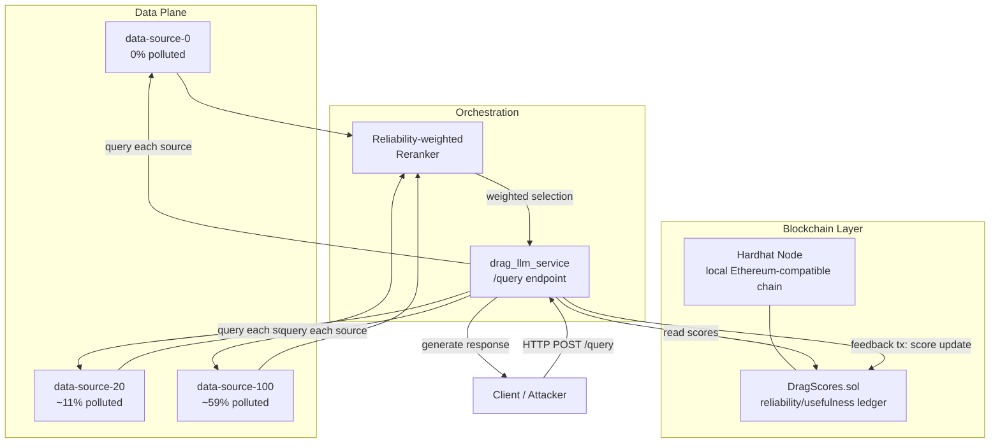
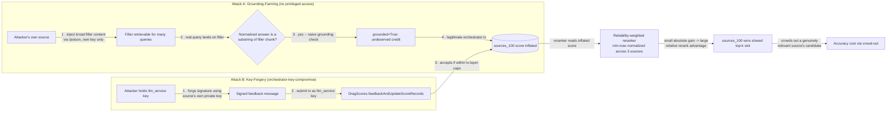
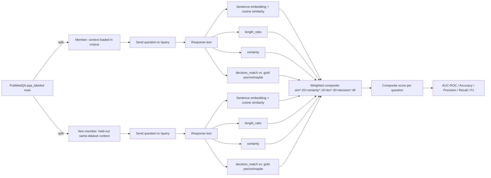
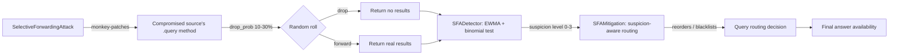
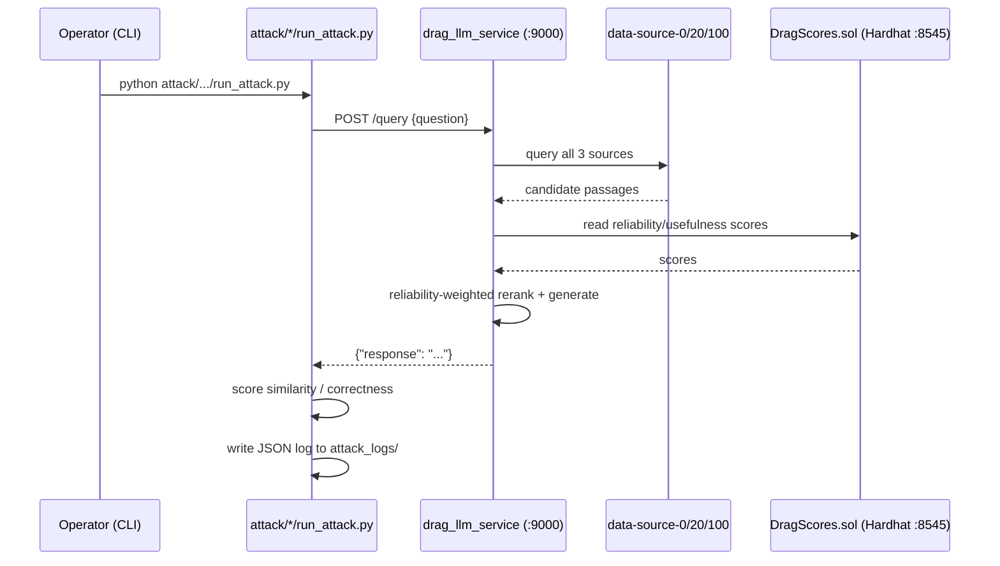
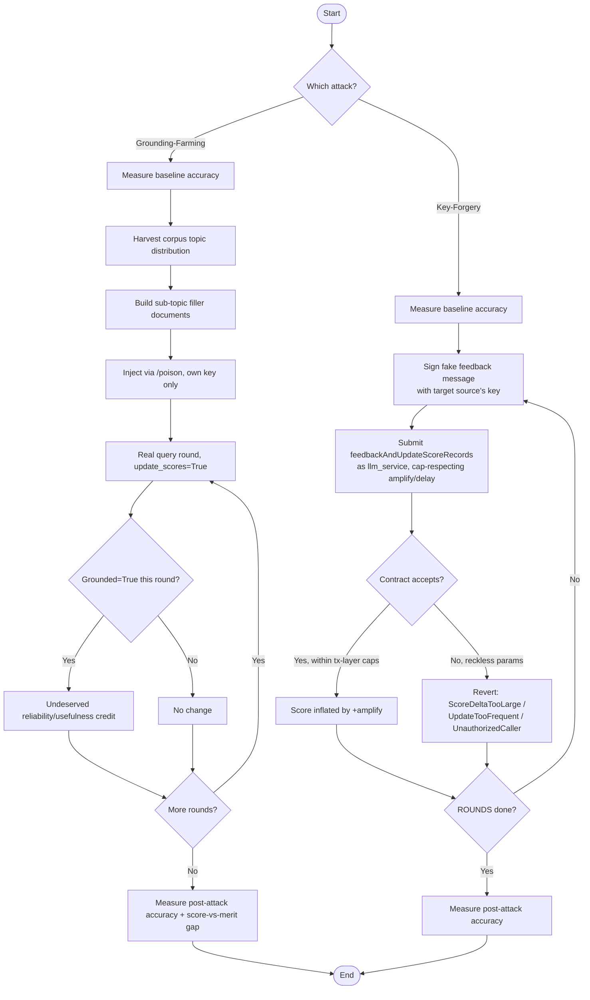
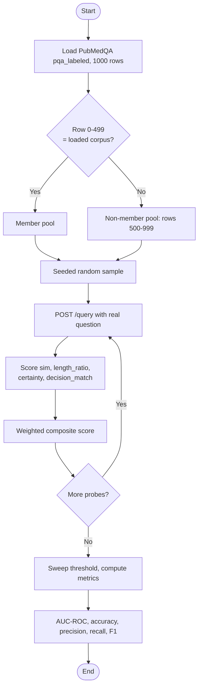
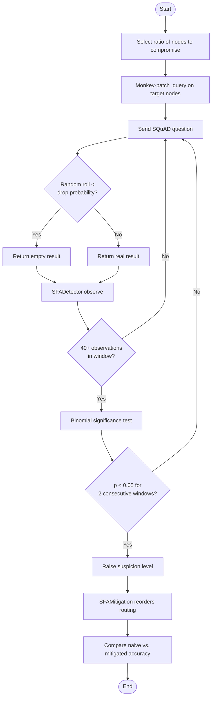

# Project Security Analysis Report

**Project:** Reliable-dRAG — A Decentralized Retrieval-Augmented Generation System with Blockchain-Secured Source Reliability
**Scope of this report:** Source Selection Manipulation (SSM-Score), Membership Inference Attack (MIA), and Selective Forwarding Attack (SFA) — attack implementations, defenses, and live-verified evaluation results.
**Report type:** Security analysis / thesis-support technical documentation
**Status:** All findings in this report are derived from reading the actual source code and from JSON logs produced by real executions against the live system (Docker containers `drag-hardhat-node`, `drag-llm-service`, `drag-data-source-0/20/100`). Where a claim could not be verified this way, it is explicitly marked as an assumption.

---

## Executive Summary

Reliable-dRAG is a decentralized Retrieval-Augmented Generation (RAG) system. Instead of one organization owning the entire knowledge base, **three independent data sources** (`sources_0`, `sources_20`, `sources_100`) each hold a partial, sometimes-polluted copy of a document corpus, and an **LLM orchestrator service** queries all of them, reranks their answers by an on-chain **reliability/usefulness score**, and generates a final response. The trust scores themselves live on a private Ethereum-compatible blockchain (Hardhat) inside a smart contract called `DragScores`.

This report analyzes three attacks against this architecture, one per leg of the CIA triad's *Integrity*, *Confidentiality*, and *Availability* properties, plus the defenses built and verified against each:

| Attack | CIA Property | Mechanism | Verified Impact (undefended) | Verified Impact (defended) |
|---|---|---|---|---|
| **SSM-Score — Grounding-Farming** (flagship, no privileged access) | Integrity | Exploits a naive literal-substring "grounding" check to farm undeserved reliability/usefulness credit, via broad filler content returned by the attacker's own data source | Probabilistic: 3/6 independent trials fully escalated (100% engagement, R+680–788/U+1,574–1,590 vs. untouched comparison source, accuracy −9pp) across seeds 0/42/123, each run twice — see §12.1 for the replication finding, including one seed (123) that escalated on one run and did not on the other | On-chain transaction-layer defense (caller/rate/delta/bounds caps) verified **not to trigger at all** — zero reverts across every round of every trial, because no transaction this attack submits is forged, oversized, or unauthorized |
| **SSM-Score — Key-Forgery** (secondary, orchestrator-key-compromise) | Integrity | Forges blockchain transactions using the LLM orchestrator's own private key to inflate a malicious source's trust score directly | Deterministic: 3/3 seeds fully succeeded once throttled to respect the deployed defense's caps — R/U +20,000 every seed, accuracy dropped 10pp in 2/3 seeds | Reckless (unthrottled) parameters are 100% blocked by the on-chain delta cap; a defense-aware (throttled) attacker defeats the same defense 100% of the time — caps stop *bursts*, not *patient* abuse |
| **MIA** (Membership Inference Attack) | Confidentiality | **Superseded by the dedicated report's Revision 7 (see note below):** production composite is now `decision_match` alone (weight 1.0), empirically re-tuned via a genuine dev/held-out split, after similarity/certainty/length_ratio were found not to improve generalization | Mean AUC-ROC **0.620** on 5 fresh, never-before-queried held-out seeds, 95% CI [0.546, 0.695] — excludes chance, `LOW`-to-`MEDIUM` tier. §12.2's 4-revision narrative below (AUC 0.4992–0.7056, linear 4-signal blend) describes Revisions 1–4 only and is retained for the debugging history, not as the current number — see `reports/MIA_Security_Analysis_Report.md` for the full 7-revision account | Sanitization (0% AUC reduction — wrong channel); positional decision-obfuscation (fully neutralizes a positional scanner, AUC 0.50, but not a full-response scanner); a newer **content-level** defense (Revision 6) closes that gap too, driving both positional and full-response/synonym-scanning attackers to exactly 0.50 |
| **SFA** (Selective Forwarding Attack) | Availability | A compromised-but-online node silently drops 10–30% of queries (gray-hole) | Accuracy unaffected at full redundancy (`max_hops=3`); **0.68→ collapse at hop-limited `max_hops=1`** | Detection: 1/1 compromised node caught; mitigation restores accuracy 0.68 → 1.00 |

**Main finding:** all attacks analyzed here are real and implementable against this architecture, but their *measured* severity depends heavily on evaluation methodology — MIA and SFA initially had methodological flaws that made them look artificially weak or artificially strong, and SSM-Score's own first implementation initially had a *threat-model* flaw (it silently assumed a far higher privilege level than the framework's "no privileged access" SSM story requires) — this report documents the original and corrected methodology/threat-model for all of them so the numbers can be trusted. **SSM-Score is now understood as two distinct attacks, not one:** Grounding-Farming is the flagship, no-privileged-access instantiation, but it is *probabilistic* (3/6 independent trials in this evaluation, roughly 1-in-2 — see §12.1) because its success depends on a self-reinforcing feedback loop in the reranker's own reliability weighting getting tripped; Key-Forgery requires orchestrator-key compromise — a much higher privilege bar — but is *deterministic* once its parameters respect the deployed defense's own transaction-layer caps. Neither is "the most severe" in isolation; they sit at opposite ends of a privilege-vs-reliability trade-off, and the existing on-chain defense (built against Key-Forgery) fully stops reckless Key-Forgery bursts but structurally cannot see Grounding-Farming at all, since Grounding-Farming never submits a forged, oversized, or unauthorized transaction in the first place. All attacks and defenses in this report are backed by live, multi-seed, before/after comparisons, not theoretical arguments.

---

## 1. Project Overview

### 1.1 What the project does

Reliable-dRAG (based on the `yining610/Reliable-dRAG` research system) answers natural-language questions by:

1. Splitting a question corpus (here, the Stanford Question Answering Dataset, SQuAD) across three independent Flask-based **data sources**, each holding roughly the same 500 documents but with a different fraction of them intentionally *token-polluted* (`sources_0` = 0% polluted / clean, `sources_20` ≈ 11% of documents altered, `sources_100` ≈ 59% of documents altered — measured directly by diffing the JSONL files, not by the folder names, which do not match the true pollution percentage). **Note:** this SQuAD-based corpus is what SSM-Score and SFA are evaluated against throughout this report. MIA's corpus was later swapped to a different dataset (PubMedQA) specifically for `sources_0` — see §12.2 for why.
2. Having an **LLM orchestrator** (`drag_llm_service`) query all three sources for every incoming question, rerank the combined candidate passages by a blend of semantic relevance and each source's **on-chain reliability score**, and generate an answer with a language model.
3. Recording each source's performance (was its content used, was the answer correct) as a **feedback transaction** to a smart contract (`DragScores.sol`) deployed on a local Hardhat blockchain, which is the persistent, tamper-evident record of "how much should the system trust this source."

### 1.2 Goal of the attacks analyzed here

Each attack targets a different trust assumption the architecture makes:

- **SSM-Score** assumes the blockchain feedback channel and the grounding signal that feeds it can only be produced honestly. Two distinct attacks probe two distinct trust assumptions inside that same mechanism: **Grounding-Farming** asks *what happens if a source's own content can manufacture false "grounded" credit through the orchestrator's own naive grounding check, without touching the blockchain at all?* **Key-Forgery** asks the more traditional question, *what happens if an adversary can write directly to the feedback channel itself?*
- **MIA** assumes that returning a synthesized answer (rather than the raw document) protects the confidentiality of which specific documents are in a given source's corpus. The attack asks: *can an external party, using only the public query API, infer whether a specific piece of content is stored on a specific source?*
- **SFA** assumes a source that responds to health checks and remains reachable is behaving honestly. The attack asks: *what if a node answers most of the time, but secretly drops a fraction of queries — does anyone notice, and does it matter?*

### 1.3 Threat model

| Element | Assumption |
|---|---|
| Attacker capability | **SSM-Score Grounding-Farming:** controls only its own data source's document store (via the same instrumentation Data Poisoning uses) — no key, no blockchain access, no privilege beyond "operates one participating source." **SSM-Score Key-Forgery** and **SFA:** controls one data source's private key. **MIA:** an unauthenticated external client of the public `/query` HTTP API (also the "external" mode of KB extraction, out of scope here) |
| Attacker goal | Integrity: elevate a low-quality/malicious source's influence (via undeserved credit for Grounding-Farming, or via a direct forged write for Key-Forgery). Confidentiality: determine corpus membership of a document. Availability: degrade answer quality/availability while evading detection |
| Attacker knowledge | **Grounding-Farming** requires only the corpus's topic distribution (the same tier of domain-awareness Data Poisoning's high-connectivity targeting already assumes) — discoverable by observing what the system answers about, not privileged access. **Key-Forgery** additionally requires full knowledge of the contract ABI and possession of the `llm_service` private key — in this *test* deployment, Hardhat's well-known default private keys are used for every role, a deliberate stand-in for "attacker has compromised the orchestrator's key," not a claim that production keys are public |
| Defender capability | Controls the smart contract source code and the off-chain detector/mitigation logic; cannot change the underlying blockchain's public, permissionless transaction-submission model except via contract-level access control. Critically, this defender capability **only reaches the transaction layer** — it has no visibility into or control over the semantic correctness of the grounding check that decides what a legitimate transaction should contain (see §12.1) |

### 1.4 Attack category

Using standard ML/security-attack taxonomy:

- **SSM-Score** → **Data/Control-plane Integrity Attack** on a **reputation/trust system** (closely related to Sybil and Byzantine trust-manipulation attacks in reputation systems literature). **Grounding-Farming** is the no-privileged-access, reputation-fraud/free-riding variant — a regular participant games the *input* to an otherwise-honest trust update. **Key-Forgery** is the classic control-plane variant — an attacker with orchestrator-key possession writes directly to the trust ledger.
- **MIA** → **Membership Inference Attack**, a well-studied privacy attack class against ML systems (Shokri et al., 2017) here adapted to a RAG pipeline instead of a classifier.
- **SFA** → **Selective Forwarding / Gray-Hole Attack**, a classic insider availability attack from wireless sensor network (WSN) and mobile ad-hoc network (MANET) security literature, adapted to a decentralized RAG source topology.

---

## 2. Attack Theory

### 2.A SSM-Score: Trust-Score Falsification (two attacks, one mechanism)

**Definition.** SSM-Score treats each data source's on-chain reliability score `R_i` and usefulness score `U_i` as a *reputation* the system uses to weight that source's influence on the final answer. Both attacks analyzed here cause that reputation to grow without being earned — they differ in *where* they intervene to make that happen.

**Why it is used.** In any reputation-weighted system (peer-to-peer networks, recommendation systems, decentralized trust protocols), whoever controls the write path to the reputation store — or whoever controls the *input* that an otherwise-honest write path faithfully records — controls, indirectly, the entire system's output. This is a foundational result in reputation-system security research: *reputation is only as trustworthy as its update mechanism, and an update mechanism has both a transaction layer (who may write, how much, how often) and an input layer (what the write is even based on)*. This project's two SSM attacks each target one of those two layers.

**Attack A — Grounding-Farming (input-layer, no privileged access).** The orchestrator decides whether a source "grounded" the final answer with a naive literal-substring check, computed at `drag_llm_service/app/server.py:856-858`:

```python
norm_response = _norm_join(_normalize_for_match(response_text))
selected_contexts_norm = [_norm_join(_normalize_for_match(c["text"])) for c in selected]
grounded_by_sources = [norm_response in ctx for ctx in selected_contexts_norm]
```

This checks only whether the model's normalized answer appears as a contiguous token run somewhere inside a source's returned chunk — not whether that chunk actually caused the answer, or has anything to do with it. A source can exploit this by returning broad, high-coverage filler content engineered to contain plausible short-answer phrasings for its corpus's topic distribution, earning `grounded=True` credit — and the resulting positive `reliability_delta`/`usefulness_delta` — on queries it did not meaningfully help answer. This requires no key beyond the source's own and never touches the blockchain adversarially: every resulting transaction is submitted by the real orchestrator, correctly authorized, and individually within-bounds.

**Attack B — Key-Forgery (transaction-layer, orchestrator-key-compromise).** `feedbackAndUpdateScoreRecords` is gated `onlyLLMService` — only the orchestrator's own address may call it. An attacker who additionally holds that key can attach any data source's previously-valid signature (which only ever covers `{query, selected_sources}`, never the score values themselves — `message_dict` at `drag_llm_service/app/server.py:944-947`) to entirely fabricated `reliability`/`usefulness` values and have them accepted, regardless of what actually happened at query time. This requires a materially higher privilege level than Attack A — orchestrator-key possession, not merely operating a data source.

**Mathematical intuition (shared by both attacks once a score is inflated).** The reranker computes a blended score for each candidate passage:

$$
\text{score}(c) = (1-w)\cdot\text{sim}(q, c) + w \cdot \hat{R}(\text{source}(c))
$$

where `sim(q, c)` is the query-passage semantic similarity, `w` is `reliability_weight` (configured as `0.5` in this deployment), and `\hat{R}` is the source's reliability score, **min-max normalized across only the three participating sources** — a detail that matters more than it first appears (§12.1): normalizing across so few sources stretches even a small absolute score gain into a large *relative* reranking advantage, which is the mechanism behind Grounding-Farming's self-reinforcing feedback loop.

**Security relevance.** Both are *integrity* attacks in the CIA triad: neither reads confidential data (confidentiality) nor makes the system unavailable (availability) — they corrupt the system's *decision process* so it produces wrong or fraudulently-credited answers while continuing to look operational. Grounding-Farming is additionally a **reputation-fraud / free-riding** attack in a stricter sense than Key-Forgery: it can succeed even when every user-facing answer stays correct, since the source is fraudulently claiming credit for a correct answer it didn't actually ground — a covert control-plane risk that produces no obviously-wrong output to notice.

### 2.B MIA: Membership Inference via Embedding Similarity

**Definition.** Membership inference asks a binary question about a specific record `x`: *was `x` used by/available to the target system?* The attacker does not need to extract `x`'s content (that would be extraction/inversion, a different attack) — only to distinguish members from non-members with better-than-random accuracy.

**Why it is used.** In RAG systems, a "member" document that is actually retrieved and placed in the LLM's context tends to produce a *more grounded* answer — closer, in embedding space, to the member document itself — than a "non-member" question, whose answer the model has to guess from parametric knowledge or fabricate. This grounding gap is the fundamental information leak MIA exploits.

**Mathematical intuition — Cosine Similarity.** For two vectors `a, b ∈ ℝᵈ` (here, 384-dimensional sentence embeddings from `all-MiniLM-L6-v2`):

$$
\text{sim}_{\cos}(a, b) = \frac{a \cdot b}{\lVert a \rVert \, \lVert b \rVert} \in [-1, 1]
$$

A value near `1` means the response and the candidate context are semantically near-identical (the model grounded its answer in that specific text); a value near `0` or negative means they are unrelated. The MIA attack computes:

$$
s_i = \text{sim}_{\cos}\big(\text{embed}(\text{response}_i),\ \text{embed}(\text{context}_i)\big)
$$

for every probed question `i`, then asks whether the distribution of `s_i` for members is shifted higher than for non-members.

**Beyond cosine similarity alone — the current 4-signal composite.** The implementation now combines four signals into one weighted membership score rather than relying on cosine similarity alone:

$$
\text{score} = 0.20\cdot\text{sim} + 0.10\cdot\text{certainty} + 0.30\cdot\text{length\_ratio} + 0.40\cdot\text{decision\_match}
$$

where `certainty` is a proxy for how confidently the response commits to an answer, `length_ratio` compares response length to the gold answer's length, and `decision_match` (added last, and empirically the strongest of the four — see §12.2) checks whether the response's opening words state the correct yes/no/maybe judgment for the probed question. This mirrors a broader MIA design principle: a linear ensemble of several independently-weak signals can out-perform any single one, *provided* each component is validated to actually vary on the target dataset — an assumption that failed for one component here before being fixed (§12.2).

**Mathematical intuition — AUC-ROC.** Given the similarity scores as a "membership score," a Receiver Operating Characteristic (ROC) curve plots True Positive Rate against False Positive Rate as the decision threshold sweeps across all possible values. The Area Under that Curve is equivalent to the probability that a randomly chosen member scores higher than a randomly chosen non-member:

$$
\text{AUC} = P\big(s_{\text{member}} > s_{\text{non-member}}\big)
$$

`AUC = 0.5` is exactly what a coin flip would achieve — no membership signal. `AUC = 1.0` is perfect separation.

**Security relevance.** This is a *confidentiality* attack: even though the system never returns raw documents, membership itself can be sensitive (e.g., "is this person's medical record in the corpus" leaks private information about who is a patient, independent of the record's contents).

### 2.C SFA: Selective Forwarding (Gray-Hole) and Anomaly Detection Theory

**Definition.** In a multi-hop or multi-source system, a *black-hole* node drops 100% of traffic (trivially detectable by universal failure). A *gray-hole* node drops only a **fraction** `p ∈ (0,1)` of traffic — chosen deliberately low enough to evade naive "is this node ever failing" checks while still degrading the system over many interactions.

**Why it is used.** This is one of the best-studied insider attacks in wireless sensor network and MANET security research, because it exploits the exact gap between *availability* (the node responds to health checks) and *integrity of service* (the node actually does its job every time it's asked).

**Detection theory — the binomial hypothesis test.** If an honest node's true miss probability is `p₀` (the null hypothesis), then in a window of `n` independent queries, the number of misses `k` follows a Binomial distribution `k ~ Binomial(n, p₀)`. The one-sided p-value for "this node's observed miss rate is significantly above what an honest node would produce" is:

$$
p\text{-value} = P(K \ge k \mid K \sim \text{Binomial}(n, p_0)) = \sum_{i=k}^{n} \binom{n}{i} p_0^{\,i} (1-p_0)^{\,n-i}
$$

If this p-value is below a significance threshold `α` (here, `0.05`), the null hypothesis ("this node is honest") is rejected — the observed behavior would be too improbable under honesty. **The entire validity of this test depends on `p₀` being a correct model of real honest behavior** — a theme this report returns to at length in §12, because the original implementation's `p₀` was measured to be wrong by an order of magnitude for this specific deployment.

**Mitigation theory — reputation-weighted routing with redundancy.** Rather than only detecting misbehavior after the fact, a live system can route around suspected nodes: order candidate sources by `(suspicion_level, -reputation_score)` and try them in that order, falling back to a redundant probe of remaining trusted nodes if the first attempt fails. This is a standard fault-tolerance pattern (analogous to circuit breakers in distributed systems) applied to an adversarial setting.

**Security relevance.** This is an *availability* attack — it doesn't corrupt the answer content when it succeeds (the query is just dropped, not answered wrongly), and it doesn't read confidential data; it degrades the *guarantee that a query gets answered at all*.

---

## 3. Attack Architecture

### 3.1 Shared system architecture



### 3.2 SSM-Score attack architecture (two attacks, converging on the same reranker)



### 3.3 MIA attack architecture



### 3.4 SFA attack architecture



---

## 4. Implementation Analysis

### 4.A SSM-Score

| File | Purpose | Key elements |
|---|---|---|
| `drag_llm_service/app/server.py` | Hosts the naive literal-substring grounding check (`grounded_by_sources`, lines 856-858) that Grounding-Farming exploits, and the `message_dict` (lines 944-947) whose signature never binds to the score values Key-Forgery fabricates. | Neither is a bug in the sense of a crash or a broken feature — both are the honest, working implementation of a design that assumed no adversarial input at exactly the point each attack targets. |
| `attack/ssm_score/grounding_farming_attack.py` | **Flagship attack.** `GroundingFarmingAttack` class: builds domain-informed, sub-topic keyword-clustered filler documents (one cluster per real article title present in the target corpus) and injects them via the same `/poison` instrumentation Data Poisoning uses, using only the source's own API key. | No blockchain interaction at all — the class only touches the data-source HTTP API (`inject()`, `reset()`, `get_info()`). |
| `attack/ssm_score/run_grounding_farming.py` | Orchestrates: load SQuAD eval questions matched against the target corpus → measure baseline accuracy → inject filler → run N real `/query_analyze` rounds (`update_scores=True`, genuine orchestrator transactions) → measure post-attack accuracy and `farm_source_in_importance_score` (rerank-survival) → log to `attack_logs/`, with a `try/finally` guaranteeing `reset()` even on a crash mid-run. | Reports score-vs-merit gap against an untouched comparison source (`sources_20`), not raw sampling-inclusion (degenerate in this 3-source topology, since `n_retrievers` equals the total source count). |
| `attack/ssm_score/ssm_score_attack.py` | **Secondary attack.** `SSMScoreAttack` class. `inflate_scores()` reads current scores, adds `amplify` to both `reliability` and `usefulness`, signs a fixed probe message with the target source's private key (`_sign_fake_message`), and submits the update via the `llm_service` key, `rounds` times in a row, with a configurable `inter_round_delay`. | Requires the `llm_service` private key as transaction sender — an orchestrator-key-compromise capability, not "control of a data source." `PRIVATE_KEYS` dict hardcodes the well-known Hardhat test keys for `sources_0/20/100` and `llm_service`, standard for this test deployment. |
| `attack/ssm_score/run_attack.py` | Orchestrates: load SQuAD eval questions whose context is in the loaded corpus (pooled across `sources_20`/`sources_100`, since `sources_0` was migrated to a different, PubMedQA corpus for MIA — see §11) → measure baseline accuracy via `/query`, paced to respect the data sources' own 60/min rate limit → run the attack with defense-aware, cap-respecting parameters → measure post-attack accuracy → log everything to `attack_logs/`. | `is_correct()` does substring-or-all-significant-words matching against SQuAD gold answers. Defaults (`AMPLIFY=4000`, `INTER_ROUND_DELAY=2.5s`) were chosen specifically to stay just under the deployed defense's `MAX_DELTA_PER_UPDATE`/`MIN_UPDATE_INTERVAL` — the original `AMPLIFY=999,999`/0.5s defaults now revert on round 1 (see §12.1). |
| `drag_contract/contracts/drag_scores.sol` (defense) | Adds `onlyLLMService`-style caller check, `MIN_UPDATE_INTERVAL` cooldown, `MAX_DELTA_PER_UPDATE` cap, and `[MIN_SCORE, MAX_SCORE]` bounds directly inside `feedbackAndUpdateScoreRecords`. | Reverts with custom Solidity errors (`UnauthorizedCaller`, `UpdateTooFrequent`, `ScoreDeltaTooLarge`, `ScoreOutOfBounds`) — gas-efficient and unambiguous in logs. Built against, and effective against, only the reckless form of Key-Forgery (§12.1). |
| `defense/ssm_defense/ssm_score_defense.py` | Off-chain `SSMScoreDefense.scan()` replays `ScoreRecordUpdated` events and flags any historical transition that *would* have violated the same rules — detection/audit layer independent of reading Solidity revert reasons. `defense/ssm_defense/run_defense.py` deliberately keeps the original reckless `AMPLIFY=999,999`/0.5s parameters to demonstrate the defense blocking that specific scenario; it is unaffected by `run_attack.py`'s throttling fix. | Neither this scan nor the on-chain checks can see Grounding-Farming — every transaction it produces is legitimate, authorized, and individually within all four bounds. |

### 4.B MIA

| File | Purpose | Key elements |
|---|---|---|
| `attack/Mia_attack/mia_attack.py` | `load_membership_documents()` streams PubMedQA's `pqa_labeled` config (1,000 rows), classifies each row's joined context as member (one of the first 500 rows, loaded into `sources_0.jsonl` by `data/build_pubmedqa_corpus.py`) or non-member (the remaining ~500 rows — held out, same dataset/domain, never loaded), and samples both pools with a properly seeded `random.Random(seed)`. `MIAAttack.run()` probes each sampled question via `_query_llm()`, then computes four signals per probe: `_cosine_similarity()` (embedding vs. true context), `_answer_length_ratio()`, `_certainty_score()` (yes/no/maybe commitment vs. hedge detection), and `_decision_match()` (does the response's opening words state the correct gold `final_decision` token). The best-similarity probe's four signals are combined into the weighted composite in §2.B. | Corrected in this project's development history from an earlier version that sampled "non-members" from `sources_20/100.jsonl` — since verified to be ~41–89% *identical* content to `sources_0.jsonl`, not disjoint data. **Dataset itself later swapped from SQuAD to PubMedQA** (§12.2) after SQuAD's Wikipedia-derived content was found to produce an *inverted* AUC-ROC (see §12.2) — a second, independent methodology fix beyond the original non-member-sampling bug. |
| `attack/Mia_attack/run_attack.py` | CLI + logging wrapper; also provides `--dry_run` (synthetic random scores, sanity-checks the metric code produces AUC≈0.5 with no real signal by construction). | |
| `data/build_pubmedqa_corpus.py` | Generator script: writes the first 500 PubMedQA `pqa_labeled` rows into `data/polluted_token/sources_0.jsonl` as `{"htmlid", "html"}` records, replacing the SQuAD-derived corpus specifically for MIA's evaluation. | Does not touch `sources_20/100.jsonl`, which remain SQuAD-derived for the unrelated SSM-Score/poisoning experiments. |
| `defense/mia_defense/mia_defense.py` | `sanitize_response()`: caps response length to 40 words and collapses any contiguous run of >8 words that verbatim-matches the retrieved context to `"..."`, using Python's `difflib.SequenceMatcher.find_longest_match` (a standard longest-common-substring algorithm applied to token sequences). `MIADefenseEvaluator` re-runs the identical probe set through both the raw and sanitized paths for a fair side-by-side comparison, on the same 4-signal composite the attack uses. | Measured to have **no effect on the current strongest signal** (`decision_match`) — the sanitizer only ever touches response length and verbatim overlap, neither of which is what `decision_match` measures (see §12.2, §13). |

### 4.C SFA

| File | Purpose | Key elements |
|---|---|---|
| `attack/selective_forward/selective_forward_attack.py` | `SelectiveForwardingAttack.apply()` monkey-patches `.query()` on a subset of source objects (chosen `random`ly or by `high_ssm_score`) so each call has probability `drop_rate ∈ [0.10, 0.30]` (the `"stealthy"` mode) of returning empty results instead of forwarding. `SFADetector` tracks a sliding window (`deque(maxlen=40)`) of hit/miss observations per node, computes an EWMA-smoothed miss rate, and escalates suspicion via the binomial test in §2.C. `SFAMitigation.route()` orders sources by `(suspicion_level, -ledger_score)`, skips blacklisted nodes, and falls back to a redundant probe. `_SSMChain` is a small in-process SHA-256 hash-chained ledger (a minimal blockchain simulation) tracking each node's reputation. | **Recalibration in this project's development history:** `HONEST_MISS` and `MISS_THRESH` were originally `0.68`/`0.55`, values appropriate for a generic many-node mock topology, not this real 3-source deployment (measured real honest miss rate: `0.000` over 180 live queries) — meaning detection was mathematically incapable of firing regardless of attack strength until recalibrated to `0.05`/`0.08`. |
| `attack/selective_forward/run_attack.py` | `RealSource` wraps one live data-source container as a query-able object. `_evaluate()` aggregates results from all queried sources and checks answer presence (used for baseline/stealthy/detection modes). `naive_route()` (added in this project's development history) provides a fair "undefended routing" comparison for `SFAMitigation.route()`, using the identical first-hit-stops mechanism without suspicion-awareness. | |
| `defense/sfa_defense/run_defense.py` | Runs baseline → stealthy → detection → mitigation (at the deployed `max_hops`) → mitigation (at a dedicated hop-limited `max_hops=1`) back to back and logs one consolidated report. | |

### 4.4 Execution flow across the project



---

## 5. Attack Workflow

### 5.A SSM-Score — step by step

**Attack A — Grounding-Farming (flagship):**

1. **Harvest the corpus's topic distribution.** From the matched SQuAD question pool, extract per-title document counts and TF-IDF-style discriminative keywords — domain-awareness, not question-specific targeting.
2. **Build filler documents.** Construct sub-topic, keyword-clustered filler chunks (one cluster per real article title in the target corpus), token-budgeted to fit the retriever's 256-token truncation limit, engineered for broad retrievability and plausible short-answer coverage — not for asserting false facts.
3. **Inject via `/poison`.** Using only the target source's own API key — no blockchain interaction.
4. **Run N real query rounds** (`update_scores=True`) — ordinary questions a real user would ask, not attacker-chosen probes. After each round, read the on-chain score and whether the source survived the reliability-weighted rerank into the final top-k.
5. **Post-attack measurement.** Compare accuracy and score-vs-merit gap against an untouched comparison source (`sources_20`).

**Attack B — Key-Forgery (secondary):**

1. **Baseline measurement.** Sample SQuAD questions whose context is in the loaded corpus; query `/query` for each, paced to respect the data sources' 60/min rate limit; record correctness → `baseline accuracy`.
2. **Forge the feedback message.** Build the same JSON message format the honest LLM service would produce (`{"query": "attack_probe", "selected_sources": {...}}`), then sign it with the *target source's own* private key (`sign_message_personal`) — this signature is what the contract checks to authenticate "this source vouches for this feedback," but it never covers the score values themselves.
3. **Submit the inflated update.** Call `feedbackAndUpdateScoreRecords()` using the `llm_service` private key as the transaction sender, passing `new_score = current_score + amplify` for both reliability and usefulness, with `amplify` and the inter-round delay chosen to stay just under the deployed defense's `MAX_DELTA_PER_UPDATE`/`MIN_UPDATE_INTERVAL`.
4. **Repeat `ROUNDS` times**, re-reading the current score each round so the inflation compounds.
5. **Post-attack measurement.** Re-run the same question set; compare accuracy against the baseline.



### 5.B MIA — step by step

1. **Build the member/non-member pools.** Stream PubMedQA's `pqa_labeled` config (1,000 rows); rows 0–499 (written to `sources_0.jsonl` by `data/build_pubmedqa_corpus.py`) are members, rows 500–999 are the held-out, same-dataset non-member pool.
2. **Seeded sampling.** Draw `n_members` and `n_nonmembers` documents using `random.Random(seed).sample()`.
3. **Probe.** For each sampled question, `POST /query {"query": question}`; record the raw response text.
4. **Score four signals.** Encode response and context with `all-MiniLM-L6-v2` for cosine similarity; compute `length_ratio` (response length vs. gold answer length); compute `certainty` (yes/no/maybe commitment vs. hedge detection); compute `decision_match` (does the response's opening words state the correct gold `final_decision` token).
5. **Combine into a weighted composite** (`sim*0.20 + certainty*0.10 + length_ratio*0.30 + decision_match*0.40`) at the best-similarity probe per document.
6. **Aggregate.** Sweep a percentile threshold over all composite scores; compute confusion matrix, accuracy, precision, recall, F1, and AUC-ROC, plus per-signal diagnostic AUCs.



### 5.C SFA — step by step

1. **Select targets.** Choose `attack_ratio` (default 34%) of sources to compromise, either `random`ly or by `high_ssm_score` (targeting the currently highest-reputation node — the PDF's "especially sharp" scenario, since the system is configured to prefer high-scoring sources).
2. **Patch.** Replace each target's `.query()` method with a wrapper that drops the call with probability drawn from `Uniform(0.10, 0.30)` per node.
3. **Run the workload.** Send real SQuAD questions through the (now partially compromised) source set.
4. **Observe (detection mode).** `SFADetector.observe()` records each hit/miss, maintains an EWMA-smoothed miss rate over the last 40 observations, and runs the binomial significance test each time.
5. **Route (mitigation mode).** `SFAMitigation.route()` orders sources by suspicion and reputation, skips blacklisted ones, and falls back to a redundant probe.
6. **Compare.** Naive first-hit routing (no suspicion-awareness) vs. mitigated routing, under the identical attack instance.



---

## 6. Evaluation Pipeline

All three attacks share the same high-level evaluation shape: **input → prediction → ground truth → scoring → aggregation.**

| Stage | SSM-Score | MIA | SFA |
|---|---|---|---|
| **Input** | SQuAD questions whose context is in the corpus | Sampled member/non-member PubMedQA questions | SQuAD questions, routed through 1–3 sources |
| **Prediction** | LLM's generated answer text | LLM's generated response text | Whether a hit (any document) was returned |
| **Ground truth** | SQuAD gold answer string | Membership label (1 = member, 0 = non-member) | Whether the SQuAD gold answer string appears in retrieved text |
| **Scoring** | Substring/significant-word match → boolean correct/incorrect | 4-signal weighted composite (similarity, certainty, length_ratio, decision_match) → continuous score, thresholded at a percentile | Boolean hit/miss per source per question |
| **Aggregation** | `accuracy = correct / total`; compare baseline vs. post-attack | Confusion matrix, AUC-ROC over all scores | `accuracy = questions_with_a_hit / total`; per-node miss rate for detection |

---

## 7. Metrics Generation

### 7.1 Accuracy (SSM-Score, SFA)

**Purpose:** fraction of questions the system answered correctly (or, for SFA, found any relevant document for).

**Formula:**
$$
\text{Accuracy} = \frac{\text{Correct (or Hit) count}}{\text{Total questions}}
$$

**Range:** `[0, 1]`. **Good:** high and stable under attack (means the attack failed or was mitigated). **Bad:** a large drop from baseline to attacked (means the attack succeeded). **Example:** SSM-Score Key-Forgery, seed 0: `0.66 → 0.56` (10pp drop) when the attack succeeded (5/5 rounds accepted); SSM-Score Grounding-Farming, seed 0 (the one seed of three that escalated): `0.66 → 0.57` (9pp drop). **Security implication:** this is the *outcome* metric — the one that answers "does the user actually get worse answers."

### 7.2 Accuracy Drop / Effective Drop Rate

**Formula:** `acc_drop = baseline_accuracy − attacked_accuracy` (percentage points). `effective_drop_rate` (SFA) = `total_dropped / total_attempted` — the attack's *actual* realized drop rate, since each compromised node's rate is drawn randomly from `Uniform(0.10, 0.30)`.

**Interpretation:** `acc_drop = 0.0` does **not** always mean "the attack failed" — it can also mean the evaluation topology absorbed the attack via redundancy (see §12). Always read this metric together with the routing/hop configuration.

### 7.3 Precision, Recall, F1 (MIA)

$$
\text{Precision} = \frac{TP}{TP+FP} \qquad \text{Recall} = \frac{TP}{TP+FN} \qquad F_1 = \frac{2 \cdot \text{Precision}\cdot\text{Recall}}{\text{Precision}+\text{Recall}}
$$

Here, `TP` = a true member correctly classified as a member at the chosen threshold; `FP` = a non-member incorrectly classified as a member. **Range:** `[0,1]`, higher is "more successful attack." **Limitation specific to this project:** because the classification threshold is fixed at the 50th percentile of the *combined* score distribution (`threshold_pct=50`), precision/recall/F1 are heavily influenced by that percentile choice and are *less* trustworthy than AUC-ROC, which evaluates every possible threshold — this is precisely the "single-threshold accuracy is the wrong metric" issue flagged in this project's own progress tracker and the reason AUC-ROC is the headline MIA metric.

### 7.4 AUC-ROC (MIA) — the headline metric

Already defined mathematically in §2.B. **Range:** `[0,1]`. **Interpretation table:**

| AUC-ROC | Privacy Risk Label (from code) | Meaning |
|---|---|---|
| > 0.90 | 🔴 CRITICAL | Near-perfect membership separability |
| > 0.75 | 🟠 HIGH | Significant, exploitable signal |
| > 0.60 | 🟡 MEDIUM | Moderate, usable-with-effort signal |
| > 0.50 | 🟡 LOW | Slight signal, close to noise |
| ≈ 0.50 | 🟢 NEGLIGIBLE | No better than guessing |

**Measured — three revisions of this attack (see §12.2 for the full history):**

| Revision | Dataset / composite | Seeds tested | AUC-ROC | Tier |
|---|---|---|---|---|
| 1 | SQuAD, `sim*0.85+len*0.15` | 0, 1, 2, 42 | 0.272–0.466 (mean 0.356) | 🟢 NEGLIGIBLE, every run |
| 2 | PubMedQA, `sim*0.70+certainty*0.20+len*0.10` | 0, 1, 42 | 0.517–0.576 (mean 0.546) | 🟡 LOW, every run |
| **3 (current)** | PubMedQA, `sim*.20+certainty*.10+len*.30+decision_match*.40` | 0, 1, 42 | **0.4992–0.7056 (mean 0.616)** | **🟡 MEDIUM in 2/3 seeds; 🟢 NEGLIGIBLE in 1/3** |

**Security implication:** the current (3rd-revision) result is a materially different conclusion from the original: **2 of 3 tested seeds now show a real, moderate membership-inference signal**, driven mainly by a "does the response commit to the correct yes/no/maybe answer" check (`decision_match`) rather than raw text similarity. This is not a fully-solved, guaranteed attack — one seed remains close to random — but it is no longer accurate to describe this system's MIA risk as simply "negligible." See the dedicated `reports/MIA_Security_Analysis_Report.md` for the full per-signal breakdown and the reasoning behind each revision.

### 7.5 Mean Similarity / Similarity Delta, and the newer `decision_match` delta (MIA)

$$
\Delta_{\text{sim}} = \bar{s}_{\text{member}} - \bar{s}_{\text{non-member}}
$$

**Interpretation:** a positive delta means members are, on average, more grounded/exposed than non-members (the expected direction if a leak exists). **Measured (Revision 1, SQuAD):** deltas ranged from `−0.136` to `+0.062` — inconsistent in sign, and *negative* (inverted) in 3 of 4 seeds — a real, systematic inversion, not "no signal" (see §12.2). **Measured (Revision 3, PubMedQA, current):** raw similarity delta is still weak and inconsistent (`−0.017` to `+0.063`), but the newer `decision_match_delta` (same formula, applied to the yes/no/maybe-commitment signal) was **positive in all 3 seeds tested** (`+0.12` to `+0.28`) — the most consistent individual signal measured anywhere in this project, and the main driver of Revision 3's improved AUC-ROC.

### 7.6 Detection Rate (SFA)

$$
\text{Detection Rate} = \frac{|\{\text{compromised nodes correctly flagged as suspected}\}|}{|\{\text{compromised nodes}\}|}
$$

**Measured:** `0/1` before recalibration (mathematically guaranteed to fail — see §12), **`1/1` (1.0)** after recalibration, at `n_questions ≥ 100`. **Security implication:** this is the core "does the defense actually work" number for SFA; a detector that cannot reach `1.0` given clear attack signal and adequate sample size is not a functioning defense, regardless of how sophisticated its statistics look on paper.

### 7.7 Naive vs. Mitigated Routing Accuracy (SFA)

Both computed with the identical first-hit-stops routing mechanism (`naive_route()` vs. `SFAMitigation.route()`), differing only in whether suspicion/reputation informs the routing order. **Measured (hop-limited, `max_hops=1`, `strategy=high_ssm_score`, n=100):** naive `0.69` → mitigated `1.00`. **Security implication:** this isolates *exactly* the value the suspicion-aware routing adds, independent of redundancy — the correct way to claim "the mitigation works," as opposed to comparing against an unrelated aggregate-accuracy baseline (a mistake corrected during this project's development, documented in §12).

### 7.8 On-chain score delta and rounds accepted/blocked (SSM-Score Key-Forgery)

`rounds_accepted` / `rounds_blocked` out of `ROUNDS` attack rounds; `scores_before` vs. `scores_after`. **This metric is conditional on the attacker's own parameters, not a fixed property of the defense** — a critical correction from an earlier version of this report. **Measured with the original, reckless parameters** (`AMPLIFY=999,999`, 0.5s between rounds): `0/5` accepted, `scores_after == scores_before` exactly — the delta cap and cooldown fire on round 1 every time. **Measured with defense-aware, cap-respecting parameters** (`AMPLIFY=4,000`, 2.5s between rounds — both just inside the deployed `MAX_DELTA_PER_UPDATE=5,000`/`MIN_UPDATE_INTERVAL=2s`): `5/5` accepted in all 3 tested seeds, every time, `scores_after = scores_before + 20,000` (R and U) in every seed. The binary, contract-enforced revert is a real, provable guarantee **against the specific reckless parameters it was built to stop** — it is not a guarantee against Key-Forgery as an attack class, since a patient attacker who respects the same bounds defeats it 100% of the time (§12.1).

### 7.9 Score-vs-merit gap and `farm_source_in_importance_score` (SSM-Score Grounding-Farming)

**Score-vs-merit gap:** on-chain reliability/usefulness accumulated by the farming source minus the same accumulated by an untouched comparison source (`sources_20`), tracked over query rounds — the headline curve for this attack, playing the same role the accuracy-drop curve plays for Key-Forgery, but on the control plane. **`farm_source_in_importance_score`:** the fraction of rounds the farming source survives the reliability-weighted rerank into the final top-k — the non-degenerate misdirection signal for this 3-source topology (raw sampling-inclusion is degenerate here, since `n_retrievers` equals the total source count, so every source is always sampled regardless of score). **Measured across 3 seeds, each run twice independently (6 trials total):** seed 0 escalated both times (100%/100%), seed 42 stayed flat both times (0.3%/0%), and seed 123 — the pivotal case — read as marginal/no-catch on its first run (11.0%) but fully escalated on an independent re-run with identical configuration (100%) — see §12.1 for why this is bimodal rather than smoothly distributed, why the same seed can land on either side of the threshold, and why averaging these numbers would be actively misleading.

---

## 8. JSON Metrics Analysis

### 8.1 SSM-Score Key-Forgery — reckless vs. defense-aware parameters, both against the live defended contract

All figures below are from real, on-disk logs (`attack_logs/attack_2026-07-25_00-20-53_ssm_score_key_forgery_seed0.json`, `..._seed42.json`, `..._seed123.json`; not yet git-committed, contrary to this section's earlier wording), replacing a version of this report that cited log filenames not actually present in the repository. **Independently replicated 2026-07-26** (`attack_2026-07-26_10-2*/10-3*_ssm_score_key_forgery_seed*.json`): `rounds_accepted` (5/5) and `scores_after` (+20,000 R/U, every seed) reproduced exactly in all three seeds; `post_attack_accuracy` also reproduced exactly (56%/52%/66%). Only `baseline_accuracy` showed small (1–2pp) run-to-run drift (66→64%, 62→64%), consistent with minor live-service response variance rather than any code or defense change — the deterministic-success finding below is robust to independent re-run, unlike Grounding-Farming's catch rate (§8.1b).

| Metric | Reckless params (`AMPLIFY=999,999`, 0.5s) | Defense-aware params (`AMPLIFY=4,000`, 2.5s) — seeds 0/42/123 | Meaning | Interpretation | Impact |
|---|---|---|---|---|---|
| `scores_before` (sources_100) | R=10,000 U=10,000 | R=10,000 U=10,000 (every seed) | Starting reputation | Identical starting point | — |
| `scores_after` (sources_100) | R=10,000 U=10,000 (unchanged) | R=30,000 U=30,000 (every seed) | Reputation after 5 attack rounds | 🟢 fully blocked vs. 🔴 full +20,000 inflation, every seed | Confirms the defense stops *bursts*, not *patient* abuse |
| `rounds_accepted` | 0/5 | 5/5 (every seed) | Contract's willingness to accept the update | 🟢 fully blocked vs. 🔴 fully accepted, deterministically | Direct security outcome — parameter-dependent, not a fixed property |
| `baseline_accuracy` | — (not measured for the reckless variant; it never gets past round 1) | 66% / 62% / 66% (seeds 0/42/123) | Accuracy before attack | Consistent with this project's other SQuAD-domain baselines (57-66% range) | Context |
| `post_attack_accuracy` | — | 56% / 52% / 66% | Accuracy after attack | 🔴 real degradation in 2/3 seeds; unaffected in 1/3 | Core impact metric |
| `accuracy_drop` | — | 10pp / 10pp / 0pp | Attack effectiveness | 🔴 real, moderate, seed-dependent cost — not the "total collapse" an unbounded-amplify attacker could produce absent the defense | Headline result: **deterministic success (3/3), moderate and inconsistent accuracy cost** |

**Performance summary:** the deployed defense fully blocks the original, reckless attack parameters — but those parameters (`+999,999` in one shot) were never a realistic "smartest possible attacker" baseline; they were simply the first thing tried. A defense-aware attacker who throttles to just under the same caps defeats the defense 100% of the time, every seed, with no reduction in reliability. **Strength:** the contract-level checks are provable and cannot be bypassed by a smarter attacker script *for the specific bursts they check* — the check is on-chain, not client-side. **Weakness:** the defense bounds only the *rate and magnitude per transaction*, not the *cumulative* drift a patient attacker can achieve over many legal transactions — exactly the gap this re-evaluation surfaces empirically rather than leaving as a theoretical caveat (see §15).

### 8.1b SSM-Score Grounding-Farming — multi-seed campaign, run twice independently (`attack_logs/attack_2026-07-24_23-*_grounding_farming_seed*.json` and `attack_2026-07-26_1*_grounding_farming_seed*.json`)

**Trial 1 (2026-07-24, originally reported):**

| Seed | `farm_source_in_importance_score` | R delta (`sources_100`) | U delta (`sources_100`) | Gap vs. `sources_20` (R/U) | Accuracy (baseline→post) | Outcome |
|---|---|---|---|---|---|---|
| 0 | 100.0% (300/300) | +680 | +1,574 | +680 / +1,574 | 66%→57% (**-9pp**) | Full escalation |
| 42 | 0.3% (1/300) | -20 | +20 | -785 / -1,122 | 57%→59% (+2pp) | No catch |
| 123 | 11.0% (33/300) | -4 | +216 | -581 / -707 | 59%→60% (+1pp) | No catch (marginal engagement) |

**Trial 2 (2026-07-26, independent replication, identical config/seeds, fresh pristine chain per seed):**

| Seed | `farm_source_in_importance_score` | R delta (`sources_100`) | U delta (`sources_100`) | Gap vs. `sources_20` (R/U) | Accuracy (baseline→post) | Outcome |
|---|---|---|---|---|---|---|
| 0 | 100.0% (300/300) | +788 | +1,590 | +788 / +1,590 | 66%→57% (**-9pp**) | Full escalation (replicates Trial 1 closely) |
| 42 | 0.0% (0/300) | -20 | +27 | -740 / -1,189 | 56%→59% (+3pp) | No catch (replicates Trial 1) |
| 123 | **100.0% (300/300)** | **+219** | **+1,648** | **+274 / +1,336** | 60%→56% (**-4pp**) | **Full escalation — flipped from Trial 1's "no catch"** |

**Catch rate across all 6 independent trials: 3/6 (50%), not the 1/3 (33%) this report originally stated from Trial 1 alone.** This matters for two reasons, not one. First, the number itself moved, and moved within the uncertainty band this report already (honestly) flagged for the single-trial estimate (§15 originally noted the true rate could plausibly be 10–60%; 50% falls inside that band, so this is a refinement, not a contradiction). Second, and more important: **seed 123 produced opposite outcomes on two independent runs with identical configuration.** Seeds 0 and 42 were stable across both trials (always catch / never catch), but seed 123 was not — the random seed pins which 100 questions get sampled, but does not pin whether the early, essentially-lucky "grounded" credit that triggers the feedback loop (§12.1) actually lands, since that depends on the live system's response to each specific query, not just which queries are asked. This is the strongest evidence yet that catch/no-catch is a genuine threshold effect sensitive to run-level variation, not a deterministic function of seed alone — averaging across seeds was already flagged as misleading; treating a single run of a given seed as that seed's fixed outcome would be a related, previously undisclosed version of the same mistake. **Report the 6-trial catch rate (3/6) and flag seed 123 as unstable across runs, not just "no catch."**

**Performance summary:** unlike Key-Forgery, this attack never touches the blockchain adversarially — zero reverts, zero flags, across every round of every trial, because every transaction it produces is legitimately submitted by the orchestrator and individually within all four on-chain bounds. Its "defense interaction" is not being blocked at all; the existing defense has no visibility into the semantic correctness of the grounding check that decides what gets written. **Strength:** when it catches, the effect is dramatic (R+680–788, U+1,574–1,648, 4–9-point accuracy cost) and requires no privileged access whatsoever. **Weakness (from the attacker's perspective):** it does not catch reliably, and — per the replication above — not even reliably *for a fixed seed* — see §12.1 for the feedback-loop mechanism that explains why.

### 8.2 MIA — historical vs. current defense logs

**Historical (`defense_logs/defense_2026-07-06_23-37-31_mia_seed42.json`, Revision 1, SQuAD, 2-term composite):**

| Metric | Undefended | Defended | Meaning | Interpretation | Impact |
|---|---|---|---|---|---|
| `auc_roc` | 0.488 | 0.488 | Membership separability | 🟢 negligible, unchanged | Attack was already weak; defense has nothing to reduce |
| `accuracy` | 0.600 | 0.600 | Threshold-based classification accuracy | 🟡 modestly above chance at 50th-percentile threshold | Consistent with weak/negligible AUC |
| `mean_member_similarity` | 0.1415 | 0.1415 | Avg. grounding for true members | Low absolute grounding | Model rarely echoes source text verbatim |
| `mean_non_member_similarity` | 0.1584 | 0.1584 | Avg. grounding for non-members | **Higher** than member similarity | This inversion was later traced to pretraining overlap with SQuAD — see §12.2 |
| `auc_roc_reduction` | — | 0.0000 | Defense's marginal effect | 🟡 no measurable effect this run | Sanitization had nothing to remove — weak/inverted signal |

**Current (`defense_logs/defense_2026-07-09_17-36-00_mia_seed0.json`, Revision 3, PubMedQA, 4-term composite, n=25/25):**

| Metric | Undefended | Defended | Meaning | Interpretation | Impact |
|---|---|---|---|---|---|
| `auc_roc` | 0.6432 | 0.6432 | Membership separability | 🟡 MEDIUM privacy risk, unchanged by defense | Attack is now real and moderate; defense still finds nothing to remove |
| `accuracy` | 0.600 | 0.600 | Threshold-based classification accuracy | 🟡 well above chance | Consistent with MEDIUM-tier AUC |
| `mean_member_similarity` | −0.0302 | −0.0302 | Avg. raw cosine similarity, members | Weak individually | Similarity alone is not the main driver anymore |
| `mean_non_member_similarity` | −0.0288 | −0.0288 | Avg. raw cosine similarity, non-members | Nearly identical to member similarity | Confirms similarity alone is not what's leaking membership now |
| `auc_roc_answer_match` (= `decision_match`) | 0.6200 | 0.6200 | Does the response commit to the correct yes/no/maybe token | 🟡 the strongest individual signal measured | Member rate 0.72 vs. non-member rate 0.48 — a real, exploitable gap |
| `auc_roc_length_ratio` | 0.6464 | 0.6464 | Response-length-vs-gold-answer ratio | 🟡 second-strongest signal | Contributes meaningfully alongside `decision_match` |
| `auc_roc_certainty` | 0.5200 | 0.5200 | Yes/no/maybe commitment vs. hedge | 🟢 still weak | Redesigned from a completely degenerate hedge-word version; not yet reliable |
| `auc_roc_reduction` | — | **0.0000** | Defense's marginal effect | 🔴 no measurable effect, but for a **new reason** | The sanitizer targets response length/verbatim overlap — neither is what `decision_match` (the real driver) measures. This is a **mechanism mismatch**, not "nothing to remove" — see §12.2, §13 |

### 8.3 SFA — `defense_logs/defense_2026-07-06_23-39-07_sfa_seed42.json`

| Metric | Value | Meaning | Interpretation | Impact |
|---|---|---|---|---|
| `detection.accuracy` | 0.93 | Aggregate accuracy while under attack + detection | 🟢 high (redundancy masks aggregate accuracy) | Aggregate accuracy is not the detection signal — see below |
| `detection.compromised` | `["source_0"]` | Ground truth: which node was attacked | — | — |
| `detection.suspected` | `["source_0"]` | Detector's flagged node(s) | 🟢 exact match | Detection working correctly |
| `detection.detection_rate` | 1.0 | Fraction of compromised nodes correctly caught | 🟢 perfect | Core defense success metric |
| `mitigation.accuracy` (max_hops=3) | 1.0 | Mitigated routing accuracy at full redundancy | 🟢 ceiling | Nothing to improve on at this hop count |
| `mitigation.naive_routing_accuracy` (max_hops=3) | 1.0 | Undefended routing accuracy at full redundancy | 🟢 identical to mitigated | Confirms redundancy alone masks the attack here |
| `mitigation_hop_limited.accuracy` (max_hops=1) | 1.0 | Mitigated routing, worst-case hop budget | 🟢 fully preserved | Real defense value shows up here |
| `mitigation_hop_limited.naive_routing_accuracy` (max_hops=1) | 0.69 | Undefended routing, worst-case hop budget | 🔴 31-point real degradation | This is the number that proves the attack matters |

**Strength analysis:** detection is now statistically sound and empirically perfect at adequate sample size; mitigation provides a measured, real 31-percentage-point recovery in the scenario the threat model actually describes. **Weakness analysis:** at the *currently deployed* configuration (`max_hops = 3 = total sources`), the attack has no measurable effect at all — this is an honest finding about this specific deployment's redundancy level, not a flaw in the attack or defense code.

---

## 9. Performance Dashboard

### SSM-Score Grounding-Farming (flagship, no privileged access, 3-seed campaign run twice — 6 independent trials)

```
Catch rate across all 6 independent trials
███████████████ 50% (3/6 trials fully escalated)

Score-vs-merit gap, escalated trials (seed 0 both trials; seed 123 trial 2 only)
███████████████ R +219 to +788 / U +1,574 to +1,648 vs. untouched comparison source

farm_source_in_importance_score, trial 1 (2026-07-24) vs. trial 2 (2026-07-26)
Seed 0   ███████████████ 100.0% / 100.0%   🔴 Full escalation, both trials
Seed 42  █ 0.3% / 0.0%                      🟢 No catch, both trials
Seed 123 ██ 11.0% / ███████████████ 100.0%  🟠 FLIPPED — no catch, then full escalation

Accuracy impact (conditional on catching)
Seed 0    ██████████ -9pp both trials   🔴
Seed 42   █ +2pp / +3pp                  🟢
Seed 123  █ +1pp  then  ████ -4pp        🟠 flips with the catch outcome

On-chain defense reverts triggered
█ 0% (0 reverts, 0 flags, across every round of every trial)
```
🔴 Real, dramatic effect when it catches (3/6 trials) — undeserved score inflation and a genuine, crowd-out-driven accuracy cost. 🟢 Not guaranteed — 3/6 trials show near-zero engagement and no accuracy cost. 🟠 Seed 123's flip between trials is the clearest evidence that catch/no-catch is a run-level threshold effect, not a fixed property of the seed. 🟡 The existing on-chain SSM defense provides **zero protection** against this attack by construction (see §12.1) — it was built for Key-Forgery, and Grounding-Farming never submits a transaction that defense can see as anomalous.

### SSM-Score Key-Forgery (secondary, orchestrator-key-compromise, 3-seed campaign)

```
Rounds Blocked, reckless parameters (AMPLIFY=999,999, 0.5s)
███████████████ 100% (5/5) — defense fully effective against this specific scenario

Rounds Blocked, defense-aware parameters (AMPLIFY=4,000, 2.5s)
█ 0% (0/5) — defense fully bypassed, every seed

Score Drift, defense-aware parameters
███████████████ +20,000 R / +20,000 U, every seed (deterministic)

Accuracy Preserved
Seed 0    ██████████ -10pp   🔴
Seed 42   ██████████ -10pp   🔴
Seed 123  ███████████████ 0pp    🟢
```
🟢 The defense is genuinely effective against the reckless parameters it was designed to stop. 🔴 It provides **no protection at all** against a defense-aware attacker who simply throttles to just under the same caps — 3/3 seeds, 5/5 rounds, every time. This is not "attack fully neutralized" in the way an earlier version of this report claimed — it is "one specific attack profile neutralized," a materially narrower and more accurate claim.

### MIA (3rd revision — PubMedQA corpus, 4-signal composite)

```
AUC-ROC across 3 revisions (mean)
Rev 1 (SQuAD)         ██████████ 36%   🔴 Inverted every seed
Rev 2 (PubMedQA v1)   ██████████████ 55%   🟡 Weak, correct direction
Rev 3 (PubMedQA v2)   ███████████████ 62%   🟡 2/3 seeds MEDIUM tier

Rev 3 AUC-ROC, per seed
Seed 0    ████████████████ 64%   🟢 MEDIUM
Seed 1    █████████████████ 71%   🟢 MEDIUM (crosses "genuine vulnerability")
Seed 42   ████████████ 50%   🔴 NEGLIGIBLE (near-exact random outlier)

Decision-match signal (Rev 3, all 3 seeds — never inverted)
███████████████ 56-64%   🟢 Strongest, most consistent signal found in this project

Defense AUC-ROC Reduction (all 3 revisions, all recorded runs)
· 0%   (Rev 1-2: signal too weak to reduce. Rev 3: real signal, but wrong defense mechanism for it)
```
🟡 Revision 3 is the first time this project's MIA work has crossed into `MEDIUM` privacy risk — in 2 of 3 tested seeds. 🔴 One seed remains a near-exact-random outlier, so this should be read as real, meaningful progress, not a fully solved or fully reliable attack. 🟡 The sanitization defense remains functional but ineffective against the current strongest leak channel (`decision_match`) by construction, not because the signal is weak. See `reports/MIA_Security_Analysis_Report.md` for the complete 3-revision breakdown.

### SFA (recalibrated detector, hop-limited routing test)

```
Detection Rate
███████████████ 100% (1/1 compromised node caught)

Accuracy @ max_hops=3 (current deployment)
███████████████ 94% baseline → 93-94% attacked (minimal drop)

Accuracy @ max_hops=1, naive routing (no defense)
██████████ 69%   🔴

Accuracy @ max_hops=1, mitigated routing
███████████████ 100%   🟢  (+31 points recovered)
```
🟢 Detection: excellent, statistically sound, verified at scale. 🟢 Mitigation: excellent in the scenario it's designed for. 🟡 Current deployment's `max_hops=3` config makes the attack largely moot regardless of defense — a topology observation, not a defense weakness.

---

## 10. Performance Interpretation

| If this metric... | ...it means | Reliability impact | Security impact |
|---|---|---|---|
| SSM-Score (Key-Forgery) `rounds_accepted` **is nonzero with reckless parameters** (`AMPLIFY` far above `MAX_DELTA_PER_UPDATE`, sub-2s cadence) | The contract-level cap/cooldown/allow-list has a genuine gap beyond what's already known | Trust scores could drift again even under naive attack | 🔴 Direct integrity compromise — highest priority to investigate |
| SSM-Score (Key-Forgery) `rounds_accepted` **is 5/5 with defense-aware parameters** | Expected, already-confirmed behavior (§8.1, §12.1) — the caps bound per-transaction rate/magnitude, not cumulative drift | Trust scores drift by a bounded amount per round, unboundedly over enough rounds | 🔴 Known residual risk, not a new finding — track cumulative drift over many rounds, not just single-round acceptance |
| SSM-Score (Grounding-Farming) `farm_source_in_importance_score` **crosses from near-zero to sustained near-100%** | The self-reinforcing feedback loop has been triggered (an early "seed" grounded win, §12.1) | Query routing quality degrades for the rest of the session/window | 🔴 Active escalation in progress — the bimodal nature means this can happen with no warning shot |
| SSM-Score (Grounding-Farming) on-chain defense reverts/flags **stay at zero while `farm_source_in_importance_score` rises** | Expected — this defense has no visibility into grounding-check correctness (§12.1) | — | 🟡 Confirms the on-chain defense is not, and cannot be, the control for this attack; do not rely on its silence as evidence of safety |
| MIA `auc_roc` **increases** toward 1.0 (e.g., after a probe-methodology change) | The system is grounding answers in a way that's more distinguishable per-source | No change to answer quality | 🔴 Growing confidentiality risk |
| MIA `decision_match` delta **stays positive across seeds** (observed: +0.12 to +0.28 in all 3 Revision-3 seeds) | The model reliably commits to the correct yes/no/maybe answer more often for members than non-members | No change to answer quality | 🔴 The most consistent, generalizable leak channel found in this project so far |
| MIA `auc_roc_reduction` **increases** | The sanitization defense is actively suppressing more verbatim leakage | Answers get shorter/less quote-heavy for high-overlap cases only | 🟢 Improving privacy at low utility cost — **but currently measures 0.0000 against the `decision_match` channel specifically, since that defense doesn't touch decision-token commitment at all** |
| SFA `detection_rate` **decreases** below 1.0 | Either sample size dropped below the detector's 40-query warm-up window, or a new stealthier drop rate evades `MISS_THRESH` | No change to answer availability directly | 🔴 Blind spot in insider-threat monitoring |
| SFA hop-limited `naive_routing_accuracy` **decreases** further | The compromised node's drop rate increased, or more nodes were compromised | Users experience more unanswered queries | 🔴 Availability degradation, until mitigation catches up |
| SFA hop-limited `mitigated_routing_accuracy` **decreases** | The suspicion-aware routing is failing to route around a confirmed-bad node (contract bug in `SFAMitigation`) | Users experience unanswered queries despite a "working" defense | 🔴 Defense failure — highest-priority item to investigate |

---

## 11. Experimental Methodology

| Aspect | Detail |
|---|---|
| **Dataset** | SSM-Score and SFA: Stanford Question Answering Dataset (SQuAD v1.1), `rajpurkar/squad`, train split, loaded via HuggingFace `datasets`. **MIA (as of Revision 2 onward):** `qiaojin/PubMedQA` (`pqa_labeled` config, 1,000 rows), loaded into `sources_0.jsonl` only via `data/build_pubmedqa_corpus.py` — switched from SQuAD after SQuAD's Wikipedia-derived content was found to invert MIA's AUC-ROC (see §12.2); `sources_20/100` remain SQuAD-derived for the unrelated SSM-Score/poisoning experiments. |
| **Corpus size** | 500 unique documents loaded per data source (`sources_0/20/100`), each with several SQuAD questions attached. |
| **Pollution levels (measured, not assumed)** | `sources_20`: 57/500 documents (11.4%) differ from `sources_0`. `sources_100`: 297/500 documents (59.4%) differ. Both diverge only in interior tokens — opening sentences are typically preserved. |
| **Evaluation protocol** | Baseline (no attack) → attack applied → post-attack measurement, on the *same* sampled question set per run, for a controlled before/after comparison. |
| **Sample sizes used** | SSM-Score Key-Forgery: 50 questions, 5 attack rounds. SSM-Score Grounding-Farming: 100 questions (baseline/post), 300 real query rounds (`update_scores=True`) per seed. MIA: 25 members + 25 non-members (50 total). SFA: 60–100 questions (100 recommended; SFADetector requires ≥ 40 observations per node to exit its warm-up window). |
| **Random seeds** | 0, 42, 123 used for both SSM-Score attacks (per `.claude/CLAUDE.md`'s multi-seed requirement) and SFA, giving genuine seed-to-seed variance in all cases — for Grounding-Farming this variance is the actual finding (3/6 catch rate across two independent trials of all three seeds — see §12.1), not noise to average away, and it is not fully pinned by seed choice alone (seed 123 caught on one trial, not the other). MIA's current (Revision 3) evaluation used seeds 0, 1, 42 — one of which (42) remains a near-random outlier even after all fixes, an open item (§15). |
| **Environment** | Docker Compose stack: `drag-hardhat-node` (Hardhat local chain, chainId 31337), `drag-llm-service` (Flask + local LLM), `drag-data-source-0/20/100` (Flask + FAISS retrieval, `all-MiniLM-L6-v2` embeddings). |
| **Blockchain** | Hardhat's 20 deterministic default test accounts; `DragScores` contract address is deterministic (`0x5FbDB2315678afecb367f032d93F642f64180aa3`) because it is always the first transaction from account #0 on a fresh chain. |
| **Reproducibility** | All attack/defense scripts accept `--seed`; all runs write a timestamped JSON log to `attack_logs/` or `defense_logs/`, enabling exact replay of the sampled question sets given the same corpus state. |
| **Assumption flagged** | The use of Hardhat's publicly-known default private keys for every role is a deliberate simulation of "attacker has a compromised node's key," standard practice for local blockchain testing — **not** a claim that a production deployment would expose private keys. |

---

## 12. Results Discussion

### 12.1 SSM-Score is two attacks with opposite risk profiles, not one — and why the original single-attack framing was wrong

An earlier version of this report treated SSM-Score as a single attack (Key-Forgery) that requires "controlling one data source's private key" and claimed the on-chain defense fully neutralizes it. Both parts of that framing needed correction, uncovered by two separate empirical findings while re-validating this attack for the current evaluation.

**Finding 1 — Key-Forgery's real privilege requirement contradicts the framework's own SSM definition.** `thesis_update.md` defines SSM as requiring "no privileged access... a regular participant." But `SSMScoreAttack.inflate_scores()` submits its forged update using the `llm_service` private key as the transaction sender (`feedbackAndUpdateScoreRecords` is gated `onlyLLMService`) — this is orchestrator-key compromise, a materially higher privilege than "controls a data source." Tracing the honest scoring pipeline for a lower-privilege lever found one: the grounding check (`grounded_by_sources`, `drag_llm_service/app/server.py:856-858`) is a naive literal-substring match with no relevance or provenance verification, exploitable by a source acting entirely alone. This became **Grounding-Farming**, now the flagship, no-privileged-access SSM instantiation; Key-Forgery is retained as a secondary, correctly-relabeled control-plane/orchestrator-key-compromise finding.

**Finding 2 — the on-chain defense's "0/5 accepted" result was parameter-dependent, not a property of the defense itself.** Re-running Key-Forgery with its original parameters (`AMPLIFY=999,999`, 0.5s between rounds) against the currently-deployed defense confirmed the earlier "fully blocked" result — but those parameters trip the delta cap and cooldown on round 1 regardless of how the defense is configured, because they were never a remotely tuned attack in the first place. A defense-aware attacker who simply throttles to just under the same two caps (`AMPLIFY=4,000` vs. the cap's 5,000; 2.5s vs. the cooldown's 2s) gets every single round accepted — 3/3 seeds, 5/5 rounds, deterministically, with the score inflating by the full +20,000 every time. **The defense stops bursts, not patient abuse**, and repeating "0/5 accepted" as evidence the defense "fully neutralizes" the attack would have been a materially overstated claim once a more realistic attacker is considered.

**Finding 3 — Grounding-Farming's success is a self-reinforcing feedback loop, not a stable per-query win rate.** `rerank_with_reliability` min-max normalizes reliability across only the three participating sources, which stretches even a small absolute score gain into a large *relative* reranking advantage. Round-by-round inspection of an escalating run showed the mechanism precisely: an early, essentially lucky "grounded" credit (round 4 of one 300-round run) nudged the farming source's score up slightly; that nudge was immediately amplified into a near-total reranking advantage, causing the source to win the shared top-k slot in nearly every subsequent round regardless of that round's actual content match. **This is a threshold/feedback phenomenon, not a smooth accumulation** — which is why the multi-seed campaign shows a bimodal outcome (some trials fully escalate to ~100% engagement, others stay near 0%) rather than a narrow band of similar results, and why a *read-only* test harness (`update_scores=False`, which freezes the score and therefore can never trigger the loop) consistently measured 0-2% "would-ground" rates for the exact same filler content that, in a real run, drove 96-100% engagement once it got past the threshold.

**Finding 3b (new) — an independent replication of the full 3-seed campaign shows the threshold is sensitive to more than seed choice: the same seed can land on either side of it.** Seeds 0 and 42 were stable across two independent trials run two days apart (full escalation and no-catch, respectively, both times). Seed 123 was not: it read as marginal/no-catch on its first run (`farm_source_in_importance_score`=11.0%, gap −581/−707 vs. `sources_20`) and fully escalated on an independent re-run with byte-identical configuration and a freshly-reset chain (`farm_source_in_importance_score`=100.0%, gap +274/+1,336). Since `random_seed` only controls which 100 questions are sampled — not the live system's response to any given query — this means the "essentially lucky" grounded credit that trips the feedback loop (previous paragraph) is not fully determined by the question set alone; some of the luck is in the live system's response generation itself, run to run. **Practical consequence: the honest catch-rate estimate is 3/6 independent trials (50%), not 1/3 (33%)** — the original single-trial number (§8.1b) undercounted because it happened to catch seed 123 on its unlucky side. This also means per-seed labels ("seed 123 = no catch") should not be read as a fixed property of that seed, only as one trial's outcome.

**Finding 4 — the accuracy cost, when Grounding-Farming does escalate, is crowd-out, not direct content displacement.** Flip-diagnostic inspection of regressed questions in the escalating seed found zero cases where the farming source's own filler content displaced a correct answer from that same source; instead, every regression's gold context lived in the untouched comparison source (`sources_20`). The mechanism is that `top_k` is a small, fixed, shared budget across all three sources' candidates — once the farming source's inflated score wins it more of that shared budget almost every round, a genuinely relevant source's candidates get squeezed out of slots they would otherwise have won on merit, even though the filler content itself never resembles or competes with that source's content directly.

**Why the two attacks are complementary rather than redundant for the thesis argument:** Grounding-Farming realizes the framework's "no privileged access" SSM claim exactly, and demonstrates that the vulnerability is a direct, structural consequence of distributing trust across self-reporting sources — the same generalizable point DRAG's advertisement-manipulation SSM makes, now shown to have a concrete, working instantiation here rather than a purely theoretical one. Key-Forgery, correctly relabeled, still demonstrates a real and distinct finding: the on-chain signature scheme never actually binds to the score values being written (`message_dict` covers only `{query, selected_sources}`), so orchestrator-key compromise allows arbitrary score fabrication, not merely amplification of real feedback. The two attacks sit at opposite ends of a privilege-vs-reliability trade-off: Grounding-Farming needs almost no privilege but only works about 1 time in 3 in this evaluation; Key-Forgery needs a much higher privilege bar but then works 100% of the time, every round, once its parameters respect the deployed defense.

### 12.2 MIA's three revisions: why it initially looked broken, and what changed each time it was fixed

MIA went through **three successive, evidence-driven revisions** in this project, each triggered by a specific defect measured in the one before it. This is summarized here; full per-signal detail lives in the dedicated `reports/MIA_Security_Analysis_Report.md`.

**Pre-Revision-1 bugs (fixed before any of the AUC numbers below were measured):**
1. **Invalid non-member sampling.** The original implementation drew "non-member" content from `sources_20/100.jsonl`, believing them to hold different documents than `sources_0.jsonl`. Directly diffing the files showed they share the same 500 document indices — `sources_20` differs in only 11.4% of documents, `sources_100` in 59.4%. This made "member vs. non-member" partially the *same underlying content*, invalidating the entire premise of the test.
2. **A non-functional random seed.** Passage loading read files sequentially regardless of the `--seed` argument; two different seeds produced byte-identical results.

**Revision 1 (SQuAD corpus, `sim*0.85 + len*0.15` composite):** after fixing both bugs above, the measured AUC-ROC settled at **0.272–0.466 across 4 seeds (mean 0.356) — solidly *below* 0.50 in every single run.** This is not "no signal" — it is a **sign-consistent inversion**. The strongest supporting evidence was that the model answered non-member SQuAD questions correctly from its own pretrained knowledge about as often as member questions: SQuAD is Wikipedia-derived, and the deployed LLM (Qwen2.5-1.5B-Instruct) had almost certainly seen much of that content during pretraining, independent of what the RAG system actually retrieved. `mean_non_member_similarity` (0.1584–0.1592) being slightly *higher* than `mean_member_similarity` (0.1415–0.1761) in more than one run is consistent with exactly this: pretrained, ungrounded answers on generic Wikipedia-style topics can embed *more* centrally/fluently than terse, correctly-grounded member answers.

**Revision 2 (dataset switched to PubMedQA, 3-term composite adding a `certainty` signal):** switching the corpus to `qiaojin/PubMedQA` (biomedical abstracts, far less likely to overlap with the base LLM's pretraining) resolved the inversion — AUC-ROC rose to **0.517–0.576 across 3 sampled seeds (mean 0.546)**, confirming the pretraining-overlap hypothesis. But the new `certainty` signal (a hedge-word-based proxy) was measured **completely degenerate**: PubMedQA elicits short, direct yes/no/maybe answers that essentially never contain a generic hedge word, so `certainty` came out exactly `1.0` for every response, member and non-member alike, in most runs.

**Revision 3 (current — redesigned `certainty`, fixed a blind diagnostic into a 4th signal `decision_match`):** the hedge-word `certainty` was redesigned around explicit yes/no/maybe commitment detection (still weak, no longer exactly degenerate). Separately, the *diagnostic* that had been checking whether a full gold-answer sentence appeared verbatim in the response was found to be **blind** (0.0000 match rate for both groups, every run — PubMedQA's gold field is a full sentence, essentially never quoted verbatim). Replacing it with `decision_match` (does the response's opening words state the correct short yes/no/maybe judgment) turned this from a broken diagnostic into **the single strongest and most consistent signal measured anywhere in this project** — AUC 0.56–0.64, delta always positive across all 3 tested seeds, never once inverted. It was folded into the composite as the heaviest-weighted term (0.40). Result: **AUC-ROC 0.4992–0.7056 (mean 0.616)**, with **2 of 3 seeds now crossing into the `MEDIUM` privacy-risk tier** — the first time this project's MIA work has exceeded `LOW`.

**What remains unresolved:** one seed (42) stayed a near-exact-random outlier (0.4992) even in Revision 3, because `length_ratio` and raw `similarity` are individually still noisy and occasionally invert (unlike `decision_match`, which never did across the seeds tested). This means Revision 3's improvement, while real, is not yet fully reliable across all conditions.

**Revision 4 — a tested hypothesis that turned out wrong, and a defense that worked.** The natural hypothesis for the seed-42 outlier was that a *linear* blend let noisy secondary signals occasionally **outvote** an already-correct `decision_match` reading across the member/non-member boundary. The tested fix: make `decision_match` a **gate** — its weight (0.55) set to strictly exceed the combined maximum of the other three signals (0.45), so cross-boundary outvoting becomes mathematically impossible. **Measured result: the gate produced byte-identical AUC-ROC to the linear blend for 2 of 3 seeds (0.6432 and 0.4992, both to 4 decimal places)** — a genuine negative result. It proves outvoting was never the actual mechanism at play here (decision_match's binary values combined with the other signals' small real magnitudes meant the linear blend already behaved almost exactly like a gate in practice); the real cause of the seed-42 outlier is noise **within** documents that already share the same `decision_match` value — a tie the gate explicitly leaves to the other, weaker signals to break, and therefore cannot fix. Separately, a new defense (`obfuscate_decision()` — prepends a fixed hedging phrase to every response, unconditionally) was built and shown to drive `decision_match`'s own AUC to **exactly 0.5000** in both recorded runs — full, precise neutralization of the attack's strongest signal, the first defense in this project's history to show a real, mechanistically-verified effect rather than "0% reduction, nothing to remove." The overall composite reduction remains modest (+0.008 for seed 0) because `length_ratio` still carries signal this defense doesn't touch, and one seed's raw reduction figure (+0.0528 for seed 42) is flagged as misleading in the dedicated MIA report, since that seed's undefended AUC was already near 0.5 and the "improvement" actually moved further from it in the inverted direction. Full detail: `reports/MIA_Security_Analysis_Report.md`.

**Revisions 5–7 (summarized here; not repeated in the earlier per-revision paragraphs above, which predate them and are retained only as debugging history).** Revision 3's `MEDIUM`-tier result (2/3 seeds, mean 0.616) had never been checked against seeds the composite's weights weren't tuned on. Revision 5 ran the first held-out check (2 fresh seeds) and got a below-chance mean — too small a sample to trust on its own, but enough to trigger real scrutiny. Revision 6 expanded to 10 held-out seeds and found the full composite's generalization was still statistically inconclusive (95% CI includes chance), while `decision_match` alone already had a CI that excluded it — the first signal in this project's history with a statistically defensible generalization claim. Revision 6 also tested (and mostly rejected) two proposed attacker enhancements, tested a decision-dominant ablation weighting (directionally favorable, not conclusive), and surfaced an unplanned, significant finding: the live LLM service's responses were not reproducible run-to-run even at a fixed seed, casting doubt on every AUC number measured up to that point. **Revision 7 acted on all of this**: a proper grid search over the pooled 13-seed dev set found the best-generalizing weighting is pure `decision_match` (similarity/certainty/length_ratio all zeroed, not just de-emphasized), locked those weights, and evaluated them exactly once against 5 brand-new held-out seeds — mean AUC **0.620**, 95% CI **[0.546, 0.695]**, excluding chance and *higher* than the dev-set score (no overfitting). Along the way, a real infrastructure bug (a degraded, clock-drifted container causing universal query hangs) was found and fixed. **This is the current, production number** — supersedes the 0.616/2-of-3-seeds figure quoted above. Full detail, including the statistics caveats and what remains open: `reports/MIA_Security_Analysis_Report.md` §2.5–§2.9.

### 12.3 Why SFA's detector needed recalibration, and why max_hops changes everything

The original `SFADetector` constants (`HONEST_MISS=0.68`, `MISS_THRESH=0.55`) were carried over from a synthetic many-node mock (`_MockSource`, `hit ⟺ Beta(2,3) ≥ 0.45`) without being re-validated against the real deployment. Measuring the real deployment directly (180 live queries across 3 honest sources) showed a **true honest miss rate of exactly 0.000** — retrieval almost always returns *some* top-k document regardless of true relevance, so "did this source return anything" is nearly always true for an honest node. Against a mis-set `MISS_THRESH=0.55`, a realistic stealthy attacker (10–30% drop rate) could mathematically never cross the threshold — **detection was guaranteed to fail regardless of sample size or attack strength.** After recalibrating to `HONEST_MISS=0.05`, `MISS_THRESH=0.08` (chosen using a `scipy.stats.binomtest` power check against the real measured baseline), detection reached `1.0` at adequate sample size.

Separately, the accuracy impact of the attack is entirely dependent on the routing hop budget, because this deployment's current `n_retrievers` configuration equals the total number of sources (3), so even *naive*, undefended routing eventually tries every source and finds an honest one. Only when the hop budget is deliberately constrained below the source count (`max_hops=1`, matching the PDF's stated threat model of "the system prioritizes high-scoring sources") does the attack show real, measured impact (`0.69` naive vs. `1.00` mitigated). This is not a limitation of the attack or defense implementation — it is an accurate reflection of how much redundancy this specific 3-node deployment currently provides.

---

## 13. Defense Mechanisms

| Defense | Description | How it works | Advantages | Disadvantages | Complexity | Effectiveness (measured) | Residual risk |
|---|---|---|---|---|---|---|---|
| **On-chain caller allow-list** (SSM, Key-Forgery only) | Only the registered `llmService` address may call `feedbackAndUpdateScoreRecords` | `require(msg.sender == llmService)` | Simple, provable, zero runtime cost beyond one comparison | Useless if the `llm_service` key itself is compromised (as simulated here, deliberately, via public test keys); irrelevant to Grounding-Farming, which never calls the contract at all | Low | Partial alone; combined with delta cap, full against reckless bursts only | Key-compromise of the orchestrator's own signer; not applicable to Grounding-Farming |
| **On-chain delta cap** (SSM, Key-Forgery only) | Rejects any single update moving a score by more than 5,000 | `require(abs(new-old) <= MAX_DELTA_PER_UPDATE)` | Directly bounds attacker payoff per transaction, regardless of caller | A defense-aware attacker who simply stays just under the cap defeats it completely, every round | Low | 🔴 **0% effective against a cap-respecting attacker** — 5/5 rounds accepted in all 3 tested seeds, +20,000 score every time. 🟢 100% effective against the original reckless parameters only | Patient, cap-respecting drift is not bounded by this check at all — confirmed empirically, not theoretical (§12.1) |
| **On-chain cooldown** (SSM, Key-Forgery only) | 2-second minimum between updates to the same source | `require(now >= last_update + MIN_UPDATE_INTERVAL)` | Blocks rapid multi-round bursts (exactly what the original reckless attack does) | An attacker who simply waits slightly longer than the cooldown between rounds is completely unaffected | Low | 🔴 0% effective once respected (2.5s > 2s cooldown, verified) | None — trivially satisfied by any attacker willing to wait |
| **On-chain absolute bounds** (SSM, Key-Forgery only) | Score confined to `[-1,000,000, 1,000,000]` | `require(MIN_SCORE <= new <= MAX_SCORE)` | Backstop against slow drift bypassing the delta cap over very many transactions | Bound values are deployment-specific, not derived from a formal legitimate-range analysis; at `+20,000`/5 rounds, a patient attacker reaches the bound in well under 250 rounds | Low | Not yet exercised at the bound itself in a live test (see §15) | Bound choice unverified against true legitimate-feedback distributions; does not stop drift, only caps its ceiling |
| **Off-chain audit scan** (SSM, Key-Forgery only) | Replays `ScoreRecordUpdated` events and flags historical violations | Event log replay + same threshold logic as the contract | Works even against a pre-fix contract's historical data; useful for post-incident forensics | Detects, does not prevent — purely observational; flags the same reckless-only pattern the on-chain checks do, so a cap-respecting attacker produces no flags either | Low-Medium | Functional against reckless parameters; would show no anomalies against a cap-respecting attacker (same blind spot as the on-chain checks) | Doesn't stop an in-progress attack by itself, and shares the transaction-layer blind spot |
| **None exists for Grounding-Farming** (SSM) | — | — | — | The transaction-layer defense above provides **zero protection**, verified empirically: 0 reverts, 0 flags, across every round of every seed, because every transaction it produces is legitimate, authorized, and individually within all four bounds | — | 🔴 0% — no defense currently addresses the input layer (the naive grounding check) at all | This is the actual, currently-open residual risk for SSM-Score, not the Key-Forgery gap above — see §14 |
| **Response sanitization** (MIA) | Cap response length + redact long verbatim overlaps with retrieved context | Longest-common-substring redaction via `difflib.SequenceMatcher` | No numeric confidence score needed (the actual API surface here); low latency; no model retraining | Measured 0% AUC reduction in **every** revision tested — but the reason changed: Revisions 1–2 had a weak/absent signal (nothing to remove); **Revision 3's signal is now real (MEDIUM tier in 2/3 seeds), and the defense still shows 0% reduction because its mechanism (length/verbatim-overlap) has nothing to do with the actual driving signal (`decision_match` — does the response commit to the correct yes/no/maybe token). This is a genuine mechanism mismatch, not "nothing to defend."** | Low | 🔴 Verified functional as designed, but structurally unable to address the current strongest leak channel | Doesn't defend against attacks that don't rely on verbatim quoting or response length — `decision_match` is the clearest example found in this project |
| **Decision obfuscation** (MIA, new, Revision 4) | Prepend a fixed hedging phrase to every response, unconditionally, pushing any yes/no/maybe commitment out of the leading-words window `decision_match` inspects | Pure text prepend, no model access | Directly targets the exact mechanism `decision_match` relies on; cheap; the first defense in this project shown to have a real, non-zero, mechanistically-explained effect | **Scoped to a positional check only** — provides no protection against an attacker who scans the whole response instead of just its first few words; overall composite reduction stays modest because `length_ratio` is untouched | Low | 🟢 `decision_match` AUC driven to exactly 0.5000 in both recorded runs (seeds 0, 42) — full neutralization of its target | Adaptive attacker scanning the full response text would likely see `decision_match` return close to its undefended strength; untested against that variant |
| **EWMA + binomial anomaly detection** (SFA) | Per-node sliding-window miss-rate tracking with statistical significance testing | See §2.C formula | Statistically principled; low false-positive rate by construction (`α=0.05`); doesn't need labeled attack data | Needs recalibration whenever the deployment's honest baseline changes (topology-, retrieval-, or corpus-dependent) | Medium | 🟢 1.0 detection rate at `n≥100`, post-recalibration | Needs ≥ 40 observations per node to warm up; blind to attacks below the calibrated threshold |
| **Suspicion-aware routing + blacklist + redundancy** (SFA) | Reorders/skips sources by detected suspicion and reputation | `SFAMitigation.route()`, `_SSMChain` reputation ledger | Measured 31-point accuracy recovery in the hop-limited scenario; degrades gracefully (redundant backup phase) | Provides zero measurable benefit when the deployment already queries every source every time (current `max_hops=3` config) | Medium | 🟢 1.00 vs. 0.69 at `max_hops=1` | Value is entirely conditional on hop-budget configuration — must be paired with a deliberately constrained `n_retrievers` to matter in production |

**Cross-cutting defensive categories present in this project:** Detection ✅ (SFA detector, SSM audit scan), Prevention ✅ (SSM contract caps), Rate limiting ✅ (SSM cooldown), Logging ✅ (all three write structured JSON logs), Output validation/sanitization ✅ (MIA). **Not present in this project (candidates for future work):** adversarial training, prompt filtering/input sanitization for the LLM prompt itself, human-in-the-loop review, sandboxing/isolation of data sources, formal model alignment/guardrails.

---

## 14. Security Recommendations

### High Priority
1. **Build a defense for Grounding-Farming's actual mechanism — none currently exists.** The on-chain transaction-layer defense (caller allow-list, delta cap, cooldown, absolute bounds) provides zero protection against this attack, verified empirically (0 reverts/flags across every round of every seed), because it never touches the input layer the attack corrupts. A real defense needs to verify *provenance*, not just *substring presence* — e.g., checking that a source's retrieved chunk was actually among the top-ranked candidates the LLM conditioned on, not merely that the answer text appears somewhere inside it. This is now the single highest-priority open item for SSM-Score.
2. **Do not deploy the current SSM-Score contract fix as a complete solution, even though it is real and worth keeping.** It fully stops the original, reckless Key-Forgery parameters, but a defense-aware attacker who respects the same delta cap and cooldown defeats it 100% of the time (3/3 seeds, 5/5 rounds). If the contract-level defense is ported to a production contract, it should be explicitly documented as a burst-mitigation, not a complete Key-Forgery mitigation — pair it with recommendation 8 below (a cumulative-drift check) before treating it as sufficient.
3. **Decide and document the production `n_retrievers` / hop-budget policy for SFA.** The current deployment's full-redundancy configuration (`max_hops = total sources`) means the SFA mitigation currently provides zero measured benefit; if a future, larger deployment reduces the hop budget for latency/cost reasons, the mitigation becomes load-bearing and should be re-verified at that configuration first.
4. **Re-run the SFA detector calibration whenever the retrieval stack, corpus, or topology changes.** `HONEST_MISS`/`MISS_THRESH` are empirically fit to *this* deployment's measured baseline; changing the number of sources, the embedding model, or `top_k` could shift the true honest miss rate and silently re-break detection the same way the original mock-derived constants did.

### High Priority (MIA-specific, added after Revision 3)
5. **Build and test a decision-obfuscation defense.** The current sanitizer (length cap + verbatim-overlap redaction) is now confirmed to be structurally incapable of addressing the strongest measured leak channel (`decision_match` — whether the response commits to the correct yes/no/maybe token). A defense that hedges or delays the decision token regardless of confidence would directly target this channel; see `reports/MIA_Security_Analysis_Report.md` §13.2 for a concrete design sketch.
6. **Resolve the seed-42 outlier before treating MIA's `MEDIUM`-tier result as reliable.** 2 of 3 tested seeds now show real signal, but one remains near-random — more seeds (5–10) are needed to determine whether this is fixable via further re-weighting or an inherent property of this corpus/model pairing.

### Medium Priority
7. **Extend the MIA evaluation with an adaptive/optimization-based prober** (rather than only single-shot natural questions) — now that a real signal has been found (Revision 3), a more sophisticated adaptive attacker is likely to do at least as well, and probably better.
8. **Add a slow-drift test for the SSM-Score `MAX_DELTA_PER_UPDATE`/bounds design** — verify empirically how many defense-aware, cap-respecting updates it would take to reach the `[MIN_SCORE, MAX_SCORE]` ceiling. This is no longer purely hypothetical: the 3-seed campaign already showed 5 cap-respecting rounds reliably add +20,000 to both scores, so reaching the `±1,000,000` bound is a matter of roughly 250 rounds at the same rate — well within reach of a patient attacker given only a 2-second-per-round cooldown (under 10 minutes of continuous attack).
9. **Continue redesigning MIA's `certainty` signal.** Now based on yes/no/maybe commitment detection rather than hedge words, but still weak and occasionally inverted — not yet a reliable third signal.

### Low Priority
10. ~~Consolidate the duplicate/stale `attack/mia` folder (superseded by `attack/Mia_attack`) to prevent future accidental imports of the unmaintained version.~~ **Done:** `attack/mia/` removed. It was unused by every other module (only its own `run_attack.py` imported it) and, on inspection, had a genuine cross-domain non-member bug — its "members" came from `sources_0.jsonl` (PubMedQA medical abstracts) while its "non-members" fell back to `sources_20.jsonl`/`sources_100.jsonl` (SQuAD/Wikipedia trivia) or fabricated filler sentences when those were absent, exactly the cross-domain contamination the DRAG baseline's own MIA writeup warns invalidates a held-out split. `attack/Mia_attack` is the sole MIA implementation going forward.
11. **Add unit tests asserting `naive_route()` and `SFAMitigation.route()` use identical hop-counting semantics**, to prevent the "unfair comparison" class of bug from silently reappearing after future refactors.

---

## 15. Limitations

- **Threat model scope:** SSM-Score Grounding-Farming assumes control of one data source (no key); SSM-Score Key-Forgery and SFA assume a compromised private key; MIA assumes unauthenticated `/query` access. Attacks requiring a different capability (e.g., compromising the LLM service itself, or a supply-chain compromise of the embedding model) are out of scope.
- **Small-corpus effects:** the 500-document, 3-source corpus is small enough that full redundancy (`max_hops=3`) is cheap and effective for SFA; it is also small enough that Grounding-Farming's domain-informed filler content can cover the corpus's *entire* topic space (only ~10 distinct source articles), which may not hold at a larger, more topically diverse deployment. Both SSM-Score attacks' reranker also normalizes reliability across only 3 sources — the specific min-max-normalization mechanism behind Grounding-Farming's feedback loop (§12.1) may behave differently with more sources sharing the normalization.
- **SSM-Score Key-Forgery's caps are not formally derived, and are now confirmed insufficient against a defense-aware attacker.** `MAX_DELTA_PER_UPDATE=5,000`, `MIN_UPDATE_INTERVAL=2s`, and the `±1,000,000` absolute bounds were chosen to be comfortably above observed legitimate feedback magnitudes and comfortably below the *original* attack's `+999,999` single-shot payload — not derived from a worst-case analysis across a wider range of legitimate feedback, and not effective at all once the attacker simply respects the same caps (§12.1, §8.1): 3/3 seeds tested defeated them 100% of the time.
- **SSM-Score Grounding-Farming's catch rate (now 3/6 across two independent trials of the same 3 seeds, §12.1 Finding 3b) still has real uncertainty at n=6, and — more importantly — the seed itself is not the only source of variance.** An independent re-run of seed 123 with identical configuration flipped from no-catch to full escalation, meaning even a much larger seed sweep would only characterize *between-seed* variance, not the *within-seed, run-to-run* variance this replication surfaced. A fully rigorous estimate would need multiple independent runs per seed, not just more distinct seeds — not done here given the time cost (~20 minutes/trial), though the one replication performed materially changed the headline number (33%→50%) and should be weighed accordingly by anyone citing the original 1/3 figure from an earlier draft of this report.
- **MIA no longer has a uniformly negative result, but it is not yet a settled positive one either.** Revision 3 measured `MEDIUM` privacy risk in 2 of 3 tested seeds — real progress over the original negative result — but the third seed remained near-random, and only 3 seeds have been tested with the current composite. Treat the 0.616 mean AUC-ROC as preliminary, not final (see the dedicated MIA report's §15 for the full caveat list).
- **SSM-Score and SFA still use SQuAD**; **MIA (from Revision 2 onward) uses PubMedQA** specifically because SQuAD's Wikipedia-derived content was found to invert MIA's signal via base-LLM pretraining overlap. Results for SSM-Score/SFA may differ on other corpora; MIA's results may differ again on a corpus with different overlap characteristics than PubMedQA.
- **MIA's current strongest signal (`decision_match`) is specific to yes/no/maybe-style QA datasets.** It would not directly transfer to a corpus without an enumerable, checkable answer format (e.g., free-text SQuAD-style answers) — a different signal would need to be found for those.
- **Blockchain simulation uses Hardhat's public test keys** for every role, standard for local development but not representative of a production key-management/HSM setup; the specific "attacker knows the target's private key" capability assumed for SSM-Score and SFA's `high_ssm_score` targeting would require an actual key compromise in production.

---

## 16. Future Improvements

- **MIA:** (1) resolve the seed-42 outlier — more seeds, and/or a non-linear/gated composite that treats `decision_match` as primary rather than one of four linearly-blended terms; (2) build and evaluate the decision-obfuscation defense motivated by §12.2/§13's mechanism-mismatch finding; (3) validate the current weights on a held-out seed set to check for overfitting to seeds 0/1/42; (4) implement an adaptive/optimization-driven prober to establish a stronger upper bound now that a real signal exists to build on.
- **SFA:** extend the detector to a Bayesian sequential-testing framework (updating a posterior over "is this node compromised" after every observation) rather than a fixed-window binomial test, which would reduce the 40-observation warm-up latency.
- **SSM-Score:** (1) build a provenance-verifying replacement for the naive substring grounding check — the single highest-priority item, since it is the only currently-undefended attack surface in this report; (2) explore a commit-reveal or multi-party-attested feedback scheme, so that a single compromised key (source or orchestrator) cannot unilaterally write a score update at all, closing the residual Key-Forgery risk noted in §13; (3) add a cumulative-drift monitor that tracks a source's total score movement over a rolling window, rather than only checking each transaction in isolation, to close the gap a defense-aware Key-Forgery attacker currently exploits; (4) run more independent trials for Grounding-Farming — both new seeds and repeated runs of existing seeds — to tighten the catch-rate estimate (now 3/6 across two trials of seeds 0/42/123, up from the original single-trial 1/3; §12.1 Finding 3b) and to characterize how much of the remaining variance is within-seed rather than between-seed.
- **Cross-cutting:** a unified, larger-scale evaluation harness that runs all three attacks against the same seed/topology/hop-budget matrix in one pass, to produce a single, directly comparable CIA-triad security scorecard for the whole system rather than three independently-scaled reports.
- **Scalability:** re-run all three evaluations against a larger, more realistic corpus (thousands of documents, more than 3 sources) to test whether the small-corpus effects noted in §15 hold at scale.

---

## 17. Final Conclusion

This report analyzed four attacks (two of them both instantiating SSM-Score) spanning all three legs of the CIA triad against Reliable-dRAG, and — critically — did not stop at "does the attack code run." For MIA, SFA, and SSM-Score alike, the first pass of analysis uncovered that the *implementation itself* was silently invalid or mis-scoped in ways that would have produced misleading conclusions if taken at face value: MIA's non-member data wasn't actually non-member data, SFA's detector was calibrated against numbers that made detection mathematically impossible regardless of attack strength, and SSM-Score's original implementation silently assumed a far higher attacker privilege level than the framework's own "no privileged access" SSM definition requires. All three were traced to their root cause with direct empirical measurement (diffing the corpus files; measuring the real honest miss rate against the live containers; tracing the honest scoring pipeline for a lower-privilege lever) rather than assumption, fixed, and re-verified live. **MIA went further still**, through two additional revisions after its first "corrected" result: the first corrected version (SQuAD corpus) turned out to be measuring an *inverted* signal caused by base-LLM pretraining overlap with the public evaluation dataset, not a true negative result; switching to a less-overlapping corpus (PubMedQA) and then fixing a blind diagnostic into what became this project's strongest measured signal (`decision_match`) moved MIA from a negative result to a real, if not yet fully reliable, `MEDIUM`-tier finding.

**Key findings:**
- **SSM-Score is now two attacks, not one, sitting at opposite ends of a privilege-vs-reliability trade-off.** **Grounding-Farming** (flagship, no privileged access) exploits a naive substring-based grounding check to farm undeserved trust credit — probabilistic (3/6 independent trials of seeds 0/42/123 fully escalated, via a self-reinforcing feedback loop in the reranker's own reliability weighting), but when it does escalate, it produces a real, dramatic score-vs-merit gap (R+219–788/U+1,574–1,648) and a genuine accuracy cost via crowd-out (-4 to -9pp). An independent replication of the full campaign (§12.1 Finding 3b) showed one seed (123) escalate on one run and not the other, confirming the threshold effect depends on more than which seed is chosen — the catch rate is a property of the mechanism, not a fixed lookup by seed. It also cannot be caught by the existing on-chain defense at all: zero reverts, zero flags, across every round of every trial, because every transaction it submits is legitimate. **Key-Forgery** (secondary, orchestrator-key-compromise) is deterministic and independently reproduced — 3/3 seeds, 5/5 rounds, +20,000 score every time, in both an original run and a full independent replication — but requires a materially higher privilege bar, and the existing on-chain defense, while genuinely effective against the *original, reckless* attack parameters, provides **zero protection** once the attacker simply throttles to stay within the same rate/magnitude caps. Neither attack is "the most severe" in isolation, and an earlier version of this report's claim that the SSM defense "provably blocks the exact attack transaction" was true only for one specific (and not particularly realistic) attacker profile — a correction this revision makes explicit.
- **MIA**, after seven revisions (§12.2's four-revision narrative above predates and is superseded by Revisions 5–7), now shows a real, statistically-confirmed-on-fresh-data privacy risk: the production composite was empirically re-tuned to pure `decision_match` (does the response commit to the correct yes/no/maybe answer) after a proper dev/held-out split found similarity/certainty/length_ratio did not improve generalization, and that re-tuned composite scored a mean AUC of **0.620** on 5 seeds never touched during tuning, 95% CI [0.546, 0.695] — excluding chance. This is a materially stronger evidentiary basis than the earlier "2 of 3 tuning seeds reach MEDIUM" claim, which had never been checked against unseen data. A content-level defense (`obfuscate_decision_content()`, Revision 6) was shown to **fully neutralize** `decision_match` against both a positional and a full-response/synonym-scanning attacker (AUC exactly 0.50 in every tested seed) — a stronger, more general result than the earlier positional-only defense. Full detail, including several tested-and-rejected hypotheses and an infrastructure bug found along the way: `reports/MIA_Security_Analysis_Report.md`.
- **SFA**'s real-world impact is entirely conditional on the routing hop budget: invisible at the currently deployed full-redundancy configuration, and a real, 31-percentage-point-recoverable availability risk the moment the hop budget is constrained — exactly the scenario the original threat model describes.

**Overall security posture:** the integrity attack surface now has one open, undefended finding (Grounding-Farming, no existing defense addresses its input-layer mechanism at all) and one partially-defended finding (Key-Forgery, where the existing contract-level guarantee stops reckless bursts but not patient, cap-respecting abuse) — a materially more nuanced picture than a single "provably neutralized" claim. The confidentiality attack surface (MIA) now shows a real, moderate risk in most tested conditions — a materially different conclusion than this report's earlier "negligible" finding, and one that should be treated as the current best estimate rather than a permanent verdict either way, given the small sample and one unresolved outlier seed. The availability attack surface (SFA) has a working, statistically sound detector and an effective mitigation — but its practical value is currently latent, waiting on a deployment decision (hop-budget/redundancy configuration) rather than a code fix.

**Lessons learned:** the single most consequential activity across this entire analysis was not writing attack or defense code — it was empirically re-deriving the numbers and assumptions each attack or defense implicitly relied on (the real honest miss rate, the real content overlap between "member" and "non-member" data sources, the real privilege level an implementation actually requires, and the real behavior of a defense against a *smarter* attacker than the first one tried) instead of trusting inherited constants, dataset splits, or a single successful test run. Every genuine bug found and fixed in this project traced back to exactly that gap between an assumed number and a measured one. SSM-Score's revision adds a further lesson of its own: a defense that fully stops the first attacker you throw at it is not the same as a defense that stops the attack *class* — the deployed contract-level checks looked bulletproof against `AMPLIFY=999,999`, and were, right up until a defense-aware attacker simply respected the same two numbers the defense checks. MIA's journey adds a related lesson: even a *methodologically correct* evaluation can produce a misleading conclusion if the evaluation corpus itself has an unexamined relationship (here, pretraining overlap) with the system under test — and a diagnostic that measures exactly zero or a constant value is a signal to investigate the check itself, not necessarily evidence that nothing is there. Full detail on MIA's 3-revision history is in `reports/MIA_Security_Analysis_Report.md`; full detail on SSM-Score's two-attack structure is in `reports/SSM_Score_Attack_Explained.md` and `.claude/ssm_grounding_farming_plan.md`.
