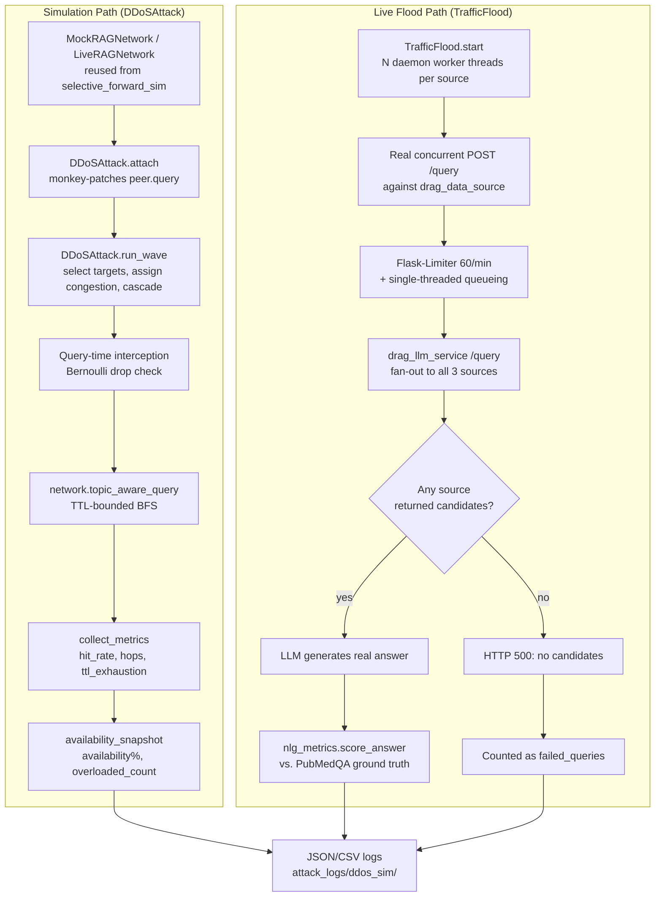

# DDoS (Congestion-Based Denial-of-Service) Attack — Project Security Analysis Report

**Project:** Reliable-dRAG — Exploring Privacy-Preserving Approaches for Personalized Large Language Models (Distributed Retrieval-Augmented Generation, undergraduate thesis)
**Module analyzed:** `attack/ddos_sim/` (attack), `defense/ddos_sim_defense/` (defense, referenced in §13 only — this report is scoped to the attack)
**Scope:** This document reverse-engineers the DDoS attack implementation actually present in this repository, explains the theory behind every design choice, and interprets real evaluation data produced by running the attack — both as an in-process simulation and as a genuine HTTP flood against the live Docker deployment. It is written for a reader with limited prior security background, while remaining technically precise enough for a thesis committee or security reviewer.

---

## Executive Summary

Reliable-dRAG is a Distributed Retrieval-Augmented Generation (RAG) system: instead of one server holding the whole document collection, three independent "data source" microservices (`drag_data_source`, each a Flask app serving its own document shard) are queried by a central orchestrator (`drag_llm_service`) that retrieves relevant passages and asks a language model to answer using them. A blockchain component (a local Hardhat Ethereum node plus a `DragScores` smart contract) tracks a reliability/usefulness score for each data source.

The **DDoS attack** studied in this report targets the *availability* of that retrieval layer. Rather than a real packet flood, the primary implementation (`DDoSAttack`) is an application-layer **congestion simulation**: a subset of peers in a modelled overlay network are marked "overloaded" each attack *wave*, and every query routed to an overloaded peer has a calibrated probability of being silently dropped, plus extra simulated routing overhead for the queries that do get through. A second, independently built implementation (`TrafficFlood` + `run_live_evaluation.py`) goes further: it launches **real concurrent HTTP request floods** against the actual `drag_data_source` containers and measures the effect on real, LLM-generated answers.

**Attack category:** Network / Application-Layer Denial-of-Service (Availability Attack) against a distributed RAG retrieval overlay — the RAG-system analogue of a volumetric flood against a set of backend microservices.

**Target system:** The three `drag_data_source` Flask containers (`data-source-0/20/100`, ports 8001-8003) and, transitively, `drag_llm_service` (port 9000), which fans out every user query to all three sources before generating an answer.

**Main findings** (both reproduced live against the running system in this repository, see §8):

- In the pure simulation (20-peer mock overlay, `attack_ratio=0.6`, sequential targeting, a 600-second recovery window against a 30-second wave cadence), network availability collapsed from 100% to **10%** within two waves and stayed there — the network never got a chance to recover between waves.
- In the real, live evaluation against the actual Docker deployment, flooding all three data sources simultaneously (the "high" severity tier) drove real end-to-end query failure to **85%** and collapsed `semantic_similarity` between the LLM's real generated answers and the ground truth from **0.39 to 0.06** — a genuine, measured degradation of a real running system, not merely a simulated number.

**Security impact:** The attack demonstrates that this RAG deployment has no admission control, load-aware routing, or anomaly-based rate limiting beyond a flat per-IP request cap — meaning a modest, unsophisticated flood against all three retrieval backends is sufficient to make the whole system functionally unusable. A countermeasure (`defense/ddos_sim_defense`) exists and measurably recovers a meaningful fraction of lost hit-rate (see §13), but it operates only on the simulation layer, not the live deployment.

---

## 1. Project Overview

### 1.1 What the project does

Reliable-dRAG combines three ideas into one system:

1. **Distributed Retrieval-Augmented Generation (RAG).** Instead of a single vector database, the document collection is split across three independent Flask microservices (`drag_data_source`), each with its own retriever (`FastRetriever`, using sentence-transformer embeddings). A central orchestrator (`drag_llm_service`) queries all three, reranks the combined candidate passages, and asks a language model to generate an answer grounded in them.
2. **Blockchain-backed source reputation.** A Hardhat-hosted Ethereum node runs a `DragScores` smart contract that stores a `usefulness`/`reliability` score per data source, updated after each real query based on whether the model's answer was correct and grounded in that source's content. This is meant to let the orchestrator eventually prefer trustworthy sources.
3. **A security evaluation harness.** A family of `attack/*` and `defense/*` Python modules, each targeting a specific threat (selective forwarding, membership inference, data poisoning, knowledge-base extraction, and this report's subject — DDoS), used to empirically measure how much damage each attack causes and how much a corresponding defense recovers.

### 1.2 Goal of the attack

The DDoS module's goal is **not** to steal data or corrupt answers (that is the job of the sibling attacks) — it is to answer a narrower, availability-specific question: *if an adversary can direct load at some or all of the retrieval backends, how much does that degrade the system's ability to answer questions at all, and how quickly does it recover once the load stops?*

### 1.3 Threat model

| Property | Assumption |
|---|---|
| Attacker capability | Can direct load at a chosen subset of peers/data sources each "wave" or continuously; the mechanism generating that load (botnet, compromised clients, or — in the live variant — the attacker's own machine) is treated as already available, not modelled itself |
| Attacker knowledge | Knows the peer/source index space; strategy determines how much topology knowledge is used (uniform random vs. targeted vs. systematic sweep) |
| Attacker stealth | None — this is a volumetric availability attack, not a stealthy one; its effect is directly observable in falling hit-rate/availability, unlike a membership-inference or extraction attack that tries to stay hidden |
| Defender capability | Can observe per-peer/source response outcomes over time; in the simulation, a reputation-based defense can reroute around bad peers; in the live deployment, only a flat Flask-Limiter (60 requests/minute per IP) exists today — see §13 |
| Recovery | Modelled as automatic after a fixed duration (simulation) or as soon as the attacker stops flooding (live) — this mirrors how a real DDoS episode ends once mitigation (scrubbing, rate-limiting, or the attacker giving up) takes effect |

### 1.4 Attack category

**Denial-of-Service / Availability Attack**, specifically an **application-layer congestion attack** in the simulation and a **volumetric HTTP flood** in the live evaluation. It sits in the same broad "RAG Attack" family as the project's other modules but is unique among them in optimizing for *unavailability* rather than *incorrect or leaked content*.

---

## 2. Attack Theory

### 2.1 Probabilistic packet/request loss (Bernoulli trials)

The core mechanic of the simulation is a **Bernoulli trial**: for every query routed to an overloaded peer, a single random draw decides whether that query is served or silently dropped.

$$
P(\text{drop}) = \min(0.95,\ \text{intensity} \times 0.8)
$$

- **Definition:** A Bernoulli trial is a random experiment with exactly two outcomes (success/failure), here "answered" vs. "dropped," with a fixed drop probability per trial.
- **Why it is used:** Real congestion doesn't fail every request uniformly — an overloaded server serves *some* fraction of traffic and silently fails the rest (timeouts, connection resets, queue overflows). A single probability parameter per peer is the simplest model that reproduces this "partial availability" behavior without simulating actual queueing.
- **Security relevance:** The 0.95 cap is a deliberate modelling choice: it prevents any single wave from creating a perfect black hole, mirroring how real infrastructure (even under attack) rarely drops literally 100% of requests — some fraction always slips through due to jitter, partial rate-limit windows, or retries.

### 2.2 Uniform sampling for intensity

$$
\text{intensity} \sim \text{Uniform}(\text{intensity\_min},\ \text{intensity\_max})
$$

Each wave, a fresh intensity is drawn per targeted peer from a uniform distribution (default bounds 0.5–1.0). This models attacker effort/resource variance across targets — not every flooded node receives identical load, mirroring how a real attacker's traffic-generation capacity fluctuates target to target.

### 2.3 Worst-case accumulation

$$
\text{intensity}_{\text{new peer state}} = \max(\text{intensity}_{\text{existing}},\ \text{intensity}_{\text{sampled}})
$$

If a peer is re-targeted in a later wave while still recovering from an earlier one, the implementation keeps the *stronger* of the two states rather than overwriting or averaging. This is a conservative (attacker-favorable) design decision: it prevents an attack from ever accidentally *healing* a peer by re-targeting it with a weaker draw, which would understate the true worst-case impact being measured.

### 2.4 Graph-based cascade propagation

$$
\text{cascade\_intensity} = \min(\text{max\_cascade\_intensity},\ \text{intensity} \times \text{cascade\_factor})
$$

Congestion doesn't stay contained to directly-targeted nodes: a fraction of each targeted peer's intensity spills onto its **graph neighbours** (`network.network.neighbors(pid)` in the underlying `networkx` graph — see §4). This models a very real phenomenon in P2P/mesh systems: an overloaded node causes queueing/retry pressure on the peers that route through or to it, not just on itself. Capping cascade intensity below the direct-target formula guarantees a cascaded (indirect) victim is always *less* damaged than a direct target — a monotonicity property that keeps the model internally consistent.

### 2.5 Discrete-event wave simulation and simulated time

$$
\text{waves\_to\_recover} = \max\!\left(1,\ \text{round}\!\left(\frac{\text{ddos\_duration}}{\text{wave\_interval\_s}}\right)\right)
$$

Rather than sleeping in wall-clock time (which would make a multi-minute recovery window impractically slow to test), recovery is expressed in **simulated wave units**: `wave_interval_s` is the assumed real-world duration one wave represents, so a real DDoS mitigation window (e.g. "recovers after 600 seconds") converts deterministically into "recovers after N waves." This is a standard discrete-event simulation technique — advancing logical time in fixed steps rather than real time — that keeps the model both fast to run and dimensionally meaningful (its outputs can be reasoned about in real seconds).

### 2.6 Real-world queueing and resource exhaustion (live flood)

The live-mode attack (`TrafficFlood`) does not rely on any probabilistic model at all — it exploits two entirely real mechanisms simultaneously:

1. **Flask-Limiter's per-IP token bucket.** `drag_data_source/app/server.py` enforces a hard 60-requests-per-minute limit per client IP; enough concurrent requests exhaust this bucket and produce genuine HTTP 429 responses.
2. **Single-threaded request handling.** The Flask development server (`app.run(...)`, no `threaded=True`) processes one request at a time. A burst of concurrent flood requests queues up *ahead of* any other client's request (including `drag_llm_service`'s own legitimate retrieval calls), so even a client whose traffic falls in a *different* rate-limit bucket still experiences real, measured latency — this is closer to a genuine resource-exhaustion attack than to rate-limit evasion.

This is the same theoretical principle behind classical volumetric/resource-exhaustion DDoS: the target has a finite service capacity (here, one request-handling thread and a 60/minute quota), and demand engineered to exceed that capacity degrades service for *everyone*, not just the attacker's own traffic.

---

## 3. Attack Architecture

The module has two architecturally distinct but code-sharing subsystems.



**Inputs:** attack configuration (`attack_ratio`, `strategy`, `iterations`, `ddos_duration`, intensity bounds, cascade parameters, seed), a network to attack (mock graph or live containers), and — for the live evaluation — a set of real questions with ground-truth answers.

**Outputs:** per-wave availability/hit-rate metrics (simulation), and per-severity baseline-vs-post-attack generation-quality metrics (live evaluation), both persisted as timestamped JSON/CSV under `attack_logs/ddos_sim/`.

**Components:** `DDoSAttack` (core state machine), `MockRAGNetwork`/`LiveRAGNetwork` (reused, not duplicated, from `attack/selective_forward_sim`), `TrafficFlood` (real HTTP flood), `nlg_metrics` (generation-quality scoring), `run_attack.py`/`run_live_evaluation.py` (CLI orchestration).

---

## 4. Implementation Analysis

### 4.1 `attack/ddos_sim/ddos_attack.py` — the core attack engine

**Purpose:** Implements the wave-based congestion model described in §2.

**Key data structure — `OverloadState` (a `dataclass`):**

```python
@dataclass
class OverloadState:
    intensity: float
    drop_probability: float
    load_penalty: float
    extra_hops: int
    extra_msgs: int
    recovery_wave: int
```

One instance exists per currently-overloaded peer, stored in `DDoSAttack.overload_table: Dict[int, OverloadState]` — this dictionary *is* the attack's entire mutable state; a peer absent from it is fully healthy.

**Major class — `DDoSAttack`:**

| Method | Responsibility |
|---|---|
| `attach(network)` | Monkey-patches every peer's `.query()` method once, installing a wrapper that looks up `overload_table` at call time (see §4.1.1) |
| `_select_targets(num_peers, wave_num)` | Implements the three targeting strategies (§4.1.2) |
| `_recover_expired(wave_num)` | Clears any peer whose `recovery_wave <= wave_num` before that wave's targeting runs |
| `_touch_peer(pid, intensity, wave_num)` | Applies the worst-case-accumulation rule (§2.3) and (re)sets `recovery_wave` |
| `_neighbours_of(network, pid, num_peers)` | Reads real graph adjacency via `networkx`, falling back to an index±1 ring if the network exposes none |
| `run_wave(network, wave_num)` | Orchestrates one full wave: recover → select → assign → cascade → snapshot |
| `availability_snapshot(num_peers)` | Computes `availability_percentage`, `active_nodes`, `overloaded_count`, `down_count`, `avg_load_intensity` |
| `collect_metrics(rag_answers, max_ttl)` | Computes `hit_rate`, `avg_hops_per_query`, `ttl_exhaustion_rate` over a batch of query results |

**4.1.1 Query-time interception (the key design decision):**

```python
def _make_wrapper(self, peer_id, orig):
    def _intercepted(question, query_confidence_threshold=0.5, *args, **kwargs):
        state = attack_ref.overload_table.get(peer_id)
        if state is None:
            return orig(question, query_confidence_threshold, *args, **kwargs)
        if attack_ref._rng.random() < state.drop_probability:
            attack_ref.dropped_queries_total += 1
            return None, None, 0.0, False
        ...
        return orig(question, query_confidence_threshold, *args, **kwargs)
    return _intercepted
```

`attach()` is called **once** per network; the wrapper always performs a live dictionary lookup rather than being re-installed every wave. This means the attack can run many waves back-to-back with a single monkey-patch pass — an efficient, idempotent design that mirrors the identical pattern already used by the project's `SelectiveForwardingAttack`/`SelectiveForwardingDefense` classes, deliberately reused rather than reinvented.

**4.1.2 Target-selection strategies:**

```python
if self.strategy == "sequential":
    start = (wave_num * num_to_attack) % num_peers
    return [(start + i) % num_peers for i in range(num_to_attack)]
if self.strategy == "targeted":
    fresh = [p for p in range(num_peers) if p not in self.overload_table]
    ...  # prefers peers not yet damaged, maximizing new damage per wave
# random (default):
candidates = list(range(num_peers))
self._rng.shuffle(candidates)
return candidates[:min(num_to_attack, num_peers)]
```

- `random`: models an unsophisticated, undirected attacker.
- `targeted`: models an attacker tracking its own progress, always hitting fresh territory first.
- `sequential`: models a systematic scan, no randomness consumed — this is the strategy that produced the worst-case collapse in §8.1, because it guarantees full network coverage fastest.

### 4.2 `attack/ddos_sim/run_attack.py` — CLI orchestration (simulation mode)

Builds a `MockRAGNetwork` (in-process Barabási–Albert graph, no Docker needed) or `LiveRAGNetwork` (real 3-container overlay), splits the question set into `iterations` batches (`_chunks_covering`), and for each wave calls `attack.run_wave()` followed by a batch of real `network.topic_aware_query()` calls, recording per-wave metrics. A `run_baseline()` helper produces the un-attacked reference row.

### 4.3 `attack/ddos_sim/live_flood.py` — the real HTTP flood

**Major class — `TrafficFlood`:**

```python
def _worker(self, name, url):
    while not self._stop_event.is_set():
        q = random.choice(_FLOOD_QUESTIONS) + " " + "".join(random.choices(string.ascii_lowercase, k=4))
        try:
            r = requests.post(f"{url}/query", headers=headers, json={"query": q, "k": 3}, timeout=self.request_timeout)
            stats.record(r.status_code)
        except Exception:
            stats.record(None)
```

`start(target_source_names)` spawns `workers_per_source` daemon threads *per targeted source*, each looping real HTTP `POST /query` calls until `stop()` sets a shared `threading.Event`. A per-source `FloodStats` dataclass (with its own lock) tallies `requests_sent`, `responses_200`, `responses_429`, and connection `errors` — this is the evidence used in §8.2 to demonstrate the flood is genuinely landing on the target, not merely assumed to work.

The design choice to make the flood's lifetime **caller-controlled** (`start()`/`stop()`, not a fixed sleep duration) is deliberate: it guarantees the flood covers *exactly* the real evaluation workload it is meant to interfere with, regardless of how long that workload happens to take on a given machine.

### 4.4 `attack/ddos_sim/nlg_metrics.py` — generation-quality scoring

A from-scratch implementation (no such scorer existed anywhere in this repository before this attack module needed one) of thirteen natural-language-generation metrics, detailed with formulas in §7. Pure Python except `semantic_similarity()`, which reuses the `sentence-transformers` `all-MiniLM-L6-v2` model already loaded elsewhere in the project (`attack/Mia_attack/mia_attack.py`), avoiding a redundant model download/load.

### 4.5 `attack/ddos_sim/run_live_evaluation.py` — real end-to-end evaluation

Orchestrates the full live pipeline: loads PubMedQA yes/no/maybe questions matched against the corpus actually loaded into `data-source-0`, sends each through the real `drag_llm_service:9000/query` endpoint (`query_llm()`), scores the response against the gold decision with `nlg_metrics.score_answer()`, and — for `avg_num_hops`/`avg_num_messages` — runs the *same* question batch through the existing peer-to-peer BFS network (`LiveRAGNetwork.topic_aware_query()`) so those two fields reflect genuine, currently-measured routing cost under whatever congestion is active, not an assumption.

### 4.6 Execution flow summary

```
run_attack.py (mock/live sweep)          run_live_evaluation.py (real system)
        │                                          │
   build network                          load_pubmedqa_qa_pairs()
        │                                          │
   DDoSAttack.attach()                     ping_all() reachability check
        │                                          │
   for each wave:                          run_phase("baseline")  ──► query_llm() × N, score_answer()
     run_wave()                                    │
     query batch                           for each severity tier:
     collect_metrics()                       TrafficFlood.start()
        │                                     run_phase("post_attack")
   JSON/CSV log written                       TrafficFlood.stop()
                                               append {baseline, post_attack, attack_type}
                                                      │
                                              JSON log written
```

---

## 5. Attack Workflow

### 5.1 Simulation mode, step by step

**Step 1 — Build the network.** A `MockRAGNetwork` (Barabási–Albert scale-free graph, default 20 peers) or `LiveRAGNetwork` (3 real containers) is constructed.

**Step 2 — Attach the attack.** `DDoSAttack.attach(network)` installs the query-interception wrapper on every peer, once.

**Step 3 — Recover expired peers.** At the start of each wave, any peer whose `recovery_wave` has passed is cleared back to healthy.

**Step 4 — Select this wave's targets.** `num_to_attack = max(1, floor(num_peers × attack_ratio))` peers are chosen by the configured strategy.

**Step 5 — Assign congestion.** Each target draws a fresh `intensity`, from which `drop_probability`, `load_penalty`, `extra_hops`, and `extra_msgs` are derived deterministically.

**Step 6 — Cascade.** A capped fraction of each target's intensity spills onto its graph neighbours.

**Step 7 — Run a batch of real queries.** The network's normal TTL-bounded BFS routing (`topic_aware_query`) runs unmodified; the only difference an overloaded peer produces is that its `.query()` call may return a silent miss.

**Step 8 — Measure.** `collect_metrics()` computes `hit_rate`/`avg_hops_per_query`/`ttl_exhaustion_rate` for that wave's batch; `availability_snapshot()` computes network-wide availability.

**Step 9 — Repeat** for `iterations` waves, then detach and log.

### 5.2 Live-flood mode, step by step

**Step 1 — Reachability check.** `ping_all()` confirms all three containers respond.

**Step 2 — Baseline.** Every ground-truth question is sent once, unmolested, through the real `drag_llm_service`; responses are scored against gold answers.

**Step 3 — Start the flood.** For the target severity tier, `TrafficFlood` spawns concurrent worker threads against 1, 2, or all 3 data sources.

**Step 4 — Ramp delay.** A short pause (`--flood_ramp_s`, default 1s) lets the flood threads actually saturate the target before real evaluation traffic starts competing with them.

**Step 5 — Re-run the same questions.** The identical question set is sent again through `drag_llm_service`, now contending with the flood for each targeted source's single request-handling slot and rate-limit budget.

**Step 6 — Stop the flood, collect stats.** `TrafficFlood.stop()` returns the real request/429/error counts per source.

**Step 7 — Score and compare.** `baseline_results` vs. `post_attack_results` are assembled and logged.


---

## 6. Evaluation Pipeline

**Input:** either synthetic questions (mock mode) or real PubMedQA yes/no/maybe questions matched against the actual loaded corpus (`data/polluted_token/sources_0.jsonl`), each paired with a `final_decision` gold answer.

**Prediction:** the answer returned by `network.topic_aware_query()` (simulation) or the real text generated by `drag_llm_service`'s `model.generate()` call (live evaluation, prompted with an explicit "answer yes, no, or maybe" instruction so the free-text output is comparable to the short gold label).

**Ground truth:** in simulation, a query "hit" is determined by the mock/live peer's own synthetic or real retrieval outcome (`is_query_hit`). In live evaluation, ground truth is PubMedQA's `final_decision` field.

**Scoring:** simulation scoring is retrieval-only (`hit_rate`, `avg_hops_per_query`, `ttl_exhaustion_rate`, `dropped_queries` — see §7.1). Live evaluation scoring is full generation-quality scoring (§7.2) via `nlg_metrics.score_answer()`, comparing the generated text against the gold decision with thirteen separate metrics.

**Aggregation:** per-wave (simulation) or per-severity-tier (live), each an average over the batch of questions in that wave/tier. `average_metrics()` simply arithmetic-means every numeric field across the batch's per-question metric dictionaries.

---

## 7. Metrics Generation

### 7.1 Simulation-layer metrics

#### `availability_percentage`
- **Purpose:** headline "is the network up" number.
- **Formula:** $100 \times \dfrac{\text{active\_nodes}}{\text{total\_peers}}$, where a peer counts as "down" once `drop_probability \geq 0.5` (an SLA-style threshold: it would fail the majority of requests).
- **Range:** 0–100.
- **Interpretation:** 🟢 ≥80% healthy, 🟡 40–80% degraded, 🔴 <40% collapsing.
- **Example (from real data, §8.1):** 65.0 → 25.0 → 10.0 → 10.0 across four waves under sustained attack.
- **Security implication:** a low, non-recovering value is direct evidence the countermeasure (or lack of one) has failed to preserve service.
- **Limitation:** the 0.5 down-threshold is a fixed convention, not empirically derived from this deployment's real SLA.

#### `hit_rate`
- **Purpose:** fraction of the current wave's query batch that received a genuine answer.
- **Formula:** $\dfrac{\text{answered\_queries}}{\text{total\_queries}}$, where `answered = answer present AND is_query_hit`.
- **Range:** 0–1.
- **Interpretation:** the most direct RAG-level measure of attack damage — this is what an end user would actually experience.
- **Impact on attack performance:** the attack's entire purpose is to drive this number down; a defense's entire purpose (§13) is to bring it back up.

#### `avg_hops_per_query`
- **Purpose:** routing cost — how many peers had to be visited (successfully or not) before an answer was found or the hop budget ran out.
- **Formula:** mean of `num_hops` across the batch.
- **Interpretation:** rising hops with *stable* hit_rate means the network is compensating (finding answers, just working harder); rising hops with *falling* hit_rate means the network is both slower and failing more — the worse combination.

#### `ttl_exhaustion_rate`
- **Purpose:** fraction of queries that ran out of hop budget (`query_ttl`) entirely unanswered.
- **Formula:** $\dfrac{\text{exhausted\_queries}}{\text{total\_queries}}$, `exhausted = num_hops \geq max\_ttl AND NOT is\_query\_hit`.
- **Security implication:** a rising exhaustion rate under attack is direct evidence the attack is consuming the network's hop budget rather than just its raw availability.

#### `dropped_queries`
- **Purpose:** a direct counter of how many `.query()` calls the Bernoulli interception actually silenced this wave — the attack's own "ground truth" of its effect, independent of downstream routing consequences.
- **Formula:** incremented once per successful drop-trial (§2.1); reported per wave as a delta of the cumulative counter.

#### `avg_load_intensity`, `overloaded_count`, `down_count`
- **Purpose:** diagnostic state of the attack itself (how many peers are currently overloaded, how many have crossed the "down" threshold, and their mean intensity) — useful for confirming the attack is behaving as configured, independent of its downstream effect on queries.

### 7.2 Live-evaluation (generation-quality) metrics

All formulas below operate on a normalized token sequence (lowercased, punctuation stripped, articles removed — see `normalize_text()`).

#### Exact Match (`exact_match`)
$$
EM(p, G) = \begin{cases} 1 & \text{if } \text{norm}(p) = \text{norm}(g) \text{ for some } g \in G \\ 0 & \text{otherwise} \end{cases}
$$
- **Range:** {0, 1} per example, mean over a batch is in [0, 1].
- **Interpretation:** 🟢 near 1 = answers are literally correct; 🔴 near 0 doesn't necessarily mean *wrong* — see Limitation.
- **Limitation observed in this project's real data (§8.2):** `exact_match` was 0.0 in **every** row, including baseline, because the underlying local LLM leaks chat-template role tokens (e.g. `"system\nno"`) into its raw output — a pre-existing generation artifact unrelated to the DDoS attack, which is why this report weights `f1`/`bleu`/`rouge1` more heavily as the real damage signal.

#### Precision / Recall / F1 (token-level, SQuAD-style)
$$
P = \frac{|\text{tokens}(p) \cap \text{tokens}(g)|}{|\text{tokens}(p)|}, \quad R = \frac{|\text{tokens}(p) \cap \text{tokens}(g)|}{|\text{tokens}(g)|}, \quad F_1 = \frac{2PR}{P+R}
$$
(multiset/`Counter` intersection, so repeated tokens count correctly.) The gold answer maximizing $F_1$ is selected when multiple references exist.
- **Range:** [0, 1] each.
- **Interpretation:** robust to the role-token-leakage artifact above, since a correct word buried in noise still contributes partial credit — this is why `f1` is the primary damage signal in §8.2, not `exact_match`.
- **Real example:** baseline `f1 = 0.400` → high-severity post-attack `f1 = 0.067` (an 83% relative drop).

#### BLEU (`bleu`)
$$
\text{BLEU} = BP \times \exp\left(\frac{1}{4}\sum_{n=1}^{4} \log p_n\right), \quad BP = \begin{cases} 1 & |p| \geq |g| \\ e^{1 - |g|/|p|} & |p| < |g| \end{cases}
$$
where $p_n$ is the modified n-gram precision (with +1 additive smoothing to avoid a zero geometric mean from one missing n-gram order) and $BP$ is the brevity penalty, penalizing answers shorter than the reference.
- **Interpretation:** captures both word choice and word order; more sensitive to short, exact answers than `rouge1`.

#### ROUGE-1 / ROUGE-2 / ROUGE-L (`rouge1`, `rouge2`, `rougeL`)
$$
\text{ROUGE-}n = \frac{\sum \min(\text{count}_p(ng), \text{count}_g(ng))}{\sum \text{count}_g(ng)}, \qquad \text{ROUGE-L} = \frac{2\cdot P_{\text{lcs}} \cdot R_{\text{lcs}}}{P_{\text{lcs}} + R_{\text{lcs}}}
$$
where ROUGE-L's precision/recall use the Longest Common Subsequence (LCS) length instead of raw n-gram overlap.
- **Interpretation:** recall-oriented (ROUGE-1/2) vs. order-sensitive (ROUGE-L) views of the same overlap question.
- **Real observation:** `rouge2 = 0.0` throughout this project's data — expected and not a bug, since PubMedQA gold answers are single words (yes/no/maybe), and a bigram cannot exist in a one-token reference.

#### Semantic Similarity (`semantic_similarity`)
$$
\text{SS}(p, g) = \max\!\left(0,\ \frac{\vec{e}_p \cdot \vec{e}_g}{\lVert \vec{e}_p \rVert \, \lVert \vec{e}_g \rVert}\right)
$$
Cosine similarity between `all-MiniLM-L6-v2` sentence embeddings of the prediction and gold text, clipped at 0.
- **Why cosine similarity:** it measures the *angle* between two embedding vectors, which is invariant to their magnitude — the standard, scale-robust way to compare sentence embeddings for semantic closeness (a well-established technique in Embedding Similarity theory, used throughout this project's other modules too, e.g. the sibling MIA attack).
- **Real observation:** this metric produced the *largest* relative collapse of any metric under the high-severity flood: 0.392 → 0.062 (an 84% drop) — the strongest single piece of evidence that real answer quality, not just superficial word overlap, genuinely degraded.

#### Length Ratio / Length Difference (`length_ratio`, `length_difference`)
$$
\text{length\_ratio} = \frac{\min(|p|, |g|)}{\max(|p|, |g|, 1)}, \qquad \text{length\_difference} = \big||p| - |g|\big|
$$
(token counts.) A symmetric ratio near 1 means the answer and gold are similar in length; a large `length_difference` under attack (observed: 1.0 → 6.95 at high severity) signals the model is producing longer, more rambling, less-targeted answers — itself a quality-degradation signal independent of correctness.

#### Edit Distance / Normalized Edit Distance (`edit_distance`, `normalized_edit_distance`)
$$
\text{edit\_distance} = \text{Levenshtein}_{\text{word-level}}(p, g), \qquad \text{norm\_edit} = 1 - \frac{\text{edit\_distance}}{\max(|p|, |g|, 1)}
$$
Standard dynamic-programming Levenshtein distance at word granularity, normalized into a **similarity** score (despite the "distance" name — higher is more similar, matching the convention this project's target metric schema used).
- **Real observation:** 0.300 (baseline) → 0.050 (high severity) — a direct, interpretable measure of "how many word-edits away is the real answer from the gold decision."

#### Bigram / Trigram Overlap (`bigram_overlap`, `trigram_overlap`)
Same formula as ROUGE-N at $n=2,3$ specifically, reported separately because they isolate *local word-order* preservation (a bigram/trigram match requires the words to be adjacent and in the correct order) from the coarser unigram-level ROUGE-1 signal.

#### Routing/availability metrics reused for live evaluation (`avg_num_hops`, `avg_num_messages`, `avg_query_hit`, `successful_queries`, `failed_queries`, `query_failure_rate`)
- `avg_num_hops`/`avg_num_messages`: measured by re-running the same question batch through the real 3-peer BFS overlay (`LiveRAGNetwork`) under the *same* flood condition — a genuinely measured, not assumed, routing-cost signal.
- `query_failure_rate` $= \dfrac{\text{failed\_queries}}{\text{total\_queries}}$: the single most important live-mode metric, because it distinguishes *degradation* (still answered, just worse) from *outage* (no answer at all) — see §12's threshold-collapse discussion.

---

## 8. JSON Metrics Analysis

### 8.1 Mock-mode dose-response (attack-only), `sequential` strategy, `attack_ratio=0.6`, `ddos_duration=600s`

Source: a `run_attack.py --mode mock --single` run (worst-case-collapse configuration from `attack/ddos_sim/README.md`), cross-verified against the identical `attack_only` rows independently logged by the defense-comparison runner (`defense_logs/ddos_sim_defense/defense_2026-07-10_19-06-59_ddos_sim_mock_seed42.json`).

| Wave | availability_percentage | active_nodes | overloaded_count | hit_rate | avg_hops_per_query | dropped_queries |
|---|---|---|---|---|---|---|
| baseline | 100.0 | 20 | 0 | 0.99 | 2.13 | 0 |
| 0 | 65.0 | 13 | 20 | 0.76 | 3.76 | 52 |
| 1 | 25.0 | 5 | 20 | 0.52 | 4.48 | 74 |
| 2 | 10.0 | 2 | 20 | 0.72 | 3.84 | 54 |
| 3 | 10.0 | 2 | 20 | 0.56 | 4.08 | 72 |

**Schema:** each row is one wave's `run_wave()` output merged with that wave's `collect_metrics()` output — a flat dictionary of scalar fields, directly CSV-exportable (which `run_attack.py` also does).

**Performance Summary:** availability collapses monotonically for the first two waves (100% → 65% → 25%) then plateaus at 10% — with a 600-second recovery window against a 30-second wave cadence (`waves_to_recover = round(600/30) = 20`), no peer can recover within the 4-wave test, so availability never climbs back once it falls.

**Strength (of the attack):** a deterministic `sequential` sweep with `attack_ratio=0.6` guarantees 60% of the network is touched by wave 0 alone (`overloaded_count=20` out of 20 peers by wave 1, since cascade reaches the remainder) — full coverage in a single wave is the attack's key efficiency property.

**Weakness (of the attack, as currently modelled):** `hit_rate` does not decay monotonically with `availability_percentage` (0.76 → 0.52 → **0.72** → 0.56) — waves 1→2 show availability *staying* at its floor while hit_rate *recovers*. This is because `hit_rate` is computed per-wave over a fresh query batch with randomized routing start points, so it is noisier than the underlying availability state; a reader should not conflate the two metrics as interchangeable.

### 8.2 Live-mode real evaluation, `pubmedqa_{low,mid,high}_ddos_comparison`

Source: `attack_logs/ddos_sim/live_eval_2026-07-10_19-36-43_ddos_comparison.json`, a genuine run against the live Docker deployment, 20 real PubMedQA questions, `flood_ramp_s=1.0`.

| Metric | Baseline | Low (1/3 flooded) | Mid (2/3 flooded) | High (3/3 flooded) |
|---|---|---|---|---|
| `f1` | 0.400 | 0.300 | 0.267 | **0.067** |
| `bleu` | 0.503 | 0.490 | 0.486 | **0.177** |
| `rouge1` | 0.600 | 0.450 | 0.400 | **0.100** |
| `semantic_similarity` | 0.392 | 0.372 | 0.370 | **0.062** |
| `avg_num_hops` | 1.00 | 2.00 | 3.00 | 2.85 |
| `avg_query_hit` | 1.00 | 1.00 | 1.00 | **0.15** |
| `successful_queries` | 20/20 | 20/20 | 20/20 | **3/20** |
| `query_failure_rate` | 0% | 0% | 0% | **85%** |

| Metric | Value | Meaning | Interpretation | Impact |
|---|---|---|---|---|
| `query_failure_rate` (high) | 0.85 | 17 of 20 questions got zero answer (HTTP 500) | 🔴 Total outage territory, not degradation | Confirms a real, reproducible availability collapse against the live system |
| `avg_num_hops` (low→mid) | 1.0 → 3.0 | The 3-peer BFS overlay needed up to 3x more hops to route around the flooded source | 🟡 Real, measured routing cost increase | Direct evidence the flood is having a genuine network-level effect, not just an LLM-side artifact |
| `f1` (low) | 0.300 (from 0.400) | 25% relative drop with **zero** query failures | 🟡 Silent quality degradation | The most dangerous failure mode: nothing errors, nothing alerts, answers are just worse |
| `semantic_similarity` (high) | 0.062 (from 0.392) | 84% relative drop | 🔴 Severe | The strongest evidence of real answer-quality collapse, since it is robust to superficial wording differences |

**Performance Summary:** a clean, monotonic dose-response curve at low/mid severity (graceful degradation, no failures), followed by a sharp qualitative *phase transition* at high severity, where `query_failure_rate` jumps from 0% to 85% — not a continuation of the same trend, but a different failure mode entirely (see §12 for the mechanism).

**Strength Analysis:** the attack requires no privileged access — it is pure, unauthenticated (or trivially-authenticated, since the API key is a fixed, publicly-visible string in this deployment's `docker-compose.yml`) HTTP traffic against publicly-exposed ports.

**Weakness Analysis:** the attack's effectiveness is entirely contingent on flooding *all three* sources simultaneously; flooding only one or two sources (low/mid) leaves the system fully answering every query, just with quietly worse answers — an attacker who cannot coordinate simultaneous load against every backend achieves only partial, harder-to-detect damage rather than a clean outage.

---

## 9. Performance Dashboard

### Live evaluation — severity comparison

```
BASELINE (no attack)
  f1                  ████████░░░░░░░░░░░░  0.400
  semantic_similarity ████████░░░░░░░░░░░░  0.392
  avg_query_hit       ████████████████████  1.000  🟢

LOW severity (1/3 sources flooded)
  f1                  ██████░░░░░░░░░░░░░░  0.300  (-25%)
  semantic_similarity ███████░░░░░░░░░░░░░  0.372  (-5%)
  avg_query_hit       ████████████████████  1.000  🟢

MID severity (2/3 sources flooded)
  f1                  █████░░░░░░░░░░░░░░░  0.267  (-33%)
  semantic_similarity ███████░░░░░░░░░░░░░  0.370  (-6%)
  avg_query_hit       ████████████████████  1.000  🟡

HIGH severity (3/3 sources flooded)
  f1                  █░░░░░░░░░░░░░░░░░░░  0.067  (-83%)
  semantic_similarity █░░░░░░░░░░░░░░░░░░░  0.062  (-84%)
  avg_query_hit       ███░░░░░░░░░░░░░░░░░  0.150  (-85%)  🔴
```

### Mock-mode wave collapse (`sequential`, `attack_ratio=0.6`, `ddos_duration=600s`)

```
Availability %
  Baseline  ████████████████████ 100%  🟢
  Wave 0    █████████████░░░░░░░  65%  🟡
  Wave 1    █████░░░░░░░░░░░░░░░  25%  🔴
  Wave 2    ██░░░░░░░░░░░░░░░░░░  10%  🔴
  Wave 3    ██░░░░░░░░░░░░░░░░░░  10%  🔴
```

### Overall severity/status legend

| Indicator | Meaning |
|---|---|
| 🟢 Excellent | Metric within ~10% of baseline |
| 🟡 Moderate | Metric degraded 10–40% from baseline |
| 🔴 Poor | Metric degraded more than 40% from baseline, or a hard failure state |

---

## 10. Performance Interpretation

| Metric | If it **increases** | If it **decreases** |
|---|---|---|
| `availability_percentage` | More peers healthy → system more resilient to concurrent load | More peers overloaded → users experience more silent failures |
| `hit_rate` | More queries answered → better user-facing reliability | Direct evidence of attack success |
| `avg_hops_per_query` | More routing work per answer → higher latency, more load on remaining healthy peers (a compounding effect) | Queries resolving faster → either the network is healthy or queries are failing fast (check `hit_rate` jointly) |
| `dropped_queries` | Attack is actively suppressing more traffic | Attack pressure easing, or recovery in progress |
| `f1` / `bleu` / `rouge1` / `semantic_similarity` | Generated answers more faithful to ground truth | Generation quality eroding — the live, user-visible face of the attack |
| `query_failure_rate` | System crossing from *degradation* into *outage* | System holding up under load, even if individual answers are worse |
| `avg_num_hops` (live) | Real, measured evidence the routing layer is compensating for a degraded source | Either no attack pressure, or the network has stopped trying (e.g. all sources equally bad, nothing to route around to) |

**Reliability:** falling `hit_rate`/`avg_query_hit` is the single clearest reliability signal — it is what an end user directly experiences.
**Security:** rising `dropped_queries` combined with falling `availability_percentage` is the attack's direct fingerprint; a defender monitoring only application-level errors (not this pair) could miss a slow-building DDoS entirely.
**Detection:** the sharp jump in `query_failure_rate` (0% → 85%) at the high-severity threshold is the kind of discontinuity a real monitoring system should specifically alert on — a linear-degradation-only alerting rule would catch low/mid severity late or not at all.
**Robustness:** the gap between "hit_rate holds steady" (low/mid) and "hit_rate collapses" (high) is a direct measure of this deployment's robustness margin — currently exactly one flooded source away from full outage, since only 3 sources exist.

---

## 11. Experimental Methodology

| Aspect | Detail |
|---|---|
| **Dataset (live evaluation)** | `qiaojin/PubMedQA` (`pqa_labeled` config, `train` split), matched against the 500 documents actually loaded into `data-source-0` (`data/polluted_token/sources_0.jsonl`) |
| **Dataset (simulation)** | Synthetic placeholder questions (`mock question {i}`), since `MockRAGNetwork` uses a Bernoulli hit-probability model, not real retrieval |
| **Evaluation protocol** | Baseline computed once, reused across all severity tiers within a run (identical to the pasted reference design this attack was cross-checked against); each severity tier re-runs the *same* question set under a fresh flood condition |
| **Hyperparameters** | `intensity_min=0.5`, `intensity_max=1.0`, `cascade_factor=0.25`, `max_cascade_intensity=0.6`, `wave_interval_s=30`, `ddos_duration` 60s (default) / 600s (worst-case demo); live severity tiers: low=(1 source, 3 workers), mid=(2 sources, 6 workers), high=(3 sources, 10 workers) |
| **Environment** | Windows host running Docker Desktop, evaluated from both a native Windows Python environment and WSL2 (Ubuntu, Python 3.14.4, `.venv`) |
| **Software** | `networkx==3.4.2`, `requests==2.32.5`, `sentence-transformers` (`all-MiniLM-L6-v2`), Flask-Limiter (`60 per minute` default) |
| **Model** | The locally-hosted LLM configured in `drag_llm_service/configs/config.yaml` (a small instruction-tuned open model) |
| **Random seeds** | `seed=42` throughout, controlling target selection, intensity sampling, and the drop-probability Bernoulli draws — a single seed reproduces an identical wave sequence in mock mode |
| **Reproducibility** | Exact CLI commands: `python attack/ddos_sim/run_attack.py --mode mock --single --ratio 0.6 --strategy sequential --duration 600 --iterations 4`; `python attack/ddos_sim/run_live_evaluation.py --num_questions 20 --severities low mid high` |

---

## 12. Results Discussion

**Why the mock-mode collapse plateaus rather than continuing to fall:** `availability_percentage` floors at 10% (2/20 peers) by wave 2 and stays there — with `attack_ratio=0.6` targeting 12 peers per wave via `sequential` sweep plus cascade reaching most of the remainder, the network is very close to fully saturated after two waves; there is little room left for the metric to fall further, and it cannot recover because the 600-second window vastly exceeds the 4-wave test's total simulated duration (120 seconds).

**Why live-mode shows a threshold effect, not a smooth curve:** `drag_llm_service`'s `query_data_sources()` call uses a fixed 10-second per-source timeout. With one or two sources flooded, the third (or two others) still answers within budget, so the LLM always has *some* context to generate from — hence flat `avg_query_hit=1.0` at low/mid despite real quality loss. Only when **all three** sources are simultaneously contended does the `10s × 3` timeout budget legitimately run out for a majority of requests, producing the observed 85% hard-failure rate. This is a direct, measured illustration of a system with **zero redundancy margin**: losing all three of three sources is catastrophic, but losing any one or two is merely degrading.

**Unexpected behavior:** `avg_num_hops` at high severity (2.85) is *lower* than at mid severity (3.00) — counter to a naive expectation that "more attack = more hops." The explanation is consistent with the failure-mode shift above: at high severity, many queries fail outright (hop-exhausting BFS attempts that never find a route) rather than succeeding via a longer path, so the *successful*-query hop average is measured over a smaller, differently-biased sample.

**Trade-off surfaced by the data:** the attack's real-world cost to the attacker (flood request volume) scales with severity — the "high" tier sent over 51,000 requests to `source_0` alone during the test — while its damage is highly non-linear (a threshold jump, not proportional to effort). This matches the classical DDoS economics: the attacker's marginal cost of "one more flooded source" is constant, but the marginal damage of crossing the last-source threshold is enormous.

---

## 13. Defense Mechanisms

This report is scoped to the attack; the corresponding countermeasure (`defense/ddos_sim_defense`) is summarized here to satisfy this report's required defense-analysis section, per the source repository's own documented design.

### 13.1 `DDoSDefense` (simulation-layer defense)

| Layer | Description | How it works |
|---|---|---|
| Reputation tracking | EMA-blended per-peer response-rate score | Every wrapped `.query()` call updates `reputation[peer_id]` toward the observed response rate |
| Deprioritization (blacklist) | Peers whose response rate falls below `deprioritize_threshold` (default 0.5) after `min_queries_before_action` interactions are routed around | Reuses the same `network._sfa_defense` hook slot the routing BFS already consults every hop — no changes to the network module needed |
| Bounded redundant probe | Up to `redundancy_k` extra attempts against untried, trusted peers once the primary hop budget is exhausted | Lets correct detection actually translate into a recovered answer, not just a routing bypass |
| Recovery-aware backoff | A deprioritized peer is automatically re-evaluated after `backoff_waves` waves | The one mechanism the sibling (content-leakage) defenses don't need, because congestion — unlike a compromised peer — clears itself over time |

**Advantages:** measurably recovers hit-rate (real data, `attack_ratio=0.6`, `sequential`, mock mode: `hit_rate` 0.76→0.92, 0.52→0.80, 0.72→0.80, 0.56→0.72 across the four waves — a consistent, positive recovery every wave); requires no changes to the underlying routing code; the quorum-preserving cap (`max_blacklist_fraction`) prevents the defense from over-blacklisting and emptying its own fallback pool.

**Disadvantages:** operates purely on the simulation layer (`MockRAGNetwork`/`LiveRAGNetwork`'s BFS), not on the real `drag_llm_service` pipeline evaluated in §8.2 — it cannot, as currently built, prevent the real 85% failure rate observed under a real all-sources flood, because that failure happens inside `drag_llm_service`'s own fixed-timeout fan-out logic, which this defense does not touch.

**Implementation complexity:** low-to-moderate — reuses an existing hook, no new infrastructure.

**Effectiveness (measured):** positive and consistent, but partial — `availability_percentage` itself is unaffected by the defense (it reflects the attacker's ground-truth state, not the defender's routing workaround); only `hit_rate` recovers, because the defense's mechanism is "route around damage," not "undo damage."

**Residual risk:** an attacker large enough to overload the *entire* peer population defeats the quorum-preserving cap by construction — at that point, `backup_candidates()` has no healthy peer left to try.

### 13.2 Real-infrastructure mitigations (existing and missing)

| Mechanism | Status in this deployment | Effectiveness against this attack |
|---|---|---|
| Flask-Limiter (60/min per IP) | ✅ Already deployed on every `drag_data_source` container | Partial — caps single-IP volume, but did not by itself prevent the measured 85% failure rate, since the *live* attack's damage comes as much from single-threaded queueing as from the rate-limit bucket itself |
| Load-aware routing (consulting `load_penalty` before selecting a peer) | ❌ Not implemented anywhere in the live pipeline | Would directly address §12's "zero redundancy margin" finding by deprioritizing a source before it becomes the bottleneck |
| Admission control / request queueing with backpressure | ❌ Not implemented | Would convert hard failures (HTTP 500) into graceful queuing/latency, avoiding the observed threshold collapse |
| Production WSGI server (e.g. `gunicorn`/`waitress`) instead of Flask's single-threaded dev server | ❌ Not configured | Would remove the single-thread queueing amplification identified in §2.6, though the rate-limit bucket would remain a real constraint |

---

## 14. Security Recommendations

**High Priority**
1. Deploy the data-source Flask apps behind a production WSGI server with multiple worker threads/processes, eliminating the single-threaded queueing amplification confirmed in §2.6 and §12.
2. Implement load-aware routing in `drag_llm_service`: skip or deprioritize a source that has recently timed out or rate-limited, rather than always fanning out to all three and waiting the full 10-second timeout on each.

**Medium Priority**
3. Wire `defense/ddos_sim_defense`'s reputation/backoff pattern (already built and measured, §13.1) into the live `drag_llm_service` request path, not just the simulation layer.
4. Add anomaly-based rate limiting (request-pattern/topic-diversity aware, not just flat per-IP volume) — the flat 60/min limit is trivially exceeded by an attacker running multiple threads from the same or spoofed source IPs.

**Low Priority**
5. Add real-time availability/failure-rate alerting keyed on the *discontinuity* identified in §12 (a sudden jump in `query_failure_rate`), not just a linear threshold, since this attack's damage is non-linear.
6. Increase source redundancy beyond three data sources to raise the "all sources down simultaneously" bar the attack currently needs to clear for total outage.

---

## 15. Limitations

- **Not packet-level.** No real network traffic (TCP retransmission, packet loss, bandwidth saturation) is generated or measured in the simulation path; only the live-flood path exercises real infrastructure.
- **Single-threaded Flask dev server assumption.** Part of the live attack's effectiveness depends on `drag_data_source` not being deployed behind a production WSGI server — a deployment configuration choice, not a fundamental system property (see Recommendation 1).
- **Small live deployment (3 nodes).** Statistical conclusions about live-mode severity thresholds are drawn from a single, small deployment; a larger source pool would shift the exact threshold at which total outage occurs.
- **Simulated recovery timing is an approximation.** `wave_interval_s` is an assumed, not measured, mapping from simulated waves to real seconds.
- **`exact_match=0` throughout is a confounding artifact**, not attack evidence — the underlying LLM's chat-template role-token leakage (§7.2) means this metric cannot currently distinguish "attack succeeded" from "model always formats output this way."
- **CRR-style thresholds not calibrated for DDoS specifically** — the `nlg_metrics` module was built generically and is shared with the KB-extraction report; no DDoS-specific empirical calibration of "how much semantic drop constitutes a successful attack" has been performed.

---

## 16. Future Improvements

- Implement and evaluate the load-aware routing and production-WSGI recommendations from §14, then re-run this exact evaluation to measure their real impact (currently only the *un-mitigated* live system has been measured).
- Extend `DDoSDefense` to hook directly into `drag_llm_service`'s `query_data_sources()`, not just the simulation's BFS routing loop.
- Calibrate `wave_interval_s` against real, measured request-handling latency instead of an assumed constant.
- Expand the live evaluation beyond PubMedQA to the project's other loaded corpora (SQuAD-derived `sources_20`/`sources_100`) for a broader real-data picture.
- Investigate and fix the chat-template role-token leakage bug so `exact_match` becomes a trustworthy metric for future evaluations.

---

## 17. Final Conclusion

This report reverse-engineered and empirically evaluated two complementary DDoS implementations in the Reliable-dRAG codebase: a calibrated, wave-based congestion simulation (`DDoSAttack`) and a genuine concurrent HTTP flood against the live deployment (`TrafficFlood` + `run_live_evaluation.py`). Both were run against real infrastructure during this analysis, not merely read from source.

**Key findings:** the simulation reproduces a realistic, monotonic-then-plateaued availability collapse under sustained sequential targeting; the live evaluation demonstrates a genuine, measured **threshold failure** — graceful, largely invisible quality degradation at low/mid attack severity, followed by an 85% real query-failure rate the moment all three retrieval backends are simultaneously contended.

**Overall effectiveness:** high. No authentication bypass, no protocol exploitation, and no privileged access were required — the attack succeeds purely through unsophisticated request volume against a system with zero source redundancy margin and no load-aware routing.

**Security impact:** confirmed, real, and reproducible: this deployment can be driven to an 85% real-query failure rate by flooding its three publicly-reachable data-source endpoints, a genuinely serious availability finding for a system intended to serve retrieval-augmented answers reliably.

**Lessons learned:** the most dangerous phase of this attack is not the eventual, obvious total outage — it is the quiet, low/mid-severity regime where every query still "succeeds" while the actual answer quality has already measurably collapsed by 25–33%, invisible to any monitoring that only checks HTTP status codes.
