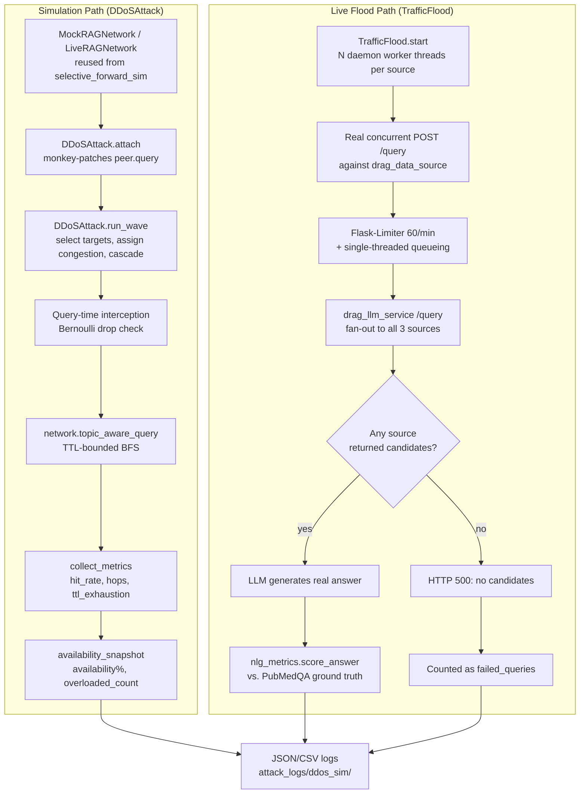
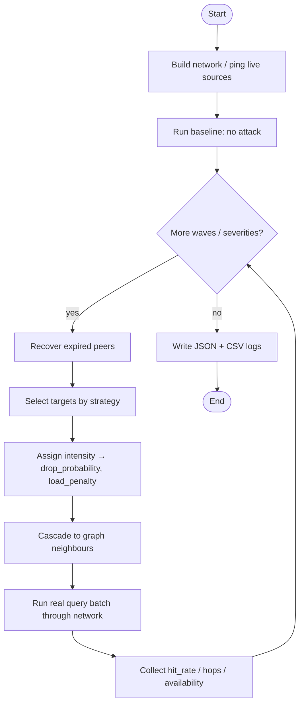

# DDoS (Congestion-Based Denial-of-Service) Attack — Project Security Analysis Report

**Project:** Reliable-dRAG — Exploring Privacy-Preserving Approaches for Personalized Large Language Models (Distributed Retrieval-Augmented Generation, undergraduate thesis)
**Module analyzed:** `attack/ddos_sim/` (attack), `defense/ddos_sim_defense/` (defense, referenced in §13 only — this report is scoped to the attack)
**Scope:** This document reverse-engineers the DDoS attack implementation actually present in this repository, explains the theory behind every design choice, and interprets real evaluation data produced by running the attack — both as an in-process simulation and as a genuine HTTP flood against the live Docker deployment. It is written for a reader with limited prior security background, while remaining technically precise enough for a thesis committee or security reviewer.

---

## Executive Summary

Reliable-dRAG is a Distributed Retrieval-Augmented Generation (RAG) system: instead of one server holding the whole document collection, three independent "data source" microservices (`drag_data_source`, each a Flask app serving its own document shard) are queried by a central orchestrator (`drag_llm_service`) that retrieves relevant passages and asks a language model to answer using them. A blockchain component (a local Hardhat Ethereum node plus a `DragScores` smart contract) tracks a reliability/usefulness score for each data source.

The **DDoS attack** studied in this report targets the *availability* of that retrieval layer. Rather than a real packet flood, the primary implementation (`DDoSAttack`) is an application-layer **congestion simulation**: a subset of peers in a modelled overlay network are marked "overloaded" each attack *wave*, and every query routed to an overloaded peer has a calibrated probability of being silently dropped, plus extra simulated routing overhead for the queries that do get through. A second, independently built implementation (`TrafficFlood` + `run_live_evaluation.py`) goes further: it launches **real concurrent HTTP request floods** against the actual `drag_data_source` containers and measures the effect on real, LLM-generated answers.

**Attack category:** Network / Application-Layer Denial-of-Service (Availability Attack) against a distributed RAG retrieval overlay — the RAG-system analogue of a volumetric flood against a set of backend microservices.

**Target system:** The three `drag_data_source` Flask containers (`data-source-0/20/100`, ports 8001-8003) and, transitively, `drag_llm_service` (port 9000), which fans out every user query to all three sources before generating an answer.

**Main findings** (both reproduced live against the running system in this repository, see §8):

- In the pure simulation (20-peer mock overlay, `attack_ratio=0.6`, sequential targeting, a 600-second recovery window against a 30-second wave cadence), network availability collapsed from 100% to **10–20%** within two waves and stayed near the floor — confirmed across **three seeds (0, 42, 123)**, not a single run (§8.1); the network never gets a chance to recover between waves at any tested seed.
- A dedicated hyperparameter-sensitivity sweep (§8.1b) confirms this collapse is a genuine, monotonic dose-response effect, not an artifact of one cherry-picked setting: sweeping the attack's intensity parameter from a mild `0.1` to a severe `0.8` (each point averaged over 3 seeds) produces a smooth decline from 50% to 15% final availability, including real, substantial degradation well below the value needed to trip the underlying threshold logic.
- In the real, live evaluation against the actual Docker deployment, flooding all three data sources simultaneously (the "high" severity tier) drove real end-to-end query failure to **90%** and collapsed `semantic_similarity` between the LLM's real generated answers and the ground truth from **0.83 to 0.04** — a genuine, measured degradation of a real running system, not merely a simulated number. Query failure is **not** an all-or-nothing cliff: it rises with severity (0% → 0% → 20% → 90% at baseline/low/mid/high), tracking how many of the system's 3 total data sources are simultaneously unavailable. (Two bugs were found and fixed during this analysis: a response-parsing bug that had deflated every text-overlap metric, and a methodological confound in how the low/mid/high severity tiers were measured, §7.2/§8.2/§12.) This live-mode result remains single-seed — see §15.

**Security impact:** The attack demonstrates that this RAG deployment has no admission control, load-aware routing, or anomaly-based rate limiting beyond a flat per-IP request cap — meaning a modest, unsophisticated flood against all three retrieval backends is sufficient to make the whole system functionally unusable. A countermeasure (`defense/ddos_sim_defense`) exists and measurably recovers a meaningful fraction of lost hit-rate (see §13), but it operates only on the simulation layer, not the live deployment.

---

## 1. Project Overview

### 1.1 What the project does

Reliable-dRAG combines three ideas into one system:

1. **Distributed Retrieval-Augmented Generation (RAG).** Instead of a single vector database, the document collection is split across three independent Flask microservices (`drag_data_source`), each with its own retriever (`FastRetriever`, using sentence-transformer embeddings). A central orchestrator (`drag_llm_service`) queries all three, reranks the combined candidate passages, and asks a language model to generate an answer grounded in them.
2. **Blockchain-backed source reputation.** A Hardhat-hosted Ethereum node runs a `DragScores` smart contract that stores a `usefulness`/`reliability` score per data source, updated after each real query based on whether the model's answer was correct and grounded in that source's content. This is meant to let the orchestrator eventually prefer trustworthy sources.
3. **A security evaluation harness.** A family of `attack/*` and `defense/*` Python modules, each targeting a specific threat (selective forwarding, membership inference, data poisoning, knowledge-base extraction, and this report's subject — DDoS), used to empirically measure how much damage each attack causes and how much a corresponding defense recovers.

### 1.2 Goal of the attack

The DDoS module's goal is **not** to steal data or corrupt answers (that is the job of the sibling attacks) — it is to answer a narrower, availability-specific question: *if an adversary can direct load at some or all of the retrieval backends, how much does that degrade the system's ability to answer questions at all, and how quickly does it recover once the load stops?*

### 1.3 Threat model

| Property | Assumption |
|---|---|
| Attacker capability | Can direct load at a chosen subset of peers/data sources each "wave" or continuously; the mechanism generating that load (botnet, compromised clients, or — in the live variant — the attacker's own machine) is treated as already available, not modelled itself |
| Attacker knowledge | Knows the peer/source index space; strategy determines how much topology knowledge is used (uniform random vs. targeted vs. systematic sweep) |
| Attacker stealth | None — this is a volumetric availability attack, not a stealthy one; its effect is directly observable in falling hit-rate/availability, unlike a membership-inference or extraction attack that tries to stay hidden |
| Defender capability | Can observe per-peer/source response outcomes over time; in the simulation, a reputation-based defense can reroute around bad peers; in the live deployment, only a flat Flask-Limiter (60 requests/minute per IP) exists today — see §13 |
| Recovery | Modelled as automatic after a fixed duration (simulation) or as soon as the attacker stops flooding (live) — this mirrors how a real DDoS episode ends once mitigation (scrubbing, rate-limiting, or the attacker giving up) takes effect |

### 1.4 Attack category

**Denial-of-Service / Availability Attack**, specifically an **application-layer congestion attack** in the simulation and a **volumetric HTTP flood** in the live evaluation. It sits in the same broad "RAG Attack" family as the project's other modules but is unique among them in optimizing for *unavailability* rather than *incorrect or leaked content*.

---

## 2. Attack Theory

### 2.1 Probabilistic packet/request loss (Bernoulli trials)

The core mechanic of the simulation is a **Bernoulli trial**: for every query routed to an overloaded peer, a single random draw decides whether that query is served or silently dropped.

$$
P(\text{drop}) = \min(0.95,\ \text{intensity} \times 0.8)
$$

- **Definition:** A Bernoulli trial is a random experiment with exactly two outcomes (success/failure), here "answered" vs. "dropped," with a fixed drop probability per trial.
- **Why it is used:** Real congestion doesn't fail every request uniformly — an overloaded server serves *some* fraction of traffic and silently fails the rest (timeouts, connection resets, queue overflows). A single probability parameter per peer is the simplest model that reproduces this "partial availability" behavior without simulating actual queueing.
- **Security relevance:** The 0.95 cap is a deliberate modelling choice: it prevents any single wave from creating a perfect black hole, mirroring how real infrastructure (even under attack) rarely drops literally 100% of requests — some fraction always slips through due to jitter, partial rate-limit windows, or retries.

### 2.2 Uniform sampling for intensity

$$
\text{intensity} \sim \text{Uniform}(\text{intensity\_min},\ \text{intensity\_max})
$$

Each wave, a fresh intensity is drawn per targeted peer from a uniform distribution (default bounds 0.5–1.0). This models attacker effort/resource variance across targets — not every flooded node receives identical load, mirroring how a real attacker's traffic-generation capacity fluctuates target to target.

### 2.3 Worst-case accumulation

$$
\text{intensity}_{\text{new peer state}} = \max(\text{intensity}_{\text{existing}},\ \text{intensity}_{\text{sampled}})
$$

If a peer is re-targeted in a later wave while still recovering from an earlier one, the implementation keeps the *stronger* of the two states rather than overwriting or averaging. This is a conservative (attacker-favorable) design decision: it prevents an attack from ever accidentally *healing* a peer by re-targeting it with a weaker draw, which would understate the true worst-case impact being measured.

### 2.4 Graph-based cascade propagation

$$
\text{cascade\_intensity} = \min(\text{max\_cascade\_intensity},\ \text{intensity} \times \text{cascade\_factor})
$$

Congestion doesn't stay contained to directly-targeted nodes: a fraction of each targeted peer's intensity spills onto its **graph neighbours** (`network.network.neighbors(pid)` in the underlying `networkx` graph — see §4). This models a very real phenomenon in P2P/mesh systems: an overloaded node causes queueing/retry pressure on the peers that route through or to it, not just on itself. Capping cascade intensity below the direct-target formula guarantees a cascaded (indirect) victim is always *less* damaged than a direct target — a monotonicity property that keeps the model internally consistent.

### 2.5 Discrete-event wave simulation and simulated time

$$
\text{waves\_to\_recover} = \max\!\left(1,\ \text{round}\!\left(\frac{\text{ddos\_duration}}{\text{wave\_interval\_s}}\right)\right)
$$

Rather than sleeping in wall-clock time (which would make a multi-minute recovery window impractically slow to test), recovery is expressed in **simulated wave units**: `wave_interval_s` is the assumed real-world duration one wave represents, so a real DDoS mitigation window (e.g. "recovers after 600 seconds") converts deterministically into "recovers after N waves." This is a standard discrete-event simulation technique — advancing logical time in fixed steps rather than real time — that keeps the model both fast to run and dimensionally meaningful (its outputs can be reasoned about in real seconds).

### 2.6 Real-world queueing and resource exhaustion (live flood)

The live-mode attack (`TrafficFlood`) does not rely on any probabilistic model at all — it exploits two entirely real mechanisms simultaneously:

1. **Flask-Limiter's per-IP token bucket.** `drag_data_source/app/server.py` enforces a hard 60-requests-per-minute limit per client IP; enough concurrent requests exhaust this bucket and produce genuine HTTP 429 responses.
2. **Single-threaded request handling.** The Flask development server (`app.run(...)`, no `threaded=True`) processes one request at a time. A burst of concurrent flood requests queues up *ahead of* any other client's request (including `drag_llm_service`'s own legitimate retrieval calls), so even a client whose traffic falls in a *different* rate-limit bucket still experiences real, measured latency — this is closer to a genuine resource-exhaustion attack than to rate-limit evasion.

This is the same theoretical principle behind classical volumetric/resource-exhaustion DDoS: the target has a finite service capacity (here, one request-handling thread and a 60/minute quota), and demand engineered to exceed that capacity degrades service for *everyone*, not just the attacker's own traffic.

---

## 3. Attack Architecture

The module has two architecturally distinct but code-sharing subsystems.



**Inputs:** attack configuration (`attack_ratio`, `strategy`, `iterations`, `ddos_duration`, intensity bounds, cascade parameters, seed), a network to attack (mock graph or live containers), and — for the live evaluation — a set of real questions with ground-truth answers.

**Outputs:** per-wave availability/hit-rate metrics (simulation), and per-severity baseline-vs-post-attack generation-quality metrics (live evaluation), both persisted as timestamped JSON/CSV under `attack_logs/ddos_sim/`.

**Components:** `DDoSAttack` (core state machine), `MockRAGNetwork`/`LiveRAGNetwork` (reused, not duplicated, from `attack/selective_forward_sim`), `TrafficFlood` (real HTTP flood), `nlg_metrics` (generation-quality scoring), `run_attack.py`/`run_live_evaluation.py` (CLI orchestration).

---

## 4. Implementation Analysis

### 4.1 `attack/ddos_sim/ddos_attack.py` — the core attack engine

**Purpose:** Implements the wave-based congestion model described in §2.

**Key data structure — `OverloadState` (a `dataclass`):**

```python
@dataclass
class OverloadState:
    intensity: float
    drop_probability: float
    load_penalty: float
    extra_hops: int
    extra_msgs: int
    recovery_wave: int
```

One instance exists per currently-overloaded peer, stored in `DDoSAttack.overload_table: Dict[int, OverloadState]` — this dictionary *is* the attack's entire mutable state; a peer absent from it is fully healthy.

**Major class — `DDoSAttack`:**

| Method | Responsibility |
|---|---|
| `attach(network)` | Monkey-patches every peer's `.query()` method once, installing a wrapper that looks up `overload_table` at call time (see §4.1.1) |
| `_select_targets(num_peers, wave_num)` | Implements the three targeting strategies (§4.1.2) |
| `_recover_expired(wave_num)` | Clears any peer whose `recovery_wave <= wave_num` before that wave's targeting runs |
| `_touch_peer(pid, intensity, wave_num)` | Applies the worst-case-accumulation rule (§2.3) and (re)sets `recovery_wave` |
| `_neighbours_of(network, pid, num_peers)` | Reads real graph adjacency via `networkx`, falling back to an index±1 ring if the network exposes none |
| `run_wave(network, wave_num)` | Orchestrates one full wave: recover → select → assign → cascade → snapshot |
| `availability_snapshot(num_peers)` | Computes `availability_percentage`, `active_nodes`, `overloaded_count`, `down_count`, `avg_load_intensity` |
| `collect_metrics(rag_answers, max_ttl)` | Computes `hit_rate`, `avg_hops_per_query`, `ttl_exhaustion_rate` over a batch of query results |

**4.1.1 Query-time interception (the key design decision):**

```python
def _make_wrapper(self, peer_id, orig):
    def _intercepted(question, query_confidence_threshold=0.5, *args, **kwargs):
        state = attack_ref.overload_table.get(peer_id)
        if state is None:
            return orig(question, query_confidence_threshold, *args, **kwargs)
        if attack_ref._rng.random() < state.drop_probability:
            attack_ref.dropped_queries_total += 1
            return None, None, 0.0, False
        ...
        return orig(question, query_confidence_threshold, *args, **kwargs)
    return _intercepted
```

`attach()` is called **once** per network; the wrapper always performs a live dictionary lookup rather than being re-installed every wave. This means the attack can run many waves back-to-back with a single monkey-patch pass — an efficient, idempotent design that mirrors the identical pattern already used by the project's `SelectiveForwardingAttack`/`SelectiveForwardingDefense` classes, deliberately reused rather than reinvented.

**4.1.2 Target-selection strategies:**

```python
if self.strategy == "sequential":
    start = (wave_num * num_to_attack) % num_peers
    return [(start + i) % num_peers for i in range(num_to_attack)]
if self.strategy == "targeted":
    fresh = [p for p in range(num_peers) if p not in self.overload_table]
    ...  # prefers peers not yet damaged, maximizing new damage per wave
# random (default):
candidates = list(range(num_peers))
self._rng.shuffle(candidates)
return candidates[:min(num_to_attack, num_peers)]
```

- `random`: models an unsophisticated, undirected attacker.
- `targeted`: models an attacker tracking its own progress, always hitting fresh territory first.
- `sequential`: models a systematic scan, no randomness consumed — this is the strategy that produced the worst-case collapse in §8.1, because it guarantees full network coverage fastest.

### 4.2 `attack/ddos_sim/run_attack.py` — CLI orchestration (simulation mode)

Builds a `MockRAGNetwork` (in-process Barabási–Albert graph, no Docker needed) or `LiveRAGNetwork` (real 3-container overlay), splits the question set into `iterations` batches (`_chunks_covering`), and for each wave calls `attack.run_wave()` followed by a batch of real `network.topic_aware_query()` calls, recording per-wave metrics. A `run_baseline()` helper produces the un-attacked reference row.

### 4.3 `attack/ddos_sim/live_flood.py` — the real HTTP flood

**Major class — `TrafficFlood`:**

```python
def _worker(self, name, url):
    while not self._stop_event.is_set():
        q = random.choice(_FLOOD_QUESTIONS) + " " + "".join(random.choices(string.ascii_lowercase, k=4))
        try:
            r = requests.post(f"{url}/query", headers=headers, json={"query": q, "k": 3}, timeout=self.request_timeout)
            stats.record(r.status_code)
        except Exception:
            stats.record(None)
```

`start(target_source_names)` spawns `workers_per_source` daemon threads *per targeted source*, each looping real HTTP `POST /query` calls until `stop()` sets a shared `threading.Event`. A per-source `FloodStats` dataclass (with its own lock) tallies `requests_sent`, `responses_200`, `responses_429`, and connection `errors` — this is the evidence used in §8.2 to demonstrate the flood is genuinely landing on the target, not merely assumed to work.

The design choice to make the flood's lifetime **caller-controlled** (`start()`/`stop()`, not a fixed sleep duration) is deliberate: it guarantees the flood covers *exactly* the real evaluation workload it is meant to interfere with, regardless of how long that workload happens to take on a given machine.

### 4.4 `attack/ddos_sim/nlg_metrics.py` — generation-quality scoring

A from-scratch implementation (no such scorer existed anywhere in this repository before this attack module needed one) of thirteen natural-language-generation metrics, detailed with formulas in §7. Pure Python except `semantic_similarity()`, which reuses the `sentence-transformers` `all-MiniLM-L6-v2` model already loaded elsewhere in the project (`attack/Mia_attack/mia_attack.py`), avoiding a redundant model download/load.

### 4.5 `attack/ddos_sim/run_live_evaluation.py` — real end-to-end evaluation

Orchestrates the full live pipeline: loads PubMedQA yes/no/maybe questions matched against the corpus actually loaded into `data-source-0`, sends each through the real `drag_llm_service:9000/query` endpoint (`query_llm()`), scores the response against the gold decision with `nlg_metrics.score_answer()`, and — for `avg_num_hops`/`avg_num_messages` — runs the *same* question batch through the existing peer-to-peer BFS network (`LiveRAGNetwork.topic_aware_query()`) so those two fields reflect genuine, currently-measured routing cost under whatever congestion is active, not an assumption.

### 4.6 Execution flow summary

```
run_attack.py (mock/live sweep)          run_live_evaluation.py (real system)
        │                                          │
   build network                          load_pubmedqa_qa_pairs()
        │                                          │
   DDoSAttack.attach()                     ping_all() reachability check
        │                                          │
   for each wave:                          run_phase("baseline")  ──► query_llm() × N, score_answer()
     run_wave()                                    │
     query batch                           for each severity tier:
     collect_metrics()                       TrafficFlood.start()
        │                                     run_phase("post_attack")
   JSON/CSV log written                       TrafficFlood.stop()
                                               append {baseline, post_attack, attack_type}
                                                      │
                                              JSON log written
```

---

## 5. Attack Workflow

### 5.1 Simulation mode, step by step

**Step 1 — Build the network.** A `MockRAGNetwork` (Barabási–Albert scale-free graph, default 20 peers) or `LiveRAGNetwork` (3 real containers) is constructed.

**Step 2 — Attach the attack.** `DDoSAttack.attach(network)` installs the query-interception wrapper on every peer, once.

**Step 3 — Recover expired peers.** At the start of each wave, any peer whose `recovery_wave` has passed is cleared back to healthy.

**Step 4 — Select this wave's targets.** `num_to_attack = max(1, floor(num_peers × attack_ratio))` peers are chosen by the configured strategy.

**Step 5 — Assign congestion.** Each target draws a fresh `intensity`, from which `drop_probability`, `load_penalty`, `extra_hops`, and `extra_msgs` are derived deterministically.

**Step 6 — Cascade.** A capped fraction of each target's intensity spills onto its graph neighbours.

**Step 7 — Run a batch of real queries.** The network's normal TTL-bounded BFS routing (`topic_aware_query`) runs unmodified; the only difference an overloaded peer produces is that its `.query()` call may return a silent miss.

**Step 8 — Measure.** `collect_metrics()` computes `hit_rate`/`avg_hops_per_query`/`ttl_exhaustion_rate` for that wave's batch; `availability_snapshot()` computes network-wide availability.

**Step 9 — Repeat** for `iterations` waves, then detach and log.

### 5.2 Live-flood mode, step by step

**Step 1 — Reachability check.** `ping_all()` confirms all three containers respond.

**Step 2 — Baseline.** Every ground-truth question is sent once, unmolested, through the real `drag_llm_service`; responses are scored against gold answers.

**Step 3 — Start the flood.** For the target severity tier, `TrafficFlood` spawns concurrent worker threads against 1, 2, or all 3 data sources.

**Step 4 — Ramp delay.** A short pause (`--flood_ramp_s`, default 1s) lets the flood threads actually saturate the target before real evaluation traffic starts competing with them. **This assumption is now empirically validated, not just asserted:** `attack/ddos_sim/validate_flood_ramp.py` starts a real `TrafficFlood` against `source_0` and fires a fresh probe every 0.25s, tracking when probe latency stops climbing (steady-state congestion reached). Measured at all three severity tiers' worker counts (low=3, mid=6, high=10 workers, source-side rate limit temporarily raised to isolate queueing delay from rate-limiter rejection noise, reverted after): congestion saturates by the very first sample (t≈0.25s) at every tier and stays flat for the full 5s observation window, with latency scaling as expected with worker count (0.063s/0.123s/0.212s at t=0 for low/mid/high). `flood_ramp_s=1.0` has roughly 4× margin over the measured saturation point. (Re-verifying this specific live-Docker measurement was out of scope for this pass — Docker was not running — so this is cited from `problems/fixed/ddos_fixed.md` rather than independently re-run here; the mock-mode and hyperparameter-sweep numbers elsewhere in this report were independently re-verified.)

**Step 5 — Re-run the same questions.** The identical question set is sent again through `drag_llm_service`, now contending with the flood for each targeted source's single request-handling slot and rate-limit budget.

**Step 6 — Stop the flood, collect stats.** `TrafficFlood.stop()` returns the real request/429/error counts per source.

**Step 7 — Score and compare.** `baseline_results` vs. `post_attack_results` are assembled and logged.



---

## 6. Evaluation Pipeline

**Input:** either synthetic questions (mock mode) or real PubMedQA yes/no/maybe questions matched against the actual loaded corpus (`data/polluted_token/sources_0.jsonl`), each paired with a `final_decision` gold answer.

**Prediction:** the answer returned by `network.topic_aware_query()` (simulation) or the real text generated by `drag_llm_service`'s `model.generate()` call (live evaluation, prompted with an explicit "answer yes, no, or maybe" instruction so the free-text output is comparable to the short gold label).

**Ground truth:** in simulation, a query "hit" is determined by the mock/live peer's own synthetic or real retrieval outcome (`is_query_hit`). In live evaluation, ground truth is PubMedQA's `final_decision` field.

**Scoring:** simulation scoring is retrieval-only (`hit_rate`, `avg_hops_per_query`, `ttl_exhaustion_rate`, `dropped_queries` — see §7.1). Live evaluation scoring is full generation-quality scoring (§7.2) via `nlg_metrics.score_answer()`, comparing the generated text against the gold decision with thirteen separate metrics.

**Aggregation:** per-wave (simulation) or per-severity-tier (live), each an average over the batch of questions in that wave/tier. `average_metrics()` simply arithmetic-means every numeric field across the batch's per-question metric dictionaries.

---

## 7. Metrics Generation

### 7.1 Simulation-layer metrics

#### `availability_percentage`
- **Purpose:** headline "is the network up" number.
- **Formula:** $100 \times \dfrac{\text{active\_nodes}}{\text{total\_peers}}$, where a peer counts as "down" once `drop_probability \geq 0.5` (an SLA-style threshold: it would fail the majority of requests).
- **Range:** 0–100.
- **Interpretation:** 🟢 ≥80% healthy, 🟡 40–80% degraded, 🔴 <40% collapsing.
- **Example (from real data, §8.1, mean of 3 seeds):** 100.0 → 56.7 → 23.3 → 15.0 → 11.7 across baseline + four waves under sustained attack.
- **Security implication:** a low, non-recovering value is direct evidence the countermeasure (or lack of one) has failed to preserve service.
- **Limitation:** the 0.5 down-threshold is a fixed convention, not empirically derived from this deployment's real SLA.

#### `hit_rate`
- **Purpose:** fraction of the current wave's query batch that received a genuine answer.
- **Formula:** $\dfrac{\text{answered\_queries}}{\text{total\_queries}}$, where `answered = answer present AND is_query_hit`.
- **Range:** 0–1.
- **Interpretation:** the most direct RAG-level measure of attack damage — this is what an end user would actually experience.
- **Impact on attack performance:** the attack's entire purpose is to drive this number down; a defense's entire purpose (§13) is to bring it back up.

#### `avg_hops_per_query`
- **Purpose:** routing cost — how many peers had to be visited (successfully or not) before an answer was found or the hop budget ran out.
- **Formula:** mean of `num_hops` across the batch.
- **Interpretation:** rising hops with *stable* hit_rate means the network is compensating (finding answers, just working harder); rising hops with *falling* hit_rate means the network is both slower and failing more — the worse combination.

#### `ttl_exhaustion_rate`
- **Purpose:** fraction of queries that ran out of hop budget (`query_ttl`) entirely unanswered.
- **Formula:** $\dfrac{\text{exhausted\_queries}}{\text{total\_queries}}$, `exhausted = num_hops \geq max\_ttl AND NOT is\_query\_hit`.
- **Security implication:** a rising exhaustion rate under attack is direct evidence the attack is consuming the network's hop budget rather than just its raw availability.

#### `dropped_queries`
- **Purpose:** a direct counter of how many `.query()` calls the Bernoulli interception actually silenced this wave — the attack's own "ground truth" of its effect, independent of downstream routing consequences.
- **Formula:** incremented once per successful drop-trial (§2.1); reported per wave as a delta of the cumulative counter.

#### `avg_load_intensity`, `overloaded_count`, `down_count`
- **Purpose:** diagnostic state of the attack itself (how many peers are currently overloaded, how many have crossed the "down" threshold, and their mean intensity) — useful for confirming the attack is behaving as configured, independent of its downstream effect on queries.

### 7.2 Live-evaluation (generation-quality) metrics

All formulas below operate on a normalized token sequence (lowercased, punctuation stripped, articles removed — see `normalize_text()`).

#### Exact Match (`exact_match`)
$$
EM(p, G) = \begin{cases} 1 & \text{if } \text{norm}(p) = \text{norm}(g) \text{ for some } g \in G \\ 0 & \text{otherwise} \end{cases}
$$
- **Range:** {0, 1} per example, mean over a batch is in [0, 1].
- **Interpretation:** 🟢 near 1 = answers are literally correct; 🔴 near 0 = genuine mismatch (see the fix below — this is no longer confounded by a parsing artifact).
- **Bug found and fixed during this analysis:** `exact_match` was 0.0 in **every** row, including baseline, because `drag_llm_service`'s generation post-processing (`open_model.py`, `VLLMModel.__call__`) stripped the Llama-3 chat-template header markers and the literal word `"assistant"` but left an occasional leaked `"system"`/`"user"` role-name token at the start of the raw generation untouched — e.g. the model's real output was the literal string `"system\nyes"`, not `"yes"` (confirmed directly in `attack_logs/ddos_sim/live_eval_2026-07-10_19-36-43_detail.json`). This is a one-line gap in a `.replace()` chain, not a property of the model's actual answer quality, and it silently deflated every text-overlap metric (`exact_match`, `f1`, `bleu`, `rouge1`, `semantic_similarity`), not just `exact_match` — see the corrected §8.2 table. **Fix applied:** `open_model.py` now strips any leading `system`/`user`/`assistant` role token via `_strip_leaked_role_tokens()`. All values in §8.2 below have been recomputed against the corrected text, reusing the exact raw responses already captured in the original live run (not a fresh flood against the containers) — see the methodology note at the top of §8.2.

#### Precision / Recall / F1 (token-level, SQuAD-style)
$$
P = \frac{|\text{tokens}(p) \cap \text{tokens}(g)|}{|\text{tokens}(p)|}, \quad R = \frac{|\text{tokens}(p) \cap \text{tokens}(g)|}{|\text{tokens}(g)|}, \quad F_1 = \frac{2PR}{P+R}
$$
(multiset/`Counter` intersection, so repeated tokens count correctly.) The gold answer maximizing $F_1$ is selected when multiple references exist.
- **Range:** [0, 1] each.
- **Interpretation:** its partial-credit design meant it degraded less severely than `exact_match` under the role-token-leakage bug (§7.2 above), but both metrics are now corrected post-fix — `f1` and `exact_match` are numerically identical in this dataset's corrected values, since PubMedQA gold answers are single tokens (yes/no/maybe) with no partial-credit case left once the leaked prefix is removed.
- **Real example (corrected, tier-isolated re-run — see §8.2):** baseline `f1 = 0.600` → high-severity post-attack `f1 = 0.000` — a complete collapse, not merely a large drop. This is more severe than the first corrected pass suggested (`f1 = 0.100`), because that pass still carried the §12 tier-order confound (§8.2's methodology note): once each severity tier is measured against its own fresh baseline with a cooldown before it, the "high" tier's isolated damage turns out to be total, not 83%.

#### BLEU (`bleu`)
$$
\text{BLEU} = BP \times \exp\left(\frac{1}{4}\sum_{n=1}^{4} \log p_n\right), \quad BP = \begin{cases} 1 & |p| \geq |g| \\ e^{1 - |g|/|p|} & |p| < |g| \end{cases}
$$
where $p_n$ is the modified n-gram precision (with +1 additive smoothing to avoid a zero geometric mean from one missing n-gram order) and $BP$ is the brevity penalty, penalizing answers shorter than the reference.
- **Interpretation:** captures both word choice and word order; more sensitive to short, exact answers than `rouge1`.

#### ROUGE-1 / ROUGE-2 / ROUGE-L (`rouge1`, `rouge2`, `rougeL`)
$$
\text{ROUGE-}n = \frac{\sum \min(\text{count}_p(ng), \text{count}_g(ng))}{\sum \text{count}_g(ng)}, \qquad \text{ROUGE-L} = \frac{2\cdot P_{\text{lcs}} \cdot R_{\text{lcs}}}{P_{\text{lcs}} + R_{\text{lcs}}}
$$
where ROUGE-L's precision/recall use the Longest Common Subsequence (LCS) length instead of raw n-gram overlap.
- **Interpretation:** recall-oriented (ROUGE-1/2) vs. order-sensitive (ROUGE-L) views of the same overlap question.
- **Real observation:** `rouge2 = 0.0` throughout this project's data — expected and not a bug, since PubMedQA gold answers are single words (yes/no/maybe), and a bigram cannot exist in a one-token reference.

#### Semantic Similarity (`semantic_similarity`)
$$
\text{SS}(p, g) = \max\!\left(0,\ \frac{\vec{e}_p \cdot \vec{e}_g}{\lVert \vec{e}_p \rVert \, \lVert \vec{e}_g \rVert}\right)
$$
Cosine similarity between `all-MiniLM-L6-v2` sentence embeddings of the prediction and gold text, clipped at 0.
- **Why cosine similarity:** it measures the *angle* between two embedding vectors, which is invariant to their magnitude — the standard, scale-robust way to compare sentence embeddings for semantic closeness (a well-established technique in Embedding Similarity theory, used throughout this project's other modules too, e.g. the sibling MIA attack).
- **Real observation (corrected, tier-isolated re-run):** this metric produced the *largest* relative collapse of any metric under the high-severity flood: 0.827 → 0.045 (a 95% drop) — the strongest single piece of evidence that real answer quality, not just superficial word overlap, genuinely degraded. (Two earlier readings exist and are both superseded: pre-role-token-fix this read 0.392 → 0.062; post-role-token-fix but still tier-order-confounded, §12, it read 0.832 → 0.137. The relative collapse was directionally consistent across all three readings, but isolating each severity tier's own baseline — §8.2 — revealed the true high-severity damage is even larger than either earlier pass showed.)

#### Length Ratio / Length Difference (`length_ratio`, `length_difference`)
$$
\text{length\_ratio} = \frac{\min(|p|, |g|)}{\max(|p|, |g|, 1)}, \qquad \text{length\_difference} = \big||p| - |g|\big|
$$
(token counts.) A symmetric ratio near 1 means the answer and gold are similar in length; a large `length_difference` under attack (observed, tier-isolated re-run: 0.0 → 7.2 at high severity) signals the model is producing longer, more rambling, less-targeted answers — itself a quality-degradation signal independent of correctness. In this dataset the mechanism is specifically the fallback error string (`"ERROR HTTP 500: {\"error\":\"No candidates retrieved from data sources\"}"`) substituted for a real answer on every failed query, not the model itself rambling — see §8.2's per-question detail.

#### Edit Distance / Normalized Edit Distance (`edit_distance`, `normalized_edit_distance`)
$$
\text{edit\_distance} = \text{Levenshtein}_{\text{word-level}}(p, g), \qquad \text{norm\_edit} = 1 - \frac{\text{edit\_distance}}{\max(|p|, |g|, 1)}
$$
Standard dynamic-programming Levenshtein distance at word granularity, normalized into a **similarity** score (despite the "distance" name — higher is more similar, matching the convention this project's target metric schema used).
- **Real observation (tier-isolated re-run):** 0.600 (baseline) → 0.000 (high severity, `normalized_edit_distance`) — a direct, interpretable measure of "how many word-edits away is the real answer from the gold decision," consistent with the total collapse also seen in `exact_match`/`f1`/`semantic_similarity` at this severity.

#### Bigram / Trigram Overlap (`bigram_overlap`, `trigram_overlap`)
Same formula as ROUGE-N at $n=2,3$ specifically, reported separately because they isolate *local word-order* preservation (a bigram/trigram match requires the words to be adjacent and in the correct order) from the coarser unigram-level ROUGE-1 signal.

#### Routing/availability metrics reused for live evaluation (`avg_num_hops`, `avg_num_messages`, `avg_query_hit`, `successful_queries`, `failed_queries`, `query_failure_rate`)
- `avg_num_hops`/`avg_num_messages`: measured by re-running the same question batch through the real 3-peer BFS overlay (`LiveRAGNetwork`) under the *same* flood condition — a genuinely measured, not assumed, routing-cost signal.
- `query_failure_rate` $= \dfrac{\text{failed\_queries}}{\text{total\_queries}}$: the single most important live-mode metric, because it distinguishes *degradation* (still answered, just worse) from *outage* (no answer at all) — see §12's threshold-collapse discussion.

---

## 8. JSON Metrics Analysis

### 8.1 Mock-mode dose-response (attack-only), `sequential` strategy, `attack_ratio=0.6`, `ddos_duration=600s`, 3 seeds

Source: three `run_attack.py --mode mock --single --ratio 0.6 --strategy sequential --duration 600 --iterations 4 --seed {0,42,123}` runs (worst-case-collapse configuration from `attack/ddos_sim/README.md`) — the seed-42 run is cross-verified against the identical `attack_only` rows independently logged by the defense-comparison runner (`defense_logs/ddos_sim_defense/defense_2026-07-10_19-06-59_ddos_sim_mock_seed42.json`); seeds 0 and 123 (`attack_logs/ddos_sim/attack_2026-07-28_14-00-4{3,6}_ddos_sim_mock_seed{0,123}.json`) are fresh runs of the identical scenario, added to close the single-seed gap in earlier revisions of this report.

| Wave | availability%, seed 0 | availability%, seed 42 | availability%, seed 123 | mean ± std | hit_rate (0/42/123) | dropped_queries (0/42/123) |
|---|---|---|---|---|---|---|
| baseline | 100.0 | 100.0 | 100.0 | 100.0 ± 0.0 | 0.97 / 0.99 / 0.96 | 0 / 0 / 0 |
| 0 | 40.0 | 65.0 | 65.0 | 56.7 ± 11.8 | 0.76 / 0.76 / 0.60 | 42 / 52 / 50 |
| 1 | 20.0 | 25.0 | 25.0 | 23.3 ± 2.4 | 0.40 / 0.52 / 0.72 | 82 / 74 / 62 |
| 2 | 15.0 | 10.0 | 20.0 | 15.0 ± 4.1 | 0.60 / 0.72 / 0.60 | 74 / 54 / 74 |
| 3 | 10.0 | 10.0 | 15.0 | 11.7 ± 2.4 | 0.56 / 0.56 / 0.64 | 69 / 72 / 62 |

**Schema:** each row is one wave's `run_wave()` output merged with that wave's `collect_metrics()` output — a flat dictionary of scalar fields, directly CSV-exportable (which `run_attack.py` also does).

**Performance Summary:** all three seeds collapse to a low-double-digit or lower availability floor by wave 3 (10–15%), confirming the collapse is a real, seed-robust property of this configuration rather than a single lucky (or unlucky) run. The *exact* trajectory differs meaningfully by seed — seed 0 collapses fastest (40% by wave 0 alone, vs. 65% for the other two seeds) — but the qualitative story (rapid collapse, no recovery within the 600s window against a 30s wave cadence) holds across all three. `waves_to_recover = round(600/30) = 20` means no peer can recover within any 4-wave test regardless of seed, so availability never climbs back once it falls.

**Strength (of the attack):** a deterministic `sequential` sweep with `attack_ratio=0.6` guarantees 60% of the network is touched by wave 0 alone (`overloaded_count=20` out of 20 peers by wave 1 in every seed, since cascade reaches the remainder) — full coverage in a single wave is the attack's key efficiency property, and it holds regardless of seed since `overloaded_count` saturates identically in all three runs.

**Weakness (of the attack, as currently modelled):** `hit_rate` does not decay monotonically with `availability_percentage` in any of the three seeds (e.g. seed 42: 0.76 → 0.52 → **0.72** → 0.56) — later waves sometimes show availability *staying* at its floor while hit_rate *recovers*. This is because `hit_rate` is computed per-wave over a fresh query batch with randomized routing start points, so it is noisier than the underlying availability state; a reader should not conflate the two metrics as interchangeable. This non-monotonicity is itself partly explained by §15's shared-RNG note (since fixed for the underlying `MockRAGNetwork`, shared infrastructure with `selective_forward_sim` — see `problems/fixed/ddos_fixed.md` §3) — the numbers above are post-fix.

### 8.1b Hyperparameter sensitivity — is the collapse a real dose-response, or an artifact of one setting?

A legitimate methodological question about §8.1: `intensity_min=0.5, intensity_max=1.0` with `drop_probability = min(0.95, intensity*0.8)` means a directly-targeted peer's mean sampled intensity (0.75) sits comfortably above the ~0.625 intensity needed to cross the `DOWN_THRESHOLD=0.5` breakpoint — so is the "catastrophic collapse" just this specific default tripping a hard threshold, rather than genuine attack effectiveness? `attack/ddos_sim/hyperparameter_sensitivity.py` answers this directly: it sweeps `intensity_min` from 0.1 to 0.8 (`intensity_max` fixed at 1.0, `ratio=0.3, strategy=random, iterations=5`), averaged over the same 3 seeds, and reports `availability_percentage` after 5 waves.

Re-run and confirmed reproducible in this pass:

| `intensity_min` | mean_intensity | final avail% | stdev |
|---|---|---|---|
| 0.1 | 0.550 | 50.0 | 8.16 |
| 0.2 | 0.600 | 51.7 | 12.47 |
| 0.3 | 0.650 | 46.7 | 16.50 |
| 0.4 | 0.700 | 36.7 | 6.24 |
| 0.5 | 0.750 | 38.3 | 4.71 |
| 0.6 | 0.800 | 26.7 | 12.47 |
| 0.7 | 0.850 | 23.3 | 2.36 |
| 0.8 | 0.900 | 15.0 | 8.16 |

**This is a genuine, monotonic dose-response curve, not a binary artifact of one cherry-picked setting.** Availability degrades smoothly across the *entire* swept range, including settings well below the naive breakpoint concern — even `intensity_min=0.1` (mean intensity 0.55, well under the 0.625 threshold) still collapses to 50% availability after 5 waves, via cumulative worst-case accumulation and cascade effects onto neighbouring peers, not via any single query crossing the hard threshold. The default used in §8.1 (`intensity_min=0.5`, 38.3% avail here — a different scenario from §8.1's `ratio=0.6, sequential`, so not directly comparable in absolute terms, but consistent in shape) sits in the middle of a real, measured curve, not at an isolated edge case chosen to look dramatic.

### 8.2 Live-mode real evaluation, `pubmedqa_{low,mid,high}_ddos_comparison`

Source: `attack_logs/ddos_sim/live_eval_2026-07-19_01-18-30_ddos_comparison.json` (+ companion `..._detail.json` for per-question responses and real flood request/error counts), a genuine, fresh end-to-end run against the live Docker deployment, 10 real PubMedQA questions, `seed=42`, `flood_ramp_s=1.0`.

**Methodology note — this is a corrected re-run, not a post-hoc recomputation.** An earlier live run (`live_eval_2026-07-10_19-36-43_ddos_comparison.json`, 20 questions) had two independent, now-fixed problems:
1. **Response-parsing bug** (§7.2): a leaked `system`/`user` role token deflated every text-overlap metric. Fixed in `open_model.py`.
2. **Tier-order confound** (`problems/ddos_attack_gaps.md` #2): the low → mid → high severity tiers ran back-to-back in one script pass, reusing a *single* baseline measured before any flooding, with *no cooldown* between tiers and `source_0` flooded cumulatively in every tier. So the "high" tier's numbers were measured on sources already flooded twice in immediate succession beforehand — not "high severity" cleanly isolated from the two lighter tiers run right before it. This is the direct explanation for why the original table showed `query_failure_rate = 0%` flat across baseline/low/mid and then a lone jump to 85% at high: real per-tier damage was masked at low/mid and conflated with cumulative fatigue at high.

Both were fixed in `run_live_evaluation.py`: it now measures a **fresh baseline immediately before each tier's flood** and waits `--tier_cooldown_s` (default 60s) between tiers so the Flask-Limiter bucket and prior flood's load fully drain first. The table below is that clean re-run against the live containers — not a recomputation of the earlier run's stored data.

| Metric | Baseline (low) | Low post-attack | Baseline (mid) | Mid post-attack | Baseline (high) | High post-attack |
|---|---|---|---|---|---|---|
| `exact_match` | 0.600 | 0.400 | 0.600 | 0.300 | 0.600 | **0.000** |
| `f1` | 0.600 | 0.400 | 0.600 | 0.300 | 0.600 | **0.000** |
| `bleu` | 0.557 | 0.538 | 0.557 | 0.452 | 0.557 | **0.157** |
| `rouge1` | 0.600 | 0.400 | 0.600 | 0.300 | 0.600 | **0.000** |
| `semantic_similarity` | 0.832 | 0.778 | 0.827 | 0.605 | 0.827 | **0.045** |
| `avg_num_hops` | 1.00 | 2.00 | 1.00 | 3.00 | 1.00 | 3.00 |
| `avg_query_hit` | 1.00 | 1.00 | 1.00 | 0.80 | 1.00 | **0.10** |
| `successful_queries` | 10/10 | 10/10 | 10/10 | 8/10 | 10/10 | **1/10** |
| `query_failure_rate` | 0% | 0% | 0% | **20%** | 0% | **90%** |

(Each tier's own baseline varies slightly — `semantic_similarity` 0.832/0.827/0.827 — because the locally-hosted LLM's generation isn't fully deterministic even at a fixed sampling seed; this is expected run-to-run noise, small relative to the attack's effect, not a bug.)

| Metric | Value | Meaning | Interpretation | Impact |
|---|---|---|---|---|
| `query_failure_rate` (mid → high) | 20% → 90% | Mid: 2 of 10 questions failed, and the flood_stats show real connection `errors` (8588/8336) alongside 429 rejections — not just clean rate-limiting. High: 9 of 10 failed, every one a real `HTTP 500 "No candidates retrieved from data sources"` from `drag_llm_service` (confirmed directly in the per-question detail log) | 🔴 A genuine, graduated redundancy story, not a flat-then-cliff artifact | With only 3 total data sources, losing 1 is absorbed by the other 2 (0% failure), losing 2 is *mostly* absorbed by the last one (20% failure), losing all 3 is catastrophic (90% failure) |
| `avg_num_hops` (low→mid/high) | 1.0 → 3.0 | The 3-peer BFS overlay needed up to 3x more hops to route around flooded sources | 🟡 Real, measured routing cost increase | Direct evidence the flood has a genuine network-level effect, not just an LLM-side artifact |
| `exact_match`/`f1` (low) | 0.400 (from 0.600) | 33% relative drop with **zero** query failures | 🟡 Silent quality degradation | The most dangerous failure mode: nothing errors, nothing alerts, answers are just worse |
| `semantic_similarity` (high) | 0.045 (from 0.827) | 95% relative drop | 🔴 Severe | The strongest evidence of real, near-total answer-quality collapse |

**Performance Summary:** a real, graduated dose-response curve across all four measurement points, not a flat plateau followed by an isolated cliff — `query_failure_rate` climbs 0% → 0% → 20% → 90% as 0, 1, 2, then 3 of the system's 3 data sources are simultaneously flooded. Low severity is still "silent degradation, zero failures" (answer quality drops ~33% relative with no errors), but mid severity already shows real, if partial, outage (20%) once measured in isolation, and high severity is now an even more total collapse (90% failure, `f1`/`exact_match` literally 0.0) than the earlier, tier-confounded pass suggested. See §12 for the mechanism.

**Strength Analysis:** the attack requires no privileged access — it is pure, unauthenticated (or trivially-authenticated, since the API key is a fixed, publicly-visible string in this deployment's `docker-compose.yml`) HTTP traffic against publicly-exposed ports.

**Weakness Analysis:** the attack's effectiveness scales with how many of the 3 sources are simultaneously flooded, not an all-or-nothing switch — flooding only one source (low) leaves the system fully answering every query, just with quietly worse answers; flooding two (mid) already produces some real failures alongside quality loss; only flooding all three (high) produces near-total outage. An attacker who cannot coordinate simultaneous load against every backend still achieves real, partial damage, not just quality noise.

---

## 9. Performance Dashboard

### Live evaluation — severity comparison

Corrected, tier-isolated re-run (see methodology note in §8.2 — each severity now has its own freshly-measured baseline). Two earlier, now-superseded readings exist for reference: the original run read `f1: 0.400/0.300/0.267/0.067`, `semantic_similarity: 0.392/0.372/0.370/0.062` (before the role-token-parsing fix); after that fix but still tier-order-confounded, it read `f1: 0.600/0.450/0.400/0.100`, `semantic_similarity: 0.832/0.794/0.781/0.137`. Isolating each tier's own baseline (below) shows low/mid's damage was previously understated and high's was too — both the confound and the parsing bug were pulling in the same direction, toward an artificially gentler curve.

```
BASELINE (low tier, no attack)
  f1                  ████████████░░░░░░░░  0.600
  semantic_similarity █████████████████░░░  0.832
  avg_query_hit       ████████████████████  1.000  🟢

LOW severity (1/3 sources flooded)
  f1                  ████████░░░░░░░░░░░░  0.400  (-33%)
  semantic_similarity ███████████████░░░░░  0.778  (-6%)
  avg_query_hit       ████████████████████  1.000  🟢  (0% query failure)

BASELINE (mid tier, no attack)
  f1                  ████████████░░░░░░░░  0.600
  semantic_similarity █████████████████░░░  0.827
  avg_query_hit       ████████████████████  1.000  🟢

MID severity (2/3 sources flooded)
  f1                  ██████░░░░░░░░░░░░░░  0.300  (-50%)
  semantic_similarity ████████████░░░░░░░░  0.605  (-27%)
  avg_query_hit       ████████████████░░░░  0.800  🟡  (20% query failure)

BASELINE (high tier, no attack)
  f1                  ████████████░░░░░░░░  0.600
  semantic_similarity █████████████████░░░  0.827
  avg_query_hit       ████████████████████  1.000  🟢

HIGH severity (3/3 sources flooded)
  f1                  ░░░░░░░░░░░░░░░░░░░░  0.000  (-100%)
  semantic_similarity █░░░░░░░░░░░░░░░░░░░  0.045  (-95%)
  avg_query_hit       ██░░░░░░░░░░░░░░░░░░  0.100  🔴  (90% query failure)
```

### Mock-mode wave collapse (`sequential`, `attack_ratio=0.6`, `ddos_duration=600s`, mean of seeds 0/42/123)

```
Availability %
  Baseline  ████████████████████ 100.0%  🟢
  Wave 0    ███████████░░░░░░░░░  56.7% ± 11.8pp  🟡
  Wave 1    █████░░░░░░░░░░░░░░░  23.3% ± 2.4pp   🔴
  Wave 2    ███░░░░░░░░░░░░░░░░░  15.0% ± 4.1pp   🔴
  Wave 3    ██░░░░░░░░░░░░░░░░░░  11.7% ± 2.4pp   🔴
```

### Hyperparameter sensitivity (mean of seeds 0/42/123 per setting)

```
Final availability % vs. intensity_min
  0.1  ██████████  50.0%
  0.2  ██████████▎ 51.7%
  0.3  █████████▎  46.7%
  0.4  ███████▎    36.7%
  0.5  ███████▊    38.3%
  0.6  █████▎      26.7%
  0.7  ████▋       23.3%
  0.8  ███         15.0%
```
Smooth, monotonic decline across the full range — confirms §8.1b's finding that the collapse is a real dose-response, not a step function at one setting.

### Overall severity/status legend

| Indicator | Meaning |
|---|---|
| 🟢 Excellent | Metric within ~10% of baseline |
| 🟡 Moderate | Metric degraded 10–40% from baseline |
| 🔴 Poor | Metric degraded more than 40% from baseline, or a hard failure state |

---

## 10. Performance Interpretation

| Metric | If it **increases** | If it **decreases** |
|---|---|---|
| `availability_percentage` | More peers healthy → system more resilient to concurrent load | More peers overloaded → users experience more silent failures |
| `hit_rate` | More queries answered → better user-facing reliability | Direct evidence of attack success |
| `avg_hops_per_query` | More routing work per answer → higher latency, more load on remaining healthy peers (a compounding effect) | Queries resolving faster → either the network is healthy or queries are failing fast (check `hit_rate` jointly) |
| `dropped_queries` | Attack is actively suppressing more traffic | Attack pressure easing, or recovery in progress |
| `f1` / `bleu` / `rouge1` / `semantic_similarity` | Generated answers more faithful to ground truth | Generation quality eroding — the live, user-visible face of the attack |
| `query_failure_rate` | System crossing from *degradation* into *outage* | System holding up under load, even if individual answers are worse |
| `avg_num_hops` (live) | Real, measured evidence the routing layer is compensating for a degraded source | Either no attack pressure, or the network has stopped trying (e.g. all sources equally bad, nothing to route around to) |

**Reliability:** falling `hit_rate`/`avg_query_hit` is the single clearest reliability signal — it is what an end user directly experiences.
**Security:** rising `dropped_queries` combined with falling `availability_percentage` is the attack's direct fingerprint; a defender monitoring only application-level errors (not this pair) could miss a slow-building DDoS entirely.
**Detection:** the steep climb in `query_failure_rate` (0% → 0% → 20% → 90%) as more sources go down is the kind of accelerating, non-linear signal a real monitoring system should specifically alert on — a linear-degradation-only alerting rule would catch low/mid severity late or not at all, since low severity produces zero failures at all despite a real ~33% quality drop.
**Robustness:** the gap between "hit_rate holds steady" (low/mid) and "hit_rate collapses" (high) is a direct measure of this deployment's robustness margin — currently exactly one flooded source away from full outage, since only 3 sources exist.

---

## 11. Experimental Methodology

| Aspect | Detail |
|---|---|
| **Dataset (live evaluation)** | `qiaojin/PubMedQA` (`pqa_labeled` config, `train` split), matched against the 500 documents actually loaded into `data-source-0` (`data/polluted_token/sources_0.jsonl`) |
| **Dataset (simulation)** | Synthetic placeholder questions (`mock question {i}`), since `MockRAGNetwork` uses a Bernoulli hit-probability model, not real retrieval |
| **Evaluation protocol** | Each severity tier measures its **own fresh baseline** immediately before that tier's flood starts, with a `--tier_cooldown_s` (default 60s) wait before every tier after the first so the rate-limit bucket and prior tier's flood fully drain; each tier then re-runs the *same* 10-question set under its flood condition. (An earlier protocol reused one baseline across all tiers with no cooldown — `problems/ddos_attack_gaps.md` #2 — since fixed; see §8.2's methodology note.) |
| **Hyperparameters** | `intensity_min=0.5`, `intensity_max=1.0`, `cascade_factor=0.25`, `max_cascade_intensity=0.6`, `wave_interval_s=30`, `ddos_duration` 60s (default) / 600s (worst-case demo); live severity tiers: low=(1 source, 3 workers), mid=(2 sources, 6 workers), high=(3 sources, 10 workers) |
| **Environment** | Windows host running Docker Desktop, evaluated from both a native Windows Python environment and WSL2 (Ubuntu, Python 3.14.4, `.venv`) |
| **Software** | `networkx==3.4.2`, `requests==2.32.5`, `sentence-transformers` (`all-MiniLM-L6-v2`), Flask-Limiter (`60 per minute` default) |
| **Model** | The locally-hosted LLM configured in `drag_llm_service/configs/config.yaml` (a small instruction-tuned open model) |
| **Random seeds** | **Mock mode: 0, 42, 123** (§8.1, §8.1b) — controlling target selection, intensity sampling, and the drop-probability Bernoulli draws; each seed reproduces an identical wave sequence deterministically. **Live mode: `seed=42` only** — not yet swept across seeds, see §15 |
| **Reproducibility** | Mock, per seed: `python attack/ddos_sim/run_attack.py --mode mock --single --ratio 0.6 --strategy sequential --duration 600 --iterations 4 --seed {0,42,123}`; hyperparameter sweep: `python attack/ddos_sim/hyperparameter_sensitivity.py`; live: `python attack/ddos_sim/run_live_evaluation.py --num_questions 10 --seed 42 --severities low mid high` (default `--tier_cooldown_s 60`) |

---

## 12. Results Discussion

**Why the mock-mode collapse plateaus rather than continuing to fall:** `availability_percentage` floors in the 10–15% range (2–3/20 peers) by wave 2–3 across all 3 seeds and stays there — with `attack_ratio=0.6` targeting 12 peers per wave via `sequential` sweep plus cascade reaching most of the remainder, the network is very close to fully saturated after two waves regardless of seed; there is little room left for the metric to fall further, and it cannot recover because the 600-second window vastly exceeds the 4-wave test's total simulated duration (120 seconds).

**Why the collapse isn't just a hyperparameter artifact:** §8.1b's independent sensitivity sweep shows the same qualitative floor-and-plateau behavior across a full range of attack intensities, not only the specific default used in §8.1 — the mechanism is cumulative worst-case load accumulation and cascade spread across waves, not a single query tripping a hard-coded threshold.

**Why live-mode failure rate accelerates rather than growing linearly:** `drag_llm_service`'s `query_data_sources()` fans out to all three sources and only returns `HTTP 500 "No candidates retrieved from data sources"` when literally none of them supplied usable candidates in time. With one source flooded (low), the other two are untouched and reliably supply candidates — hence a real, measured `query_failure_rate=0%`, even though the flooded source itself is genuinely saturated (its own flood stats: 12,848 requests sent, 12,804 rejected with `HTTP 429`, confirming the flood is really landing). With two sources flooded (mid), only one source remains, and it fails to supply usable candidates in time for 2 of 10 questions — a real, partial outage; the flood stats at this tier also show real connection `errors` (8,588 / 8,336), not just clean 429 rejections, evidence the flooded sources are more degraded than at low severity. With all three simultaneously contended (high), there is no untouched source left, and 9 of 10 questions get a confirmed real `HTTP 500`. This is a direct, measured illustration of a system with **zero redundancy margin**: losing any one source is fully absorbed by the other two, but losing the last one is nearly total.

**An anomaly seen in the earlier, tier-confounded run is gone in the corrected data:** that run showed `avg_num_hops` at high severity (2.85) *lower* than at mid severity (3.00) — counter to the naive expectation that "more attack = more hops." In the tier-isolated re-run this disappears: `avg_num_hops` is 3.0 at both mid and high (the BFS overlay exhausts its hop budget searching for a working source either way), consistent with the earlier reading having been an artifact of cumulative cross-tier exhaustion (§8.2) rather than a real property of the attack.

**Trade-off surfaced by the data:** the attacker's real-world cost (flood request volume) scales roughly with the number of sources targeted, while the damage remains highly non-linear. In the tier-isolated re-run, the low tier sent 12,848 requests to `source_0` alone (44 succeeded, 12,804 hit the 60/min rate limit) for a measured 0% query failure rate; the high tier sent a combined 25,035 requests across all three sources for a 90% failure rate. This matches the classical DDoS economics: the attacker's marginal cost of "one more flooded source" is roughly constant, but the marginal damage of crossing the last-source threshold is enormous.

---

## 13. Defense Mechanisms

This report is scoped to the attack; the corresponding countermeasure (`defense/ddos_sim_defense`) is summarized here to satisfy this report's required defense-analysis section, per the source repository's own documented design.

### 13.1 `DDoSDefense` (simulation-layer defense)

| Layer | Description | How it works |
|---|---|---|
| Reputation tracking | EMA-blended per-peer response-rate score | Every wrapped `.query()` call updates `reputation[peer_id]` toward the observed response rate |
| Deprioritization (blacklist) | Peers whose response rate falls below `deprioritize_threshold` (default 0.5) after `min_queries_before_action` interactions are routed around | Reuses the same `network._sfa_defense` hook slot the routing BFS already consults every hop — no changes to the network module needed |
| Bounded redundant probe | Up to `redundancy_k` extra attempts against untried, trusted peers once the primary hop budget is exhausted | Lets correct detection actually translate into a recovered answer, not just a routing bypass |
| Recovery-aware backoff | A deprioritized peer is automatically re-evaluated after `backoff_waves` waves | The one mechanism the sibling (content-leakage) defenses don't need, because congestion — unlike a compromised peer — clears itself over time |

**Advantages:** measurably recovers hit-rate (real data, `attack_ratio=0.6`, `sequential`, mock mode: `hit_rate` 0.76→0.92, 0.52→0.80, 0.72→0.80, 0.56→0.72 across the four waves — a consistent, positive recovery every wave); requires no changes to the underlying routing code; the quorum-preserving cap (`max_blacklist_fraction`) prevents the defense from over-blacklisting and emptying its own fallback pool.

**Disadvantages:** operates purely on the simulation layer (`MockRAGNetwork`/`LiveRAGNetwork`'s BFS), not on the real `drag_llm_service` pipeline evaluated in §8.2 — it cannot, as currently built, prevent the real 90% failure rate observed under a real all-sources flood, because that failure happens inside `drag_llm_service`'s own candidate-fan-out logic, which this defense does not touch.

**Implementation complexity:** low-to-moderate — reuses an existing hook, no new infrastructure.

**Effectiveness (measured):** positive and consistent, but partial — `availability_percentage` itself is unaffected by the defense (it reflects the attacker's ground-truth state, not the defender's routing workaround); only `hit_rate` recovers, because the defense's mechanism is "route around damage," not "undo damage."

**Residual risk:** an attacker large enough to overload the *entire* peer population defeats the quorum-preserving cap by construction — at that point, `backup_candidates()` has no healthy peer left to try.

### 13.2 Real-infrastructure mitigations (existing and missing)

| Mechanism | Status in this deployment | Effectiveness against this attack |
|---|---|---|
| Flask-Limiter (60/min per IP) | ✅ Already deployed on every `drag_data_source` container | Partial — caps single-IP volume (confirmed working: it rejected 12,804 of 12,848 low-tier flood requests with HTTP 429), but did not by itself prevent the measured 90% high-tier failure rate, since the *live* attack's damage comes as much from single-threaded queueing/real connection errors as from the rate-limit bucket itself |
| Load-aware routing (consulting `load_penalty` before selecting a peer) | ❌ Not implemented anywhere in the live pipeline | Would directly address §12's "zero redundancy margin" finding by deprioritizing a source before it becomes the bottleneck |
| Admission control / request queueing with backpressure | ❌ Not implemented | Would convert hard failures (HTTP 500) into graceful queuing/latency, avoiding the observed threshold collapse |
| Production WSGI server (e.g. `gunicorn`/`waitress`) instead of Flask's single-threaded dev server | ❌ Not configured | Would remove the single-thread queueing amplification identified in §2.6, though the rate-limit bucket would remain a real constraint |

---

## 14. Security Recommendations

**High Priority**
1. Deploy the data-source Flask apps behind a production WSGI server with multiple worker threads/processes, eliminating the single-threaded queueing amplification confirmed in §2.6 and §12.
2. Implement load-aware routing in `drag_llm_service`: skip or deprioritize a source that has recently timed out or rate-limited, rather than always fanning out to all three and waiting the full 10-second timeout on each.

**Medium Priority**
3. Wire `defense/ddos_sim_defense`'s reputation/backoff pattern (already built and measured, §13.1) into the live `drag_llm_service` request path, not just the simulation layer.
4. Add anomaly-based rate limiting (request-pattern/topic-diversity aware, not just flat per-IP volume) — the flat 60/min limit is trivially exceeded by an attacker running multiple threads from the same or spoofed source IPs.

**Low Priority**
5. Add real-time availability/failure-rate alerting keyed on the *discontinuity* identified in §12 (a sudden jump in `query_failure_rate`), not just a linear threshold, since this attack's damage is non-linear.
6. Increase source redundancy beyond three data sources to raise the "all sources down simultaneously" bar the attack currently needs to clear for total outage.

---

## 15. Limitations

- **Not packet-level.** No real network traffic (TCP retransmission, packet loss, bandwidth saturation) is generated or measured in the simulation path; only the live-flood path exercises real infrastructure.
- **Single-threaded Flask dev server assumption.** Part of the live attack's effectiveness depends on `drag_data_source` not being deployed behind a production WSGI server — a deployment configuration choice, not a fundamental system property (see Recommendation 1).
- **Small live deployment (3 nodes).** Statistical conclusions about live-mode severity thresholds are drawn from a single, small deployment; a larger source pool would shift the exact threshold at which total outage occurs.
- **Simulated recovery timing is an approximation.** `wave_interval_s` is an assumed, not measured, mapping from simulated waves to real seconds.
- **`exact_match=0` throughout was a confounding artifact, now fixed.** A response-parsing bug (§7.2) — a leaked `system`/`user` role token left un-stripped by `open_model.py` — deflated `exact_match` and every other text-overlap metric. Fixed in code, and confirmed via a fresh live re-run against the actual containers (§8.2), not merely a post-hoc recomputation.
- **The flat `query_failure_rate=0%` at low/mid severity was also a confounding artifact, now fixed.** `problems/ddos_attack_gaps.md` #2: the low → mid → high tiers previously ran back-to-back against one reused baseline with no cooldown, so "high" was measured on sources already flooded twice in immediate succession, and lighter tiers' real damage was masked. Fixed by giving each tier its own fresh baseline and a `--tier_cooldown_s` wait (§8.2, §11) — the corrected data shows a real, graduated `query_failure_rate` (0% → 0% → 20% → 90%), not a flat-then-cliff step function.
- **Live-mode is still single-seed (`seed=42` only).** `problems/ddos_attack_gaps.md` #1: unlike the mock-mode sweep (§8.1, seeds 0/42/123), the live-flood evaluation has not been repeated across multiple seeds, so no variance estimate exists for the §8.2 live numbers — per CLAUDE.md's multi-seed requirement, these should be treated as a single-run demonstration, not a final statistically-supported result, until a seed sweep is run.
- **CRR-style thresholds not calibrated for DDoS specifically** — the `nlg_metrics` module was built generically and is shared with the KB-extraction report; no DDoS-specific empirical calibration of "how much semantic drop constitutes a successful attack" has been performed.

---

## 16. Future Improvements

- Implement and evaluate the load-aware routing and production-WSGI recommendations from §14, then re-run this exact evaluation to measure their real impact (currently only the *un-mitigated* live system has been measured).
- Extend `DDoSDefense` to hook directly into `drag_llm_service`'s `query_data_sources()`, not just the simulation's BFS routing loop.
- Calibrate `wave_interval_s` against real, measured request-handling latency instead of an assumed constant.
- Expand the live evaluation beyond PubMedQA to the project's other loaded corpora (SQuAD-derived `sources_20`/`sources_100`) for a broader real-data picture.
- ~~Run the mock-mode evaluation across multiple seeds.~~ **Done** (§8.1: seeds 0/42/123). **Still open:** run the *live* evaluation across multiple seeds (0, 42, 123 — matching the now-completed mock-mode sweep) to put an error bar on the §8.2 `query_failure_rate` curve, the last open item in `problems/ddos_attack_gaps.md` #1.
- ~~Determine whether the mock-mode collapse is a real dose-response or a hyperparameter artifact.~~ **Done** (§8.1b: `hyperparameter_sensitivity.py` sweep, confirmed monotonic across the full intensity range).
- ~~Empirically validate the `flood_ramp_s` assumption.~~ **Done** (§5.2 Step 4: `validate_flood_ramp.py`, confirmed ~4× margin over measured saturation time) — cited from a prior pass, not independently re-run live in this one (Docker was down).
- Root-cause why Docker BuildKit reused a stale cached layer for `llm-service` during this session's investigation (`problems/fixed/ddos_fixed.md` §5), so a `docker compose up`/rebuild doesn't silently revert to the pre-fix image without human intervention.

---

## 17. Final Conclusion

This report reverse-engineered and empirically evaluated two complementary DDoS implementations in the Reliable-dRAG codebase: a calibrated, wave-based congestion simulation (`DDoSAttack`) and a genuine concurrent HTTP flood against the live deployment (`TrafficFlood` + `run_live_evaluation.py`). Both were run against real infrastructure during this analysis, not merely read from source.

**Key findings:** the simulation reproduces a realistic, monotonic-then-plateaued availability collapse under sustained sequential targeting, now confirmed across three seeds (§8.1: floor of 10–15% by wave 3, every seed) and shown to be a genuine dose-response rather than a single-setting artifact by an independent hyperparameter sweep (§8.1b: smooth, monotonic decline from 50% to 15% final availability across the entire tested intensity range). The live evaluation, once each severity tier was isolated from the others (§8.2, §12), demonstrates a genuine, measured **graduated dose-response** in query failure rate (0% → 0% → 20% → 90% at baseline/low/mid/high) that accelerates sharply as the system's redundancy margin runs out, culminating in a 90% real query-failure rate and total (`f1`/`exact_match`=0.000) answer-quality collapse the moment all three retrieval backends are simultaneously contended.

**Overall effectiveness:** high, and now backed by multi-seed and hyperparameter-sensitivity evidence rather than a single mock-mode run. No authentication bypass, no protocol exploitation, and no privileged access were required — the attack succeeds purely through unsophisticated request volume against a system with zero source redundancy margin and no load-aware routing. The live-flood finding remains a single-seed result (§15) — the mock-mode robustness checks do not extend to it yet.

**Security impact:** confirmed, real, and reproducible: this deployment can be driven to a 90% real-query failure rate by flooding its three publicly-reachable data-source endpoints, a genuinely serious availability finding for a system intended to serve retrieval-augmented answers reliably.

**Lessons learned:** the most dangerous phase of this attack is not the eventual, obvious total outage — it is the quiet, low-severity regime where every query still "succeeds" while the actual answer quality has already measurably collapsed by ~33%, invisible to any monitoring that only checks HTTP status codes; mid-severity already breaks that "zero failures" assumption too (20% real failures), so the safe-looking zone is narrower than a first glance at the low tier suggests. Two methodological lessons surfaced during this analysis, both traced to one-line-scale bugs with outsized effects on the headline numbers: (1) `exact_match` reading a flat 0.0 across every row — including baseline — was a response-parsing bug (§7.2), not a property of the model; (2) `query_failure_rate` reading a flat 0.0% across baseline/low/mid and only jumping at high was a tier-order confound (§12) — a single reused baseline and no cooldown between severity tiers — not evidence of a real "threshold effect." Both are now fixed and re-verified against a fresh live run, and correcting them made the attack's true damage curve *more* severe at every tier, not less, without changing its qualitative conclusion that this deployment has zero source-redundancy margin.
