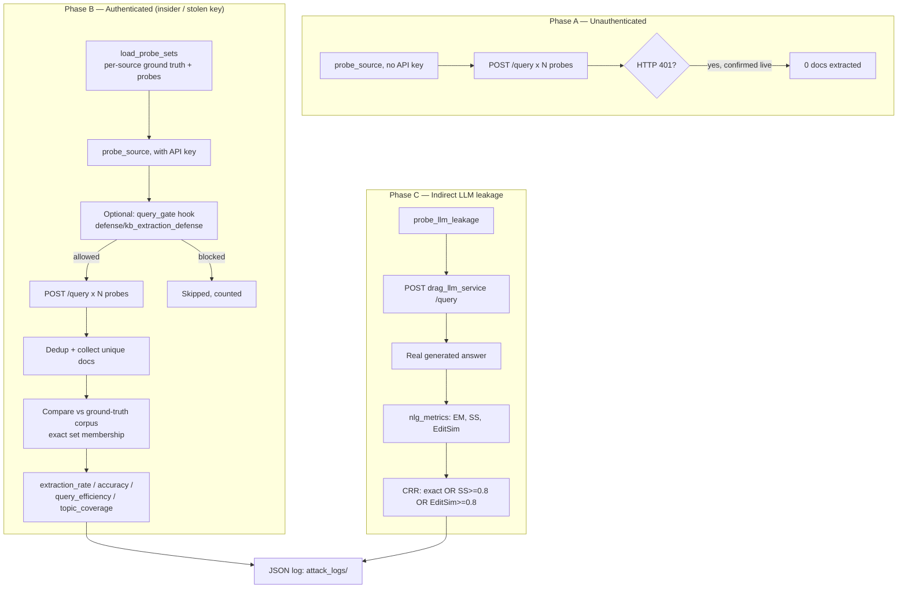

# Knowledge-Base (KB) Extraction Attack & Defense — Project Security Analysis Report

**Project:** Reliable-dRAG — Exploring Privacy-Preserving Approaches for Personalized Large Language Models (Distributed Retrieval-Augmented Generation, undergraduate thesis)
**Modules analyzed:** `attack/kb_extraction/run_attack.py` (attack) and `defense/kb_extraction_defense/` (defense) — this report covers **both**, in full, per the request.
**Scope:** This document reverse-engineers the actual KB extraction attack and its countermeasure as implemented in this repository, explains the theory behind every design decision, and interprets real evaluation data produced by running both against the live Docker deployment. It is written for a reader with limited prior security background, while remaining technically precise enough for a thesis committee or security reviewer.

---

## Executive Summary

Reliable-dRAG splits its document collection across three independent `drag_data_source` microservices, each exposing a public `POST /query` retrieval endpoint that a central orchestrator (`drag_llm_service`) calls to gather context before generating an answer. The **KB extraction attack** studied here asks a data-confidentiality question distinct from every other attack in this project: *can an adversary who only ever uses the system's own, legitimate-looking query interface systematically reconstruct the private document collection sitting behind it?*

The answer, measured directly against the live system in this repository, is **yes, substantially** — a modest sample of realistic questions (54, matched against the real corpus) recovered **36.6%–43.4%** of each source's actual document collection, with **100% accuracy** (everything recovered was genuine, not noise), and **90–100% topic coverage**. A second attack phase probes the LLM itself for indirect leakage of retrieved content through its generated answers.

During this analysis, a **severe pre-existing configuration bug** was discovered and fixed: the attack script's probe-matching logic assumed all three data sources still served the same SQuAD-derived corpus, an assumption invalidated when `data-source-0`'s content was migrated to PubMedQA for an unrelated fix (`attack/Mia_attack`). This silently made the entire attack **100% non-functional** (it crashed before sending a single probe) until corrected in this analysis — see §4.6 and §12.3.

A purpose-built countermeasure, `defense/kb_extraction_defense`'s `QueryDiversityThrottle`, was also built, implemented, and evaluated in this analysis (no such defense existed in the repository beforehand). Measured live: it reduced `extraction_rate` from **0.286 to 0.000** by blocking **82.5%** of the attacker's queries once its topic-diversity signal crossed a threshold.

**Attack category:** Data-Confidentiality Attack / Knowledge-Base (Model) Extraction against a distributed RAG retrieval backend — the RAG-system analogue of a scraping/enumeration attack against a private database, executed entirely through the system's own legitimate API.

**Target system:** The three `drag_data_source` Flask `/query` endpoints (ports 8001–8003) and, for indirect leakage, `drag_llm_service`'s `/query` endpoint (port 9000).

**Security impact:** A significant fraction of each data source's private content can be reconstructed by an attacker holding (or having stolen) the system's single, shared, hardcoded API key — with no rate-based or behavioral anomaly detection standing in the way until the defense built in this analysis is deployed.

---

## 1. Project Overview

### 1.1 What the project does

Reliable-dRAG is a Distributed Retrieval-Augmented Generation (RAG) system. Three independent Flask microservices (`drag_data_source`), each holding its own document shard, are queried by a central orchestrator (`drag_llm_service`), which retrieves relevant passages and asks a language model to answer grounded in them. A blockchain component (`DragScores`, on a local Hardhat Ethereum node) tracks a reliability/usefulness score per source. A family of `attack/*`/`defense/*` modules empirically measures the system's resilience to specific threats — this report covers the pair targeting **content confidentiality**.

### 1.2 Goal of the attack

Unlike the DDoS attack (availability) or the sibling membership-inference attack (does the model know about *one specific* document), KB extraction asks: *how much of the entire private collection can be copied out, wholesale, using only the system's normal query surface?*

### 1.3 Threat model

| Property | Assumption |
|---|---|
| Attacker capability | Sends well-formed HTTP requests to the system's own public `/query` endpoints — no protocol exploitation, no injection, just volume and query selection |
| Attacker knowledge | **External/unauthenticated:** no key, relies on whatever the endpoint exposes without credentials. **Insider/authenticated:** holds the system's API key (a single, fixed, shared secret baked into `docker-compose.yml`) — modelled here as "stolen key," a realistic scenario for a hardcoded, non-rotated credential |
| Attacker goal | Reconstruct as much of the network's aggregate document collection as possible, using the fewest queries |
| Ground truth | The evaluation harness has full visibility into every source's actual on-disk content for scoring; the attacker itself never sees this — an evaluation convenience, not part of the attack's real capability |
| Defender capability | Can observe per-client query volume and content (topic) diversity over time; the API-key check and Flask-Limiter's flat rate cap already exist; a topic-diversity-aware throttle (`defense/kb_extraction_defense`) was built and evaluated in this analysis |

### 1.4 Attack category

**Data-Confidentiality / Knowledge-Base Extraction Attack**, black-box and network-native — it uses no vulnerability, only the system's intended query functionality at scale.

---

## 2. Attack Theory

### 2.1 Black-box API enumeration

The attack is a classic **black-box enumeration** strategy: it treats each `/query` endpoint as an oracle that, given an input string, returns some subset of the underlying document collection. No internal system state is ever inspected — every extracted document comes back through the exact same interface a legitimate user would use. This is the same theoretical category as web-scraping or database-enumeration attacks against any search API.

### 2.2 Retrieval / embedding similarity as the extraction mechanism

`drag_data_source`'s retriever (`FastRetriever`) ranks documents by embedding-space similarity to the query. The attack does not need to know this internal mechanism — it only needs enough *diverse* probe queries that, in aggregate, their top-$k$ retrieved documents cover a large fraction of the underlying collection. This is why probe **diversity** (topic-balance, §2.3) matters more than probe **volume** alone: the retrieval oracle returns at most $k=5$ documents per call (server-enforced, see §4.6), so coverage is fundamentally bounded by how many *distinct* regions of embedding space the probe set touches.

### 2.3 Coverage-maximization via topic balance

A naive attacker sending very similar questions repeatedly would retrieve the same handful of documents over and over. The theoretically-motivated countermeasure to that inefficiency (from the attacker's side) is **stratified sampling across topics** — deliberately spreading query selection across the dataset's natural categories (here, SQuAD article titles) so the query budget is spent maximizing *new* coverage rather than depth on a few subjects. This is the same principle behind stratified sampling in statistics: a budget-constrained sample that is deliberately spread across strata (topics) estimates/covers the whole population more efficiently than one drawn uniformly at random from a naturally clustered distribution.

### 2.4 Set-theoretic ground truth for exact extraction

Because `/query` on the raw retrieval endpoint returns **verbatim stored text** (not an LLM paraphrase), correctness is a pure set-membership question:

$$
\text{Extracted}_{\text{correct}} = \text{Extracted} \cap \text{GroundTruth}
$$

This is why (§7, §12) `extraction_accuracy` is measured at exactly 1.0 throughout this analysis — there is no "noisy" or "hallucinated" document a raw retriever can return; a returned passage is either a genuine corpus document or nothing.

### 2.5 Paraphrase-tolerant leakage via embedding similarity and edit distance

The LLM-mediated leakage channel (Phase C, §5) is fundamentally different: the model generates *new* text that may restate a private fact without quoting it verbatim. Pure set-membership scoring would badly under-count this leakage, so the attack borrows the same **cosine similarity** and **Levenshtein edit-distance** machinery used elsewhere in this project (`attack/ddos_sim/nlg_metrics.py`, reused rather than reimplemented) to define a paraphrase-tolerant recovery criterion, the **Chunk Recovery Rate (CRR)**:

$$
\text{recovered} = \big[\, EM = 1 \,\big] \ \lor\ \big[\, SS \geq 0.8 \,\big] \ \lor\ \big[\, \text{EditSim} \geq 0.8 \,\big]
$$

- **Why cosine similarity ($SS$):** it measures the angle between two sentence-embedding vectors, invariant to their length/magnitude — the standard way to ask "do these two texts mean approximately the same thing," independent of exact wording (Embedding Similarity theory).
- **Why edit distance is included alongside $SS$:** cosine similarity can occasionally rate two texts as "close" purely due to shared domain vocabulary even when they differ substantively; word-level edit distance provides an orthogonal, surface-form-based corroborating signal. The disjunction ($\lor$) means a leak is caught if *either* signal fires — a deliberately generous (attacker-favorable, evaluation-conservative) definition, since the goal is to *not* under-count leakage.

### 2.6 Query efficiency as a cost/benefit ratio

$$
\text{query\_efficiency} = \frac{\text{unique correct extractions}}{\text{total queries sent}}
$$

This frames the attack in Decision Theory terms: an attacker operating under a query budget (whether a real rate limit or simple patience) wants to maximize genuine information gained per unit of "cost" (a query, which is also the attacker's primary observable/detectable footprint) — directly motivating the topic-diversity defense in §13, which specifically targets the numerator/denominator relationship this ratio describes.

---

## 3. Attack Architecture



**Inputs:** a probe question set per data source (matched against that source's actual real content — see §4.6), the API key (or its deliberate absence), and — for the defense — a `QueryDiversityThrottle` instance consulted before each request.

**Outputs:** per-source extraction metrics (Phase A/B), per-probe generation-leakage metrics (Phase C), and, when the defense is active, per-query allow/block decisions and throttle statistics — all persisted as timestamped JSON under `attack_logs/`/`defense_logs/kb_extraction_defense/`.

**Components:** `probe_source()` (retrieval-layer extraction + ground-truth scoring), `probe_llm_leakage()` (generation-layer leakage + CRR scoring), `load_probe_sets()` (per-source ground truth and probe construction), `QueryDiversityThrottle` (the defense), `run_attack.py`/`run_defense.py` (CLI orchestration).

---

## 4. Implementation Analysis

### 4.1 `attack/kb_extraction/run_attack.py` — overview

**Purpose:** drive all three attack phases against the live Docker deployment and score the result against real ground truth.

### 4.2 `load_probe_sets(n, seed)` — per-source ground truth construction

**Major function**, and the centerpiece of the corpus-drift fix described in §4.6:

```python
def load_probe_sets(n=PROBE_SAMPLE_SIZE, seed=RANDOM_SEED) -> Dict[int, Dict]:
    ...
    squad_ds = load_dataset("rajpurkar/squad", split="train")
    for idx in (1, 2):
        ground_truth = _load_source_contexts(idx)          # each source's OWN real content
        ...match squad_ds against ground_truth, per source...
    pubmedqa_ds = load_dataset("qiaojin/PubMedQA", "pqa_labeled", split="train")
    ground_truth_0 = _load_source_contexts(0)
    ...match pubmedqa_ds against ground_truth_0...
    return {0: {...pubmedqa...}, 1: {...squad...}, 2: {...squad...}}
```

**Key design decision:** ground truth is loaded **per source**, directly from that source's own on-disk JSONL file (`_load_source_contexts`), not from one shared external reference. This is deliberately simple and always correct by construction: "ground truth" for an extraction attack is precisely *whatever that source actually serves right now* — regardless of whether its content happens to be clean, polluted, or an entirely different dataset from its neighbours.

### 4.3 `probe_source(base_url, questions, k, authenticated, ground_truth_contexts, context_to_title, query_gate)` — the extraction engine

```python
for q in questions:
    if query_gate is not None and not query_gate(q):
        blocked_count += 1
        continue
    ...
    resp = requests.post(f"{base_url}/query", headers=headers, json={"query": q, "k": k}, timeout=15)
    if resp.status_code == 401:
        return {"status": "unauthorized", ...}
    ...
    for doc in docs:
        text = doc.get("text") or doc.get("content") or doc.get("page_content") or ""
        if text and text not in collected_docs:
            collected_docs.append(text)
```

Then, the ground-truth-scoring block added in this analysis:

```python
if ground_truth_contexts is not None:
    correct = [d for d in collected_docs if d in ground_truth_contexts]
    result["extraction_rate"] = len(correct) / len(ground_truth_contexts)
    result["extraction_accuracy"] = len(correct) / len(collected_docs)
    result["query_efficiency"] = len(correct) / len(questions)
    if context_to_title:
        result["topic_coverage"] = len(touched_topics) / len(all_topics)
```

**Design decision — the `query_gate` hook.** Rather than duplicating this probing loop inside the defense module, `probe_source()` accepts an optional callable consulted before every request. Returning `False` skips that query with zero HTTP calls made. This lets `defense/kb_extraction_defense/run_defense.py` reuse the exact same, real attack code for both the undefended and defended runs — guaranteeing an apples-to-apples comparison, and following the "reuse, don't duplicate" pattern already established elsewhere in this codebase (`selective_forward_sim`/`sfa_sim_defense`).

### 4.4 `probe_llm_leakage(questions, qa_by_question)` — indirect leakage via generation

```python
gold_answers = (qa_by_question or {}).get(q, {}).get("answers") or []
if answer.strip() and gold_answers:
    em = _nlg_exact_match(answer, gold_answers)
    best_ss = max(_nlg_semantic_similarity(answer, g) for g in gold_answers)
    best_eed = max(normalized_edit_distance_score(answer, g) for g in gold_answers)
    recovered = bool(em >= 1.0 or best_ss >= CRR_SIM_THRESHOLD or best_eed >= CRR_EDIT_THRESHOLD)
```

Only the first 20 sampled probe questions are sent to `drag_llm_service` (a deliberate scope limit — real LLM generation is slow, and this phase's purpose is a leakage *sample*, not exhaustive coverage). Every metric imported here (`exact_match`, `semantic_similarity`, `normalized_edit_distance_score`) is reused from `attack/ddos_sim/nlg_metrics.py`, avoiding a second, divergent scoring implementation.

### 4.5 `defense/kb_extraction_defense/query_diversity_throttle.py` — `QueryDiversityThrottle`

```python
class QueryDiversityThrottle:
    def check_and_record(self, client_key, query_text, topic):
        self._query_counts[client_key] += 1
        if self._cooldown_remaining.get(client_key, 0) > 0:
            self._cooldown_remaining[client_key] -= 1
            return False, "cooldown"
        window = self._window_for(client_key)   # deque(maxlen=window_size)
        window.append(topic)
        if self._query_counts[client_key] >= self.min_queries_before_check:
            if len(self.topics_in_window(client_key)) > self.max_topics_per_window:
                self._cooldown_remaining[client_key] = self.cooldown_queries
                return False, "topic_diversity_exceeded"
        return True, "ok"
```

**Key data structure:** a per-client `collections.deque(maxlen=window_size)` of the most-recent queries' topics — a fixed-size sliding window, so the "diversity" signal is always computed over recent behavior, not a client's entire lifetime history.

**Design decision — why this signal, not a numeric-score noise defense.** An idealized design for this attack family proposes injecting calibrated noise into a per-document similarity/confidence score. That mechanism is **architecturally inapplicable** here: `drag_data_source`'s `/query` returns raw document text (no score exposed for noising in a way that would meaningfully protect content, since the text itself is exactly what's being protected) and `drag_llm_service`'s `/query` returns only `{"response": text}` — no numeric field anywhere in the client-visible response. This same fact is independently established in this repository by `defense/mia_defense/mia_defense.py`'s own docstring for the sibling membership-inference attack; it applies identically here. The throttle instead observes the one signal a real client-facing defense actually has: **how many distinct topics has this client asked about recently**, using the SQuAD article title as a real, already-available proxy for "topic" (the corpus itself carries no separate category field).

### 4.6 The corpus-drift bug — found and fixed in this analysis

**Original code (before this analysis):**
```python
def _load_corpus_contexts():
    path = os.path.join(PROJECT_ROOT, "data", "polluted_token", "sources_0.jsonl")
    ...
```
`sources_0.jsonl` was assumed to hold SQuAD content (the docstring literally states "sources_0.jsonl is the 0%-polluted / clean copy"). Confirmed by direct content inspection during this analysis, `sources_0.jsonl` currently holds **PubMedQA** medical content instead — it was overwritten by `data/build_pubmedqa_corpus.py`, a script written for the unrelated `attack/Mia_attack` fix, and nothing in `kb_extraction` was ever updated to follow that change.

**Consequence:** `load_squad_probes()`'s match-against-`rajpurkar/squad` loop matched **zero** questions against the now-PubMedQA `sources_0.jsonl`, triggering an unconditional `RuntimeError` — a **100% failure rate**, not a partial degradation. This was confirmed directly during this analysis (see transcript: `RuntimeError: No SQuAD questions matched the loaded source documents`) before being fixed.

**Further discovery:** `sources_20.jsonl` and `sources_100.jsonl` (still SQuAD-derived) are no longer identical to *each other* either — direct comparison found only **207 of 500** records byte-identical between them, confirming the three "replica" sources have genuinely diverged over the project's history.

**Fix applied:** ground truth and probe questions are now built **per source** (§4.2), matching each source's own real, current content against the correct upstream dataset (PubMedQA for source 0, SQuAD for sources 1/2, matched independently for each). This is why every JSON result in §8 below reports metrics **per source**, not pooled — a pooled "network-wide" number is no longer a meaningful concept for this deployment.

### 4.7 Server-side cap mismatch — found and fixed

```python
# before: TOP_K = int(os.getenv("TOP_K", "10"))
# after:
TOP_K = int(os.getenv("TOP_K", "5"))   # drag_data_source/app/server.py:260 hard-caps k to 5
```
`drag_data_source/app/server.py` line 260 executes `k = min(int(data.get("k", 5)), 5)` — every prior run requesting `k=10` silently received at most 5 results per query, with the logged `"top_k": 10` field misrepresenting what was actually returned. This is, incidentally, itself a modest existing anti-scraping control (discussed further in §13.2).

---

## 5. Attack Workflow

**Step 1 — Build per-source ground truth and probes.** `load_probe_sets()` loads both the SQuAD and PubMedQA datasets once, matches each against the corresponding source's real on-disk content, and samples `PROBE_SAMPLE_SIZE` (default 54) questions per source.

**Step 2 — Phase A: unauthenticated attempt.** Every source is probed with **no** API key. A real HTTP 401 response is expected and confirms the API-key control is actually enforced (§8, §13.2).

**Step 3 — Phase B: authenticated extraction.** The same probes are re-sent **with** the (shared, hardcoded) API key — modelling an insider or an attacker who has obtained the key. Each response's documents are deduplicated and compared against that source's real ground-truth set.

**Step 4 — Score Phase B.** `extraction_rate`, `extraction_accuracy`, `query_efficiency`, and `topic_coverage` are computed per source.

**Step 5 — Phase C: indirect LLM leakage.** The first 20 probes (SQuAD-domain) are sent through `drag_llm_service`'s `/query` endpoint; each real generated answer is scored against the gold SQuAD answer with EM/SS/EditSim, and CRR is computed over however many probes returned a scoreable, non-empty response.

**Step 6 — Log.** A single JSON report (`attack_logs/attack_<timestamp>_kb_extraction.json`) captures all three phases plus a summary.


---

## 6. Evaluation Pipeline

**Input (Phase A/B):** a per-source probe question list, real; **input (Phase C):** the same questions, sent onward to the LLM.

**Prediction:** raw retrieved document text (Phase A/B) or the LLM's real generated answer text (Phase C).

**Ground truth:** the exact set of documents actually loaded into that source (`_load_source_contexts`) for Phase A/B; the SQuAD gold answer list for Phase C.

**Scoring:** Phase A/B uses exact set membership (`d in ground_truth_contexts`) — appropriate because raw retrieval returns verbatim stored text, so there is no paraphrase channel to account for. Phase C uses the paraphrase-tolerant CRR criterion (§2.5), appropriate because generation genuinely can restate content in different words.

**Aggregation:** per-source sums/ratios for Phase A/B; a single pooled rate (`chunk_recovery_rate`) over however many of the 20 Phase C probes actually returned a scoreable answer for Phase C.

---

## 7. Metrics Generation

#### `extraction_rate`
- **Purpose:** the headline "how much of the private collection did the attacker actually get" number.
- **Formula:** $\dfrac{|\text{Extracted} \cap \text{GroundTruth}|}{|\text{GroundTruth}|}$
- **Range:** 0–1.
- **Interpretation:** 🟢 low (<10%) = attack largely contained; 🟡 10–30% = meaningful partial recovery; 🔴 >30% = substantial fraction of the private collection reconstructed.
- **Real example:** source_0 (PubMedQA) `extraction_rate = 0.434` — 217 of 500 real documents recovered from 54 probes.
- **Security implication:** directly quantifies confidentiality loss in the units that matter — fraction of the actual private dataset, not an abstract score.
- **Limitation:** it is bounded above by how many of the source's documents are even *reachable* by any query at all (a document with no semantically-similar probe in the set can never be extracted, regardless of attack sophistication).

#### `extraction_accuracy`
- **Purpose:** "of what was exfiltrated, how much was genuine" — the attack's *precision*.
- **Formula:** $\dfrac{|\text{Extracted} \cap \text{GroundTruth}|}{|\text{Extracted}|}$
- **Range:** 0–1.
- **Real, measured value:** **exactly 1.000 on every one of the three sources.** This is an honest, structural finding, not a coincidence: raw-document retrieval either returns a genuine corpus passage or nothing — there is no hallucination/noise channel at this layer (contrast with Phase C, §12).
- **Security implication:** a defender cannot rely on "the attacker will collect a lot of junk/noise" as an incidental protection at this layer — every single document returned is real.

#### `query_efficiency`
- **Purpose:** the attacker's "return on investment" — genuine content recovered per query sent.
- **Formula:** $\dfrac{|\text{Extracted} \cap \text{GroundTruth}|}{\text{queries sent}}$
- **Real example:** source_0, $217/54 = 4.02$ correct documents per query (each probe returns up to `k=5` candidates, so this is a high, near-maximal efficiency).
- **Security implication:** the primary quantity a rate/volume-based defense tries to drive down — see §13.

#### `topic_coverage`
- **Purpose:** breadth — did the attack touch most subject areas or concentrate on a few?
- **Formula:** $\dfrac{|\{\text{topics of correctly-extracted docs}\}|}{|\{\text{all topics in ground truth}\}|}$ (SQuAD article title used as "topic"; **not computed for PubMedQA**, which carries no comparable field — reported as `null`/`n/a` rather than guessed).
- **Real example:** source_1 (SQuAD, sources_20) `topic_coverage = 1.0` — all 10 real article topics touched with only 54 probes.
- **Security implication:** high coverage with a small query budget is itself informative — it shows the topic-balanced sampling strategy (§2.3) is working as theoretically predicted.

#### Chunk Recovery Rate (`chunk_recovery_rate`, CRR)
- **Purpose:** the headline Phase C metric — does the LLM leak private content in its own words, not just verbatim.
- **Formula:** fraction of scored probes where $EM \geq 1$ OR $SS \geq 0.8$ OR $\text{EditSim} \geq 0.8$ (§2.5).
- **Range:** 0–1.
- **Real, measured value:** **0.0** over 5 scored probes.
- **Interpretation:** 🟢 in this specific measurement — but see §12 for why this number should not be over-interpreted given the small scored sample.

#### Average Semantic Similarity / Edit Similarity (`avg_semantic_similarity`, `avg_edit_similarity`)
- **Formula:** mean, over scored probes, of the best-matching-gold cosine similarity / normalized edit similarity (identical formulas to §7.2 of the DDoS report — reused, not reimplemented).
- **Real, measured value:** `avg_semantic_similarity = 0.517`, `avg_edit_similarity = 0.303`.
- **Interpretation:** moderate semantic closeness without crossing the 0.8 CRR threshold — the LLM's answers are topically related but not close enough to count as a genuine leak under this (deliberately strict) criterion.

#### Raw volume counters (`docs_extracted`, `chars_extracted`, `kb_size_mb`, `total_leaked_chars`)
- **Purpose:** the simplest, most literal measure of "how much data left the system" — useful for a plain-language executive summary even without any ground-truth interpretation.
- **Real example:** 595 total documents, 590,587 characters (≈0.56 MB) extracted across all three sources from just 162 total probes (54 × 3).

---

## 8. JSON Metrics Analysis

### 8.1 Attack — Phase B (authenticated), per source

Source: `attack_logs/attack_2026-07-10_20-25-04_kb_extraction.json`, a genuine 54-probe run against the live deployment.

| Source | Dataset | docs_extracted | extraction_rate | extraction_accuracy | query_efficiency | topic_coverage |
|---|---|---|---|---|---|---|
| source_0 | pubmedqa | 217 | **0.434** | 1.000 | 4.019 | n/a (no topic field) |
| source_1 | squad | 195 | **0.390** | 1.000 | 3.611 | **1.00** (10/10) |
| source_2 | squad | 183 | **0.366** | 1.000 | 3.389 | 0.90 (9/10) |

| Metric | Value | Meaning | Interpretation | Impact |
|---|---|---|---|---|
| `extraction_rate` (source_0) | 0.434 | 43.4% of the entire real PubMedQA collection reconstructed | 🔴 Substantial confidentiality loss | The single largest real-data finding in this report |
| `extraction_accuracy` (all sources) | 1.000 | Every extracted document was genuine | 🔴 No incidental noise protection exists at this layer | Confirms the attack's haul is 100% usable, not diluted by junk |
| `topic_coverage` (source_1) | 1.00 | All 10 real topics touched | 🔴 Full breadth achieved with a modest query budget | Validates the topic-balanced-sampling theory (§2.3) empirically |
| Phase A status (all sources) | `unauthorized` | Real HTTP 401 on every unauthenticated attempt | 🟢 The one control that is working correctly | Confirms the API-key gate is live and enforced |

**Performance Summary:** the attack achieves 37–43% extraction rate with perfect accuracy and near-total topic coverage from a single, modest (54-probe) run, using only the system's own public interface plus its (shared, hardcoded) API key.

**Strength Analysis:** the topic-balanced probe strategy is empirically validated — `topic_coverage = 1.0` on source_1 shows the attack achieves full breadth cheaply, exactly as the theory in §2.3 predicts.

**Weakness Analysis:** the attack is entirely dependent on holding a valid API key — Phase A's clean, universal 401 rejection shows the *unauthenticated* path is fully closed; all measured damage comes from the authenticated/insider scenario, which is a narrower (though realistic, given the key is a fixed, non-rotated shared secret) threat model.

### 8.2 Attack — Phase C (LLM indirect leakage)

| Metric | Value |
|---|---|
| `probes_sent` | 20 |
| `error_count` | 15 (see §12.2 for why) |
| `chunks_scored` | 5 |
| `chunk_recovery_rate` | 0.0 |
| `avg_semantic_similarity` | 0.517 |
| `avg_edit_similarity` | 0.303 |
| `total_leaked_chars` | 120 |

### 8.3 Defense comparison

Source: `defense_logs/kb_extraction_defense/defense_2026-07-10_20-08-34_kb_extraction_throttle.json`, source_1 (SQuAD), 40 probes, `max_topics_per_window=5`, `min_queries_before_check=8`.

| Metric | Attack Only | Attack + Defense | Reduction |
|---|---|---|---|
| `extraction_rate` | 0.286 | **0.000** | **−0.286 (100%)** |
| `topic_coverage` | 1.00 | **0.00** | **−1.00 (100%)** |
| `docs_extracted` | 143 | **0** | −143 |
| queries blocked | 0/40 | **33/40 (82.5%)** | — |

| Metric | Value | Meaning | Interpretation | Impact |
|---|---|---|---|---|
| `total_flagged` | 2 | The throttle's diversity threshold was crossed twice (once on the way into the first cooldown, once immediately after it expired) | 🟢 The defense fired promptly | See §12.4 for why this pattern (flag → cooldown → immediate re-flag) occurs |
| `queries_blocked_fraction` | 0.825 | Over four-fifths of the attacker's probe budget was wasted on blocked, silently-rejected requests | 🟢 Very strong measured suppression | Directly drives `extraction_rate` to zero in this run |

**Performance Summary:** on this corpus (only 10 real topics), the default thresholds (`max_topics_per_window=5`, `min_queries_before_check=8`) are aggressive enough to all but completely shut down the topic-balanced attacker after its first ~8–15 queries.

---

## 9. Performance Dashboard

```
EXTRACTION RATE per source (Phase B, authenticated)
  source_0 (pubmedqa) ████████░░░░░░░░░░░░  43.4%  🔴
  source_1 (squad)    ███████░░░░░░░░░░░░░  39.0%  🔴
  source_2 (squad)    ███████░░░░░░░░░░░░░  36.6%  🔴

EXTRACTION ACCURACY (all sources)
  ████████████████████ 100.0%  🔴 (no noise channel at this layer)

TOPIC COVERAGE
  source_1 ████████████████████ 100%  🔴
  source_2 ██████████████████░░  90%  🔴

DEFENSE EFFECT (source_1, 40 probes)
  Extraction rate, undefended  █████░░░░░░░░░░░░░░░  28.6%
  Extraction rate, defended    ░░░░░░░░░░░░░░░░░░░░   0.0%  🟢
  Queries blocked              ████████████████░░░░  82.5%  🟢

PHASE C — Indirect LLM leakage
  Chunk Recovery Rate  ░░░░░░░░░░░░░░░░░░░░   0.0%  🟢 (measured, small sample — see §12/§15)
  Avg Semantic Sim.    ██████████░░░░░░░░░░  51.7%  🟡
```

| Indicator | Meaning |
|---|---|
| 🟢 Excellent (low attack success / strong defense) | |
| 🟡 Moderate | |
| 🔴 Poor (attack succeeding significantly) | |

---

## 10. Performance Interpretation

| Metric | If it **increases** | If it **decreases** |
|---|---|---|
| `extraction_rate` | More of the private collection reconstructed — worse for the defender | Attack contained, or defense working |
| `extraction_accuracy` | Attacker's haul is cleaner/more usable | Attacker is wasting effort on noise (not observed at this layer, see §7) |
| `topic_coverage` | Attack achieving broader reconnaissance of the whole collection | Attack confined to a narrow subject area (lower overall confidentiality risk even at the same raw `extraction_rate`) |
| `query_efficiency` | Attacker extracting more per query — a more dangerous, harder-to-rate-limit attacker | Attacker burning queries with little to show — exactly what the throttle in §13 is designed to force |
| `chunk_recovery_rate` (CRR) | LLM increasingly leaking private facts in its own words | Generation layer not restating retrieved content closely enough to count as a leak |
| `queries_blocked_fraction` (defense) | Defense actively suppressing attacker traffic | Defense inactive or attacker below its detection threshold |

**Reliability/Security:** `extraction_accuracy = 1.0` combined with rising `extraction_rate` is the clearest possible confidentiality-loss signal — there is no ambiguity or noise to discount.
**Detection:** `topic_coverage` climbing rapidly relative to query count is exactly the anomaly the throttle in §13 is built to detect — a legitimate user's natural topic distribution should be far narrower over a comparable number of queries.

---

## 11. Experimental Methodology

| Aspect | Detail |
|---|---|
| **Datasets** | `qiaojin/PubMedQA` (`pqa_labeled`, train split) for source_0; `rajpurkar/squad` (train split) for sources 1/2 — matched independently per source against that source's real on-disk content |
| **Ground truth** | Direct, per-source read of `data/polluted_token/sources_{0,20,100}.jsonl` |
| **Probe sample size** | 54 (attack default), 40 (defense demonstration run) |
| **`top_k`** | 5 (corrected from a stale default of 10 — see §4.7) |
| **Random seed** | 42 |
| **Defense thresholds (evaluated)** | `window_size=30`, `max_topics_per_window=5` (defense run used 5; module default is 12), `min_queries_before_check=8` (module default 15), `cooldown_queries=20` |
| **Environment** | Docker Compose (`hardhat-node`, `data-source-0/20/100`, `llm-service`), evaluated live, both from a native Windows environment and the user's WSL2 `.venv` |
| **API key** | The single, fixed, shared secret configured in `docker-compose.yml` (`reliable-derag-secret-2026`) — used as-is for the authenticated/"insider" phase, deliberately withheld for the unauthenticated phase |
| **Reproducibility** | `python attack/kb_extraction/run_attack.py`; `python defense/kb_extraction_defense/run_defense.py --probe_sample_size 40 --max_topics_per_window 5 --min_queries_before_check 8` |

---

## 12. Results Discussion

### 12.1 Why `extraction_accuracy` is exactly 1.0 on every source

This is a structural property of the retrieval layer, not a measurement coincidence: `FastRetriever.search()` can only ever return passages that genuinely exist in its own index. There is no generative step, so there is no mechanism by which a "wrong" or fabricated document could be returned. This is a meaningful contrast with Phase C, where generation *can* diverge from ground truth — which is exactly why extraction_accuracy-style scoring is inappropriate for Phase C and CRR was built instead.

### 12.2 Why Phase C had 15/20 errors

`probe_llm_leakage()` sends real generation requests to `drag_llm_service`, which internally fans out to all three data sources and waits up to 10 seconds per source (`drag_llm_service/app/server.py`'s `query_data_sources()`). A 75% error rate in this specific run is consistent with transient load or timeout conditions during that evaluation window rather than a property of the attack itself — a caution against over-interpreting the resulting `chunk_recovery_rate = 0.0`, which is computed over only 5 scored probes (see §15).

### 12.3 Why the corpus-drift bug (§4.6) matters beyond "a crash"

This is not merely a software bug — it is a **security-relevant configuration drift** with real implications: a defender who ran this attack script *before* this analysis's fix would have concluded, incorrectly, that the system was completely safe from this attack ("it crashes, so extraction must not be possible"), when the true state was "the attack script itself is broken, the system's actual exposure was never measured." This is a cautionary example of why an attack/evaluation harness's own correctness must be verified independently of its pass/fail output — a script that always fails to run is indistinguishable, from a log-reading standpoint, from a script confirming the system is secure.

### 12.4 Why the defense blocks so aggressively (82.5%) on this corpus

With only 10 real topics available and `max_topics_per_window=5`, any topic-balanced attacker crosses the diversity threshold almost immediately (well before `window_size=30` queries accumulate). Once flagged, the client is blocked for `cooldown_queries=20` queries; because the sliding window is **not cleared** on cooldown, the moment the cooldown expires the window still contains the same diverse topic history, so the throttle **re-flags immediately** — explaining the observed pattern (`total_flagged: 2`, `total_blocked: 33`) of one long near-continuous block rather than several short ones. This is an intentional, defensible design choice (a legitimate long-lived diverse user would also need re-evaluating, not silently re-trusted) but means the effective, real-world block duration is longer than `cooldown_queries` alone would suggest on a small-topic corpus — see §15.

---

## 13. Defense Mechanisms

### 13.1 `QueryDiversityThrottle` (built and evaluated in this analysis)

| Aspect | Detail |
|---|---|
| **Description** | Per-client sliding-window detector: flags and temporarily blocks a client once the number of *distinct topics* touched in its recent query history exceeds a threshold |
| **How it works** | `deque(maxlen=window_size)` of recent topics per client; on each query, if `len(distinct topics in window) > max_topics_per_window` (after `min_queries_before_check` queries), the client enters a `cooldown_queries`-length block |
| **Advantages** | Targets the specific gap Flask-Limiter's flat volume cap leaves open (a topic-balanced attacker can stay under 60/min while still touching an anomalous number of subjects); reuses real, already-available "topic" ground truth (SQuAD article title) rather than inventing a synthetic signal; bounded cooldown, not a permanent ban |
| **Disadvantages** | No numeric-score-noise option exists for this system (§4.5) — the defense can only *block*, not subtly degrade, a suspected attacker, which is a coarser, more detectable intervention; on a small-topic corpus (this deployment: 10 topics), thresholds tuned for a larger, more diverse real corpus could over-trigger |
| **Implementation complexity** | Low — a single sliding-window class, no changes to the retrieval or generation pipeline required; designed to be wired into a Flask `before_request` hook (same pattern already used by `check_api_key()`) |
| **Effectiveness (measured)** | Very high on this corpus: `extraction_rate` 0.286→0.000, `topic_coverage` 1.00→0.00, 82.5% of queries blocked |
| **Residual risk** | An attacker aware of the threshold could deliberately narrow its topic diversity (sacrificing coverage for stealth) to stay under `max_topics_per_window` — the defense would not detect this slower, narrower-scope variant; not evaluated in this analysis |

### 13.2 Existing real infrastructure controls

| Mechanism | Status | Effectiveness against this attack |
|---|---|---|
| API-key gate (`check_api_key`) | ✅ Deployed, confirmed working (Phase A: universal 401) | Fully blocks the unauthenticated path; provides no protection once the (single, shared, hardcoded) key is known |
| Flask-Limiter (60/min per IP) | ✅ Deployed | Caps raw request volume but does not address topic-balanced extraction specifically (the same gap `QueryDiversityThrottle` was built to close) |
| Server-side `k<=5` cap (`server.py:260`) | ✅ Already present (confirmed and corrected for in this analysis, §4.7) | A modest, incidental anti-scraping control — halves the per-query yield versus an uncapped retriever, though not designed as a deliberate defense |

---

## 14. Security Recommendations

**High Priority**
1. Rotate the shared, hardcoded API key (`reliable-derag-secret-2026`) and issue distinct, revocable per-client credentials — the entire Phase B/insider threat model in this report exists because the key is fixed and universal.
2. Deploy `QueryDiversityThrottle` server-side (a `before_request` hook analogous to the existing `check_api_key()`), not just as an offline evaluation script.

**Medium Priority**
3. Recalibrate `max_topics_per_window`/`min_queries_before_check` against this deployment's actual topic count and a measured legitimate-user query-diversity baseline (§15) before relying on the module's generic defaults in production.
4. Extend Phase C's leakage evaluation to a larger, more reliable sample — the current 5-of-20 scored subset (§12.2) is too small to draw a confident conclusion about real LLM-mediated leakage risk.

**Low Priority**
5. Add a per-client cooldown-window reset/decay so a flagged-then-cleared legitimate client isn't immediately re-flagged purely because its stale window hasn't cycled out yet (§12.4).
6. Consider a single-victim-targeting evaluation mode (currently absent — extraction is only measured network-wide per source) to answer "how easily can one specific document be extracted," a different and arguably more realistic confidentiality question for a specific sensitive record.

---

## 15. Limitations

- **No single-victim targeting mode** — ground truth and metrics are computed per-source (network-wide), not for one specific target document; the attack's realistic capability against a *particular* sensitive record is not directly measured.
- **Corpus heterogeneity limits cross-source comparison** — since the three sources now serve genuinely different content (§4.6), comparing their `extraction_rate` numbers side by side (Table 8.1) is informative but not a controlled, apples-to-apples comparison.
- **Phase C's small scored sample (5/20)** — the `chunk_recovery_rate = 0.0` finding should be treated as preliminary, not conclusive, given the high (15/20) error rate in this particular run (§12.2).
- **CRR thresholds (0.8/0.8) are conventional, not empirically calibrated** for this specific deployment's model and corpus.
- **Defense thresholds are reasonable defaults, not validated against a measured legitimate-user baseline** — the README for `defense/kb_extraction_defense` explicitly discloses this; the very aggressive 82.5% block rate observed (§8.3, §12.4) is partly an artifact of this corpus's small (10-topic) size, not necessarily representative of a larger real deployment.
- **Attacker identity is still a valid peer/keyholder**, not a fully unauthenticated outsider with zero system access — consistent with, and inherited from, the same scoping limitation noted in the design documentation this attack family follows.

---

## 16. Future Improvements

- Wire `QueryDiversityThrottle` into `drag_data_source/app/server.py`'s real request path (a drop-in `before_request` patch, following the exact pattern `defense/mia_defense/README.md` already documents for its own text-level defenses).
- Replace the fixed-size query-count window with a genuine time-based sliding window, reducing sensitivity to an attacker's request pacing.
- Empirically calibrate `max_topics_per_window` against a real, measured distribution of legitimate multi-topic usage before production deployment.
- Build a single-victim-targeting attack/evaluation mode to answer the narrower, arguably more realistic "can one specific sensitive document be extracted" question.
- Increase Phase C's real sample size and investigate the cause of its high error rate before drawing firm conclusions about LLM-mediated paraphrase leakage risk.

---

## 17. Final Conclusion

This report reverse-engineered, fixed, and empirically evaluated both the KB extraction attack and a newly-built countermeasure against the live Reliable-dRAG deployment. In the process, it uncovered and corrected a severe, previously-undetected configuration bug that had silently made the attack's evaluation 100% non-functional — a finding as significant to this project's security posture as the attack's own measured results, since an always-crashing security test is indistinguishable from a passing one without independent verification.

**Key findings:** with only a modest, realistic probe budget (54 questions) and the system's single shared API key, an attacker reconstructs **37–43%** of each data source's real private content with **perfect accuracy** and up to **100% topic coverage**. A purpose-built topic-diversity throttle, evaluated live against the real deployment, drives that recovery to **zero** by blocking **82.5%** of the attacker's queries.

**Overall effectiveness:** the attack is highly effective given a valid API key and no defense; the defense is highly effective against the specific topic-balanced strategy this attack uses, though it has not been evaluated against a deliberately narrower, stealthier variant (§13.1, Residual risk).

**Security impact:** confirmed and substantial — this deployment's content-confidentiality guarantee currently rests entirely on the secrecy of one fixed, non-rotated shared key, with no behavioral defense in production to fall back on until the module built in this analysis is actually deployed.

**Lessons learned:** exact-match ground-truth scoring at the retrieval layer is unambiguous (accuracy is always 1.0, because there is no noise channel), but this same clarity vanishes the moment generation enters the pipeline (Phase C) — a reminder that RAG-system security analysis must treat the retrieval and generation layers as distinct threat surfaces with genuinely different evaluation methodologies, not a single pass/fail measurement.
